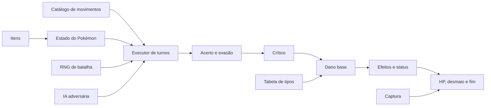
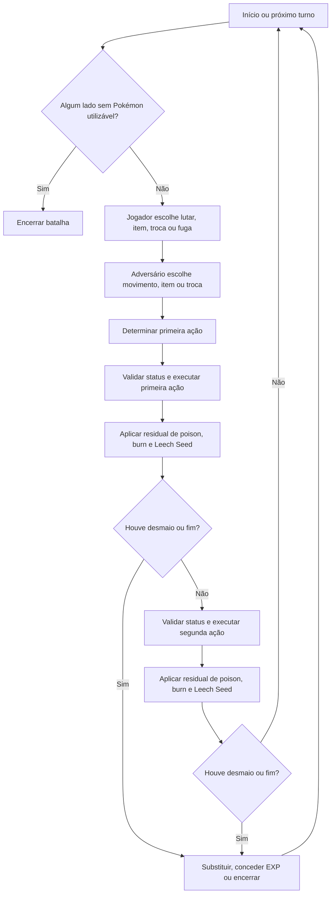

# Sistema de Batalhas de Pokémon Red/Blue

## Controle do documento

| Campo | Valor |
|---|---|
| Identificação | BTL-001 |
| Arquivo | `001-2026-08-01-Sistema_de_Batalhas_Pokemon_Red_Blue.md` |
| Revisão | 1.2 |
| Data de emissão | 2026-08-01 |
| Situação | Emitido para revisão e uso técnico interno |
| Responsável pelo processo | Equipe de reescrita ASM para C |
| Elaborado por | Análise automatizada e verificação direta do código-fonte |
| Aprovador | Solicitante do projeto para o marco C inicial |
| Baseline do código | commit `2b9f524537649e22d11bedaaee6eb81832fbbcb0` |
| Abrangência | ROM Pokémon Red/Blue deste repositório |
| Classificação | Informação documentada interna |

### Histórico de revisões

| Revisão | Data | Alteração | Autor | Aprovação |
|---|---|---|---|---|
| 1.0 | 2026-08-01 | Emissão inicial da especificação do sistema de batalhas | Codex | Pendente |
| 1.1 | 2026-08-01 | Inclusão do oráculo ASM Red/Blue, matriz executável, riscos isolados e gate pré-C | Codex | Pendente |
| 1.2 | 2026-08-03 | Aprovação do gate e implementação C17 diferencial de CombatMath e TrainerAI | Codex | Solicitante do projeto |

## 1. Finalidade e relação com a ISO 9001

Este documento registra o comportamento observável e os algoritmos do sistema de
batalhas implementado no código ASM. Ele deve servir como:

- fonte técnica controlada para compreender a ROM;
- contrato de compatibilidade para a reescrita incremental em C;
- base de rastreabilidade entre requisito, código legado e teste;
- registro de riscos, defeitos históricos e decisões de migração;
- evidência de revisão e validação do conhecimento sobre o processo.

A estrutura adota práticas compatíveis com a abordagem de processos, pensamento
baseado em risco, controle de informação documentada, planejamento operacional,
medição e tratamento de não conformidades da ISO 9001. Isso **não** declara que o
repositório, o software ou este documento sejam certificados ou estejam formalmente
em conformidade com a norma.

Na data desta emissão, a referência publicada aplicável é a
[ISO 9001:2015/Amd 1:2024](https://www.iso.org/standard/88431.html). A sexta edição
da [ISO 9001 está em publicação, com previsão da ISO para setembro de 2026](https://www.iso.org/standard/88464.html).
A forma de controle adotada também considera a orientação oficial da ISO sobre
[informação documentada](https://www.iso.org/files/live/sites/isoorg/files/archive/pdf/en/documented_information.pdf):
manter o necessário para operar os processos e reter evidência dos resultados.

## 2. Escopo

### 2.1 Incluído

Esta especificação cobre:

- inicialização, tipos, estados e encerramento de batalha;
- seleção e ordem de ações;
- dados, uso e PP dos movimentos;
- acerto, evasão, imunidade e precisão;
- dano normal, dano crítico, STAB, tipos e variação aleatória;
- movimentos de dano fixo ou comportamento especial;
- condições de status, modificadores de atributos e estados voláteis;
- HP, desmaio, cura, recuperação de PP e itens de batalha;
- captura normal e Safari, incluindo a chance matemática;
- fuga, troca, IA adversária, aleatoriedade, experiência e resultado;
- comportamentos defeituosos da Geração I que fazem parte desta implementação;
- critérios para reimplementação em C com DDD, SOLID e TDD.

### 2.2 Excluído

Não são especificados em detalhe pixel a pixel ou quadro a quadro:

- animações, áudio e temporização visual, salvo quando alteram estado ou regra;
- o texto integral apresentado ao jogador;
- cada entrada individual dos 165 movimentos, pois seus parâmetros continuam sendo
  a fonte de dados em `data/moves/moves.asm`;
- regras introduzidas em gerações posteriores.

## 3. Objetivos da qualidade

| ID | Objetivo | Critério verificável |
|---|---|---|
| Q-01 | Preservar comportamento | Casos de referência ASM e C produzem o mesmo estado final com as mesmas entradas e sequência aleatória. |
| Q-02 | Tornar cálculos reproduzíveis | Toda divisão inteira e todo limite numérico estão explícitos e cobertos por testes de fronteira. |
| Q-03 | Garantir rastreabilidade | Cada domínio possui símbolos ASM de origem e pelo menos um caso de aceitação. |
| Q-04 | Isolar defeitos históricos | Cada comportamento anômalo está marcado como compatibilidade ou depende de decisão formal para correção. |
| Q-05 | Permitir migração incremental | O código C deve ser substituível por subsistema sem alterar dados persistidos ou protocolo de batalha. |
| Q-06 | Manter documentação atualizada | Mudanças no ASM ou C que afetem batalha exigem atualização deste documento, dos testes e do grafo Graphify. |

## 4. Termos e convenções

| Termo | Definição neste documento |
|---|---|
| Atacante | Pokémon que executa o movimento atual. |
| Alvo | Pokémon que recebe o movimento atual. |
| HP | Pontos de vida atuais ou máximos, armazenados em 16 bits. |
| PP | Quantidade restante de usos de um movimento. |
| STAB | Bônus quando o tipo do movimento coincide com pelo menos um tipo do atacante. |
| DV | Determinant Value de 0 a 15, equivalente ao IV da Geração I. |
| Stat Exp | Experiência acumulada separadamente para cada atributo. |
| Status permanente | Sono, veneno, queimadura, congelamento ou paralisia, persistente fora da batalha. |
| Estado volátil | Estado que existe apenas durante a batalha ou enquanto o Pokémon permanece ativo. |
| Piso | Arredondamento para baixo após uma divisão inteira. É indicado por `floor(...)`. |
| RNG | Gerador de números pseudoaleatórios. Um byte aleatório está no intervalo inclusivo `[0, 255]`. |
| Compatibilidade | Reprodução intencional do comportamento da ROM, inclusive quando ele é um bug conhecido. |

Os nomes de símbolos, arquivos, movimentos e itens permanecem em inglês para permitir
busca direta no repositório. As fórmulas usam inteiros e aplicam `floor` em cada etapa,
não apenas no resultado final.

## 5. Visão arquitetural e fontes de verdade

| Responsabilidade | Fonte principal | Símbolos relevantes |
|---|---|---|
| Orquestração da batalha | `engine/battle/core.asm`, `engine/battle/end_of_battle.asm` | `InitBattle`, `StartBattle`, `MainInBattleLoop`, `EndOfBattle` |
| Seleção e execução de movimentos | `engine/battle/core.asm` | `MoveSelectionMenu`, `ExecutePlayerMove`, `ExecuteEnemyMove` |
| Dano, crítico, acerto e tipos | `engine/battle/core.asm` | `CalculateDamage`, `CriticalHitTest`, `MoveHitTest`, `AdjustDamageForMoveType`, `RandomizeDamage` |
| Efeitos de movimentos | `engine/battle/effects.asm` e `engine/battle/move_effects/*.asm` | handlers associados aos IDs de efeito |
| Catálogo de efeitos | `data/moves/effects_pointers.asm` | `MoveEffectPointerTable` |
| Dados dos movimentos | `data/moves/moves.asm` | `Moves` |
| Efetividade de tipos | `data/types/type_matchups.asm` | `TypeEffects` |
| Constantes de batalha e tipos | `constants/battle_constants.asm`, `constants/type_constants.asm` | limites, estados, tipos físicos e especiais |
| Consumo de PP | `engine/battle/decrement_pp.asm` | `DecrementPP` |
| Itens, cura, PP e captura | `engine/items/item_effects.asm` | `ItemUseMedicine`, `ItemUsePPRestore`, `ItemUseBall` |
| IA dos treinadores | `engine/battle/trainer_ai.asm` | rotinas `AI*` |
| Experiência | `engine/battle/experience.asm` | `GainExperience` |
| Cálculo de atributos | `home/move_mon.asm` | `CalcStats`, `CalcStat` |
| Barra de HP | `engine/gfx/hp_bar.asm`, `home/palettes.asm` | `GetHPBarLength`, `GetHealthBarColor` |
| Safari | `engine/battle/safari_zone.asm`, `engine/items/item_effects.asm` | `PrintSafariZoneBattleText` e handlers de bait/rock |

### 5.1 Dependências conceituais



## 6. Modelo de dados da batalha

### 6.1 Movimento

Cada entrada de `Moves` ocupa seis bytes e contém, nesta ordem:

1. ID/animação do movimento;
2. ID do efeito;
3. poder base;
4. tipo;
5. precisão codificada;
6. PP base.

A ROM possui 165 movimentos (`NUM_ATTACKS`), com até quatro movimentos por Pokémon.
Não existe categoria física/especial por movimento. A categoria é determinada
exclusivamente pelo tipo:

- físicos: `NORMAL`, `FIGHTING`, `FLYING`, `POISON`, `GROUND`, `ROCK`, `BIRD`,
  `BUG` e `GHOST`;
- especiais: `FIRE`, `WATER`, `GRASS`, `ELECTRIC`, `PSYCHIC_TYPE`, `ICE` e
  `DRAGON`.

Consequentemente, todo movimento de tipo Fire usa `Special`, e todo movimento de
tipo Normal usa `Attack`, independentemente da aparência ou descrição do golpe.

### 6.2 Pokémon ativo

O estado de batalha mantém uma cópia do Pokémon ativo, incluindo:

- espécie, nível e dois tipos;
- HP atual e máximo;
- Attack, Defense, Speed e Special atuais;
- quatro IDs de movimento e quatro valores de PP;
- status permanente;
- estágios de atributos;
- flags e contadores voláteis.

Alterações persistentes, como HP, PP e status, são sincronizadas com a estrutura da
equipe. Modificadores de estágio e estados voláteis não são persistidos depois da
batalha.

### 6.3 Tipos de batalha

- `wIsInBattle = 1`: batalha contra Pokémon selvagem;
- `wIsInBattle = 2`: batalha contra treinador;
- `BATTLE_TYPE_NORMAL`: batalha normal;
- `BATTLE_TYPE_OLD_MAN`: tutorial de captura;
- `BATTLE_TYPE_SAFARI`: regras da Safari Zone;
- batalha por link: usa troca de comandos e sequência aleatória sincronizada.

## 7. Processo operacional da batalha

### 7.1 Inicialização

`InitBattle` limpa e inicializa o estado transitório, identifica batalha selvagem ou
de treinador, carrega o Pokémon adversário, prepara a equipe do jogador e chama
`StartBattle`. Pokémon selvagens entram com HP máximo. Pokémon de treinador usam o
HP e status existentes em sua estrutura de equipe.

### 7.2 Ciclo principal



O dano residual é processado depois da ação de cada lado, e não apenas uma vez no
fim do par de ações. Um desmaio é verificado imediatamente após dano direto ou
residual.

### 7.3 Ações e consumo do turno

- Usar um movimento válido consome a ação.
- Trocar de Pokémon consome a ação.
- Um item usado com sucesso consome a ação.
- Remédios e restauradores de PP cancelados ou sem alvo/efeito válido não são
  consumidos e devolvem o jogador à seleção.
- Balls lançadas e itens táticos seguem seus handlers próprios; uma Ball que falha
  ou é bloqueada pelo treinador é consumida e gasta a ação.
- Uma tentativa de fuga que falha consome a ação.
- Uma captura bem-sucedida termina a batalha.
- Em batalha de treinador, tentar lançar uma Ball não captura o Pokémon.
- A IA de treinador pode usar item ou trocar no lugar do movimento.

## 8. Seleção, ordem e execução de movimentos

### 8.1 Seleção do jogador

O menu mostra apenas os movimentos do Pokémon ativo. Um movimento com PP zero não
pode ser escolhido normalmente. Se todos os movimentos estiverem sem PP ou
indisponíveis, o sistema seleciona `STRUGGLE`.

### 8.2 Seleção do adversário

- Pokémon selvagem: escolhe uniformemente um dos slots de movimento válidos.
- Treinador: começa com pesos para os movimentos e executa rotinas de IA conforme a
  classe; os pesos podem favorecer dano efetivo, status e alterações de atributos.
- Fora de batalha por link, o adversário não reduz PP. Na prática, seus movimentos
  possuem usos ilimitados.

### 8.3 Ordem das ações

Para duas ações de movimento:

1. `QUICK_ATTACK` age primeiro, salvo quando ambos o usam.
2. `COUNTER` age por último, salvo quando ambos o usam.
3. Nos demais casos, o maior `Speed` atual age primeiro.
4. Empate de `Speed` é decidido por `BattleRandom`, aproximadamente 50% para cada lado.

Itens, troca e fuga seguem os ramos próprios do ciclo e podem anteceder a execução
do movimento adversário. Uma ação posterior deixa de ocorrer se a batalha terminar
ou o Pokémon que a executaria desmaiar antes dela.

### 8.4 PP: quantidade de usos

O byte de PP usa:

- seis bits inferiores: PP atual;
- dois bits superiores: quantidade de `PP UP` aplicada, de 0 a 3.

Regras:

- um uso normal reduz 1 PP;
- `STRUGGLE` não consome PP;
- repetições internas de `BIDE`, `THRASH`, `PETAL_DANCE`, ataques múltiplos,
  aprisionamento e `RAGE` não reduzem PP novamente;
- o PP do Pokémon ativo e o PP da equipe são atualizados juntos;
- após `TRANSFORM`, cada movimento copiado começa com 5 PP;
- em batalhas normais, apenas o jogador está sujeito ao esgotamento de PP do
  adversário; no link, os dados de PP dos dois jogadores são reais.

`STRUGGLE` tem poder 50, tipo Normal e recoil de metade do dano efetivamente causado,
com mínimo de 1 HP.

## 9. Validação antes do movimento

Antes do cálculo de dano, o executor pode impedir ou substituir a ação por causa de:

- sono;
- congelamento;
- paralisia total;
- confusão e autolesão;
- flinch;
- recarga de `HYPER_BEAM`;
- carregamento de movimentos de dois turnos;
- aprisionamento por movimentos como `WRAP`;
- sequência forçada de `BIDE`, `THRASH`, `PETAL_DANCE` ou `RAGE`;
- desobediência de Pokémon trocado.

Movimentos com requisitos próprios são validados pelos seus handlers. Exemplos:
`DREAM_EATER` requer alvo dormindo; `FLY` e `DIG` criam fase de invulnerabilidade;
`MIRROR_MOVE`, `METRONOME`, `MIMIC`, `DISABLE` e `TRANSFORM` alteram ou consultam o
estado de outros movimentos.

## 10. Precisão, acerto e evasão

### 10.1 Precisão armazenada

O percentual declarado no catálogo é convertido para byte por:

```text
PrecisaoBase = floor(Percentual * 255 / 100)
```

Assim, um movimento declarado como 100% armazena 255.

### 10.2 Estágios de accuracy e evasion

O estágio neutro é 7. Os valores de 1 a 13 representam modificadores de -6 a +6:

| Modificador | -6 | -5 | -4 | -3 | -2 | -1 | 0 | +1 | +2 | +3 | +4 | +5 | +6 |
|---|---:|---:|---:|---:|---:|---:|---:|---:|---:|---:|---:|---:|---:|
| Razão | 1/4 | 28/100 | 33/100 | 40/100 | 1/2 | 66/100 | 1 | 3/2 | 2 | 5/2 | 3 | 7/2 | 4 |

O estágio de evasão do alvo é refletido e aplicado como modificador inverso.
Conceitualmente, para cada razão representada por numerador `N` e denominador `D`:

```text
P1 = max(1, floor(PrecisaoBase * NAccuracy / DAccuracy))
P2 = max(1, floor(P1 * NEvasionInvertida / DEvasionInvertida))
PrecisaoFinal = min(255, P2)
```

A implementação usa numeradores e denominadores inteiros da tabela e aplica piso a
cada divisão. O mínimo 1 significa que um movimento sujeito ao teste comum ainda
pode acertar com chance `1/256` mesmo sob os modificadores mais desfavoráveis.

### 10.3 Teste de acerto

O movimento acerta quando:

```text
RNG < PrecisaoFinal
```

Portanto, precisão final 255 ainda falha quando o RNG é 255: chance real de
`255/256`, aproximadamente 99,6094%.

Exceções relevantes:

- `SWIFT` ignora o teste comum de precisão;
- `X ACCURACY` ignora precisão e evasão enquanto sua flag estiver ativa;
- a invulnerabilidade de `FLY`/`DIG` é verificada antes do bypass de `X ACCURACY`;
- imunidade por tipo pode marcar o movimento como falho antes do teste de precisão;
- movimentos de status executam validações adicionais no próprio efeito;
- `MIST` impede reduções de atributo recebidas.

## 11. Ataque crítico

### 11.1 Chance

A chance usa o **Base Speed da espécie**, não o `Speed` atual. Seja `B` o Base Speed.
O teste sorteia um byte uniforme, aplica rotações que preservam a distribuição, e o
crítico ocorre quando o valor é menor que o limiar `T`.

| Situação | Limiar `T` | Chance |
|---|---:|---:|
| Movimento comum | `floor(B / 2)` | `T / 256` |
| Alto crítico | `min(8 * floor(B / 2), 255)` | `T / 256` |
| Com `FOCUS_ENERGY` ou `DIRE_HIT`, comum | `floor(B / 8)` | `T / 256` |
| Com `FOCUS_ENERGY` ou `DIRE_HIT`, alto crítico | `min(4 * floor(B / 4), 255)` | `T / 256` |

Movimentos de alto crítico:

- `KARATE_CHOP`;
- `RAZOR_LEAF`;
- `CRABHAMMER`;
- `SLASH`.

Um limiar limitado a 255 produz chance máxima de `255/256`, nunca 100%.
Movimento com poder base zero não produz crítico.

### 11.2 Bug de Focus Energy e Dire Hit

A flag `GETTING_PUMPED` desloca o limiar na direção errada. Em vez de aumentar, ela
reduz a chance para aproximadamente um quarto da chance normal. `DIRE_HIT` ativa a
mesma flag e herda o mesmo defeito.

### 11.3 Efeito do crítico sobre o dano

Em um crítico:

- o nível usado pela fórmula é duplicado;
- Attack/Defense ou Special ofensivo/defensivo são recalculados a partir dos dados
  base do Pokémon;
- estágios positivos e negativos são ignorados;
- efeitos de burn, paralysis, bônus de insígnia, `REFLECT` e `LIGHT_SCREEN` são
  ignorados nesse recálculo.

O resultado não é simplesmente “dano vezes dois”. Dependendo dos modificadores que
foram ignorados, o crítico pode aumentar menos, aumentar muito ou até causar menos
dano que um golpe normal.

## 12. Fórmula de dano normal

### 12.1 Escolha dos atributos

- Tipo físico: usa `Attack` do atacante e `Defense` do alvo.
- Tipo especial: usa `Special` do atacante e `Special` do alvo.
- `REFLECT` duplica Defense.
- `LIGHT_SCREEN` duplica Special defensivo.
- Burn reduz Attack para metade, com mínimo 1.
- Paralysis reduz Speed para um quarto, com mínimo 1; Speed não entra diretamente na
  fórmula de dano, mas altera ordem e algumas regras.
- `SELFDESTRUCT` e `EXPLOSION` dividem a defesa usada por 2, com mínimo 1.

Se um atributo ofensivo ou defensivo excede um byte, a rotina reduz ambos por 4 para
caber no cálculo. Valores acima de 1023 não permanecem representáveis depois dessa
redução e o byte alto pode ser descartado; Defense efetiva pode inclusive chegar a
zero e bloquear a divisão. Esses detalhes devem ser isolados no modo de
compatibilidade.

### 12.2 Dano base

Para movimento com poder maior que zero:

```text
L = nível do atacante; em crítico, L = 2 * nível
A = Attack ou Special ofensivo
D = Defense ou Special defensivo
P = poder base

Etapa1 = floor(2 * L / 5) + 2
Etapa2 = Etapa1 * P
Etapa3 = Etapa2 * A
Etapa4 = floor(Etapa3 / D)
Etapa5 = floor(Etapa4 / 50)
DanoNeutro = min(999, Etapa5 + 2)
```

O dano neutro normal fica entre 2 e 999 antes de STAB, tipos e aleatoriedade.

### 12.3 Ordem dos multiplicadores

Para um golpe que acertou:

1. calcular dano neutro;
2. aplicar STAB;
3. aplicar o multiplicador contra o primeiro tipo do alvo;
4. aplicar o multiplicador contra o segundo tipo, se diferente;
5. aplicar o fator aleatório;
6. limitar o dano aplicado ao HP atual do alvo.

Cada multiplicação e divisão usa inteiro e piso. Depois de STAB e tipos, o valor pode
ultrapassar 999. O dano realmente removido nunca ultrapassa o HP atual.

### 12.4 STAB

Se o tipo do movimento for igual a qualquer um dos tipos do atacante:

```text
DanoComSTAB = Dano + floor(Dano / 2)
```

Isso corresponde a `floor(1,5 * Dano)`. Pokémon com dois tipos recebe apenas um STAB,
mesmo que os dois tipos armazenados sejam iguais.

### 12.5 Vantagem e resistência por tipo

Cada relação aplica um destes fatores:

- super efetivo: `2`;
- normal: `1`;
- pouco efetivo: `1/2`, com piso;
- sem efeito: `0`.

Em alvo de dois tipos, os fatores são sequenciais: `4x`, `2x`, `1x`, `1/2x`, `1/4x`
ou `0x`. Se uma redução a `1/4` transformar dano 2 ou 3 em zero por arredondamento,
a implementação marca o golpe como falho.

### 12.6 Tabela de tipos da ROM

As relações não listadas são neutras. A tabela abaixo reproduz
`data/types/type_matchups.asm`, inclusive relações incorretas segundo gerações
posteriores.

| Tipo atacante | Super efetivo (2x) | Pouco efetivo (1/2x) | Sem efeito (0x) |
|---|---|---|---|
| Normal | — | Rock | Ghost |
| Fighting | Normal, Rock, Ice | Poison, Flying, Psychic, Bug | Ghost |
| Flying | Fighting, Bug, Grass | Electric, Rock | — |
| Poison | Grass, Bug | Poison, Ground, Rock, Ghost | — |
| Ground | Fire, Electric, Rock, Poison | Grass, Bug | Flying |
| Rock | Fire, Flying, Bug, Ice | Fighting, Ground | — |
| Bug | Grass, Psychic, Poison | Fire, Fighting, Flying, Ghost | — |
| Ghost | Ghost | — | Normal, Psychic |
| Fire | Grass, Ice, Bug | Fire, Water, Rock, Dragon | — |
| Water | Fire, Rock, Ground | Water, Grass, Dragon | — |
| Grass | Water, Ground, Rock | Fire, Grass, Poison, Flying, Bug, Dragon | — |
| Electric | Water, Flying | Electric, Grass, Dragon | Ground |
| Psychic | Fighting, Poison | Psychic | — |
| Ice | Grass, Ground, Flying, Dragon | Water, Ice | — |
| Dragon | Dragon | — | — |
| Bird | — | — | — |

Pontos de compatibilidade importantes:

- Ghost não afeta Psychic nesta tabela; esse é o conhecido erro da Geração I.
- Poison e Bug são super efetivos entre si nas entradas existentes.
- Não existem tipos Dark, Steel ou Fairy.

### 12.7 Variação aleatória do dano

Para dano maior que 1, o sistema sorteia uniformemente um inteiro `R` entre 217 e
255, rejeitando outros bytes, e calcula:

```text
DanoFinal = floor(DanoAposTipos * R / 255)
```

O intervalo é de aproximadamente 85,098% a 100%. Dano 0 ou 1 não é randomizado.

### 12.8 Exemplo reproduzível

Para nível 50, poder 80, Attack 100 e Defense 80, sem crítico:

```text
Etapa1 = floor(100 / 5) + 2 = 22
Etapa2 = 22 * 80 = 1760
Etapa3 = 1760 * 100 = 176000
Etapa4 = floor(176000 / 80) = 2200
Etapa5 = floor(2200 / 50) = 44
DanoNeutro = 46
Com STAB = 46 + floor(46 / 2) = 69
Super efetivo = 138
Aleatório = floor(138 * R / 255), R em [217, 255]
Resultado possível = 117 a 138 HP
```

## 13. Movimentos com dano ou fluxo especial

| Efeito | Regra principal |
|---|---|
| `SUPER_FANG` | `floor(HP atual do alvo / 2)`, mínimo 1. |
| `SEISMIC_TOSS`, `NIGHT_SHADE` | Dano igual ao nível do usuário. |
| `SONICBOOM` | 20 HP fixos. |
| `DRAGON_RAGE` | 40 HP fixos. |
| `PSYWAVE` | Jogador: inteiro de 1 até `floor(1,5 * nível) - 1`; adversário pode gerar 0 devido a assimetria do código. |
| OHKO | Além do teste de precisão, exige Speed atual do usuário maior ou igual ao do alvo; quando válido, grava dano 65535 para garantir desmaio. |
| `COUNTER` | Requer último movimento selecionado Normal ou Fighting, poder não zero e `wDamage` não zero; retorna 2 vezes o dano compartilhado, limitado a 65535. |
| `BIDE` | Armazena dano recebido durante 2 a 3 turnos e devolve o dobro. |
| Confusão | Autolesão usa poder 40, sem tipo, com Attack e Defense do próprio usuário; não aplica crítico, STAB, tipo ou variação aleatória. |
| Ataque de 2 golpes | Executa exatamente dois acertos. |
| Ataque de 2 a 5 golpes | 2 e 3 golpes têm probabilidade 3/8 cada; 4 e 5 têm 1/8 cada. Precisão e dano são calculados uma vez, e os acertos repetem esse dano. |
| Aprisionamento | A sequência total dura de 2 a 5 acertos com a mesma distribuição; o alvo não age durante a prisão. |
| Recoil | Em geral remove `floor(dano efetivo / 4)`; `STRUGGLE` usa metade. O mínimo é 1. |
| Drain | Cura metade do dano efetivamente removido, mínimo 1 e máximo até completar o HP. |
| `RECOVER`, `SOFTBOILED` | Curam `floor(MaxHP / 2)`, limitados ao MaxHP. |
| `REST` | Restaura todo o HP, limpa status e aplica contador de sono 2. |
| `SUBSTITUTE` | Custa `floor(MaxHP / 4)` e cria HP de substituto de um byte. Apenas o underflow é impedido. |

Movimentos de dois turnos, recarga, cópia, transformação, troca forçada e seleção de
outro movimento devem ser modelados como transições de estado, não como variações da
fórmula de dano.

## 14. Status e efeitos de estado

### 14.1 Status permanentes

Um Pokémon não recebe um novo status permanente enquanto já possui outro.

| Status | Aplicação e efeito durante a batalha |
|---|---|
| Sleep | O contador aplicado normalmente é de 1 a 7. Ele é reduzido antes da ação; o turno em que chega a zero acorda o Pokémon, mas ainda não executa o movimento. `REST` usa contador 2. |
| Poison | Depois de cada ação de um lado, remove `max(1, floor(MaxHP / 16))`. Tipo Poison é imune à aplicação normal de poison. |
| Toxic | Usa a base de `floor(MaxHP / 16)` multiplicada por contador crescente. Compartilha estado com outras rotinas, causando defeitos históricos. |
| Burn | Remove `max(1, floor(MaxHP / 16))` no processamento residual e reduz Attack pela metade. |
| Freeze | Impede ação sem chance aleatória de descongelar. Um movimento de fogo com efeito de burn pode descongelar; `FIRE_SPIN` não usa esse mesmo caminho. |
| Paralysis | Reduz Speed a um quarto e, em cada tentativa de ação, possui 25% de chance de paralisia total. |

### 14.2 Estados voláteis

| Estado | Comportamento |
|---|---|
| Confusion | Dura de 2 a 5 verificações. Enquanto ativa, aproximadamente metade das verificações causa autolesão. |
| Flinch | Impede a ação somente se o alvo ainda não agiu; é limpo no ciclo seguinte. |
| Leech Seed | Tipo Grass é imune. A cada processamento residual, remove HP e cura o oponente. |
| Reflect | Duplica Defense para dano normal enquanto ativo. |
| Light Screen | Duplica Special defensivo para dano normal enquanto ativo. |
| Mist | Impede reduções de estágio impostas pelo adversário. |
| Focus Energy | Ativa o cálculo defeituoso de crítico descrito na seção 11. |
| Substitute | Recebe dano no lugar do Pokémon e bloqueia vários efeitos, conforme o handler específico. |
| Disable | Torna temporariamente um slot de movimento indisponível. |

`HAZE` restaura estágios e vários estados voláteis dos dois lados. O status permanente
limpo pelo caminho do efeito é o do alvo correspondente, não um reset irrestrito de
toda a batalha.

### 14.3 Chances de efeitos secundários

Os IDs de efeito distinguem variantes. As probabilidades implementadas incluem:

| Família de efeito secundário | Probabilidades existentes |
|---|---|
| Poison | 20% e 40% |
| Burn, freeze ou paralysis | 10% e 30% |
| Confusion | 10% |
| Flinch | 10% e 30% |
| Redução de atributo | aproximadamente 33% |

Movimentos de status sem dano usam a precisão do próprio movimento antes de aplicar
o efeito. Efeitos secundários só são tentados depois que o golpe atende às condições
do seu handler.

### 14.4 Imunidades e peculiaridades de status

- Um alvo com status permanente já existente bloqueia outro status permanente.
- Movimentos que causam status como efeito secundário de dano impedem a condição
  quando o tipo do movimento coincide com um tipo do alvo. Isso faz, por exemplo,
  `BODY_SLAM` não paralisar um Pokémon Normal nesta implementação.
- `THUNDER_WAVE` verifica a imunidade de Ground no seu caminho direto.
- Poison não é aplicado normalmente a tipo Poison.
- Leech Seed não é aplicado a tipo Grass.
- Substitute, Mist e condições específicas do movimento podem bloquear o efeito.

### 14.5 Estágios de atributos

Attack, Defense, Speed, Special, Accuracy e Evasion usam estágio neutro 7 e limites
1 a 13, equivalentes a -6 até +6. Os quatro atributos numéricos são recalculados com
o estágio e limitados ao intervalo 1 a 999. Accuracy e Evasion usam a tabela da
seção 10.

Em batalha sem link, insígnias aplicam ao jogador bônus de aproximadamente 12,5%:

- Boulder Badge: Attack;
- Thunder Badge: Defense;
- Soul Badge: Speed;
- Volcano Badge: Special.

A reaplicação desses bônus por rotinas de mudança de atributos produz o “badge boost
glitch” e deve ser preservada em modo compatível.

## 15. HP: cálculo, armazenamento e exibição

### 15.1 Cálculo do MaxHP

Sejam:

```text
B = atributo base da espécie
DV = valor de 0 a 15
E = Stat Exp de HP, de 0 a 65535
L = nível
RaizExp = min(ceil(sqrt(E)), 255)
BonusExp = floor(RaizExp / 4)
S = 2 * (B + DV) + BonusExp
MaxHP = floor(S * L / 100) + L + 10
MaxHP = min(MaxHP, 999)
```

A saturação de `RaizExp` em 255 é relevante em `E = 65535`: o bônus continua 63,
em vez de 64.

O DV de HP é composto pelos bits menos significativos dos DVs de Attack, Defense,
Speed e Special, nessa ordem.

Para os demais atributos:

```text
Stat = min(999, floor(S * L / 100) + 5)
```

### 15.2 HP durante a batalha

- HP atual e máximo são valores de 16 bits, embora os atributos calculados sejam
  limitados a 999.
- Dano é subtraído com saturação: se `dano >= HP`, o HP torna-se zero.
- `wDamage` é atualizado para o HP realmente removido. Recoil e drain usam esse valor
  efetivo, não o dano teórico excedente.
- HP zero significa desmaio.
- Cura nunca ultrapassa MaxHP.
- Potion não revive; Revive não afeta Pokémon vivo.

### 15.3 Barra de HP

A barra possui 48 pixels. Para MaxHP menor que 256, o comprimento é:

```text
Pixels = floor(HPAtual * 48 / MaxHP)
```

Para MaxHP de 256 ou mais, produto e divisor são reduzidos por 4 antes da divisão,
com perda inteira de precisão. Pokémon vivo recebe pelo menos 1 pixel; o caminho de
desmaio desenha a barra vazia.

Cor pelo comprimento:

- verde: 27 a 48 pixels;
- amarelo: 10 a 26 pixels;
- vermelho: 1 a 9 pixels.

O HUD do jogador mostra HP numérico; o HUD do adversário não mostra o número.

## 16. Itens de cura, status, PP e batalha

### 16.1 Regras comuns

- O alvo deve pertencer à equipe aplicável e ser compatível com o item.
- Remédios e restauradores de PP sem efeito válido não são removidos nem consomem o
  turno.
- Um item aplicado com sucesso é removido e consome o turno. Balls e itens táticos
  seguem regras próprias e não devem herdar automaticamente a validação dos
  remédios.
- Se o alvo for o Pokémon ativo, HP, PP, status e atributos derivados são
  sincronizados com a cópia de batalha.

### 16.2 Cura de HP e revive

| Item | Efeito |
|---|---|
| `POTION` | +20 HP |
| `SUPER_POTION` | +50 HP |
| `HYPER_POTION` | +200 HP |
| `FRESH_WATER` | +50 HP |
| `SODA_POP` | +60 HP |
| `LEMONADE` | +80 HP |
| `MAX_POTION` | Completa o HP |
| `FULL_RESTORE` | Completa o HP e remove qualquer status permanente |
| `REVIVE` | Apenas em desmaiado; restaura `floor(MaxHP / 2)` |
| `MAX_REVIVE` | Apenas em desmaiado; restaura MaxHP |

### 16.3 Cura de status

| Item | Status removido |
|---|---|
| `ANTIDOTE` | Poison/Toxic |
| `BURN_HEAL` | Burn |
| `ICE_HEAL` | Freeze |
| `AWAKENING` | Sleep |
| `PARLYZ_HEAL` | Paralysis |
| `FULL_HEAL` | Qualquer status permanente |

Ao remover status do Pokémon ativo, a rotina também corrige os atributos de batalha
afetados e limpa o estado de Toxic quando aplicável.

`POKE_FLUTE` em batalha acorda os Pokémon adormecidos da equipe do jogador, os
ativos e, em batalha de treinador, também a equipe adversária. Sem Pokémon dormindo,
ela não produz cura.

### 16.4 Recuperação e aumento de PP

| Item | Efeito |
|---|---|
| `ETHER` | +10 PP em um movimento, limitado ao máximo |
| `MAX_ETHER` | Completa o PP de um movimento |
| `ELIXER` | +10 PP em cada movimento aprendido |
| `MAX_ELIXER` | Completa o PP de cada movimento aprendido |
| `PP_UP` | Aumenta permanentemente o PP máximo; não pode ser usado em batalha |

Cada `PP_UP`, até três por movimento, acrescenta:

```text
BonusPorPPUp = min(floor(PPBase / 5), 7)
PPMaximo = PPBase + QuantidadePPUp * BonusPorPPUp
```

Esse limite de 7 por aplicação pertence a esta ROM e difere de regras posteriores.

Defeito conhecido: `MAX_ETHER` e `MAX_ELIXER` comparam o byte de PP sem mascarar os
dois bits de PP Up ao verificar “já está cheio”. Um item pode ser consumido e
informar efeito mesmo quando o PP baixo já está completo.

### 16.5 Itens táticos

| Item | Efeito na batalha |
|---|---|
| `X_ACCURACY` | Ativa bypass do teste comum de accuracy/evasion. |
| `GUARD_SPEC` | Ativa a proteção equivalente a Mist. |
| `DIRE_HIT` | Ativa a flag de Focus Energy e, por bug, reduz crítico. |
| `X_ATTACK` | Aumenta Attack em um estágio. |
| `X_DEFEND` | Aumenta Defense em um estágio. |
| `X_SPEED` | Aumenta Speed em um estágio. |
| `X_SPECIAL` | Aumenta Special em um estágio. |
| `POKE_DOLL` | Encerra uma batalha selvagem por fuga. |

A IA de treinadores pode usar Potion, Super Potion, Hyper Potion, Full Restore, Full
Heal e itens X conforme a classe e o limite interno de itens da batalha.

## 17. Captura de Pokémon

### 17.1 Pré-condições

Uma Ball só chega ao cálculo quando:

- há batalha ativa e ela é selvagem;
- o alvo não é Pokémon de treinador;
- o alvo não é o fantasma não identificado nem o Restless Soul Marowak;
- existe espaço na equipe ou na Box atual, salvo o tutorial do Old Man;
- o item é uma Ball válida.

`MASTER_BALL` captura sempre **depois** dessas restrições. Captura bem-sucedida
preserva espécie, HP e status, registra Pokédex e envia o Pokémon à equipe ou Box.

### 17.2 Variáveis

```text
C = catch rate atual da espécie, byte [0, 255]
Hmax = MaxHP do alvo
H = HP atual do alvo
S = bônus de status para o primeiro teste
U = maior valor possível de Rand1 para a Ball
F = BallFactor do cálculo de HP
```

| Ball | `U` | quantidade de valores de Rand1 | `F` |
|---|---:|---:|---:|
| Poké Ball | 255 | 256 | 12 |
| Great Ball | 200 | 201 | 8 |
| Ultra Ball | 150 | 151 | 12 |
| Safari Ball | 150 | 151 | 12 |

O RNG é repetido até `Rand1` cair uniformemente em `[0, U]`.

### 17.3 Bônus de status

| Estado do alvo | `S` |
|---|---:|
| Nenhum | 0 |
| Burn, paralysis ou poison | 12 |
| Freeze ou sleep | 25 |

Se `Rand1 < S`, a subtração sofre underflow e a captura é imediata.

### 17.4 Fator de HP

Todas as divisões usam piso:

```text
DivisorHP = max(floor(H / 4), 1)
W = floor(floor(Hmax * 255 / F) / DivisorHP)
X = min(W, 255)
```

HP baixo aumenta `W`. A Great Ball usa fator 8, enquanto Ultra e Safari usam 12;
isso é intencionalmente descrito como implementado, não como uma correção teórica.

### 17.5 Decisão de captura

Para Balls que não sejam Master Ball:

1. sortear `Rand1` em `[0, U]`;
2. se `Rand1 < S`, capturar;
3. calcular `R = Rand1 - S`;
4. se `R > C`, falhar;
5. se `W > 255`, capturar;
6. sortear `Rand2` em `[0, 255]`;
7. capturar se `Rand2 <= X`; caso contrário, falhar.

As igualdades favorecem a captura nos dois testes.

### 17.6 Probabilidade exata

Seja `N = U + 1`. A quantidade de resultados de captura imediata por status é:

```text
A = min(S, N)
```

A quantidade de resultados restantes de `Rand1` que passam pelo catch rate é:

```text
B = max(0, min(U, S + C) - S + 1)
```

A chance condicional do segundo teste é:

```text
P2 = 1                         se W > 255
P2 = (X + 1) / 256             se W <= 255
```

Logo:

```text
P(captura) = (A + B * P2) / N
```

Essa fórmula descreve o código desta ROM, não as fórmulas de captura de gerações
posteriores.

### 17.7 Exemplo de captura

Considere `Hmax = 100`, `H = 25`, `C = 45`, alvo dormindo (`S = 25`) e Ultra Ball:

```text
U = 150; N = 151; F = 12
DivisorHP = floor(25 / 4) = 6
W = floor(floor(100 * 255 / 12) / 6)
W = floor(2125 / 6) = 354
P2 = 1
A = 25
B = resultados Rand1 de 25 a 70 = 46
P = (25 + 46) / 151 = 71 / 151 = 47,0199%
```

Com o mesmo alvo em HP cheio, `W = 85` e `P2 = 86/256`, reduzindo a chance para
aproximadamente 26,790%.

### 17.8 Animação de sacudidas

As sacudidas são calculadas **depois que a captura já falhou**. Elas informam a
animação, mas não executam tentativas adicionais.

```text
BallFactor2 = 255 para Poké Ball
BallFactor2 = 200 para Great Ball
BallFactor2 = 150 para Ultra/Safari Ball

Y = floor(C * 100 / BallFactor2)
Status2 = 0 sem status, 5 para burn/paralysis/poison, 10 para freeze/sleep
Z = floor(X * Y / 255) + Status2
```

| `Z` | Resultado visual |
|---:|---|
| 0 a 9 | 0 sacudidas; a Ball erra |
| 10 a 29 | 1 sacudida |
| 30 a 69 | 2 sacudidas |
| 70 ou mais | 3 sacudidas |

### 17.9 Captura na Safari Zone

- O jogador começa com 30 Safari Balls.
- Não há comandos normais de movimento; as opções são Ball, bait, rock e run.
- Bait divide o catch rate atual por 2, zera o fator de rock e acrescenta duração
  aleatória de 1 a 5 ao fator de bait.
- Rock dobra o catch rate atual com saturação em 255, zera o fator de bait e
  acrescenta duração aleatória de 1 a 5 ao fator de rock.
- Os fatores são reduzidos a cada ação Safari.
- Quando o estado de rock termina, o catch rate é restaurado a partir da espécie.
  O caminho de término de bait não possui restauração simétrica no mesmo ponto.
- A chance de fuga parte de um limiar derivado de duas vezes o byte baixo do Speed:
  bait o divide por 4; rock o duplica com saturação. O Pokémon foge quando o byte
  aleatório fica abaixo desse limiar.

## 18. Fuga, troca, desmaio e encerramento

### 18.1 Fuga de batalha selvagem

- Se o Speed atual do jogador for maior ou igual ao do adversário, a fuga é certa.
- Caso contrário, a rotina calcula um fator baseado em `PlayerSpeed * 32`, no quarto
  do `EnemySpeed` e no número de tentativas anteriores.
- Cada falha anterior acrescenta 30 ao fator.
- Fator que excede a faixa de byte garante sucesso; caso contrário, ele é comparado
  a um byte aleatório.
- Falha consome o turno.
- `POKE_DOLL` força fuga de batalha selvagem.
- Batalha de treinador comum não permite fuga.

Para compatibilidade bit a bit, a rotina `TryRunningFromBattle` deve ser portada com
as mesmas larguras de byte, overflow e ordem de divisões, em vez de ser substituída
por uma expressão algébrica de precisão ilimitada.

### 18.2 Troca

Trocar seleciona um membro vivo da equipe, sincroniza o Pokémon anterior, carrega o
novo ativo e reinicializa os estados voláteis aplicáveis ao participante que saiu.
A troca normal consome o turno e permite a ação adversária.

### 18.3 Desmaio

Quando HP chega a zero:

- o Pokémon não pode executar ação pendente;
- estados e dados persistentes são sincronizados;
- se o adversário desmaiou, são processadas experiência e possíveis recompensas;
- se ainda houver Pokémon utilizável, o lado correspondente envia o próximo;
- sem Pokémon utilizável, ocorre vitória ou derrota/blackout.

### 18.4 Experiência e recompensas

O ganho base deriva de `BaseExp * nível / 7`, com divisões inteiras. Participantes
e `EXP_ALL` influenciam a divisão. Batalha de treinador e Pokémon trocado aplicam
bônus de 1,5 em etapas próprias. Pokémon desmaiado não recebe EXP de participação.
Stat Exp recebe os atributos base do adversário derrotado, com saturação em 65535.
Batalhas por link não concedem EXP.

O encerramento também trata dinheiro de treinador, `PAY_DAY`, atualização da equipe,
evolução quando aplicável, captura, fuga e retorno ao mapa.

## 19. Desobediência

Pokémon cujo treinador original difere do jogador podem desobedecer acima do limite
permitido pelas insígnias:

| Insígnia relevante | Nível obediente até |
|---|---:|
| Nenhuma | 10 |
| Cascade Badge | 30 |
| Rainbow Badge | 50 |
| Marsh Badge | 70 |
| Earth Badge | 100 |

A desobediência pode trocar o movimento, não fazer nada, dormir ou causar autolesão,
conforme os ramos aleatórios de `CheckForTradedMon` e rotinas relacionadas.

## 20. IA, RNG e batalha por link

### 20.1 IA

A IA de treinador modifica pesos de movimentos. Entre os critérios observados:

- evita alguns movimentos de status quando o alvo já possui status;
- avalia efetividade de tipos para determinadas classes;
- pode favorecer alterações de atributos em situações ou classes específicas;
- pode trocar de Pokémon ou usar item conforme a política do treinador.

Essa IA não é um planejador geral. É uma coleção ordenada de heurísticas e tabelas,
e a ordem de aplicação faz parte do comportamento.

### 20.2 Aleatoriedade

`BattleRandom` usa o RNG normal fora de link. O RNG do jogo combina registradores e
estado interno; testes da reimplementação não devem depender de relógio real. Deve
existir uma interface injetável que aceite sequência de bytes conhecida.

Em link, os lados consomem uma lista aleatória sincronizada. Qualquer diferença na
quantidade ou ordem de chamadas ao RNG pode provocar dessincronização.

## 21. Não conformidades e riscos conhecidos

Os itens abaixo são não conformidades em relação à intenção provável ou a regras
posteriores, mas constituem comportamento legado. A correção exige ADR e modo de
compatibilidade explícito.

| ID | Comportamento legado | Risco na reescrita | Tratamento requerido |
|---|---|---|---|
| NC-01 | Focus Energy e Dire Hit reduzem crítico. | “Corrigir” silenciosamente quebra compatibilidade. | Teste de caracterização e flag de política se houver modo corrigido. |
| NC-02 | Precisão 100% falha em 1/256 no teste comum. | Uso de float ou `<=` altera resultado. | Comparar byte com `<`. |
| NC-03 | Ghost não afeta Psychic. | Tabela moderna produz resultado diferente. | Carregar tabela da ROM como dado versionado. |
| NC-04 | IA inicializa efetividade neutra com `$10` em um caminho, não com o valor decimal esperado. | IA C pode escolher movimentos diferentes. | Caracterizar `AIGetTypeEffectiveness`. |
| NC-05 | Adversário comum não consome PP. | Modelo simétrico muda batalhas longas. | Política de PP por tipo de controlador. |
| NC-06 | Max Ether/Elixer testa bits de PP Up junto com PP atual. | Item pode parecer ter efeito em PP cheio. | Preservar no perfil legado; testar PP Up 1 a 3. |
| NC-07 | Toxic e Leech Seed compartilham contador em caminhos residuais. | Dano e cura podem crescer de modo inesperado. | Teste de integração Toxic + Leech Seed + troca. |
| NC-08 | Bônus de insígnia pode ser reaplicado em mudança de atributo. | Stats divergem após buffs/debuffs. | Golden master por sequência de efeitos. |
| NC-09 | Counter consulta movimento selecionado e `wDamage` compartilhado. | Resultado depende de cursor/ação anterior e pode dessincronizar link. | Modelar o estado legado antes de criar evento semântico novo. |
| NC-10 | Psywave adversário pode causar 0. | Normalização simétrica altera resultado. | Caso de RNG mínimo para ambos os lados. |
| NC-11 | Substitute só impede underflow do custo. | Certos HP permitem chegar a zero ao criar Substitute. | Teste de fronteira por MaxHP e HP atual. |
| NC-12 | Ataques de status secundário usam imunidade por igualdade de tipo do movimento. | Body Slam e casos equivalentes mudam. | Testes por tipo do alvo e forma de aplicação. |
| NC-13 | Defesa pode chegar a zero em caminho de redução para byte. | Divisão por zero pode travar a rotina. | Identificar como risco crítico; não reproduzir travamento sem sandbox de compatibilidade. |
| NC-14 | Capturar alvo transformado pode salvar a espécie como Ditto. | Dados persistidos divergem. | Teste de captura após Transform e decisão formal. |
| NC-15 | Término de bait e rock não restaura catch rate de forma simétrica. | Simulação Safari “limpa” muda probabilidades. | Teste de sequência bait/rock até expiração. |

### 21.1 Política de decisão

Cada item deve receber uma destas disposições:

- `PRESERVAR`: comportamento obrigatório no perfil ROM-compatible;
- `CORRIGIR`: comportamento alterado com teste e justificativa;
- `CONFIGURAR`: perfis legado e corrigido coexistem;
- `NÃO APLICÁVEL`: demonstrado por análise e revisão.

Nenhuma correção deve ser incorporada ao domínio C sem ID de decisão, impacto nos
testes, responsável e revisão deste documento.

## 22. Contrato para reescrita em C

### 22.1 Linguagem ubíqua e limites DDD

Contextos sugeridos:

| Contexto delimitado | Responsabilidade | Não deve conhecer |
|---|---|---|
| `Battle` | ciclo, ações, ordem, participantes e resultado | renderização e persistência da Box |
| `Moves` | catálogo, PP e resolução de efeitos | menus e áudio |
| `CombatMath` | acerto, crítico, dano e tipos | inventário e IA |
| `Conditions` | status, estágios e estados voláteis | captura e Pokédex |
| `Items` | validade e aplicação de itens | detalhes do frame loop |
| `Capture` | Balls, catch rate, Safari e resultado | fórmula de dano |
| `TrainerAI` | escolha de ação por política | mutação direta de HP |
| `Progression` | EXP, Stat Exp, dinheiro e evolução | cálculo de acerto |
| `Presentation` | texto, animação, HUD e som | decisão de regra |

Agregados candidatos: `Battle`, `Combatant`, `MoveSet`, `Party` e `CaptureAttempt`.
Objetos de valor candidatos: `Hp`, `Pp`, `Level`, `StatStage`, `Type`, `Damage` e
`RandomByte`.

### 22.2 Aplicação de SOLID

- **SRP:** separar orquestração do turno, matemática, efeitos, IA e apresentação.
- **OCP:** adicionar handlers de efeito ou política de compatibilidade sem alterar o
  executor central.
- **LSP:** controladores humano, selvagem, treinador e link devem cumprir o mesmo
  contrato de seleção de ação sem prometer capacidades inexistentes.
- **ISP:** interfaces pequenas para RNG, catálogo, estado da equipe, inventário e
  eventos de apresentação.
- **DIP:** domínio depende de abstrações como `RandomSource`, `MoveCatalog` e
  `BattleEventSink`; adaptadores Game Boy ou desktop dependem do domínio.

SOLID não justifica uma hierarquia por movimento. A tabela de 165 movimentos deve
permanecer orientada a dados, com handlers compartilhados pelos 86 tipos de efeito.

### 22.3 Estratégia de refactoring

Seguindo o processo incremental de Refactoring:

1. criar testes de caracterização sobre o ASM ou um harness equivalente;
2. extrair tipos inteiros e estado de batalha sem alterar comportamento;
3. portar primeiro funções puras: tipos, estágios, HP, acerto, crítico, dano e captura;
4. introduzir interfaces para RNG e catálogo;
5. portar handlers de efeitos por famílias;
6. portar orquestração, IA e link após estabilizar contratos;
7. substituir um subsistema por vez, comparando eventos e estado final;
8. refatorar nomes e estruturas somente com a suíte verde;
9. decidir separadamente quais bugs terão perfil corrigido.

Pequenas transformações devem ser registradas em commits próprios. Otimizações só
devem ocorrer depois de equivalência funcional mensurável.

## 23. Estratégia TDD e critérios de aceitação

O ciclo recomendado é Red-Green-Refactor. Cada caso fixa entradas, sequência de bytes
RNG, resultado e eventos relevantes.

### 23.1 Matriz mínima de testes

| ID | Cenário | Resultado obrigatório |
|---|---|---|
| T-BTL-001 | Quick Attack contra movimento comum de usuário mais lento | Quick Attack executa primeiro. |
| T-BTL-002 | Speeds iguais com RNG mínimo/máximo | Cada ramo de desempate é reproduzido. |
| T-ACC-001 | Precisão final 255 e RNG 255 | Movimento falha. |
| T-ACC-002 | Precisão final 255 e RNG 254 | Movimento acerta. |
| T-ACC-003 | Swift contra evasão máxima | Ignora teste comum. |
| T-CRT-001 | Base Speed par e ímpar, movimento comum | Limiar é `floor(B/2)`. |
| T-CRT-002 | Slash com Base Speed suficiente | Limiar alto é limitado a 255. |
| T-CRT-003 | Focus Energy com movimento comum e alto crítico | Chances caem segundo a fórmula legada. |
| T-DMG-001 | Exemplo da seção 12.8 | Dano antes do RNG é 138; faixa final 117 a 138. |
| T-DMG-002 | Ataque físico e especial com mesmos números | Cada um consulta o par de atributos correto. |
| T-DMG-003 | Crítico com buffs, debuffs, burn, Reflect e badge | Modificadores ignorados conforme o ASM. |
| T-DMG-004 | Explosion com Defense 1 | Defense efetiva permanece 1. |
| T-TYP-001 | STAB simples e Pokémon de dois tipos | Bônus aplicado uma vez. |
| T-TYP-002 | Dupla fraqueza, dupla resistência e imunidade | Multiplicadores 4, 1/4 e 0. |
| T-TYP-003 | Ghost contra Psychic | Sem efeito. |
| T-STA-001 | Sleep em todos os contadores 1 a 7 | Desconta antes da ação e não age no turno de despertar. |
| T-STA-002 | Burn/poison após primeira e segunda ação | Residual ocorre em ambos os pontos. |
| T-STA-003 | Paralysis com bytes nos limites | Chance de 25% e Speed mínimo 1. |
| T-STA-004 | Toxic combinado com Leech Seed | Contador e cura reproduzem o legado. |
| T-PP-001 | Movimento de 1 PP, último uso | PP chega a zero e ação ocorre uma vez. |
| T-PP-002 | Todos os PP zero | Struggle é selecionado e causa recoil de metade. |
| T-PP-003 | Multi-hit, Bide e trapping | Apenas a seleção inicial consome PP. |
| T-ITM-001 | Cada item de HP nos limites 0, 1, MaxHP-1 e MaxHP | Validade, saturação, consumo e turno corretos. |
| T-ITM-002 | Revive em vivo e fainted | Só fainted é alvo válido; metade usa piso. |
| T-ITM-003 | Ether e Elixer com PP Up | Bits superiores preservados. |
| T-CAP-001 | Exemplo da seção 17.7 | Probabilidade enumerada é 71/151. |
| T-CAP-002 | `Rand1 < S`, `= S`, `S+C` e `S+C+1` | Underflow, igualdades e falha corretos. |
| T-CAP-003 | `W = 255` e `W = 256` | Segundo RNG no primeiro; captura direta no segundo. |
| T-CAP-004 | `Rand2 = X` e `X+1` | Igualdade captura; seguinte falha. |
| T-CAP-005 | Master Ball com Box cheia ou treinador | Restrições ocorrem antes do sucesso automático. |
| T-SAF-001 | Sequências bait/rock e expiração | Catch rate e fuga seguem contadores legados. |
| T-AI-001 | Adversário usa movimento repetidamente | PP adversário não diminui fora de link. |
| T-LNK-001 | Mesmas ações e lista RNG nos dois lados | Consumo de RNG e estado permanecem sincronizados. |
| T-HP-001 | HP 1, dano maior que HP | HP vira zero e dano efetivo vira 1. |
| T-HP-002 | Barra para MaxHP abaixo/acima de 256 | Pixels e cor reproduzem redução inteira. |
| T-END-001 | Último Pokémon de cada lado desmaia por dano/residual | Resultado e ordem de encerramento reproduzidos. |

### 23.2 Testes de propriedades

Além dos exemplos:

- `0 <= HPAtual <= MaxHP <= 999` para stats calculados;
- cura válida nunca reduz HP;
- dano aplicado nunca excede HP anterior;
- PP baixo permanece entre 0 e PP máximo, preservando bits de PP Up;
- resultado de tipo pertence a `{0, 1/4, 1/2, 1, 2, 4}` para até dois tipos;
- captura calculada permanece entre 0 e 1;
- mesma entrada e mesma sequência RNG produzem o mesmo resultado;
- nenhuma rotina pura consulta relógio, UI ou estado global implícito.

### 23.3 Golden master

O harness deve registrar por ação:

- comando escolhido por cada lado;
- bytes RNG consumidos, na ordem;
- movimento efetivo e PP antes/depois;
- resultado de acerto, crítico e multiplicador de tipo;
- dano teórico, dano efetivo e HP antes/depois;
- status, estágios, flags e contadores;
- item consumido, troca, captura, fuga, desmaio e resultado final.

A comparação deve ser sobre estado e eventos semânticos. Frames, áudio e texto só
entram quando forem objeto explícito da migração de apresentação.

## 24. Controle de mudanças e manutenção

### 24.1 Gatilhos de revisão

Este documento deve ser revisado quando ocorrer qualquer um destes eventos:

- alteração em fonte listada na seção 5;
- nova evidência que contradiga uma regra documentada;
- decisão de preservar ou corrigir uma não conformidade;
- alteração do contrato C, formato de save ou protocolo de link;
- atualização da referência normativa que mude o processo documental adotado.

### 24.2 Fluxo de mudança

1. identificar requisito e símbolos afetados;
2. atualizar ou criar teste de caracterização;
3. registrar risco e comportamento esperado;
4. alterar ASM, C ou documentação;
5. executar testes unitários, integração e golden master;
6. atualizar Graphify;
7. revisar rastreabilidade e aprovar a nova revisão;
8. registrar alteração no histórico.

### 24.3 Graphify como registro de contexto

O grafo deve permanecer atualizado para que agentes consultem relações entre
arquivos, símbolos e rotinas antes de modificar o domínio.

Atualização do grafo RGBDS:

```sh
$(cat graphify-out/.graphify_python) tools/graphify_rgbds.py .
```

Consulta de contexto de batalha:

```sh
$(cat graphify-out/.graphify_python) -m graphify query \
  "battle damage critical type status item capture catch heal move effect accuracy" \
  --budget 7000
```

O resultado relevante da análise deve ser salvo como memória do grafo. Uma mudança
não está documentalmente completa se código, testes, este arquivo e Graphify
divergirem.

## 25. Rastreabilidade consolidada

| Requisito | Regra | Código de origem | Testes mínimos |
|---|---|---|---|
| BTL-FLW | Ciclo e consumo de ações | `MainInBattleLoop` em `engine/battle/core.asm` | T-BTL-001/002, T-END-001 |
| BTL-MOV | Dados e seleção de movimentos | `Moves`, `MoveSelectionMenu`, seleção inimiga | T-PP-001/002/003, T-AI-001 |
| BTL-ACC | Acerto, accuracy e evasion | `MoveHitTest`, `CalcHitChance` | T-ACC-001/002/003 |
| BTL-CRT | Chance e efeito crítico | `CriticalHitTest`, `HighCriticalMoves` | T-CRT-001/002/003 |
| BTL-DMG | Dano normal e especial | `CalculateDamage`, `RandomizeDamage` | T-DMG-001/002/003/004 |
| BTL-TYP | STAB e efetividade | `AdjustDamageForMoveType`, `TypeEffects` | T-TYP-001/002/003 |
| BTL-STA | Status e estágios | `engine/battle/effects.asm`, `move_effects/*` | T-STA-001/002/003/004 |
| BTL-HP | Cálculo e barra de HP | `CalcStat`, `GetHPBarLength`, `GetHealthBarColor` | T-HP-001/002 |
| BTL-ITM | Cura, PP e itens táticos | `engine/items/item_effects.asm` | T-ITM-001/002/003 |
| BTL-CAP | Captura e Safari | `ItemUseBall`, `engine/battle/safari_zone.asm` | T-CAP-001 a 005, T-SAF-001 |
| BTL-RNG | Determinismo e link | `BattleRandom`, rotina `Random`, troca link | T-LNK-001 |
| BTL-AI | Escolha adversária | `engine/battle/trainer_ai.asm` | T-AI-001 |
| BTL-END | Desmaio, EXP e fim | `GainExperience`, `EndOfBattle` | T-END-001 |

## 26. Evidências de revisão

A emissão 1.0 foi construída por:

1. atualização/reflexão do grafo existente em `graphify-out/`;
2. consulta do grafo pelos termos do vocabulário real do repositório;
3. inspeção direta dos símbolos ASM apontados pelo grafo;
4. conferência das fórmulas pela ordem das operações inteiras;
5. identificação separada de regra, apresentação e defeito legado;
6. registro da baseline Git para repetibilidade.

### 26.1 Evidência executável da revisão 1.1

- `rewrite/battle/contracts/cases/*.json` chama rotinas da ROM de produção por símbolo;
- `rewrite/battle/tests/test_move_catalog_asm.py` lê os 165 movimentos nas ROMs;
- `rewrite/battle/tests/test_asm_properties.py` enumera sono e o exemplo de captura 71/151;
- `rewrite/battle/contracts/traceability.json` atribui exatamente um responsável a cada ID controlado;
- `rewrite/battle/contracts/compatibility_hazards.md` isola hangs, link/UI e mutações persistentes;
- `rewrite/battle/tests/test_c_rewrite_gate.py` impede código C antes da revisão humana deste marco;
- `.github/workflows/battle-characterization.yml` executa o contrato para Red e Blue.
- a revisão 1.1 registrou `497 passed` na validação local Red/Blue antes da inclusão do C.

### 26.2 Evidência executável da revisão 1.2

Evidência executável da revisão 1.2:

- `rewrite/battle/include/pokered/battle/` define a API portátil sem dependência de RAM ou emulador;
- `rewrite/battle/tests/c/test_main.c` cobre os 256 bytes de RNG com ASan/UBSan;
- `rewrite/battle/tests/test_c_differential.py` projeta ASM e C no mesmo `BattleResult`;
- `battle-c-tables --check` garante que tipos, críticos, estágios e políticas C derivam do RGBDS;
- os contratos de IA incluem todas as políticas especiais e as fronteiras de seleção dos quatro slots;
- `ENHANCED` retorna não suportado e não se mistura ao perfil fiel.

### 26.3 Checklist de aprovação

- [ ] Responsável técnico confirmou as fórmulas de dano e captura.
- [ ] Responsável técnico confirmou status, itens e fluxo de turno.
- [ ] Matriz de tipos foi comparada com `TypeEffects`.
- [ ] Não conformidades receberam disposição inicial.
- [x] Casos TDD foram incorporados à suíte de caracterização ASM.
- [x] Marco C inicial de CombatMath e TrainerAI foi aprovado pelo solicitante em 2026-08-03.
- [ ] Grafo foi regenerado após a inclusão deste documento.
- [ ] Aprovador e data de aprovação foram registrados.

## 27. Referências internas

- `engine/battle/core.asm`
- `engine/battle/effects.asm`
- `engine/battle/decrement_pp.asm`
- `engine/battle/end_of_battle.asm`
- `engine/battle/experience.asm`
- `engine/battle/trainer_ai.asm`
- `engine/battle/safari_zone.asm`
- `engine/battle/move_effects/*.asm`
- `engine/items/item_effects.asm`
- `engine/gfx/hp_bar.asm`
- `home/move_mon.asm`
- `home/palettes.asm`
- `data/moves/moves.asm`
- `data/moves/effects_pointers.asm`
- `data/types/type_matchups.asm`
- `data/battle/critical_hit_moves.asm`
- `constants/battle_constants.asm`
- `constants/type_constants.asm`
- `constants/move_constants.asm`
- `constants/item_constants.asm`

## 28. Aprovação

| Papel | Nome | Data | Resultado |
|---|---|---|---|
| Elaboração técnica | Codex | 2026-08-01 | Emitido |
| Revisão do domínio | Pendente | — | Pendente |
| Aprovação | Pendente | — | Pendente |
