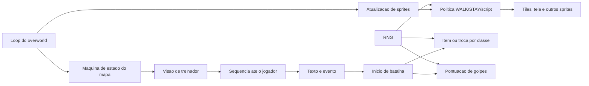

# Funcionamento das IAs e dos NPCs de Pokemon Red/Blue

## Controle do documento

| Campo | Valor |
|---|---|
| Identificacao | AI-NPC-003 |
| Arquivo | `003-2026-08-01-Funcionamento-das-IAs-Pokemon.md` |
| Revisao | 1.0 |
| Data de emissao | 2026-08-01 |
| Situacao | Emitido para revisao e uso tecnico interno |
| Responsavel pelo processo | Equipe de reescrita ASM para C |
| Elaborado por | Gerador deterministico, Graphify e verificacao direta do codigo-fonte |
| Aprovador | Pendente de designacao |
| Baseline do codigo | commit `51079046aab46619f2ac5d9127ecf5be70e9a5e8` |
| Abrangencia | IA de batalha, movimento, percepcao, interacao e scripts de NPC da ROM Red/Blue |
| Classificacao | Informacao documentada interna |

### Historico de revisoes

| Revisao | Data | Alteracao | Autor | Aprovacao |
|---|---|---|---|---|
| 1.0 | 2026-08-01 | Emissao inicial da especificacao e dos inventarios completos | Codex | Pendente |

## 1. Finalidade e relacao com a ISO 9001

Este documento controla o conhecimento sobre os algoritmos que tomam decisoes por
treinadores, criaturas e objetos de mapa. Ele e um contrato de caracterizacao para
a reescrita incremental em C e uma base para testes, analise de risco, aprovacao e
melhoria posterior.

A estrutura usa abordagem de processo, pensamento baseado em risco, criterios de
aceitacao, rastreabilidade, evidencia e controle de informacao documentada
inspirados na ISO 9001. Isso **nao** declara certificacao nem conformidade formal do
repositorio, do produto ou deste documento. Na data de emissao, a referencia
publicada aplicavel e a [ISO 9001:2015/Amd 1:2024](https://www.iso.org/standard/88431.html),
enquanto a [proxima edicao esta em desenvolvimento](https://www.iso.org/standard/88464.html).
O formato tambem considera a orientacao oficial da ISO sobre
[informacao documentada da ISO 9001:2015](https://www.iso.org/files/live/sites/isoorg/files/standards/docs/en/iso_9001_2015_guidance_documented_information.pdf)
e a [ISO 10013:2021](https://www.iso.org/standard/75736.html).

## 2. Escopo

### 2.1 Incluido

- escolha de golpes, itens e trocas pela IA de treinadores;
- comportamento de oponentes selvagens e batalhas por link;
- tabelas, estado em RAM, RNG, comparacoes, limites e defeitos conhecidos;
- atualizacao, movimento aleatorio, direcao, atraso, animacao e colisao de sprites;
- visao de treinadores, aproximacao, interrupcao do jogador e inicio de conversa/batalha;
- movimento roteirizado, simulacao de joypad, RLE e busca de caminho existente;
- despacho de dialogo, servicos de NPC, flags de evento e maquinas de estado dos mapas;
- inventario dos 918 `object_event` em 208 mapas, 322
  cabecalhos de treinador e 199 estados nomeados de script;
- recomendacoes para uma implementacao fiel e para um modo melhorado capaz de
  modelar o estilo do jogador, navegar e iniciar interacoes.

### 2.2 Excluido

- transcricao integral de todos os dialogos, que continuam controlados em `text/`;
- IA ou regras de Pokemon Yellow e geracoes posteriores;
- classificacao narrativa subjetiva de cada personagem;
- afirmacao de intencao original quando o codigo apenas permite observar o efeito;
- qualquer uso de aprendizado no modo fiel sem uma decisao formal de produto.

## 3. Objetivos e criterios da qualidade

| ID | Objetivo | Criterio verificavel |
|---|---|---|
| AI-Q01 | Cobertura | 47 classes, 918 objetos, 322 cabecalhos e 199 estados de script inventariados. |
| AI-Q02 | Fidelidade | Mesmas entradas, bytes de RNG e estado produzem a mesma acao no modo `GEN1_FIDELITY`. |
| AI-Q03 | Rastreabilidade | Cada algoritmo e tabela aponta para arquivo, simbolo ou linha de origem. |
| AI-Q04 | Separacao de melhoria | Comportamento novo existe somente em `ENHANCED` e nao altera saves/replays fieis. |
| AI-Q05 | Testabilidade | RNG, relogio, input, mapa e persistencia sao portas injetaveis. |
| AI-Q06 | Manutencao | Mudancas relevantes regeneram este arquivo e atualizam Graphify. |

## 4. Conclusao executiva

Nao ha perceptron, rede neural, aprendizado de maquina, modelo estatistico treinado,
minimax, Monte Carlo ou behavior tree nesta ROM. O comportamento e composto por:

1. **regras deterministicas e tabelas**, como flags, classes, tipos e ponteiros;
2. **heuristicas de pontuacao**, que alteram quatro notas de golpe e preservam apenas
   as menores;
3. **sorteios pseudoaleatorios**, usados para desempate, movimento e chance de itens;
4. **maquinas de estado**, selecionadas por indices de script e bytes do sprite;
5. **sequencias predefinidas**, muitas vezes comprimidas por RLE;
6. **uma busca gulosa Manhattan**, usada apenas em eventos especificos para montar
   uma sequencia ate o jogador.

Portanto, o jogo e deterministico quando estado inicial, input, temporizacao do
registrador `rDIV` e sequencia aleatoria sao fixados. Ele nao registra como o jogador
luta, nao aprende preferencias, nao muda pesos e nao transfere conhecimento entre
batalhas. A aparente inteligencia emerge de regras pequenas, dados de classe e RNG.

## 5. Visao arquitetural



| Processo | Fonte principal | Simbolos |
|---|---|---|
| Atualizacao de sprites | `home/update_sprites.asm`, `engine/overworld/sprite_collisions.asm` | `UpdateSprites`, `_UpdateSprites` |
| Movimento autonomo | `engine/overworld/movement.asm` | `UpdateNPCSprite`, `TryWalking`, `CanWalkOntoTile` |
| Movimento coordenado | `home/npc_movement.asm`, `engine/overworld/auto_movement.asm` | `RunNPCMovementScript`, tabelas Pallet/Pewter |
| Caminho ate jogador | `engine/overworld/pathfinding.asm` | `CalcPositionOfPlayerRelativeToNPC`, `FindPathToPlayer` |
| Visao e aproximacao | `engine/overworld/trainer_sight.asm`, `home/trainers.asm` | `TrainerEngage`, `TrainerWalkUpToPlayer` |
| Scripts e dialogos | `scripts/*.asm`, `home/text_script.asm`, `home/text.asm` | `CallFunctionInTable`, `DisplayTextID`, `TextCommandProcessor` |
| IA de acao | `engine/battle/trainer_ai.asm`, `data/trainers/ai_pointers.asm` | `TrainerAI`, `TrainerAIPointers` |
| IA de golpe | `engine/battle/trainer_ai.asm`, `data/trainers/move_choices.asm` | `AIEnemyTrainerChooseMoves`, modificadores 1-4 |
| Dados de batalha | `data/moves/moves.asm`, `data/types/type_matchups.asm` | `Moves`, `TypeEffects` |
| Estado | `ram/wram.asm`, `ram/hram.asm` | `wSpriteStateData*`, `wAICount`, `wBuffer`, `hFindPath*` |

## 6. Aleatoriedade e reprodutibilidade

`Random` chama `Random_`. Esta rotina le duas vezes o registrador de divisao de
hardware `rDIV`, soma uma leitura a `hRandomAdd` com carry e subtrai outra de
`hRandomSub` com borrow. O byte normalmente consumido pela logica de NPC e
`hRandomAdd`. Em batalha, `BattleRandom` deve ser usado; batalhas por link consomem
uma lista sincronizada entre os dois aparelhos.

Isto nao e aleatoriedade criptografica e tambem nao e uma decisao aprendida. Para a
reescrita, o contrato de RNG deve expor `next_overworld_byte()` e
`next_battle_byte()`, permitir seed/trace injetavel e preservar a ordem de consumo.
Alterar uma chamada aparentemente irrelevante pode mudar todas as decisoes seguintes.

## 7. IA de batalha

### 7.1 Ordem das decisoes

1. `SelectEnemyMove` elimina estados em que nao se pode escolher: recharge, Rage,
   charge, Thrash, sono, congelamento, trapping e Bide.
2. Oponente selvagem recebe o conjunto original; treinador chama
   `AIEnemyTrainerChooseMoves`.
3. A selecao escolhe um dos quatro slots por faixas de aproximadamente 25%; slot
   vazio ou disabled repete o sorteio.
4. No turno da acao adversaria, `TrainerAI` pode substituir o golpe por item ou troca.
5. Se a rotina retorna carry, a acao especial consumiu o turno; caso contrario o
   golpe escolhido e executado.

Oponentes nao-link tem PP ilimitado: os valores sao carregados, mas a execucao nao
os decrementa. A selecao normal tambem nao exclui PP zero. Em link, a decisao vem do
outro jogador e as regras normais de PP pertencem ao lado humano remoto.

### 7.2 Pontuacao dos quatro golpes

O vetor `wBuffer` inicia como `[10, 10, 10, 10]`. O slot disabled recebe `80`.
Cada camada configurada para a classe altera as notas; ao final, somente os slots
com a **menor nota** sobrevivem. Todos os sobreviventes continuam equiprovaveis no
sorteio por slot. Nao ha softmax ou soma ponderada de probabilidades.

| Camada | Regra | Alteracao |
|---|---|---:|
| 1 | Se o jogador ja tem status, golpe sem dano cujo efeito esta em `StatusAilmentMoveEffects` | `+5` (desencoraja fortemente) |
| 2 | Apenas quando `wAILayer2Encouragement == 1`; favorece faixas numericas de efeitos de stat/status | `-1` |
| 3 | Compara tipo do golpe com `TypeEffects`; super efetivo | `-1` |
| 3 | Resistente/imune e existe outro golpe considerado melhor | `+1` |
| 4 | Rotina vazia e nao usada por classe alguma | `0` |

A camada 2 ocorre nominalmente apenas na segunda oportunidade apos o Pokemon entrar:
o contador comeca em zero e e incrementado no inicio da execucao adversaria. Ela
compara **intervalos de IDs de efeito**, nao utilidade real no estado atual.

### 7.3 Comparacao de tipos

`AIGetTypeEffectiveness` consulta `TypeEffects` com o tipo do golpe e os dois tipos
do jogador. A neutralidade interna e `$10` hexadecimal; as entradas usam 20, 10 ou
0. A rotina para na primeira correspondencia e nao combina os dois tipos. Assim, nao
calcula fraqueza 4x, resistencia 1/4 ou cancelamento entre tipos. A camada ainda pode
favorecer golpe sem dano porque nao exige `power > 0` no caminho super efetivo.

Ao procurar alternativa para um golpe resistido, considera melhores `Super Fang`,
golpes de dano especial fixo, `Fly` e qualquer golpe de **outro tipo** com poder
nao zero; nao estima dano, STAB, accuracy, velocidade, KO, status, setup ou resposta
do jogador.

### 7.4 Acoes especiais por treinador

`wAICount` inicia em `$ff` ao enviar um Pokemon. Na primeira avaliacao, recebe o
limite da classe. Somente uma acao efetivamente usada decrementa o contador; trocar
e enviar outro Pokemon reinicializa o limite para esse novo ativo. `GenericAI` nunca
age. Limiares exatos usam um byte `[0,255]` e o macro `percent = *255/100`.

| Rotina | Probabilidade exata por avaliacao | Condicao e acao |
|---|---:|---|
| `JugglerAI` | 64/256 = 25% | Troca se houver pelo menos dois Pokemon nao desmaiados. |
| `BlackbeltAI` | 32/256 = 12,5% | Usa X Attack. |
| `GiovanniAI` | 64/256 = 25% | Usa Guard Spec. |
| `CooltrainerMAI` | 64/256 = 25% | Usa X Attack. |
| `CooltrainerFAI` | efetivamente 100% sob limiar de HP | Bug: o `ret nc` da intencao de 25% esta comentado; Hyper Potion abaixo de 1/10, senao troca abaixo de 1/5. |
| `BrockAI` | deterministica | Full Heal se o ativo tiver qualquer status. |
| `MistyAI` | 64/256 = 25% | X Defend. |
| `LtSurgeAI` | 64/256 = 25% | X Speed. |
| `ErikaAI` | 128/256 = 50% | Super Potion somente abaixo de 1/10 do HP maximo. |
| `KogaAI` | 64/256 = 25% | X Attack. |
| `BlaineAI` | 64/256 = 25% | Super Potion sem verificar HP, inclusive cheio. |
| `SabrinaAI` | 64/256 = 25% | Hyper Potion abaixo de 1/10. |
| `Rival2AI` | 32/256 = 12,5% | Potion abaixo de 1/5. |
| `Rival3AI` | 32/256 = 12,5% | Full Restore abaixo de 1/5. |
| `LoreleiAI` | 128/256 = 50% | Super Potion abaixo de 1/5. |
| `BrunoAI` | 64/256 = 25% | X Defend. |
| `AgathaAI` | 20/256 = 7,8125% para troca | Se RNG <20 tenta troca; com HP abaixo de 1/4, RNG 20..127 usa Super Potion (42,1875%); demais casos nao agem. |
| `LanceAI` | 128/256 = 50% | Hyper Potion abaixo de 1/5. |
| `GenericAI` | 0% | Retorna sem usar acao. |

`AISwitchIfEnoughMons` apenas conta vivos. `EnemySendOut` escolhe o primeiro membro
vivo, em ordem de equipe, que nao seja o atual. Nao ha comparacao de tipos, golpes,
HP relativo ou matchup para escolher a troca.

### 7.5 Itens implementados

- Potion cura 20 HP; Super Potion 50; Hyper Potion 200.
- Full Restore restaura HP maximo e limpa status; Full Heal limpa status.
- X Attack, X Defend e X Speed chamam o mesmo mecanismo dos modificadores de stat.
- Guard Spec ativa protecao equivalente a Mist.
- X Accuracy, Dire Hit e X Special tem rotinas, mas nao sao apontados pela tabela de
  classes atual.
- Itens de cura limitam ao MaxHP. A IA nao consulta inventario nem dinheiro.

### 7.6 Golpes especiais dos times

`LoneMoves` injeta Bide, BubbleBeam, Thunderbolt, Mega Drain, Toxic, Psywave,
Fire Blast e Fissure em indices definidos por scripts de lider. `TeamMoves` injeta
Blizzard para Lorelei, Fissure para Bruno, Toxic para Agatha e Barrier para Lance.
Isso altera o conjunto disponivel, nao o algoritmo de decisao.

### 7.7 Tabela completa por classe

Camadas: 1=status redundante; 2=efeitos favorecidos; 3=tipo. O limite e o numero
maximo de acoes especiais efetivamente usadas por Pokemon ativo.

| Classe | Limite | Rotina de acao | Camadas de golpe |
|---|---:|---|---|
| `YOUNGSTER` | 3 | `GenericAI` | nenhuma |
| `BUG_CATCHER` | 3 | `GenericAI` | 1 |
| `LASS` | 3 | `GenericAI` | 1 |
| `SAILOR` | 3 | `GenericAI` | 1,3 |
| `JR_TRAINER_M` | 3 | `GenericAI` | 1 |
| `JR_TRAINER_F` | 3 | `GenericAI` | 1 |
| `POKEMANIAC` | 3 | `GenericAI` | 1,2,3 |
| `SUPER_NERD` | 3 | `GenericAI` | 1,2 |
| `HIKER` | 3 | `GenericAI` | 1 |
| `BIKER` | 3 | `GenericAI` | 1 |
| `BURGLAR` | 3 | `GenericAI` | 1,3 |
| `ENGINEER` | 3 | `GenericAI` | 1 |
| `UNUSED_JUGGLER` | 3 | `JugglerAI` | 1,2 |
| `FISHER` | 3 | `GenericAI` | 1,3 |
| `SWIMMER` | 3 | `GenericAI` | 1,3 |
| `CUE_BALL` | 3 | `GenericAI` | nenhuma |
| `GAMBLER` | 3 | `GenericAI` | 1 |
| `BEAUTY` | 3 | `GenericAI` | 1,3 |
| `PSYCHIC_TR` | 3 | `GenericAI` | 1,2 |
| `ROCKER` | 3 | `GenericAI` | 1,3 |
| `JUGGLER` | 3 | `JugglerAI` | 1 |
| `TAMER` | 3 | `GenericAI` | 1 |
| `BIRD_KEEPER` | 3 | `GenericAI` | 1 |
| `BLACKBELT` | 2 | `BlackbeltAI` | 1 |
| `RIVAL1` | 3 | `GenericAI` | 1 |
| `PROF_OAK` | 3 | `GenericAI` | 1,3 |
| `CHIEF` | 1 | `GenericAI` | 1,2 |
| `SCIENTIST` | 3 | `GenericAI` | 1,2 |
| `GIOVANNI` | 1 | `GiovanniAI` | 1,3 |
| `ROCKET` | 3 | `GenericAI` | 1 |
| `COOLTRAINER_M` | 2 | `CooltrainerMAI` | 1,3 |
| `COOLTRAINER_F` | 1 | `CooltrainerFAI` | 1,3 |
| `BRUNO` | 2 | `BrunoAI` | 1 |
| `BROCK` | 5 | `BrockAI` | 1 |
| `MISTY` | 1 | `MistyAI` | 1,3 |
| `LT_SURGE` | 1 | `LtSurgeAI` | 1,3 |
| `ERIKA` | 1 | `ErikaAI` | 1,3 |
| `KOGA` | 2 | `KogaAI` | 1,3 |
| `BLAINE` | 2 | `BlaineAI` | 1,3 |
| `SABRINA` | 1 | `SabrinaAI` | 1,3 |
| `GENTLEMAN` | 3 | `GenericAI` | 1,2 |
| `RIVAL2` | 1 | `Rival2AI` | 1,3 |
| `RIVAL3` | 1 | `Rival3AI` | 1,3 |
| `LORELEI` | 2 | `LoreleiAI` | 1,2,3 |
| `CHANNELER` | 3 | `GenericAI` | 1 |
| `AGATHA` | 2 | `AgathaAI` | 1 |
| `LANCE` | 1 | `LanceAI` | 1,3 |


## 8. Comportamento dos NPCs no mapa

### 8.1 Modelo de dados

Cada `object_event` declara coordenadas, sprite, `WALK`/`STAY`, restricao de direcao,
ID de texto e, quando aplicavel, item ou oponente. O mapa corrente materializa ate
`MAX_OBJECT_EVENTS = 16`; existem 16 pares de estruturas `wSpriteStateData1` e
`wSpriteStateData2`, incluindo o jogador.

`StateData1` contem imagem, estado de movimento, vetores por pixel, posicao de tela,
frames, direcao e bits de colisao. `StateData2` contem deslocamento acumulado,
coordenada no mapa, byte de politica/script, prioridade na grama, atraso, direcao
original, picture ID e slot de VRAM. `wMapSpriteData` guarda restricao/texto e
`wMapSpriteExtraData` guarda classe/item e conjunto/nivel.

### 8.2 Maquina de estados de movimento

| Estado | Valor/bit | Comportamento |
|---|---|---|
| Nao inicializado | status `0` | Inicializa como pronto e imagem invisivel ate posicionamento. |
| Pronto | status `1` | Pode escolher direcao quando jogador nao esta andando e fonte nao esta aberta. |
| Atrasado | status `2` | Decrementa `MOVEMENTDELAY`; ao chegar a zero volta a pronto. |
| Andando | status `3` | Move 1 pixel por tick durante 16 ticks e avanca frame a cada 4. |
| Face player | bit 7 | Ao conversar, gira para o jogador, salvo excecao do capitao da S.S. Anne. |
| Script local | byte 1 `< WALK` | Consome `wNPCMovementDirections` ate sentinela `$ff`. |
| Coordenado | sprite offset selecionado | `DoScriptedNPCMovement` move NPC em sincronia de 2 pixels com o jogador. |

### 8.3 WALK, STAY e direcoes

Ha 98 objetos `WALK` e 820 objetos
`STAY`. Para ambos, a engine sorteia um byte. Os dois bits superiores dividem as
quatro direcoes em faixas de 64 resultados:

- `ANY_DIR`: Down, Up, Left e Right com 25% nominal cada;
- `UP_DOWN`: Up ou Down com 50% cada;
- `LEFT_RIGHT`: Left ou Right com 50% cada;
- `DOWN`, `UP`, `LEFT`, `RIGHT`: direcao fixa;
- `NONE`: sem restricao adicional, mas normalmente combinado com `STAY`;
- `BOULDER_MOVEMENT_BYTE_2`: tratamento de objeto empurravel.

`STAY` ainda escolhe uma direcao e pode virar, mas `CanWalkOntoTile` impede o passo.
`WALK` tenta deslocar. Depois de andar ou falhar, o atraso recebe `RNG & $7f`, faixa
0..127; zero sofre underflow e dura 256 ticks. O resultado e vagar local sem destino,
memoria, perseguicao ou agenda.

Distribuicao declarada no corpus:

| Restricao | Objetos |
|---|---:|
| `NONE` | 251 |
| `DOWN` | 233 |
| `RIGHT` | 120 |
| `LEFT` | 114 |
| `UP` | 79 |
| `LEFT_RIGHT` | 49 |
| `UP_DOWN` | 29 |
| `ANY_DIR` | 22 |
| `BOULDER_MOVEMENT_BYTE_2` | 21 |


### 8.4 Passabilidade e colisao

Para movimento autonomo, `CanWalkOntoTile` compara o tile destino com a lista de
colisao do tileset apontada por `wTilesetCollisionPtr`, impede sair da regiao de
tela, chama `DetectCollisionBetweenSprites` e verifica deslocamentos acumulados.
Movimento roteirizado (`byte 1 < WALK`) e aceito antes dessas verificacoes, pois os
scripts assumem trajetos validos.

`DetectCollisionBetweenSprites` percorre os 16 slots, descarta slot vazio ou
offscreen, ajusta coordenadas em 7/9 pixels conforme o vetor e grava direcoes de
colisao e uma mascara de quais sprites colidiram. Nao ha steering, reserva global de
rota, negociacao de passagem ou desvio local.

Defeitos relevantes para compatibilidade:

- o teste vertical de deslocamento pode prender um sprite apos andar cinco passos
  para cima, enquanto o equivalente horizontal compara sem desvio condicional;
- atraso zero representa 256 ticks por underflow;
- um byte `WALK` encontrado dentro da lista de movimento local segue um indice
  aparentemente incorreto (`$fe`), marcado como bug no fonte;
- scripts locais ignoram a passabilidade normal e podem atravessar geometria se os
  dados estiverem errados.

### 8.5 Visao de treinador e interrupcao do jogador

O jogo **ja implementa** NPC que detecta, para e aborda o jogador:

1. `CheckForEngagingTrainers` percorre cabecalhos ainda nao derrotados.
2. `TrainerEngage` exige sprite visivel, alinhamento exato no mesmo X ou Y, distancia
   dentro do alcance e jogador a frente da direcao atual.
3. Nao existe ray cast por todos os tiles entre ambos; a logica e geometrica e os
   mapas posicionam treinadores para que o corredor seja valido.
4. Ao detectar, define `BIT_SEEN_BY_TRAINER`, carrega classe/conjunto, toca musica,
   mostra a exclamacao e bloqueia o fluxo normal.
5. `TrainerWalkUpToPlayer` escreve N-1 passos retos ate ficar adjacente.
6. O texto pre-batalha e exibido e a batalha inicia. A flag persistente impede nova
   abordagem depois da derrota.

`view_range` do macro `trainer` e armazenado como `valor << 4`, portanto cada unidade
representa 16 pixels/um passo de grade. Alcance zero desativa deteccao automatica,
mas o treinador ainda pode ser acionado ao conversar.

### 8.6 Busca de caminho existente

`FindPathToPlayer` nao e A*. Primeiro, `CalcPositionOfPlayerRelativeToNPC` calcula
distancias absolutas em passos de 16 pixels e flags de quadrante. A busca entao:

1. calcula quanto falta em X e Y;
2. reduz o eixo com maior distancia;
3. em empate, reduz X;
4. grava uma direcao por passo em `wNPCMovementDirections2`;
5. encerra com `$ff`.

E um caminho Manhattan guloso, sem mapa, custo, fila, visitados ou obstaculos. E
usado para Oak em Pallet e para o rival no laboratorio. Como a sequencia posterior
e tratada como script, a seguranca depende do evento e do layout conhecidos.

### 8.7 Movimento roteirizado

Existem dois mecanismos:

- `MoveSprite` copia uma lista terminada em `$ff` para `wNPCMovementDirections` e
  bloqueia input; `UpdateNPCSprite` consome uma entrada por passo.
- movimento coordenado decodifica listas RLE para o jogador e o NPC, simula joypad e
  atualiza o NPC em passos de 2 pixels para manter sincronismo. As tabelas globais
  cobrem Oak em Pallet e os guias de Pewter; muitos mapas possuem sequencias locais.

RLE armazena pares `<byte, repeticoes>` e sentinela `$ff`. Este mecanismo conduz
entradas de sala, empurra o jogador em portoes, move rivais/Rockets, executa pisos de
seta e sincroniza cenas. Ele e uma cutscene deterministica, nao navegacao autonoma.

### 8.8 Dialogo, servicos e eventos

Ao pressionar A diante de um objeto, a engine identifica o sprite, marca o bit para
encarar o jogador, resolve seu text ID e executa o ponteiro do mapa. `text_asm`
permite que um dialogo execute codigo e altere estado. Ao fechar, as direcoes
originais sao restauradas e os sprites recarregados.

O primeiro byte do texto possui despachos globais para Mart, enfermeira, PCs,
vending machine, prize vendor e Cable Club. Outros servicos sao scripts de mapa:

| Arquetipo | Comportamento | Fonte principal |
|---|---|---|
| Mart | Carrega lista de itens, menu, preco, dinheiro e inventario | `engine/events/pokemart.asm`, `data/items/marts.asm` |
| Centro Pokemon | Pergunta, cura equipe, animacao e retorno | `engine/events/pokecenter.asm` |
| Cable Club | Estados de recepcao, espera e link | `engine/link/cable_club_npc.asm` |
| Troca NPC | Valida especie, confirma, cria recebido e roda sequencia | `engine/events/in_game_trades.asm`, `data/events/trades.asm` |
| Day Care | Deposito, experiencia por passos, custo e retirada | `scripts/Daycare.asm`, `engine/overworld/daycare_exp.asm` |
| Name Rater | Valida propriedade e executa naming screen | `scripts/NameRatersHouse.asm` |
| Fosil | Recebe fossil, usa evento/tempo e entrega especie | `scripts/CinnabarLabFossilRoom.asm`, `engine/events/cinnabar_lab.asm` |
| Prize vendor | Valida Coin Case, saldo, equipe/box e concede premio | `engine/events/prize_menu.asm`, `data/events/prizes.asm` |
| Bike Shop | Condiciona preco/voucher e entrega bicicleta | `scripts/BikeShop.asm` |
| Safari gate | Entrada, taxa, Balls, passos e saida automatica | `scripts/SafariZoneGate.asm`, `engine/events/hidden_events/safari_game.asm` |
| Oak's aides | Conta especies capturadas e concede item por limiar | `engine/events/oaks_aide.asm` |
| Treinador | Antes/fim/depois, flag persistente, classe e conjunto | `home/trainers.asm`, `scripts/*.asm` |

Todos esses fluxos sao regras de negocio deterministicas sobre flags, inventario,
dinheiro, party, coordenadas e respostas do jogador. Nenhum adapta a conversa ao
historico alem dos estados explicitamente salvos.

## 9. Tabelas e comparacoes utilizadas

| Tabela/estado | Chave comparada | Resultado |
|---|---|---|
| `TrainerAIPointers` | `wTrainerClass` | limite de uso e rotina de item/troca |
| `TrainerClassMoveChoiceModifications` | `wTrainerClass` | lista de camadas 1-4 |
| `AIMoveChoiceModificationFunctionPointers` | ID da camada | funcao de pontuacao |
| `StatusAilmentMoveEffects` | efeito do golpe | identifica status redundante |
| `Moves` | ID do golpe | efeito, poder, tipo, accuracy e PP |
| `TypeEffects` | tipo atacante/defensor | 20, 10 ou 0 para a heuristica |
| `TrainerDataPointers`/parties | classe e `wTrainerNo` | equipe e niveis |
| `LoneMoves`/`TeamMoves` | indice/classe | golpe especial injetado |
| `TrainerAIPointers` RNG | byte contra limiar | usar item, trocar ou nao agir |
| cabecalho `trainer` | flag, alcance, textos | visao, repeticao e dialogos |
| `wEventFlags` | bit de evento | ramo de script e persistencia |
| tabelas `*ScriptPointers` | indice `w*CurScript` | proximo estado do mapa |
| `object_event` | sprite ID/text ID | movimento, interacao, item ou oponente |
| collision list do tileset | tile destino | passo autonomo permitido |
| `SpriteCollisionBitTable` | indice do outro sprite | mascara de colisao |
| `NPCMovementDirectionsToJoypadMasksTable` | direcao NPC | input simulado equivalente |
| tabelas RLE/movimento | byte e repeticoes | sequencia de cutscene |
| ponteiros de texto do mapa | text ID | texto simples ou `text_asm` |
| despachos `TX_SCRIPT_*` | primeiro byte | servico global de NPC |

## 10. Classificacao dos algoritmos

| Mecanismo | Classe tecnica | Aprende? | Planeja? | Usa RNG? |
|---|---|---:|---:|---:|
| Escolha de golpe de treinador | utility scoring discreto + filtro argmin | Nao | Nao | Sim, desempate |
| Item/troca de treinador | regras probabilisticas por classe | Nao | Nao | Sim |
| Golpe selvagem | escolha uniforme por slot valido | Nao | Nao | Sim |
| Movimento WALK | random walk restrito | Nao | Nao | Sim |
| Visao de treinador | linha cardinal + alcance + facing | Nao | Nao | Nao |
| Aproximacao de treinador | sequencia reta | Nao | Nao | Nao |
| `FindPathToPlayer` | guloso Manhattan | Nao | Um caminho sem obstaculos | Nao |
| Scripts de mapa | maquina de estados/tabela de funcoes | Nao | Sequencia predefinida | Ocasional |
| Dialogos/servicos | regras e transacoes | Nao | Nao | Ocasional |

Um perceptron exigiria vetor de features, pesos, produto escalar, limiar e, para
aprender, regra de atualizacao. Nenhum desses elementos existe aqui. As notas de
golpe podem parecer pesos, mas sao constantes temporarias reiniciadas a cada decisao
e ajustadas por `if`s; nao constituem perceptron.

## 11. Recomendacao para a reescrita fiel

### 11.1 Dois modos obrigatorios

```c
typedef enum {
    GEN1_FIDELITY,
    ENHANCED
} BehaviorMode;
```

`GEN1_FIDELITY` e criterio de aceitacao da migracao. Deve reproduzir tabelas,
ordem de comparacoes, overflow/underflow relevantes, bugs catalogados e consumo de
RNG. `ENHANCED` deve ser opt-in, versionado e testado separadamente. Misturar
melhorias na traducao impede provar equivalencia.

### 11.2 Limites DDD

| Bounded context | Responsabilidade |
|---|---|
| `BattleDecision` | observacao de batalha, pontuacao, item, troca e acao |
| `OverworldActors` | estado, percepcao, movimento, colisao e animacao de NPC |
| `Navigation` | grid, consulta de passabilidade, path e reserva de destino |
| `ScriptedEvents` | estado de mapa, flags, comandos, cutscenes e dialogos |
| `NpcServices` | mart, heal, trade, daycare, premios e demais transacoes |
| `PlayerModel` | historico agregado e previsao, inexistente no modo fiel |
| `Runtime` | RNG, input, relogio, bancos/memoria, audio e video |

### 11.3 SOLID pragmatico em C

- `BattleDecisionPolicy` recebe uma observacao imutavel e devolve uma intencao; nao
  executa animacao nem altera RAM diretamente.
- `MovementPolicy` decide destino; `CollisionQuery` valida; `ActorExecutor` aplica.
- `PerceptionPolicy` detecta jogador e emite evento; dialogo e batalha sao consumidores.
- `ScriptVM` interpreta comandos e depende de portas para mapa, texto, inventario e batalha.
- RNG entra por interface pequena; fixtures fornecem bytes exatos.
- tabelas sao dados tipados e validados, nao `switch` duplicado em varios modulos.

### 11.4 Refactoring incremental

1. caracterizar rotina ASM com snapshot de RAM e trace de RNG;
2. extrair leitores C das tabelas sem mudar formato;
3. implementar funcao pura equivalente;
4. executar diferencial ASM/C para milhares de estados;
5. substituir uma chamada por vez;
6. somente depois separar nomes, structs e estrategias;
7. ativar melhorias atras de `BehaviorMode`.

## 12. Melhorias possiveis no modo ENHANCED

### 12.1 IA de batalha mais forte e explicavel

Use utility AI deterministica, nao uma rede neural como primeiro passo. Para cada
acao legal, estime dano esperado, chance de KO, risco recebido, valor de status,
setup, accuracy, STAB, matchup, HP, velocidade, PP e custo de troca. Perfis de
treinador alteram pesos e tolerancia a risco. Empates usam RNG injetavel.

Uma busca curta de 1-2 turnos pode ser adicionada para chefes, com limite fixo de
nos e avaliacao reproduzivel. Isso e mais auditavel e mais facil de testar que um
modelo opaco, mantendo a personalidade controlada por dados.

### 12.2 Aprender como o jogador joga

E possivel, mas nao pertence ao modo fiel. Recomenda-se um `PlayerModel` local,
limitado e interpretavel:

- contadores com decaimento exponencial para Fight/Item/Switch/Run;
- frequencia por faixa de HP e vantagem de tipo;
- repeticao do ultimo golpe/tipo;
- tendencia a trocar diante de status ou matchup ruim;
- uso de cura e preferencia ofensiva/defensiva;
- janela limitada ou decaimento para nao eternizar comportamento antigo.

O modelo pode prever a proxima **categoria de acao** por distribuicao condicional.
Um perceptron multiclasses simples e tecnicamente possivel, mas so deve entrar apos
uma baseline de contadores: exige normalizacao, taxa de aprendizado, pesos no save,
controle de overflow, versionamento e testes de estabilidade. Ele nao e necessario
para produzir adaptacao convincente.

Primeiro execute em `shadow mode`: registra previsao e acerto, mas a IA continua
fiel. Depois, no modo melhorado, use a previsao apenas como um termo limitado da
utility, com clamp, para evitar que uma amostra pequena domine a decisao.

Controles obrigatorios:

- opcao para zerar aprendizado e desativar adaptacao;
- schema de save versionado e migracao;
- limite de peso/contador e aritmetica definida;
- nenhuma coleta externa; dados permanecem no save local;
- seed e trace para reproduzir bugs;
- dificuldade e taxa de adaptacao comunicadas por configuracao, nao escondidas.

### 12.3 NPCs andando pelo mapa

Introduza um `NavigationGrid` derivado da colisao do mapa e use A* para destinos
longos. Para movimentacao local, reserve a proxima celula, detecte deadlock e aplique
prioridade estavel por actor ID. Portas, warps, ledges, agua e scripts precisam de
custos/capacidades explicitos.

Cada NPC pode ter agenda e maquina de estados: `Idle`, `Wander`, `Travel`, `Work`,
`Talk`, `Alert`, `ReturnHome`, `Scripted`. O path e recalculado somente quando alvo
ou mapa muda/bloqueia; nao a cada frame. Mapas descarregados usam simulacao de baixa
frequencia ou saltos de agenda, evitando tentar manter sprites ativos globalmente.

### 12.4 Parar o jogador para conversar

Generalize o pipeline ja usado por treinadores e Oak:

1. `PerceptionPolicy` detecta por alcance, cone de visao, trigger ou evento;
2. um arbitro garante que apenas um NPC reserve a interacao;
3. input do jogador e bloqueado por token com liberacao garantida;
4. NPC calcula caminho ate uma celula adjacente alcancavel;
5. ambos se encaram;
6. dialogo roda e pode emitir quest/batalha/transacao;
7. estado e input sao restaurados mesmo em cancelamento ou troca de mapa.

Inclua cooldown, prioridade de evento, verificacao de cutscene/batalha/menu e uma
rota de cancelamento. Sem isso, dois NPCs podem abordar ao mesmo tempo ou prender o
jogador.

### 12.5 Comportamentos adicionais seguros

- reacoes a horario, clima, historia e badges por regras declarativas;
- memoria curta de conversa e quest flags tipadas;
- fuga, patrulha, curiosidade e retorno ao posto;
- barks contextuais sem interromper o jogador;
- ajuda de navegacao e seguidores com reserva de celula;
- perfis de treinador que usam estrategia coerente com classe e time;
- telemetria local de decisao para explicar por que uma acao foi escolhida.

## 13. Estrategia TDD

### 13.1 Testes de caracterizacao obrigatorios

| ID | Caso | Evidencia esperada |
|---|---|---|
| AI-T01 | Classe sem camadas | conjunto original e sorteio por slot existente |
| AI-T02 | Status ja presente | golpe de status sem dano recebe `+5` |
| AI-T03 | Segundo momento do ativo | camada 2 ocorre somente com contador igual a 1 |
| AI-T04 | Super efetivo simples | nota `-1` pela primeira entrada de `TypeEffects` |
| AI-T05 | Pokemon dual type | reproduzir a primeira correspondencia, sem multiplicacao |
| AI-T06 | Disabled | slot recebe 80 e nao e selecionado quando ha alternativa |
| AI-T07 | Empate de minimos | distribuicao por slots e rejeicao de vazios seguem bytes gravados |
| AI-T08 | Blaine com HP cheio | pode desperdiçar Super Potion no limiar de RNG |
| AI-T09 | Cooltrainer F | cura/troca sem gate de 25% |
| AI-T10 | Agatha fronteiras 19/20/127/128 | troca, cura ou nenhuma acao exatamente como ASM |
| AI-T11 | Troca | primeiro membro vivo nao atual e escolhido |
| AI-T12 | Limite de item | decrementa apenas apos acao usada e reinicializa por ativo |
| NPC-T01 | WALK + ANY_DIR | quatro faixas de 64 bytes escolhem direcoes corretas |
| NPC-T02 | STAY | muda facing, nunca coordenada de mapa |
| NPC-T03 | atraso zero | dura 256 ticks em fidelidade |
| NPC-T04 | colisao | mascara e bloqueio iguais para todos os offsets limite |
| NPC-T05 | trainer sight | alinhamento, facing, distancia e flag nas fronteiras |
| NPC-T06 | alcance zero | nao aborda automaticamente; conversa manual funciona |
| NPC-T07 | approach | gera N-1 passos e termina adjacente |
| NPC-T08 | path guloso | reduz maior eixo e prefere X no empate |
| NPC-T09 | RLE | expande pares e preserva sentinela `$ff` |
| NPC-T10 | dialogo | encara durante texto e restaura direcao ao fechar |
| NPC-T11 | evento derrotado | treinador nao volta a abordar |
| NPC-T12 | input lock | toda saida de script libera controle exatamente uma vez |

### 13.2 Diferencial e propriedades

- rode todos os 256 bytes de RNG para cada rotina probabilistica;
- gere combinacoes dos quatro golpes, efeitos, tipos e status;
- compare RAM observavel, acao, carry e quantidade de bytes aleatorios consumidos;
- para movimento, varie os 256 bytes, bordas de tela, tile e 16 slots de colisao;
- para scripts, use golden traces de estado, flags, input simulado e sequencia textual;
- execute `GEN1_FIDELITY` e `ENHANCED` em suites separadas para impedir vazamento.

## 14. Riscos e nao conformidades conhecidas

| ID | Risco/defeito | Efeito | Tratamento |
|---|---|---|---|
| AI-R01 | Tipo dual nao combinado | escolha subotima | preservar em fiel; corrigir em melhorado |
| AI-R02 | Cooltrainer F sem retorno probabilistico | cura/troca muito frequente | teste de bug e feature flag de correcao |
| AI-R03 | Blaine ignora HP | item desperdicado | preservar/corrigir por modo |
| AI-R04 | Camada 2 depende de contador transitorio | preferencia ocorre uma vez | teste de sequencia, nao apenas unitario isolado |
| AI-R05 | PP inimigo ilimitado | diverge de regras do jogador | contrato explicito por modo |
| AI-R06 | RNG acoplado a `rDIV` | replay diverge por ordem/timing | porta de RNG e trace |
| NPC-R01 | path guloso ignora obstaculos | caminho invalido fora de cena prevista | manter apenas em scripts; A* no melhorado |
| NPC-R02 | script ignora colisao | atravessa mapa se dado errado | validar trajetos estaticamente |
| NPC-R03 | underflow de atraso | pausa longa inesperada | teste e opcao de correcao |
| NPC-R04 | limite de deslocamento assimetrico | NPC prende/vaga diferente por eixo | snapshot e correcao por modo |
| NPC-R05 | abordagem sem arbitragem geral | extensao pode gerar disputa | interaction coordinator |
| NPC-R06 | aprendizado persistente sem versao | save incompativel | schema e migracao |
| NPC-R07 | IA adaptativa muito forte | experiencia injusta | clamp, dificuldade e reset |

## 15. Rastreabilidade de requisitos

| Requisito | Fonte | Teste/aceitacao |
|---|---|---|
| AI-REQ-001 Escolher golpe fiel | `trainer_ai.asm`, `move_choices.asm` | AI-T01..AI-T07 |
| AI-REQ-002 Usar item/troca fiel | `trainer_ai.asm`, `ai_pointers.asm` | AI-T08..AI-T12 |
| AI-REQ-003 Preservar RNG | `home/random.asm`, `engine/math/random.asm`, `BattleRandom` | trace byte a byte |
| NPC-REQ-001 Atualizar movimento | `movement.asm`, `sprite_collisions.asm` | NPC-T01..NPC-T04 |
| NPC-REQ-002 Abordar jogador | `trainer_sight.asm`, `home/trainers.asm` | NPC-T05..NPC-T07 |
| NPC-REQ-003 Executar caminhos/scripts | `pathfinding.asm`, `auto_movement.asm` | NPC-T08..NPC-T09 |
| NPC-REQ-004 Interagir e persistir | `text_script.asm`, `scripts/*.asm` | NPC-T10..NPC-T12 |
| ENH-REQ-001 Melhorar sem regressao | `BehaviorMode` e ADR futuro | suite fiel continua identica |
| ENH-REQ-002 Aprender com controle | `PlayerModel` futuro | reset, clamp, migracao e shadow metrics |

## 16. Controle de mudancas e Graphify

Regenerar apos alterar objetos, trainer headers, scripts, movimento, colisao, RNG,
IA de batalha ou tabelas relacionadas:

```sh
python3 tools/generate_npc_ai_document.py
python3 tools/generate_npc_ai_document.py --check
$(cat graphify-out/.graphify_python) tools/graphify_rgbds.py .
$(cat graphify-out/.graphify_python) -m graphify export html
```

Revisao obrigatoria deve confirmar diff do documento, assertions do gerador, testes
afetados e grafo atualizado. O HTML e `graphify-out/graph.html`; o JSON consultavel
por agentes e `graphify-out/graph.json`.

## 17. Evidencias e aprovacao

### 17.1 Evidencias desta revisao

- consulta Graphify expandida com vocabulario do proprio grafo;
- leitura direta das rotinas e tabelas citadas;
- inventario deterministico dos fontes ASM;
- assertions de 47 classes, 918 objetos, 322 cabecalhos e 199 estados;
- verificacao de sintaxe do gerador e reproducibilidade do Markdown;
- atualizacao do grafo e export HTML apos emissao.

### 17.2 Checklist do aprovador

- [ ] Escopo e modos fiel/melhorado aprovados.
- [ ] Bugs historicos classificados entre preservar e corrigir.
- [ ] Casos TDD possuem fixtures e responsavel.
- [ ] Inventarios conferem com o baseline.
- [ ] Modelo de aprendizado possui opt-out, reset e schema de save.
- [ ] Graphify e links de fonte estao atualizados.

## 18. Referencias internas

- `docs/001-2026-08-01-Sistema_de_Batalhas_Pokemon_Red_Blue.md`
- `docs/002-2026-08-01-Informações_sobre_Pokemons.md`
- `engine/battle/trainer_ai.asm`
- `engine/battle/core.asm`
- `data/trainers/ai_pointers.asm`
- `data/trainers/move_choices.asm`
- `engine/overworld/movement.asm`
- `engine/overworld/sprite_collisions.asm`
- `engine/overworld/trainer_sight.asm`
- `engine/overworld/pathfinding.asm`
- `engine/overworld/auto_movement.asm`
- `home/trainers.asm`
- `home/text_script.asm`
- `macros/scripts/maps.asm`
- `ram/wram.asm`

## 19. Resumo quantitativo gerado

| Medida | Resultado |
|---|---:|
| Classes de treinador com configuracao de IA | 47 |
| Objetos de mapa | 918 |
| Mapas com objeto | 208 |
| NPC/interacao generica | 403 |
| Treinadores declarados como objeto | 334 |
| Pokemon estaticos hostis | 12 |
| Itens/objetos coletaveis | 106 |
| Pokemon/cenario interativo | 28 |
| Obstaculos empurraveis | 25 |
| Outros objetos interativos | 10 |
| Cabecalhos `trainer` com flag/visao/textos | 322 em 69 mapas |
| Estados nomeados nas tabelas de script | 199 em 56 mapas |
| Pontos de chamada de movimento roteirizado | 72 |

## 20. Inventario completo dos objetos de mapa

Este anexo e a cobertura estrutural de todos os `object_event`, inclusive NPCs,
treinadores, Pokemon de cenario, encontros estaticos, itens e obstaculos. `Texto`
aponta para o comportamento/dialogo especifico no script correspondente.


### 20.1 Mapa `AgathasRoom`

| # | X,Y | Sprite | Movimento/restricao | Categoria | Alvo/dado | Texto | Fonte |
|---:|---|---|---|---|---|---|---|
| 1 | 5,2 | `SPRITE_AGATHA` | `STAY` / `DOWN` | Treinador | OPP_AGATHA; conjunto/nivel 1 | `TEXT_AGATHASROOM_AGATHA` | `data/maps/objects/AgathasRoom.asm:16` |

### 20.2 Mapa `BikeShop`

| # | X,Y | Sprite | Movimento/restricao | Categoria | Alvo/dado | Texto | Fonte |
|---:|---|---|---|---|---|---|---|
| 1 | 6,2 | `SPRITE_BIKE_SHOP_CLERK` | `STAY` / `NONE` | NPC/interacao | - | `TEXT_BIKESHOP_CLERK` | `data/maps/objects/BikeShop.asm:16` |
| 2 | 5,6 | `SPRITE_MIDDLE_AGED_WOMAN` | `WALK` / `UP_DOWN` | NPC/interacao | - | `TEXT_BIKESHOP_MIDDLE_AGED_WOMAN` | `data/maps/objects/BikeShop.asm:17` |
| 3 | 1,3 | `SPRITE_YOUNGSTER` | `STAY` / `UP` | NPC/interacao | - | `TEXT_BIKESHOP_YOUNGSTER` | `data/maps/objects/BikeShop.asm:18` |

### 20.3 Mapa `BillsHouse`

| # | X,Y | Sprite | Movimento/restricao | Categoria | Alvo/dado | Texto | Fonte |
|---:|---|---|---|---|---|---|---|
| 1 | 6,5 | `SPRITE_MONSTER` | `STAY` / `NONE` | Pokemon/cenario interativo | - | `TEXT_BILLSHOUSE_BILL_POKEMON` | `data/maps/objects/BillsHouse.asm:16` |
| 2 | 4,4 | `SPRITE_SUPER_NERD` | `STAY` / `NONE` | NPC/interacao | - | `TEXT_BILLSHOUSE_BILL_SS_TICKET` | `data/maps/objects/BillsHouse.asm:17` |
| 3 | 6,5 | `SPRITE_SUPER_NERD` | `STAY` / `NONE` | NPC/interacao | - | `TEXT_BILLSHOUSE_BILL_CHECK_OUT_MY_RARE_POKEMON` | `data/maps/objects/BillsHouse.asm:18` |

### 20.4 Mapa `BluesHouse`

| # | X,Y | Sprite | Movimento/restricao | Categoria | Alvo/dado | Texto | Fonte |
|---:|---|---|---|---|---|---|---|
| 1 | 2,3 | `SPRITE_DAISY` | `STAY` / `RIGHT` | NPC/interacao | - | `TEXT_BLUESHOUSE_DAISY_SITTING` | `data/maps/objects/BluesHouse.asm:16` |
| 2 | 6,4 | `SPRITE_DAISY` | `WALK` / `UP_DOWN` | Item/objeto coletavel | 0 | `TEXT_BLUESHOUSE_DAISY_WALKING` | `data/maps/objects/BluesHouse.asm:17` |
| 3 | 3,3 | `SPRITE_POKEDEX` | `STAY` / `NONE` | Item/objeto coletavel | 0 | `TEXT_BLUESHOUSE_TOWN_MAP` | `data/maps/objects/BluesHouse.asm:18` |

### 20.5 Mapa `BrunosRoom`

| # | X,Y | Sprite | Movimento/restricao | Categoria | Alvo/dado | Texto | Fonte |
|---:|---|---|---|---|---|---|---|
| 1 | 5,2 | `SPRITE_BRUNO` | `STAY` / `DOWN` | Treinador | OPP_BRUNO; conjunto/nivel 1 | `TEXT_BRUNOSROOM_BRUNO` | `data/maps/objects/BrunosRoom.asm:16` |

### 20.6 Mapa `CeladonChiefHouse`

| # | X,Y | Sprite | Movimento/restricao | Categoria | Alvo/dado | Texto | Fonte |
|---:|---|---|---|---|---|---|---|
| 1 | 4,2 | `SPRITE_GRAMPS` | `STAY` / `DOWN` | NPC/interacao | - | `TEXT_CELADONCHIEFHOUSE_CHIEF` | `data/maps/objects/CeladonChiefHouse.asm:16` |
| 2 | 1,4 | `SPRITE_ROCKET` | `WALK` / `ANY_DIR` | NPC/interacao | - | `TEXT_CELADONCHIEFHOUSE_ROCKET` | `data/maps/objects/CeladonChiefHouse.asm:17` |
| 3 | 5,6 | `SPRITE_SAILOR` | `STAY` / `LEFT` | NPC/interacao | - | `TEXT_CELADONCHIEFHOUSE_SAILOR` | `data/maps/objects/CeladonChiefHouse.asm:18` |

### 20.7 Mapa `CeladonCity`

| # | X,Y | Sprite | Movimento/restricao | Categoria | Alvo/dado | Texto | Fonte |
|---:|---|---|---|---|---|---|---|
| 1 | 8,17 | `SPRITE_LITTLE_GIRL` | `WALK` / `ANY_DIR` | NPC/interacao | - | `TEXT_CELADONCITY_LITTLE_GIRL` | `data/maps/objects/CeladonCity.asm:42` |
| 2 | 11,28 | `SPRITE_GRAMPS` | `STAY` / `UP` | NPC/interacao | - | `TEXT_CELADONCITY_GRAMPS1` | `data/maps/objects/CeladonCity.asm:43` |
| 3 | 14,19 | `SPRITE_GIRL` | `WALK` / `UP_DOWN` | NPC/interacao | - | `TEXT_CELADONCITY_GIRL` | `data/maps/objects/CeladonCity.asm:44` |
| 4 | 25,22 | `SPRITE_GRAMPS` | `STAY` / `DOWN` | NPC/interacao | - | `TEXT_CELADONCITY_GRAMPS2` | `data/maps/objects/CeladonCity.asm:45` |
| 5 | 22,16 | `SPRITE_GRAMPS` | `STAY` / `DOWN` | NPC/interacao | - | `TEXT_CELADONCITY_GRAMPS3` | `data/maps/objects/CeladonCity.asm:46` |
| 6 | 32,12 | `SPRITE_FISHER` | `STAY` / `LEFT` | NPC/interacao | - | `TEXT_CELADONCITY_FISHER` | `data/maps/objects/CeladonCity.asm:47` |
| 7 | 30,12 | `SPRITE_MONSTER` | `STAY` / `RIGHT` | Pokemon/cenario interativo | - | `TEXT_CELADONCITY_POLIWRATH` | `data/maps/objects/CeladonCity.asm:48` |
| 8 | 32,29 | `SPRITE_ROCKET` | `WALK` / `LEFT_RIGHT` | NPC/interacao | - | `TEXT_CELADONCITY_ROCKET1` | `data/maps/objects/CeladonCity.asm:49` |
| 9 | 42,14 | `SPRITE_ROCKET` | `WALK` / `LEFT_RIGHT` | NPC/interacao | - | `TEXT_CELADONCITY_ROCKET2` | `data/maps/objects/CeladonCity.asm:50` |

### 20.8 Mapa `CeladonDiner`

| # | X,Y | Sprite | Movimento/restricao | Categoria | Alvo/dado | Texto | Fonte |
|---:|---|---|---|---|---|---|---|
| 1 | 8,5 | `SPRITE_COOK` | `WALK` / `LEFT_RIGHT` | NPC/interacao | - | `TEXT_CELADONDINER_COOK` | `data/maps/objects/CeladonDiner.asm:18` |
| 2 | 7,2 | `SPRITE_MIDDLE_AGED_WOMAN` | `STAY` / `NONE` | NPC/interacao | - | `TEXT_CELADONDINER_MIDDLE_AGED_WOMAN` | `data/maps/objects/CeladonDiner.asm:19` |
| 3 | 1,4 | `SPRITE_MIDDLE_AGED_MAN` | `STAY` / `DOWN` | NPC/interacao | - | `TEXT_CELADONDINER_MIDDLE_AGED_MAN` | `data/maps/objects/CeladonDiner.asm:20` |
| 4 | 5,3 | `SPRITE_FISHER` | `STAY` / `RIGHT` | NPC/interacao | - | `TEXT_CELADONDINER_FISHER` | `data/maps/objects/CeladonDiner.asm:21` |
| 5 | 0,1 | `SPRITE_GYM_GUIDE` | `STAY` / `DOWN` | NPC/interacao | - | `TEXT_CELADONDINER_GYM_GUIDE` | `data/maps/objects/CeladonDiner.asm:22` |

### 20.9 Mapa `CeladonGym`

| # | X,Y | Sprite | Movimento/restricao | Categoria | Alvo/dado | Texto | Fonte |
|---:|---|---|---|---|---|---|---|
| 1 | 4,3 | `SPRITE_SILPH_WORKER_F` | `STAY` / `DOWN` | Treinador | OPP_ERIKA; conjunto/nivel 1 | `TEXT_CELADONGYM_ERIKA` | `data/maps/objects/CeladonGym.asm:21` |
| 2 | 2,11 | `SPRITE_COOLTRAINER_F` | `STAY` / `RIGHT` | Treinador | OPP_LASS; conjunto/nivel 17 | `TEXT_CELADONGYM_COOLTRAINER_F1` | `data/maps/objects/CeladonGym.asm:22` |
| 3 | 7,10 | `SPRITE_BEAUTY` | `STAY` / `LEFT` | Treinador | OPP_BEAUTY; conjunto/nivel 1 | `TEXT_CELADONGYM_BEAUTY1` | `data/maps/objects/CeladonGym.asm:23` |
| 4 | 9,5 | `SPRITE_COOLTRAINER_F` | `STAY` / `DOWN` | Treinador | OPP_JR_TRAINER_F; conjunto/nivel 11 | `TEXT_CELADONGYM_COOLTRAINER_F2` | `data/maps/objects/CeladonGym.asm:24` |
| 5 | 1,5 | `SPRITE_BEAUTY` | `STAY` / `DOWN` | Treinador | OPP_BEAUTY; conjunto/nivel 2 | `TEXT_CELADONGYM_BEAUTY2` | `data/maps/objects/CeladonGym.asm:25` |
| 6 | 6,3 | `SPRITE_COOLTRAINER_F` | `STAY` / `DOWN` | Treinador | OPP_LASS; conjunto/nivel 18 | `TEXT_CELADONGYM_COOLTRAINER_F3` | `data/maps/objects/CeladonGym.asm:26` |
| 7 | 3,3 | `SPRITE_BEAUTY` | `STAY` / `DOWN` | Treinador | OPP_BEAUTY; conjunto/nivel 3 | `TEXT_CELADONGYM_BEAUTY3` | `data/maps/objects/CeladonGym.asm:27` |
| 8 | 5,3 | `SPRITE_COOLTRAINER_F` | `STAY` / `DOWN` | Treinador | OPP_COOLTRAINER_F; conjunto/nivel 1 | `TEXT_CELADONGYM_COOLTRAINER_F4` | `data/maps/objects/CeladonGym.asm:28` |

### 20.10 Mapa `CeladonHotel`

| # | X,Y | Sprite | Movimento/restricao | Categoria | Alvo/dado | Texto | Fonte |
|---:|---|---|---|---|---|---|---|
| 1 | 3,1 | `SPRITE_GRANNY` | `STAY` / `DOWN` | NPC/interacao | - | `TEXT_CELADONHOTEL_GRANNY` | `data/maps/objects/CeladonHotel.asm:16` |
| 2 | 2,4 | `SPRITE_BEAUTY` | `STAY` / `NONE` | NPC/interacao | - | `TEXT_CELADONHOTEL_BEAUTY` | `data/maps/objects/CeladonHotel.asm:17` |
| 3 | 8,4 | `SPRITE_SUPER_NERD` | `WALK` / `LEFT_RIGHT` | NPC/interacao | - | `TEXT_CELADONHOTEL_SUPER_NERD` | `data/maps/objects/CeladonHotel.asm:18` |

### 20.11 Mapa `CeladonMansion1F`

| # | X,Y | Sprite | Movimento/restricao | Categoria | Alvo/dado | Texto | Fonte |
|---:|---|---|---|---|---|---|---|
| 1 | 0,5 | `SPRITE_MONSTER` | `STAY` / `RIGHT` | Pokemon/cenario interativo | - | `TEXT_CELADONMANSION1F_MEOWTH` | `data/maps/objects/CeladonMansion1F.asm:21` |
| 2 | 1,5 | `SPRITE_GRANNY` | `STAY` / `DOWN` | NPC/interacao | - | `TEXT_CELADONMANSION1F_GRANNY` | `data/maps/objects/CeladonMansion1F.asm:22` |
| 3 | 1,8 | `SPRITE_FAIRY` | `WALK` / `LEFT_RIGHT` | Pokemon/cenario interativo | - | `TEXT_CELADONMANSION1F_CLEFAIRY` | `data/maps/objects/CeladonMansion1F.asm:23` |
| 4 | 4,4 | `SPRITE_MONSTER` | `WALK` / `UP_DOWN` | Pokemon/cenario interativo | - | `TEXT_CELADONMANSION1F_NIDORANF` | `data/maps/objects/CeladonMansion1F.asm:24` |

### 20.12 Mapa `CeladonMansion3F`

| # | X,Y | Sprite | Movimento/restricao | Categoria | Alvo/dado | Texto | Fonte |
|---:|---|---|---|---|---|---|---|
| 1 | 0,4 | `SPRITE_BIKE_SHOP_CLERK` | `STAY` / `UP` | NPC/interacao | - | `TEXT_CELADONMANSION3F_PROGRAMMER` | `data/maps/objects/CeladonMansion3F.asm:23` |
| 2 | 3,4 | `SPRITE_CLERK` | `STAY` / `UP` | NPC/interacao | - | `TEXT_CELADONMANSION3F_GRAPHIC_ARTIST` | `data/maps/objects/CeladonMansion3F.asm:24` |
| 3 | 0,7 | `SPRITE_SUPER_NERD` | `STAY` / `UP` | NPC/interacao | - | `TEXT_CELADONMANSION3F_WRITER` | `data/maps/objects/CeladonMansion3F.asm:25` |
| 4 | 2,3 | `SPRITE_SILPH_WORKER_M` | `STAY` / `NONE` | NPC/interacao | - | `TEXT_CELADONMANSION3F_GAME_DESIGNER` | `data/maps/objects/CeladonMansion3F.asm:26` |

### 20.13 Mapa `CeladonMansionRoofHouse`

| # | X,Y | Sprite | Movimento/restricao | Categoria | Alvo/dado | Texto | Fonte |
|---:|---|---|---|---|---|---|---|
| 1 | 2,2 | `SPRITE_HIKER` | `STAY` / `DOWN` | NPC/interacao | - | `TEXT_CELADONMANSION_ROOF_HOUSE_HIKER` | `data/maps/objects/CeladonMansionRoofHouse.asm:15` |
| 2 | 4,3 | `SPRITE_POKE_BALL` | `STAY` / `NONE` | Objeto interativo | - | `TEXT_CELADONMANSION_ROOF_HOUSE_EEVEE_POKEBALL` | `data/maps/objects/CeladonMansionRoofHouse.asm:16` |

### 20.14 Mapa `CeladonMart1F`

| # | X,Y | Sprite | Movimento/restricao | Categoria | Alvo/dado | Texto | Fonte |
|---:|---|---|---|---|---|---|---|
| 1 | 8,3 | `SPRITE_LINK_RECEPTIONIST` | `STAY` / `DOWN` | NPC/interacao | - | `TEXT_CELADONMART1F_RECEPTIONIST` | `data/maps/objects/CeladonMart1F.asm:20` |

### 20.15 Mapa `CeladonMart2F`

| # | X,Y | Sprite | Movimento/restricao | Categoria | Alvo/dado | Texto | Fonte |
|---:|---|---|---|---|---|---|---|
| 1 | 5,3 | `SPRITE_CLERK` | `STAY` / `DOWN` | NPC/interacao | - | `TEXT_CELADONMART2F_CLERK1` | `data/maps/objects/CeladonMart2F.asm:19` |
| 2 | 6,3 | `SPRITE_CLERK` | `STAY` / `DOWN` | NPC/interacao | - | `TEXT_CELADONMART2F_CLERK2` | `data/maps/objects/CeladonMart2F.asm:20` |
| 3 | 19,5 | `SPRITE_MIDDLE_AGED_MAN` | `STAY` / `NONE` | NPC/interacao | - | `TEXT_CELADONMART2F_MIDDLE_AGED_MAN` | `data/maps/objects/CeladonMart2F.asm:21` |
| 4 | 14,4 | `SPRITE_GIRL` | `WALK` / `UP_DOWN` | NPC/interacao | - | `TEXT_CELADONMART2F_GIRL` | `data/maps/objects/CeladonMart2F.asm:22` |

### 20.16 Mapa `CeladonMart3F`

| # | X,Y | Sprite | Movimento/restricao | Categoria | Alvo/dado | Texto | Fonte |
|---:|---|---|---|---|---|---|---|
| 1 | 16,5 | `SPRITE_CLERK` | `STAY` / `NONE` | NPC/interacao | - | `TEXT_CELADONMART3F_CLERK` | `data/maps/objects/CeladonMart3F.asm:31` |
| 2 | 11,6 | `SPRITE_GAMEBOY_KID` | `STAY` / `RIGHT` | NPC/interacao | - | `TEXT_CELADONMART3F_GAMEBOY_KID1` | `data/maps/objects/CeladonMart3F.asm:32` |
| 3 | 7,2 | `SPRITE_GAMEBOY_KID` | `STAY` / `DOWN` | NPC/interacao | - | `TEXT_CELADONMART3F_GAMEBOY_KID2` | `data/maps/objects/CeladonMart3F.asm:33` |
| 4 | 8,2 | `SPRITE_GAMEBOY_KID` | `STAY` / `DOWN` | NPC/interacao | - | `TEXT_CELADONMART3F_GAMEBOY_KID3` | `data/maps/objects/CeladonMart3F.asm:34` |
| 5 | 2,5 | `SPRITE_LITTLE_BOY` | `STAY` / `UP` | NPC/interacao | - | `TEXT_CELADONMART3F_LITTLE_BOY` | `data/maps/objects/CeladonMart3F.asm:35` |

### 20.17 Mapa `CeladonMart4F`

| # | X,Y | Sprite | Movimento/restricao | Categoria | Alvo/dado | Texto | Fonte |
|---:|---|---|---|---|---|---|---|
| 1 | 5,7 | `SPRITE_CLERK` | `STAY` / `NONE` | NPC/interacao | - | `TEXT_CELADONMART4F_CLERK` | `data/maps/objects/CeladonMart4F.asm:18` |
| 2 | 15,5 | `SPRITE_SUPER_NERD` | `WALK` / `LEFT_RIGHT` | NPC/interacao | - | `TEXT_CELADONMART4F_SUPER_NERD` | `data/maps/objects/CeladonMart4F.asm:19` |
| 3 | 5,2 | `SPRITE_YOUNGSTER` | `WALK` / `LEFT_RIGHT` | NPC/interacao | - | `TEXT_CELADONMART4F_YOUNGSTER` | `data/maps/objects/CeladonMart4F.asm:20` |

### 20.18 Mapa `CeladonMart5F`

| # | X,Y | Sprite | Movimento/restricao | Categoria | Alvo/dado | Texto | Fonte |
|---:|---|---|---|---|---|---|---|
| 1 | 14,5 | `SPRITE_GENTLEMAN` | `WALK` / `UP_DOWN` | NPC/interacao | - | `TEXT_CELADONMART5F_GENTLEMAN` | `data/maps/objects/CeladonMart5F.asm:19` |
| 2 | 2,6 | `SPRITE_SAILOR` | `STAY` / `NONE` | NPC/interacao | - | `TEXT_CELADONMART5F_SAILOR` | `data/maps/objects/CeladonMart5F.asm:20` |
| 3 | 5,3 | `SPRITE_CLERK` | `STAY` / `DOWN` | NPC/interacao | - | `TEXT_CELADONMART5F_CLERK1` | `data/maps/objects/CeladonMart5F.asm:21` |
| 4 | 6,3 | `SPRITE_CLERK` | `STAY` / `DOWN` | NPC/interacao | - | `TEXT_CELADONMART5F_CLERK2` | `data/maps/objects/CeladonMart5F.asm:22` |

### 20.19 Mapa `CeladonMartRoof`

| # | X,Y | Sprite | Movimento/restricao | Categoria | Alvo/dado | Texto | Fonte |
|---:|---|---|---|---|---|---|---|
| 1 | 10,4 | `SPRITE_SUPER_NERD` | `STAY` / `LEFT` | NPC/interacao | - | `TEXT_CELADONMARTROOF_SUPER_NERD` | `data/maps/objects/CeladonMartRoof.asm:18` |
| 2 | 5,5 | `SPRITE_LITTLE_GIRL` | `WALK` / `ANY_DIR` | NPC/interacao | - | `TEXT_CELADONMARTROOF_LITTLE_GIRL` | `data/maps/objects/CeladonMartRoof.asm:19` |

### 20.20 Mapa `CeladonPokecenter`

| # | X,Y | Sprite | Movimento/restricao | Categoria | Alvo/dado | Texto | Fonte |
|---:|---|---|---|---|---|---|---|
| 1 | 3,1 | `SPRITE_NURSE` | `STAY` / `DOWN` | NPC/interacao | - | `TEXT_CELADONPOKECENTER_NURSE` | `data/maps/objects/CeladonPokecenter.asm:17` |
| 2 | 7,3 | `SPRITE_GENTLEMAN` | `WALK` / `LEFT_RIGHT` | NPC/interacao | - | `TEXT_CELADONPOKECENTER_GENTLEMAN` | `data/maps/objects/CeladonPokecenter.asm:18` |
| 3 | 10,5 | `SPRITE_BEAUTY` | `WALK` / `ANY_DIR` | NPC/interacao | - | `TEXT_CELADONPOKECENTER_BEAUTY` | `data/maps/objects/CeladonPokecenter.asm:19` |
| 4 | 11,2 | `SPRITE_LINK_RECEPTIONIST` | `STAY` / `DOWN` | NPC/interacao | - | `TEXT_CELADONPOKECENTER_LINK_RECEPTIONIST` | `data/maps/objects/CeladonPokecenter.asm:20` |

### 20.21 Mapa `CeruleanBadgeHouse`

| # | X,Y | Sprite | Movimento/restricao | Categoria | Alvo/dado | Texto | Fonte |
|---:|---|---|---|---|---|---|---|
| 1 | 5,3 | `SPRITE_MIDDLE_AGED_MAN` | `STAY` / `RIGHT` | NPC/interacao | - | `TEXT_CERULEANBADGEHOUSE_MIDDLE_AGED_MAN` | `data/maps/objects/CeruleanBadgeHouse.asm:15` |

### 20.22 Mapa `CeruleanCave1F`

| # | X,Y | Sprite | Movimento/restricao | Categoria | Alvo/dado | Texto | Fonte |
|---:|---|---|---|---|---|---|---|
| 1 | 7,13 | `SPRITE_POKE_BALL` | `STAY` / `NONE` | Item/objeto coletavel | FULL_RESTORE | `TEXT_CERULEANCAVE1F_FULL_RESTORE` | `data/maps/objects/CeruleanCave1F.asm:23` |
| 2 | 19,3 | `SPRITE_POKE_BALL` | `STAY` / `NONE` | Item/objeto coletavel | MAX_ELIXER | `TEXT_CERULEANCAVE1F_MAX_ELIXER` | `data/maps/objects/CeruleanCave1F.asm:24` |
| 3 | 5,0 | `SPRITE_POKE_BALL` | `STAY` / `NONE` | Item/objeto coletavel | NUGGET | `TEXT_CERULEANCAVE1F_NUGGET` | `data/maps/objects/CeruleanCave1F.asm:25` |

### 20.23 Mapa `CeruleanCave2F`

| # | X,Y | Sprite | Movimento/restricao | Categoria | Alvo/dado | Texto | Fonte |
|---:|---|---|---|---|---|---|---|
| 1 | 29,9 | `SPRITE_POKE_BALL` | `STAY` / `NONE` | Item/objeto coletavel | PP_UP | `TEXT_CERULEANCAVE2F_PP_UP` | `data/maps/objects/CeruleanCave2F.asm:20` |
| 2 | 4,15 | `SPRITE_POKE_BALL` | `STAY` / `NONE` | Item/objeto coletavel | ULTRA_BALL | `TEXT_CERULEANCAVE2F_ULTRA_BALL` | `data/maps/objects/CeruleanCave2F.asm:21` |
| 3 | 13,6 | `SPRITE_POKE_BALL` | `STAY` / `NONE` | Item/objeto coletavel | FULL_RESTORE | `TEXT_CERULEANCAVE2F_FULL_RESTORE` | `data/maps/objects/CeruleanCave2F.asm:22` |

### 20.24 Mapa `CeruleanCaveB1F`

| # | X,Y | Sprite | Movimento/restricao | Categoria | Alvo/dado | Texto | Fonte |
|---:|---|---|---|---|---|---|---|
| 1 | 27,13 | `SPRITE_MONSTER` | `STAY` / `DOWN` | Pokemon estatico | MEWTWO; conjunto/nivel 70 | `TEXT_CERULEANCAVEB1F_MEWTWO` | `data/maps/objects/CeruleanCaveB1F.asm:15` |
| 2 | 16,9 | `SPRITE_POKE_BALL` | `STAY` / `NONE` | Item/objeto coletavel | ULTRA_BALL | `TEXT_CERULEANCAVEB1F_ULTRA_BALL` | `data/maps/objects/CeruleanCaveB1F.asm:16` |
| 3 | 18,1 | `SPRITE_POKE_BALL` | `STAY` / `NONE` | Item/objeto coletavel | MAX_REVIVE | `TEXT_CERULEANCAVEB1F_MAX_REVIVE` | `data/maps/objects/CeruleanCaveB1F.asm:17` |

### 20.25 Mapa `CeruleanCity`

| # | X,Y | Sprite | Movimento/restricao | Categoria | Alvo/dado | Texto | Fonte |
|---:|---|---|---|---|---|---|---|
| 1 | 20,2 | `SPRITE_BLUE` | `STAY` / `DOWN` | NPC/interacao | - | `TEXT_CERULEANCITY_RIVAL` | `data/maps/objects/CeruleanCity.asm:38` |
| 2 | 30,8 | `SPRITE_ROCKET` | `STAY` / `NONE` | Treinador | OPP_ROCKET; conjunto/nivel 5 | `TEXT_CERULEANCITY_ROCKET` | `data/maps/objects/CeruleanCity.asm:39` |
| 3 | 31,20 | `SPRITE_COOLTRAINER_M` | `STAY` / `DOWN` | NPC/interacao | - | `TEXT_CERULEANCITY_COOLTRAINER_M` | `data/maps/objects/CeruleanCity.asm:40` |
| 4 | 15,18 | `SPRITE_SUPER_NERD` | `WALK` / `UP_DOWN` | NPC/interacao | - | `TEXT_CERULEANCITY_SUPER_NERD1` | `data/maps/objects/CeruleanCity.asm:41` |
| 5 | 9,21 | `SPRITE_SUPER_NERD` | `WALK` / `LEFT_RIGHT` | NPC/interacao | - | `TEXT_CERULEANCITY_SUPER_NERD2` | `data/maps/objects/CeruleanCity.asm:42` |
| 6 | 28,12 | `SPRITE_GUARD` | `STAY` / `DOWN` | NPC/interacao | - | `TEXT_CERULEANCITY_GUARD1` | `data/maps/objects/CeruleanCity.asm:43` |
| 7 | 29,26 | `SPRITE_COOLTRAINER_F` | `STAY` / `LEFT` | NPC/interacao | - | `TEXT_CERULEANCITY_COOLTRAINER_F1` | `data/maps/objects/CeruleanCity.asm:44` |
| 8 | 28,26 | `SPRITE_MONSTER` | `STAY` / `DOWN` | Pokemon/cenario interativo | - | `TEXT_CERULEANCITY_SLOWBRO` | `data/maps/objects/CeruleanCity.asm:45` |
| 9 | 9,27 | `SPRITE_COOLTRAINER_F` | `WALK` / `LEFT_RIGHT` | NPC/interacao | - | `TEXT_CERULEANCITY_COOLTRAINER_F2` | `data/maps/objects/CeruleanCity.asm:46` |
| 10 | 4,12 | `SPRITE_SUPER_NERD` | `STAY` / `DOWN` | NPC/interacao | - | `TEXT_CERULEANCITY_SUPER_NERD3` | `data/maps/objects/CeruleanCity.asm:47` |
| 11 | 27,12 | `SPRITE_GUARD` | `STAY` / `DOWN` | NPC/interacao | - | `TEXT_CERULEANCITY_GUARD2` | `data/maps/objects/CeruleanCity.asm:48` |

### 20.26 Mapa `CeruleanGym`

| # | X,Y | Sprite | Movimento/restricao | Categoria | Alvo/dado | Texto | Fonte |
|---:|---|---|---|---|---|---|---|
| 1 | 4,2 | `SPRITE_BRUNETTE_GIRL` | `STAY` / `DOWN` | Treinador | OPP_MISTY; conjunto/nivel 1 | `TEXT_CERULEANGYM_MISTY` | `data/maps/objects/CeruleanGym.asm:17` |
| 2 | 2,3 | `SPRITE_COOLTRAINER_F` | `STAY` / `RIGHT` | Treinador | OPP_JR_TRAINER_F; conjunto/nivel 1 | `TEXT_CERULEANGYM_COOLTRAINER_F` | `data/maps/objects/CeruleanGym.asm:18` |
| 3 | 8,7 | `SPRITE_SWIMMER` | `STAY` / `LEFT` | Treinador | OPP_SWIMMER; conjunto/nivel 1 | `TEXT_CERULEANGYM_SWIMMER` | `data/maps/objects/CeruleanGym.asm:19` |
| 4 | 7,10 | `SPRITE_GYM_GUIDE` | `STAY` / `DOWN` | NPC/interacao | - | `TEXT_CERULEANGYM_GYM_GUIDE` | `data/maps/objects/CeruleanGym.asm:20` |

### 20.27 Mapa `CeruleanMart`

| # | X,Y | Sprite | Movimento/restricao | Categoria | Alvo/dado | Texto | Fonte |
|---:|---|---|---|---|---|---|---|
| 1 | 0,5 | `SPRITE_CLERK` | `STAY` / `RIGHT` | NPC/interacao | - | `TEXT_CERULEANMART_CLERK` | `data/maps/objects/CeruleanMart.asm:16` |
| 2 | 3,4 | `SPRITE_COOLTRAINER_M` | `WALK` / `UP_DOWN` | NPC/interacao | - | `TEXT_CERULEANMART_COOLTRAINER_M` | `data/maps/objects/CeruleanMart.asm:17` |
| 3 | 6,2 | `SPRITE_COOLTRAINER_F` | `WALK` / `LEFT_RIGHT` | NPC/interacao | - | `TEXT_CERULEANMART_COOLTRAINER_F` | `data/maps/objects/CeruleanMart.asm:18` |

### 20.28 Mapa `CeruleanPokecenter`

| # | X,Y | Sprite | Movimento/restricao | Categoria | Alvo/dado | Texto | Fonte |
|---:|---|---|---|---|---|---|---|
| 1 | 3,1 | `SPRITE_NURSE` | `STAY` / `DOWN` | NPC/interacao | - | `TEXT_CERULEANPOKECENTER_NURSE` | `data/maps/objects/CeruleanPokecenter.asm:17` |
| 2 | 10,5 | `SPRITE_SUPER_NERD` | `WALK` / `ANY_DIR` | NPC/interacao | - | `TEXT_CERULEANPOKECENTER_SUPER_NERD` | `data/maps/objects/CeruleanPokecenter.asm:18` |
| 3 | 4,3 | `SPRITE_GENTLEMAN` | `STAY` / `DOWN` | NPC/interacao | - | `TEXT_CERULEANPOKECENTER_GENTLEMAN` | `data/maps/objects/CeruleanPokecenter.asm:19` |
| 4 | 11,2 | `SPRITE_LINK_RECEPTIONIST` | `STAY` / `DOWN` | NPC/interacao | - | `TEXT_CERULEANPOKECENTER_LINK_RECEPTIONIST` | `data/maps/objects/CeruleanPokecenter.asm:20` |

### 20.29 Mapa `CeruleanTradeHouse`

| # | X,Y | Sprite | Movimento/restricao | Categoria | Alvo/dado | Texto | Fonte |
|---:|---|---|---|---|---|---|---|
| 1 | 5,4 | `SPRITE_GRANNY` | `STAY` / `LEFT` | NPC/interacao | - | `TEXT_CERULEANTRADEHOUSE_GRANNY` | `data/maps/objects/CeruleanTradeHouse.asm:15` |
| 2 | 1,2 | `SPRITE_GAMBLER` | `STAY` / `NONE` | NPC/interacao | - | `TEXT_CERULEANTRADEHOUSE_GAMBLER` | `data/maps/objects/CeruleanTradeHouse.asm:16` |

### 20.30 Mapa `CeruleanTrashedHouse`

| # | X,Y | Sprite | Movimento/restricao | Categoria | Alvo/dado | Texto | Fonte |
|---:|---|---|---|---|---|---|---|
| 1 | 2,1 | `SPRITE_FISHING_GURU` | `STAY` / `DOWN` | NPC/interacao | - | `TEXT_CERULEANTRASHEDHOUSE_FISHING_GURU` | `data/maps/objects/CeruleanTrashedHouse.asm:17` |
| 2 | 5,6 | `SPRITE_GIRL` | `WALK` / `LEFT_RIGHT` | NPC/interacao | - | `TEXT_CERULEANTRASHEDHOUSE_GIRL` | `data/maps/objects/CeruleanTrashedHouse.asm:18` |

### 20.31 Mapa `ChampionsRoom`

| # | X,Y | Sprite | Movimento/restricao | Categoria | Alvo/dado | Texto | Fonte |
|---:|---|---|---|---|---|---|---|
| 1 | 4,2 | `SPRITE_BLUE` | `STAY` / `DOWN` | NPC/interacao | - | `TEXT_CHAMPIONSROOM_RIVAL` | `data/maps/objects/ChampionsRoom.asm:17` |
| 2 | 3,7 | `SPRITE_OAK` | `STAY` / `UP` | NPC/interacao | - | `TEXT_CHAMPIONSROOM_OAK` | `data/maps/objects/ChampionsRoom.asm:18` |

### 20.32 Mapa `CinnabarGym`

| # | X,Y | Sprite | Movimento/restricao | Categoria | Alvo/dado | Texto | Fonte |
|---:|---|---|---|---|---|---|---|
| 1 | 3,3 | `SPRITE_MIDDLE_AGED_MAN` | `STAY` / `DOWN` | Treinador | OPP_BLAINE; conjunto/nivel 1 | `TEXT_CINNABARGYM_BLAINE` | `data/maps/objects/CinnabarGym.asm:22` |
| 2 | 17,2 | `SPRITE_SUPER_NERD` | `STAY` / `DOWN` | Treinador | OPP_SUPER_NERD; conjunto/nivel 9 | `TEXT_CINNABARGYM_SUPER_NERD1` | `data/maps/objects/CinnabarGym.asm:23` |
| 3 | 17,8 | `SPRITE_SUPER_NERD` | `STAY` / `DOWN` | Treinador | OPP_BURGLAR; conjunto/nivel 4 | `TEXT_CINNABARGYM_SUPER_NERD2` | `data/maps/objects/CinnabarGym.asm:24` |
| 4 | 11,4 | `SPRITE_SUPER_NERD` | `STAY` / `DOWN` | Treinador | OPP_SUPER_NERD; conjunto/nivel 10 | `TEXT_CINNABARGYM_SUPER_NERD3` | `data/maps/objects/CinnabarGym.asm:25` |
| 5 | 11,8 | `SPRITE_SUPER_NERD` | `STAY` / `DOWN` | Treinador | OPP_BURGLAR; conjunto/nivel 5 | `TEXT_CINNABARGYM_SUPER_NERD4` | `data/maps/objects/CinnabarGym.asm:26` |
| 6 | 11,14 | `SPRITE_SUPER_NERD` | `STAY` / `DOWN` | Treinador | OPP_SUPER_NERD; conjunto/nivel 11 | `TEXT_CINNABARGYM_SUPER_NERD5` | `data/maps/objects/CinnabarGym.asm:27` |
| 7 | 3,14 | `SPRITE_SUPER_NERD` | `STAY` / `DOWN` | Treinador | OPP_BURGLAR; conjunto/nivel 6 | `TEXT_CINNABARGYM_SUPER_NERD6` | `data/maps/objects/CinnabarGym.asm:28` |
| 8 | 3,8 | `SPRITE_SUPER_NERD` | `STAY` / `DOWN` | Treinador | OPP_SUPER_NERD; conjunto/nivel 12 | `TEXT_CINNABARGYM_SUPER_NERD7` | `data/maps/objects/CinnabarGym.asm:29` |
| 9 | 16,13 | `SPRITE_GYM_GUIDE` | `STAY` / `DOWN` | NPC/interacao | - | `TEXT_CINNABARGYM_GYM_GUIDE` | `data/maps/objects/CinnabarGym.asm:30` |

### 20.33 Mapa `CinnabarIsland`

| # | X,Y | Sprite | Movimento/restricao | Categoria | Alvo/dado | Texto | Fonte |
|---:|---|---|---|---|---|---|---|
| 1 | 12,5 | `SPRITE_GIRL` | `WALK` / `LEFT_RIGHT` | NPC/interacao | - | `TEXT_CINNABARISLAND_GIRL` | `data/maps/objects/CinnabarIsland.asm:23` |
| 2 | 14,6 | `SPRITE_GAMBLER` | `STAY` / `NONE` | NPC/interacao | - | `TEXT_CINNABARISLAND_GAMBLER` | `data/maps/objects/CinnabarIsland.asm:24` |

### 20.34 Mapa `CinnabarLab`

| # | X,Y | Sprite | Movimento/restricao | Categoria | Alvo/dado | Texto | Fonte |
|---:|---|---|---|---|---|---|---|
| 1 | 1,3 | `SPRITE_FISHING_GURU` | `STAY` / `NONE` | NPC/interacao | - | `TEXT_CINNABARLAB_FISHING_GURU` | `data/maps/objects/CinnabarLab.asm:21` |

### 20.35 Mapa `CinnabarLabFossilRoom`

| # | X,Y | Sprite | Movimento/restricao | Categoria | Alvo/dado | Texto | Fonte |
|---:|---|---|---|---|---|---|---|
| 1 | 5,2 | `SPRITE_SCIENTIST` | `WALK` / `LEFT_RIGHT` | NPC/interacao | - | `TEXT_CINNABARLABFOSSILROOM_SCIENTIST1` | `data/maps/objects/CinnabarLabFossilRoom.asm:15` |
| 2 | 7,6 | `SPRITE_SCIENTIST` | `STAY` / `UP` | NPC/interacao | - | `TEXT_CINNABARLABFOSSILROOM_SCIENTIST2` | `data/maps/objects/CinnabarLabFossilRoom.asm:16` |

### 20.36 Mapa `CinnabarLabMetronomeRoom`

| # | X,Y | Sprite | Movimento/restricao | Categoria | Alvo/dado | Texto | Fonte |
|---:|---|---|---|---|---|---|---|
| 1 | 7,2 | `SPRITE_SCIENTIST` | `STAY` / `DOWN` | NPC/interacao | - | `TEXT_CINNABARLABMETRONOMEROOM_SCIENTIST1` | `data/maps/objects/CinnabarLabMetronomeRoom.asm:18` |
| 2 | 2,3 | `SPRITE_SCIENTIST` | `WALK` / `LEFT_RIGHT` | NPC/interacao | - | `TEXT_CINNABARLABMETRONOMEROOM_SCIENTIST2` | `data/maps/objects/CinnabarLabMetronomeRoom.asm:19` |

### 20.37 Mapa `CinnabarLabTradeRoom`

| # | X,Y | Sprite | Movimento/restricao | Categoria | Alvo/dado | Texto | Fonte |
|---:|---|---|---|---|---|---|---|
| 1 | 3,2 | `SPRITE_SUPER_NERD` | `STAY` / `DOWN` | NPC/interacao | - | `TEXT_CINNABARLABTRADEROOM_SUPER_NERD` | `data/maps/objects/CinnabarLabTradeRoom.asm:16` |
| 2 | 1,4 | `SPRITE_GRAMPS` | `STAY` / `NONE` | NPC/interacao | - | `TEXT_CINNABARLABTRADEROOM_GRAMPS` | `data/maps/objects/CinnabarLabTradeRoom.asm:17` |
| 3 | 5,5 | `SPRITE_BEAUTY` | `STAY` / `UP` | NPC/interacao | - | `TEXT_CINNABARLABTRADEROOM_BEAUTY` | `data/maps/objects/CinnabarLabTradeRoom.asm:18` |

### 20.38 Mapa `CinnabarMart`

| # | X,Y | Sprite | Movimento/restricao | Categoria | Alvo/dado | Texto | Fonte |
|---:|---|---|---|---|---|---|---|
| 1 | 0,5 | `SPRITE_CLERK` | `STAY` / `RIGHT` | NPC/interacao | - | `TEXT_CINNABARMART_CLERK` | `data/maps/objects/CinnabarMart.asm:16` |
| 2 | 6,2 | `SPRITE_SILPH_WORKER_F` | `STAY` / `NONE` | NPC/interacao | - | `TEXT_CINNABARMART_SILPH_WORKER_F` | `data/maps/objects/CinnabarMart.asm:17` |
| 3 | 3,4 | `SPRITE_SCIENTIST` | `STAY` / `NONE` | NPC/interacao | - | `TEXT_CINNABARMART_SCIENTIST` | `data/maps/objects/CinnabarMart.asm:18` |

### 20.39 Mapa `CinnabarPokecenter`

| # | X,Y | Sprite | Movimento/restricao | Categoria | Alvo/dado | Texto | Fonte |
|---:|---|---|---|---|---|---|---|
| 1 | 3,1 | `SPRITE_NURSE` | `STAY` / `DOWN` | NPC/interacao | - | `TEXT_CINNABARPOKECENTER_NURSE` | `data/maps/objects/CinnabarPokecenter.asm:17` |
| 2 | 9,4 | `SPRITE_COOLTRAINER_F` | `WALK` / `ANY_DIR` | NPC/interacao | - | `TEXT_CINNABARPOKECENTER_COOLTRAINER_F` | `data/maps/objects/CinnabarPokecenter.asm:18` |
| 3 | 2,6 | `SPRITE_GENTLEMAN` | `STAY` / `NONE` | NPC/interacao | - | `TEXT_CINNABARPOKECENTER_GENTLEMAN` | `data/maps/objects/CinnabarPokecenter.asm:19` |
| 4 | 11,2 | `SPRITE_LINK_RECEPTIONIST` | `STAY` / `DOWN` | NPC/interacao | - | `TEXT_CINNABARPOKECENTER_LINK_RECEPTIONIST` | `data/maps/objects/CinnabarPokecenter.asm:20` |

### 20.40 Mapa `Colosseum`

| # | X,Y | Sprite | Movimento/restricao | Categoria | Alvo/dado | Texto | Fonte |
|---:|---|---|---|---|---|---|---|
| 1 | 2,2 | `SPRITE_RED` | `STAY` / `ANY_DIR` | NPC/interacao | - | `TEXT_COLOSSEUM_OPPONENT` | `data/maps/objects/Colosseum.asm:12` |

### 20.41 Mapa `CopycatsHouse1F`

| # | X,Y | Sprite | Movimento/restricao | Categoria | Alvo/dado | Texto | Fonte |
|---:|---|---|---|---|---|---|---|
| 1 | 2,2 | `SPRITE_MIDDLE_AGED_WOMAN` | `STAY` / `DOWN` | NPC/interacao | - | `TEXT_COPYCATSHOUSE1F_MIDDLE_AGED_WOMAN` | `data/maps/objects/CopycatsHouse1F.asm:17` |
| 2 | 5,4 | `SPRITE_MIDDLE_AGED_MAN` | `STAY` / `LEFT` | NPC/interacao | - | `TEXT_COPYCATSHOUSE1F_MIDDLE_AGED_MAN` | `data/maps/objects/CopycatsHouse1F.asm:18` |
| 3 | 1,4 | `SPRITE_FAIRY` | `WALK` / `UP_DOWN` | Pokemon/cenario interativo | - | `TEXT_COPYCATSHOUSE1F_CHANSEY` | `data/maps/objects/CopycatsHouse1F.asm:19` |

### 20.42 Mapa `CopycatsHouse2F`

| # | X,Y | Sprite | Movimento/restricao | Categoria | Alvo/dado | Texto | Fonte |
|---:|---|---|---|---|---|---|---|
| 1 | 4,3 | `SPRITE_BRUNETTE_GIRL` | `WALK` / `ANY_DIR` | NPC/interacao | - | `TEXT_COPYCATSHOUSE2F_COPYCAT` | `data/maps/objects/CopycatsHouse2F.asm:19` |
| 2 | 4,6 | `SPRITE_BIRD` | `WALK` / `LEFT_RIGHT` | Pokemon/cenario interativo | - | `TEXT_COPYCATSHOUSE2F_DODUO` | `data/maps/objects/CopycatsHouse2F.asm:20` |
| 3 | 5,1 | `SPRITE_MONSTER` | `STAY` / `DOWN` | Pokemon/cenario interativo | - | `TEXT_COPYCATSHOUSE2F_MONSTER` | `data/maps/objects/CopycatsHouse2F.asm:21` |
| 4 | 2,0 | `SPRITE_BIRD` | `STAY` / `DOWN` | Pokemon/cenario interativo | - | `TEXT_COPYCATSHOUSE2F_BIRD` | `data/maps/objects/CopycatsHouse2F.asm:22` |
| 5 | 1,6 | `SPRITE_FAIRY` | `STAY` / `RIGHT` | Pokemon/cenario interativo | - | `TEXT_COPYCATSHOUSE2F_FAIRY` | `data/maps/objects/CopycatsHouse2F.asm:23` |

### 20.43 Mapa `Daycare`

| # | X,Y | Sprite | Movimento/restricao | Categoria | Alvo/dado | Texto | Fonte |
|---:|---|---|---|---|---|---|---|
| 1 | 2,3 | `SPRITE_GENTLEMAN` | `STAY` / `RIGHT` | NPC/interacao | - | `TEXT_DAYCARE_GENTLEMAN` | `data/maps/objects/Daycare.asm:14` |

### 20.44 Mapa `DiglettsCaveRoute11`

| # | X,Y | Sprite | Movimento/restricao | Categoria | Alvo/dado | Texto | Fonte |
|---:|---|---|---|---|---|---|---|
| 1 | 2,3 | `SPRITE_GAMBLER` | `STAY` / `NONE` | NPC/interacao | - | `TEXT_DIGLETTSCAVEROUTE11_GAMBLER` | `data/maps/objects/DiglettsCaveRoute11.asm:15` |

### 20.45 Mapa `DiglettsCaveRoute2`

| # | X,Y | Sprite | Movimento/restricao | Categoria | Alvo/dado | Texto | Fonte |
|---:|---|---|---|---|---|---|---|
| 1 | 3,3 | `SPRITE_FISHING_GURU` | `STAY` / `NONE` | NPC/interacao | - | `TEXT_DIGLETTSCAVEROUTE2_FISHING_GURU` | `data/maps/objects/DiglettsCaveRoute2.asm:15` |

### 20.46 Mapa `FightingDojo`

| # | X,Y | Sprite | Movimento/restricao | Categoria | Alvo/dado | Texto | Fonte |
|---:|---|---|---|---|---|---|---|
| 1 | 5,3 | `SPRITE_HIKER` | `STAY` / `DOWN` | Treinador | OPP_BLACKBELT; conjunto/nivel 1 | `TEXT_FIGHTINGDOJO_KARATE_MASTER` | `data/maps/objects/FightingDojo.asm:20` |
| 2 | 3,4 | `SPRITE_HIKER` | `STAY` / `RIGHT` | Treinador | OPP_BLACKBELT; conjunto/nivel 2 | `TEXT_FIGHTINGDOJO_BLACKBELT1` | `data/maps/objects/FightingDojo.asm:21` |
| 3 | 3,6 | `SPRITE_HIKER` | `STAY` / `RIGHT` | Treinador | OPP_BLACKBELT; conjunto/nivel 3 | `TEXT_FIGHTINGDOJO_BLACKBELT2` | `data/maps/objects/FightingDojo.asm:22` |
| 4 | 5,5 | `SPRITE_HIKER` | `STAY` / `LEFT` | Treinador | OPP_BLACKBELT; conjunto/nivel 4 | `TEXT_FIGHTINGDOJO_BLACKBELT3` | `data/maps/objects/FightingDojo.asm:23` |
| 5 | 5,7 | `SPRITE_HIKER` | `STAY` / `LEFT` | Treinador | OPP_BLACKBELT; conjunto/nivel 5 | `TEXT_FIGHTINGDOJO_BLACKBELT4` | `data/maps/objects/FightingDojo.asm:24` |
| 6 | 4,1 | `SPRITE_POKE_BALL` | `STAY` / `NONE` | Objeto interativo | - | `TEXT_FIGHTINGDOJO_HITMONLEE_POKE_BALL` | `data/maps/objects/FightingDojo.asm:25` |
| 7 | 5,1 | `SPRITE_POKE_BALL` | `STAY` / `NONE` | Objeto interativo | - | `TEXT_FIGHTINGDOJO_HITMONCHAN_POKE_BALL` | `data/maps/objects/FightingDojo.asm:26` |

### 20.47 Mapa `FuchsiaBillsGrandpasHouse`

| # | X,Y | Sprite | Movimento/restricao | Categoria | Alvo/dado | Texto | Fonte |
|---:|---|---|---|---|---|---|---|
| 1 | 2,3 | `SPRITE_MIDDLE_AGED_WOMAN` | `STAY` / `RIGHT` | NPC/interacao | - | `TEXT_FUCHSIABILLSGRANDPASHOUSE_MIDDLE_AGED_WOMAN` | `data/maps/objects/FuchsiaBillsGrandpasHouse.asm:16` |
| 2 | 7,2 | `SPRITE_GAMBLER` | `STAY` / `UP` | NPC/interacao | - | `TEXT_FUCHSIABILLSGRANDPASHOUSE_BILLS_GRANDPA` | `data/maps/objects/FuchsiaBillsGrandpasHouse.asm:17` |
| 3 | 5,5 | `SPRITE_YOUNGSTER` | `STAY` / `NONE` | NPC/interacao | - | `TEXT_FUCHSIABILLSGRANDPASHOUSE_YOUNGSTER` | `data/maps/objects/FuchsiaBillsGrandpasHouse.asm:18` |

### 20.48 Mapa `FuchsiaCity`

| # | X,Y | Sprite | Movimento/restricao | Categoria | Alvo/dado | Texto | Fonte |
|---:|---|---|---|---|---|---|---|
| 1 | 10,12 | `SPRITE_YOUNGSTER` | `WALK` / `LEFT_RIGHT` | NPC/interacao | - | `TEXT_FUCHSIACITY_YOUNGSTER1` | `data/maps/objects/FuchsiaCity.asm:44` |
| 2 | 28,17 | `SPRITE_GAMBLER` | `WALK` / `LEFT_RIGHT` | NPC/interacao | - | `TEXT_FUCHSIACITY_GAMBLER` | `data/maps/objects/FuchsiaCity.asm:45` |
| 3 | 30,14 | `SPRITE_FISHER` | `STAY` / `DOWN` | NPC/interacao | - | `TEXT_FUCHSIACITY_ERIK` | `data/maps/objects/FuchsiaCity.asm:46` |
| 4 | 24,8 | `SPRITE_YOUNGSTER` | `STAY` / `UP` | NPC/interacao | - | `TEXT_FUCHSIACITY_YOUNGSTER2` | `data/maps/objects/FuchsiaCity.asm:47` |
| 5 | 31,5 | `SPRITE_FAIRY` | `WALK` / `ANY_DIR` | Pokemon/cenario interativo | - | `TEXT_FUCHSIACITY_CHANSEY` | `data/maps/objects/FuchsiaCity.asm:48` |
| 6 | 25,6 | `SPRITE_POKE_BALL` | `STAY` / `NONE` | Objeto interativo | - | `TEXT_FUCHSIACITY_VOLTORB` | `data/maps/objects/FuchsiaCity.asm:49` |
| 7 | 12,6 | `SPRITE_MONSTER` | `WALK` / `LEFT_RIGHT` | Pokemon/cenario interativo | - | `TEXT_FUCHSIACITY_KANGASKHAN` | `data/maps/objects/FuchsiaCity.asm:50` |
| 8 | 30,12 | `SPRITE_MONSTER` | `WALK` / `LEFT_RIGHT` | Pokemon/cenario interativo | - | `TEXT_FUCHSIACITY_SLOWPOKE` | `data/maps/objects/FuchsiaCity.asm:51` |
| 9 | 8,17 | `SPRITE_SEEL` | `WALK` / `ANY_DIR` | NPC/interacao | - | `TEXT_FUCHSIACITY_LAPRAS` | `data/maps/objects/FuchsiaCity.asm:52` |
| 10 | 6,5 | `SPRITE_FOSSIL` | `STAY` / `NONE` | Objeto interativo | - | `TEXT_FUCHSIACITY_FOSSIL` | `data/maps/objects/FuchsiaCity.asm:53` |

### 20.49 Mapa `FuchsiaGoodRodHouse`

| # | X,Y | Sprite | Movimento/restricao | Categoria | Alvo/dado | Texto | Fonte |
|---:|---|---|---|---|---|---|---|
| 1 | 5,3 | `SPRITE_FISHING_GURU` | `STAY` / `RIGHT` | NPC/interacao | - | `TEXT_FUCHSIAGOODRODHOUSE_FISHING_GURU` | `data/maps/objects/FuchsiaGoodRodHouse.asm:15` |

### 20.50 Mapa `FuchsiaGym`

| # | X,Y | Sprite | Movimento/restricao | Categoria | Alvo/dado | Texto | Fonte |
|---:|---|---|---|---|---|---|---|
| 1 | 4,10 | `SPRITE_KOGA` | `STAY` / `DOWN` | Treinador | OPP_KOGA; conjunto/nivel 1 | `TEXT_FUCHSIAGYM_KOGA` | `data/maps/objects/FuchsiaGym.asm:21` |
| 2 | 8,13 | `SPRITE_ROCKER` | `STAY` / `DOWN` | Treinador | OPP_JUGGLER; conjunto/nivel 7 | `TEXT_FUCHSIAGYM_ROCKER1` | `data/maps/objects/FuchsiaGym.asm:22` |
| 3 | 7,8 | `SPRITE_ROCKER` | `STAY` / `RIGHT` | Treinador | OPP_JUGGLER; conjunto/nivel 3 | `TEXT_FUCHSIAGYM_ROCKER2` | `data/maps/objects/FuchsiaGym.asm:23` |
| 4 | 1,12 | `SPRITE_ROCKER` | `STAY` / `DOWN` | Treinador | OPP_JUGGLER; conjunto/nivel 8 | `TEXT_FUCHSIAGYM_ROCKER3` | `data/maps/objects/FuchsiaGym.asm:24` |
| 5 | 3,5 | `SPRITE_ROCKER` | `STAY` / `UP` | Treinador | OPP_TAMER; conjunto/nivel 1 | `TEXT_FUCHSIAGYM_ROCKER4` | `data/maps/objects/FuchsiaGym.asm:25` |
| 6 | 8,2 | `SPRITE_ROCKER` | `STAY` / `DOWN` | Treinador | OPP_TAMER; conjunto/nivel 2 | `TEXT_FUCHSIAGYM_ROCKER5` | `data/maps/objects/FuchsiaGym.asm:26` |
| 7 | 2,7 | `SPRITE_ROCKER` | `STAY` / `LEFT` | Treinador | OPP_JUGGLER; conjunto/nivel 4 | `TEXT_FUCHSIAGYM_ROCKER6` | `data/maps/objects/FuchsiaGym.asm:27` |
| 8 | 7,15 | `SPRITE_GYM_GUIDE` | `STAY` / `DOWN` | NPC/interacao | - | `TEXT_FUCHSIAGYM_GYM_GUIDE` | `data/maps/objects/FuchsiaGym.asm:28` |

### 20.51 Mapa `FuchsiaMart`

| # | X,Y | Sprite | Movimento/restricao | Categoria | Alvo/dado | Texto | Fonte |
|---:|---|---|---|---|---|---|---|
| 1 | 0,5 | `SPRITE_CLERK` | `STAY` / `RIGHT` | NPC/interacao | - | `TEXT_FUCHSIAMART_CLERK` | `data/maps/objects/FuchsiaMart.asm:16` |
| 2 | 4,2 | `SPRITE_MIDDLE_AGED_MAN` | `STAY` / `NONE` | NPC/interacao | - | `TEXT_FUCHSIAMART_MIDDLE_AGED_MAN` | `data/maps/objects/FuchsiaMart.asm:17` |
| 3 | 6,5 | `SPRITE_COOLTRAINER_F` | `WALK` / `UP_DOWN` | NPC/interacao | - | `TEXT_FUCHSIAMART_COOLTRAINER_F` | `data/maps/objects/FuchsiaMart.asm:18` |

### 20.52 Mapa `FuchsiaMeetingRoom`

| # | X,Y | Sprite | Movimento/restricao | Categoria | Alvo/dado | Texto | Fonte |
|---:|---|---|---|---|---|---|---|
| 1 | 4,1 | `SPRITE_SAFARI_ZONE_WORKER` | `STAY` / `DOWN` | NPC/interacao | - | `TEXT_FUCHSIAMEETINGROOM_SAFARI_ZONE_WORKER1` | `data/maps/objects/FuchsiaMeetingRoom.asm:16` |
| 2 | 0,2 | `SPRITE_SAFARI_ZONE_WORKER` | `STAY` / `UP` | NPC/interacao | - | `TEXT_FUCHSIAMEETINGROOM_SAFARI_ZONE_WORKER2` | `data/maps/objects/FuchsiaMeetingRoom.asm:17` |
| 3 | 10,1 | `SPRITE_SAFARI_ZONE_WORKER` | `STAY` / `DOWN` | NPC/interacao | - | `TEXT_FUCHSIAMEETINGROOM_SAFARI_ZONE_WORKER3` | `data/maps/objects/FuchsiaMeetingRoom.asm:18` |

### 20.53 Mapa `FuchsiaPokecenter`

| # | X,Y | Sprite | Movimento/restricao | Categoria | Alvo/dado | Texto | Fonte |
|---:|---|---|---|---|---|---|---|
| 1 | 3,1 | `SPRITE_NURSE` | `STAY` / `DOWN` | NPC/interacao | - | `TEXT_FUCHSIAPOKECENTER_NURSE` | `data/maps/objects/FuchsiaPokecenter.asm:17` |
| 2 | 2,3 | `SPRITE_ROCKER` | `STAY` / `NONE` | NPC/interacao | - | `TEXT_FUCHSIAPOKECENTER_ROCKER` | `data/maps/objects/FuchsiaPokecenter.asm:18` |
| 3 | 6,5 | `SPRITE_COOLTRAINER_F` | `WALK` / `LEFT_RIGHT` | NPC/interacao | - | `TEXT_FUCHSIAPOKECENTER_COOLTRAINER_F` | `data/maps/objects/FuchsiaPokecenter.asm:19` |
| 4 | 11,2 | `SPRITE_LINK_RECEPTIONIST` | `STAY` / `DOWN` | NPC/interacao | - | `TEXT_FUCHSIAPOKECENTER_LINK_RECEPTIONIST` | `data/maps/objects/FuchsiaPokecenter.asm:20` |

### 20.54 Mapa `GameCorner`

| # | X,Y | Sprite | Movimento/restricao | Categoria | Alvo/dado | Texto | Fonte |
|---:|---|---|---|---|---|---|---|
| 1 | 2,6 | `SPRITE_BEAUTY` | `STAY` / `DOWN` | NPC/interacao | - | `TEXT_GAMECORNER_BEAUTY1` | `data/maps/objects/GameCorner.asm:26` |
| 2 | 5,6 | `SPRITE_CLERK` | `STAY` / `DOWN` | NPC/interacao | - | `TEXT_GAMECORNER_CLERK1` | `data/maps/objects/GameCorner.asm:27` |
| 3 | 2,10 | `SPRITE_MIDDLE_AGED_MAN` | `STAY` / `LEFT` | NPC/interacao | - | `TEXT_GAMECORNER_MIDDLE_AGED_MAN1` | `data/maps/objects/GameCorner.asm:28` |
| 4 | 2,13 | `SPRITE_BEAUTY` | `STAY` / `LEFT` | NPC/interacao | - | `TEXT_GAMECORNER_BEAUTY2` | `data/maps/objects/GameCorner.asm:29` |
| 5 | 5,11 | `SPRITE_FISHING_GURU` | `STAY` / `RIGHT` | NPC/interacao | - | `TEXT_GAMECORNER_FISHING_GURU` | `data/maps/objects/GameCorner.asm:30` |
| 6 | 8,11 | `SPRITE_MIDDLE_AGED_WOMAN` | `STAY` / `LEFT` | NPC/interacao | - | `TEXT_GAMECORNER_MIDDLE_AGED_WOMAN` | `data/maps/objects/GameCorner.asm:31` |
| 7 | 8,14 | `SPRITE_GYM_GUIDE` | `STAY` / `LEFT` | NPC/interacao | - | `TEXT_GAMECORNER_GYM_GUIDE` | `data/maps/objects/GameCorner.asm:32` |
| 8 | 11,15 | `SPRITE_GAMBLER` | `STAY` / `RIGHT` | NPC/interacao | - | `TEXT_GAMECORNER_GAMBLER` | `data/maps/objects/GameCorner.asm:33` |
| 9 | 14,11 | `SPRITE_CLERK` | `STAY` / `LEFT` | NPC/interacao | - | `TEXT_GAMECORNER_CLERK2` | `data/maps/objects/GameCorner.asm:34` |
| 10 | 17,13 | `SPRITE_GENTLEMAN` | `STAY` / `RIGHT` | NPC/interacao | - | `TEXT_GAMECORNER_GENTLEMAN` | `data/maps/objects/GameCorner.asm:35` |
| 11 | 9,5 | `SPRITE_ROCKET` | `STAY` / `UP` | Treinador | OPP_ROCKET; conjunto/nivel 7 | `TEXT_GAMECORNER_ROCKET` | `data/maps/objects/GameCorner.asm:36` |

### 20.55 Mapa `GameCornerPrizeRoom`

| # | X,Y | Sprite | Movimento/restricao | Categoria | Alvo/dado | Texto | Fonte |
|---:|---|---|---|---|---|---|---|
| 1 | 1,4 | `SPRITE_BALDING_GUY` | `STAY` / `NONE` | NPC/interacao | - | `TEXT_GAMECORNERPRIZEROOM_BALDING_GUY` | `data/maps/objects/GameCornerPrizeRoom.asm:18` |
| 2 | 7,3 | `SPRITE_GAMBLER` | `WALK` / `LEFT_RIGHT` | NPC/interacao | - | `TEXT_GAMECORNERPRIZEROOM_GAMBLER` | `data/maps/objects/GameCornerPrizeRoom.asm:19` |

### 20.56 Mapa `HallOfFame`

| # | X,Y | Sprite | Movimento/restricao | Categoria | Alvo/dado | Texto | Fonte |
|---:|---|---|---|---|---|---|---|
| 1 | 5,2 | `SPRITE_OAK` | `STAY` / `DOWN` | NPC/interacao | - | `TEXT_HALLOFFAME_OAK` | `data/maps/objects/HallOfFame.asm:14` |

### 20.57 Mapa `IndigoPlateauLobby`

| # | X,Y | Sprite | Movimento/restricao | Categoria | Alvo/dado | Texto | Fonte |
|---:|---|---|---|---|---|---|---|
| 1 | 7,5 | `SPRITE_NURSE` | `STAY` / `DOWN` | NPC/interacao | - | `TEXT_INDIGOPLATEAULOBBY_NURSE` | `data/maps/objects/IndigoPlateauLobby.asm:19` |
| 2 | 4,9 | `SPRITE_GYM_GUIDE` | `STAY` / `RIGHT` | NPC/interacao | - | `TEXT_INDIGOPLATEAULOBBY_GYM_GUIDE` | `data/maps/objects/IndigoPlateauLobby.asm:20` |
| 3 | 5,1 | `SPRITE_COOLTRAINER_F` | `STAY` / `DOWN` | NPC/interacao | - | `TEXT_INDIGOPLATEAULOBBY_COOLTRAINER_F` | `data/maps/objects/IndigoPlateauLobby.asm:21` |
| 4 | 0,5 | `SPRITE_CLERK` | `STAY` / `RIGHT` | NPC/interacao | - | `TEXT_INDIGOPLATEAULOBBY_CLERK` | `data/maps/objects/IndigoPlateauLobby.asm:22` |
| 5 | 13,6 | `SPRITE_LINK_RECEPTIONIST` | `STAY` / `DOWN` | NPC/interacao | - | `TEXT_INDIGOPLATEAULOBBY_LINK_RECEPTIONIST` | `data/maps/objects/IndigoPlateauLobby.asm:23` |

### 20.58 Mapa `LancesRoom`

| # | X,Y | Sprite | Movimento/restricao | Categoria | Alvo/dado | Texto | Fonte |
|---:|---|---|---|---|---|---|---|
| 1 | 6,1 | `SPRITE_LANCE` | `STAY` / `DOWN` | Treinador | OPP_LANCE; conjunto/nivel 1 | `TEXT_LANCESROOM_LANCE` | `data/maps/objects/LancesRoom.asm:15` |

### 20.59 Mapa `LavenderCuboneHouse`

| # | X,Y | Sprite | Movimento/restricao | Categoria | Alvo/dado | Texto | Fonte |
|---:|---|---|---|---|---|---|---|
| 1 | 3,5 | `SPRITE_MONSTER` | `STAY` / `UP` | Pokemon/cenario interativo | - | `TEXT_LAVENDERCUBONEHOUSE_CUBONE` | `data/maps/objects/LavenderCuboneHouse.asm:15` |
| 2 | 2,4 | `SPRITE_BRUNETTE_GIRL` | `STAY` / `RIGHT` | NPC/interacao | - | `TEXT_LAVENDERCUBONEHOUSE_BRUNETTE_GIRL` | `data/maps/objects/LavenderCuboneHouse.asm:16` |

### 20.60 Mapa `LavenderMart`

| # | X,Y | Sprite | Movimento/restricao | Categoria | Alvo/dado | Texto | Fonte |
|---:|---|---|---|---|---|---|---|
| 1 | 0,5 | `SPRITE_CLERK` | `STAY` / `RIGHT` | NPC/interacao | - | `TEXT_LAVENDERMART_CLERK` | `data/maps/objects/LavenderMart.asm:16` |
| 2 | 3,4 | `SPRITE_BALDING_GUY` | `STAY` / `NONE` | NPC/interacao | - | `TEXT_LAVENDERMART_BALDING_GUY` | `data/maps/objects/LavenderMart.asm:17` |
| 3 | 7,2 | `SPRITE_COOLTRAINER_M` | `STAY` / `NONE` | NPC/interacao | - | `TEXT_LAVENDERMART_COOLTRAINER_M` | `data/maps/objects/LavenderMart.asm:18` |

### 20.61 Mapa `LavenderPokecenter`

| # | X,Y | Sprite | Movimento/restricao | Categoria | Alvo/dado | Texto | Fonte |
|---:|---|---|---|---|---|---|---|
| 1 | 3,1 | `SPRITE_NURSE` | `STAY` / `DOWN` | NPC/interacao | - | `TEXT_LAVENDERPOKECENTER_NURSE` | `data/maps/objects/LavenderPokecenter.asm:17` |
| 2 | 5,3 | `SPRITE_GENTLEMAN` | `STAY` / `NONE` | NPC/interacao | - | `TEXT_LAVENDERPOKECENTER_GENTLEMAN` | `data/maps/objects/LavenderPokecenter.asm:18` |
| 3 | 2,6 | `SPRITE_LITTLE_GIRL` | `WALK` / `UP_DOWN` | NPC/interacao | - | `TEXT_LAVENDERPOKECENTER_LITTLE_GIRL` | `data/maps/objects/LavenderPokecenter.asm:19` |
| 4 | 11,2 | `SPRITE_LINK_RECEPTIONIST` | `STAY` / `DOWN` | NPC/interacao | - | `TEXT_LAVENDERPOKECENTER_LINK_RECEPTIONIST` | `data/maps/objects/LavenderPokecenter.asm:20` |

### 20.62 Mapa `LavenderTown`

| # | X,Y | Sprite | Movimento/restricao | Categoria | Alvo/dado | Texto | Fonte |
|---:|---|---|---|---|---|---|---|
| 1 | 15,9 | `SPRITE_LITTLE_GIRL` | `WALK` / `ANY_DIR` | NPC/interacao | - | `TEXT_LAVENDERTOWN_LITTLE_GIRL` | `data/maps/objects/LavenderTown.asm:26` |
| 2 | 9,10 | `SPRITE_COOLTRAINER_M` | `STAY` / `NONE` | NPC/interacao | - | `TEXT_LAVENDERTOWN_COOLTRAINER_M` | `data/maps/objects/LavenderTown.asm:27` |
| 3 | 8,7 | `SPRITE_SUPER_NERD` | `WALK` / `LEFT_RIGHT` | NPC/interacao | - | `TEXT_LAVENDERTOWN_SUPER_NERD` | `data/maps/objects/LavenderTown.asm:28` |

### 20.63 Mapa `LoreleisRoom`

| # | X,Y | Sprite | Movimento/restricao | Categoria | Alvo/dado | Texto | Fonte |
|---:|---|---|---|---|---|---|---|
| 1 | 5,2 | `SPRITE_LORELEI` | `STAY` / `DOWN` | Treinador | OPP_LORELEI; conjunto/nivel 1 | `TEXT_LORELEISROOM_LORELEI` | `data/maps/objects/LoreleisRoom.asm:16` |

### 20.64 Mapa `MrFujisHouse`

| # | X,Y | Sprite | Movimento/restricao | Categoria | Alvo/dado | Texto | Fonte |
|---:|---|---|---|---|---|---|---|
| 1 | 3,5 | `SPRITE_SUPER_NERD` | `STAY` / `NONE` | NPC/interacao | - | `TEXT_MRFUJISHOUSE_SUPER_NERD` | `data/maps/objects/MrFujisHouse.asm:19` |
| 2 | 6,3 | `SPRITE_LITTLE_GIRL` | `STAY` / `DOWN` | NPC/interacao | - | `TEXT_MRFUJISHOUSE_LITTLE_GIRL` | `data/maps/objects/MrFujisHouse.asm:20` |
| 3 | 6,4 | `SPRITE_MONSTER` | `STAY` / `UP` | Pokemon/cenario interativo | - | `TEXT_MRFUJISHOUSE_PSYDUCK` | `data/maps/objects/MrFujisHouse.asm:21` |
| 4 | 1,3 | `SPRITE_MONSTER` | `STAY` / `NONE` | Pokemon/cenario interativo | - | `TEXT_MRFUJISHOUSE_NIDORINO` | `data/maps/objects/MrFujisHouse.asm:22` |
| 5 | 3,1 | `SPRITE_MR_FUJI` | `STAY` / `NONE` | NPC/interacao | - | `TEXT_MRFUJISHOUSE_MR_FUJI` | `data/maps/objects/MrFujisHouse.asm:23` |
| 6 | 3,3 | `SPRITE_POKEDEX` | `STAY` / `NONE` | NPC/interacao | - | `TEXT_MRFUJISHOUSE_POKEDEX` | `data/maps/objects/MrFujisHouse.asm:24` |

### 20.65 Mapa `MrPsychicsHouse`

| # | X,Y | Sprite | Movimento/restricao | Categoria | Alvo/dado | Texto | Fonte |
|---:|---|---|---|---|---|---|---|
| 1 | 5,3 | `SPRITE_FISHING_GURU` | `STAY` / `LEFT` | NPC/interacao | - | `TEXT_MRPSYCHICSHOUSE_MR_PSYCHIC` | `data/maps/objects/MrPsychicsHouse.asm:14` |

### 20.66 Mapa `MtMoon1F`

| # | X,Y | Sprite | Movimento/restricao | Categoria | Alvo/dado | Texto | Fonte |
|---:|---|---|---|---|---|---|---|
| 1 | 5,6 | `SPRITE_HIKER` | `STAY` / `DOWN` | Treinador | OPP_HIKER; conjunto/nivel 1 | `TEXT_MTMOON1F_HIKER` | `data/maps/objects/MtMoon1F.asm:30` |
| 2 | 12,16 | `SPRITE_YOUNGSTER` | `STAY` / `RIGHT` | Treinador | OPP_YOUNGSTER; conjunto/nivel 3 | `TEXT_MTMOON1F_YOUNGSTER1` | `data/maps/objects/MtMoon1F.asm:31` |
| 3 | 30,4 | `SPRITE_COOLTRAINER_F` | `STAY` / `DOWN` | Treinador | OPP_LASS; conjunto/nivel 5 | `TEXT_MTMOON1F_COOLTRAINER_F1` | `data/maps/objects/MtMoon1F.asm:32` |
| 4 | 24,31 | `SPRITE_SUPER_NERD` | `STAY` / `UP` | Treinador | OPP_SUPER_NERD; conjunto/nivel 1 | `TEXT_MTMOON1F_SUPER_NERD` | `data/maps/objects/MtMoon1F.asm:33` |
| 5 | 16,23 | `SPRITE_COOLTRAINER_F` | `STAY` / `DOWN` | Treinador | OPP_LASS; conjunto/nivel 6 | `TEXT_MTMOON1F_COOLTRAINER_F2` | `data/maps/objects/MtMoon1F.asm:34` |
| 6 | 7,22 | `SPRITE_YOUNGSTER` | `STAY` / `DOWN` | Treinador | OPP_BUG_CATCHER; conjunto/nivel 7 | `TEXT_MTMOON1F_YOUNGSTER2` | `data/maps/objects/MtMoon1F.asm:35` |
| 7 | 30,27 | `SPRITE_YOUNGSTER` | `STAY` / `RIGHT` | Treinador | OPP_BUG_CATCHER; conjunto/nivel 8 | `TEXT_MTMOON1F_YOUNGSTER3` | `data/maps/objects/MtMoon1F.asm:36` |
| 8 | 2,20 | `SPRITE_POKE_BALL` | `STAY` / `NONE` | Item/objeto coletavel | POTION | `TEXT_MTMOON1F_POTION1` | `data/maps/objects/MtMoon1F.asm:37` |
| 9 | 2,2 | `SPRITE_POKE_BALL` | `STAY` / `NONE` | Item/objeto coletavel | MOON_STONE | `TEXT_MTMOON1F_MOON_STONE` | `data/maps/objects/MtMoon1F.asm:38` |
| 10 | 35,31 | `SPRITE_POKE_BALL` | `STAY` / `NONE` | Item/objeto coletavel | RARE_CANDY | `TEXT_MTMOON1F_RARE_CANDY` | `data/maps/objects/MtMoon1F.asm:39` |
| 11 | 36,23 | `SPRITE_POKE_BALL` | `STAY` / `NONE` | Item/objeto coletavel | ESCAPE_ROPE | `TEXT_MTMOON1F_ESCAPE_ROPE` | `data/maps/objects/MtMoon1F.asm:40` |
| 12 | 20,33 | `SPRITE_POKE_BALL` | `STAY` / `NONE` | Item/objeto coletavel | POTION | `TEXT_MTMOON1F_POTION2` | `data/maps/objects/MtMoon1F.asm:41` |
| 13 | 5,32 | `SPRITE_POKE_BALL` | `STAY` / `NONE` | Item/objeto coletavel | TM_WATER_GUN | `TEXT_MTMOON1F_TM_WATER_GUN` | `data/maps/objects/MtMoon1F.asm:42` |

### 20.67 Mapa `MtMoonB2F`

| # | X,Y | Sprite | Movimento/restricao | Categoria | Alvo/dado | Texto | Fonte |
|---:|---|---|---|---|---|---|---|
| 1 | 12,8 | `SPRITE_SUPER_NERD` | `STAY` / `RIGHT` | Treinador | OPP_SUPER_NERD; conjunto/nivel 2 | `TEXT_MTMOONB2F_SUPER_NERD` | `data/maps/objects/MtMoonB2F.asm:24` |
| 2 | 11,16 | `SPRITE_ROCKET` | `STAY` / `DOWN` | Treinador | OPP_ROCKET; conjunto/nivel 1 | `TEXT_MTMOONB2F_ROCKET1` | `data/maps/objects/MtMoonB2F.asm:25` |
| 3 | 15,22 | `SPRITE_ROCKET` | `STAY` / `DOWN` | Treinador | OPP_ROCKET; conjunto/nivel 2 | `TEXT_MTMOONB2F_ROCKET2` | `data/maps/objects/MtMoonB2F.asm:26` |
| 4 | 29,11 | `SPRITE_ROCKET` | `STAY` / `UP` | Treinador | OPP_ROCKET; conjunto/nivel 3 | `TEXT_MTMOONB2F_ROCKET3` | `data/maps/objects/MtMoonB2F.asm:27` |
| 5 | 29,17 | `SPRITE_ROCKET` | `STAY` / `LEFT` | Treinador | OPP_ROCKET; conjunto/nivel 4 | `TEXT_MTMOONB2F_ROCKET4` | `data/maps/objects/MtMoonB2F.asm:28` |
| 6 | 12,6 | `SPRITE_FOSSIL` | `STAY` / `NONE` | Objeto interativo | - | `TEXT_MTMOONB2F_DOME_FOSSIL` | `data/maps/objects/MtMoonB2F.asm:29` |
| 7 | 13,6 | `SPRITE_FOSSIL` | `STAY` / `NONE` | Objeto interativo | - | `TEXT_MTMOONB2F_HELIX_FOSSIL` | `data/maps/objects/MtMoonB2F.asm:30` |
| 8 | 25,21 | `SPRITE_POKE_BALL` | `STAY` / `NONE` | Item/objeto coletavel | HP_UP | `TEXT_MTMOONB2F_HP_UP` | `data/maps/objects/MtMoonB2F.asm:31` |
| 9 | 29,5 | `SPRITE_POKE_BALL` | `STAY` / `NONE` | Item/objeto coletavel | TM_MEGA_PUNCH | `TEXT_MTMOONB2F_TM_MEGA_PUNCH` | `data/maps/objects/MtMoonB2F.asm:32` |

### 20.68 Mapa `MtMoonPokecenter`

| # | X,Y | Sprite | Movimento/restricao | Categoria | Alvo/dado | Texto | Fonte |
|---:|---|---|---|---|---|---|---|
| 1 | 3,1 | `SPRITE_NURSE` | `STAY` / `DOWN` | NPC/interacao | - | `TEXT_MTMOONPOKECENTER_NURSE` | `data/maps/objects/MtMoonPokecenter.asm:19` |
| 2 | 4,3 | `SPRITE_YOUNGSTER` | `STAY` / `UP` | NPC/interacao | - | `TEXT_MTMOONPOKECENTER_YOUNGSTER` | `data/maps/objects/MtMoonPokecenter.asm:20` |
| 3 | 7,3 | `SPRITE_GENTLEMAN` | `STAY` / `UP` | NPC/interacao | - | `TEXT_MTMOONPOKECENTER_GENTLEMAN` | `data/maps/objects/MtMoonPokecenter.asm:21` |
| 4 | 10,6 | `SPRITE_MIDDLE_AGED_MAN` | `WALK` / `LEFT_RIGHT` | NPC/interacao | - | `TEXT_MTMOONPOKECENTER_MAGIKARP_SALESMAN` | `data/maps/objects/MtMoonPokecenter.asm:22` |
| 5 | 7,2 | `SPRITE_CLIPBOARD` | `STAY` / `NONE` | NPC/interacao | - | `TEXT_MTMOONPOKECENTER_CLIPBOARD` | `data/maps/objects/MtMoonPokecenter.asm:23` |
| 6 | 11,2 | `SPRITE_LINK_RECEPTIONIST` | `STAY` / `DOWN` | NPC/interacao | - | `TEXT_MTMOONPOKECENTER_LINK_RECEPTIONIST` | `data/maps/objects/MtMoonPokecenter.asm:24` |

### 20.69 Mapa `Museum1F`

| # | X,Y | Sprite | Movimento/restricao | Categoria | Alvo/dado | Texto | Fonte |
|---:|---|---|---|---|---|---|---|
| 1 | 12,4 | `SPRITE_SCIENTIST` | `STAY` / `LEFT` | NPC/interacao | - | `TEXT_MUSEUM1F_SCIENTIST1` | `data/maps/objects/Museum1F.asm:21` |
| 2 | 1,4 | `SPRITE_GAMBLER` | `STAY` / `NONE` | NPC/interacao | - | `TEXT_MUSEUM1F_GAMBLER` | `data/maps/objects/Museum1F.asm:22` |
| 3 | 15,2 | `SPRITE_SCIENTIST` | `STAY` / `DOWN` | NPC/interacao | - | `TEXT_MUSEUM1F_SCIENTIST2` | `data/maps/objects/Museum1F.asm:23` |
| 4 | 17,4 | `SPRITE_SCIENTIST` | `STAY` / `NONE` | NPC/interacao | - | `TEXT_MUSEUM1F_SCIENTIST3` | `data/maps/objects/Museum1F.asm:24` |
| 5 | 16,2 | `SPRITE_OLD_AMBER` | `STAY` / `NONE` | NPC/interacao | - | `TEXT_MUSEUM1F_OLD_AMBER` | `data/maps/objects/Museum1F.asm:25` |

### 20.70 Mapa `Museum2F`

| # | X,Y | Sprite | Movimento/restricao | Categoria | Alvo/dado | Texto | Fonte |
|---:|---|---|---|---|---|---|---|
| 1 | 1,7 | `SPRITE_YOUNGSTER` | `WALK` / `LEFT_RIGHT` | NPC/interacao | - | `TEXT_MUSEUM2F_YOUNGSTER` | `data/maps/objects/Museum2F.asm:19` |
| 2 | 0,5 | `SPRITE_GRAMPS` | `STAY` / `DOWN` | NPC/interacao | - | `TEXT_MUSEUM2F_GRAMPS` | `data/maps/objects/Museum2F.asm:20` |
| 3 | 7,5 | `SPRITE_SCIENTIST` | `STAY` / `DOWN` | NPC/interacao | - | `TEXT_MUSEUM2F_SCIENTIST` | `data/maps/objects/Museum2F.asm:21` |
| 4 | 11,5 | `SPRITE_BRUNETTE_GIRL` | `STAY` / `NONE` | NPC/interacao | - | `TEXT_MUSEUM2F_BRUNETTE_GIRL` | `data/maps/objects/Museum2F.asm:22` |
| 5 | 12,5 | `SPRITE_HIKER` | `STAY` / `DOWN` | NPC/interacao | - | `TEXT_MUSEUM2F_HIKER` | `data/maps/objects/Museum2F.asm:23` |

### 20.71 Mapa `NameRatersHouse`

| # | X,Y | Sprite | Movimento/restricao | Categoria | Alvo/dado | Texto | Fonte |
|---:|---|---|---|---|---|---|---|
| 1 | 5,3 | `SPRITE_SILPH_PRESIDENT` | `STAY` / `LEFT` | NPC/interacao | - | `TEXT_NAMERATERSHOUSE_NAME_RATER` | `data/maps/objects/NameRatersHouse.asm:14` |

### 20.72 Mapa `OaksLab`

| # | X,Y | Sprite | Movimento/restricao | Categoria | Alvo/dado | Texto | Fonte |
|---:|---|---|---|---|---|---|---|
| 1 | 4,3 | `SPRITE_BLUE` | `STAY` / `NONE` | Treinador | OPP_RIVAL1; conjunto/nivel 1 | `TEXT_OAKSLAB_RIVAL` | `data/maps/objects/OaksLab.asm:24` |
| 2 | 6,3 | `SPRITE_POKE_BALL` | `STAY` / `NONE` | Objeto interativo | - | `TEXT_OAKSLAB_CHARMANDER_POKE_BALL` | `data/maps/objects/OaksLab.asm:25` |
| 3 | 7,3 | `SPRITE_POKE_BALL` | `STAY` / `NONE` | Objeto interativo | - | `TEXT_OAKSLAB_SQUIRTLE_POKE_BALL` | `data/maps/objects/OaksLab.asm:26` |
| 4 | 8,3 | `SPRITE_POKE_BALL` | `STAY` / `NONE` | Objeto interativo | - | `TEXT_OAKSLAB_BULBASAUR_POKE_BALL` | `data/maps/objects/OaksLab.asm:27` |
| 5 | 5,2 | `SPRITE_OAK` | `STAY` / `DOWN` | NPC/interacao | - | `TEXT_OAKSLAB_OAK1` | `data/maps/objects/OaksLab.asm:28` |
| 6 | 2,1 | `SPRITE_POKEDEX` | `STAY` / `NONE` | NPC/interacao | - | `TEXT_OAKSLAB_POKEDEX1` | `data/maps/objects/OaksLab.asm:29` |
| 7 | 3,1 | `SPRITE_POKEDEX` | `STAY` / `NONE` | NPC/interacao | - | `TEXT_OAKSLAB_POKEDEX2` | `data/maps/objects/OaksLab.asm:30` |
| 8 | 5,10 | `SPRITE_OAK` | `STAY` / `UP` | NPC/interacao | - | `TEXT_OAKSLAB_OAK2` | `data/maps/objects/OaksLab.asm:31` |
| 9 | 1,9 | `SPRITE_GIRL` | `WALK` / `UP_DOWN` | NPC/interacao | - | `TEXT_OAKSLAB_GIRL` | `data/maps/objects/OaksLab.asm:32` |
| 10 | 2,10 | `SPRITE_SCIENTIST` | `STAY` / `NONE` | NPC/interacao | - | `TEXT_OAKSLAB_SCIENTIST1` | `data/maps/objects/OaksLab.asm:33` |
| 11 | 8,10 | `SPRITE_SCIENTIST` | `STAY` / `NONE` | NPC/interacao | - | `TEXT_OAKSLAB_SCIENTIST2` | `data/maps/objects/OaksLab.asm:34` |

### 20.73 Mapa `PalletTown`

| # | X,Y | Sprite | Movimento/restricao | Categoria | Alvo/dado | Texto | Fonte |
|---:|---|---|---|---|---|---|---|
| 1 | 8,5 | `SPRITE_OAK` | `STAY` / `NONE` | NPC/interacao | - | `TEXT_PALLETTOWN_OAK` | `data/maps/objects/PalletTown.asm:21` |
| 2 | 3,8 | `SPRITE_GIRL` | `WALK` / `ANY_DIR` | NPC/interacao | - | `TEXT_PALLETTOWN_GIRL` | `data/maps/objects/PalletTown.asm:22` |
| 3 | 11,14 | `SPRITE_FISHER` | `WALK` / `ANY_DIR` | NPC/interacao | - | `TEXT_PALLETTOWN_FISHER` | `data/maps/objects/PalletTown.asm:23` |

### 20.74 Mapa `PewterCity`

| # | X,Y | Sprite | Movimento/restricao | Categoria | Alvo/dado | Texto | Fonte |
|---:|---|---|---|---|---|---|---|
| 1 | 8,15 | `SPRITE_COOLTRAINER_F` | `STAY` / `NONE` | NPC/interacao | - | `TEXT_PEWTERCITY_COOLTRAINER_F` | `data/maps/objects/PewterCity.asm:30` |
| 2 | 17,25 | `SPRITE_COOLTRAINER_M` | `STAY` / `NONE` | NPC/interacao | - | `TEXT_PEWTERCITY_COOLTRAINER_M` | `data/maps/objects/PewterCity.asm:31` |
| 3 | 27,17 | `SPRITE_SUPER_NERD` | `STAY` / `NONE` | NPC/interacao | - | `TEXT_PEWTERCITY_SUPER_NERD1` | `data/maps/objects/PewterCity.asm:32` |
| 4 | 26,25 | `SPRITE_SUPER_NERD` | `WALK` / `LEFT_RIGHT` | NPC/interacao | - | `TEXT_PEWTERCITY_SUPER_NERD2` | `data/maps/objects/PewterCity.asm:33` |
| 5 | 35,16 | `SPRITE_YOUNGSTER` | `STAY` / `DOWN` | NPC/interacao | - | `TEXT_PEWTERCITY_YOUNGSTER` | `data/maps/objects/PewterCity.asm:34` |

### 20.75 Mapa `PewterGym`

| # | X,Y | Sprite | Movimento/restricao | Categoria | Alvo/dado | Texto | Fonte |
|---:|---|---|---|---|---|---|---|
| 1 | 4,1 | `SPRITE_SUPER_NERD` | `STAY` / `DOWN` | Treinador | OPP_BROCK; conjunto/nivel 1 | `TEXT_PEWTERGYM_BROCK` | `data/maps/objects/PewterGym.asm:16` |
| 2 | 3,6 | `SPRITE_COOLTRAINER_M` | `STAY` / `RIGHT` | Treinador | OPP_JR_TRAINER_M; conjunto/nivel 1 | `TEXT_PEWTERGYM_COOLTRAINER_M` | `data/maps/objects/PewterGym.asm:17` |
| 3 | 7,10 | `SPRITE_GYM_GUIDE` | `STAY` / `DOWN` | NPC/interacao | - | `TEXT_PEWTERGYM_GYM_GUIDE` | `data/maps/objects/PewterGym.asm:18` |

### 20.76 Mapa `PewterMart`

| # | X,Y | Sprite | Movimento/restricao | Categoria | Alvo/dado | Texto | Fonte |
|---:|---|---|---|---|---|---|---|
| 1 | 0,5 | `SPRITE_CLERK` | `STAY` / `RIGHT` | NPC/interacao | - | `TEXT_PEWTERMART_CLERK` | `data/maps/objects/PewterMart.asm:16` |
| 2 | 3,3 | `SPRITE_YOUNGSTER` | `WALK` / `UP_DOWN` | NPC/interacao | - | `TEXT_PEWTERMART_YOUNGSTER` | `data/maps/objects/PewterMart.asm:17` |
| 3 | 5,5 | `SPRITE_SUPER_NERD` | `STAY` / `NONE` | NPC/interacao | - | `TEXT_PEWTERMART_SUPER_NERD` | `data/maps/objects/PewterMart.asm:18` |

### 20.77 Mapa `PewterNidoranHouse`

| # | X,Y | Sprite | Movimento/restricao | Categoria | Alvo/dado | Texto | Fonte |
|---:|---|---|---|---|---|---|---|
| 1 | 4,5 | `SPRITE_MONSTER` | `STAY` / `LEFT` | Pokemon/cenario interativo | - | `TEXT_PEWTERNIDORANHOUSE_NIDORAN` | `data/maps/objects/PewterNidoranHouse.asm:16` |
| 2 | 3,5 | `SPRITE_LITTLE_BOY` | `STAY` / `RIGHT` | NPC/interacao | - | `TEXT_PEWTERNIDORANHOUSE_LITTLE_BOY` | `data/maps/objects/PewterNidoranHouse.asm:17` |
| 3 | 1,2 | `SPRITE_MIDDLE_AGED_MAN` | `STAY` / `NONE` | NPC/interacao | - | `TEXT_PEWTERNIDORANHOUSE_MIDDLE_AGED_MAN` | `data/maps/objects/PewterNidoranHouse.asm:18` |

### 20.78 Mapa `PewterPokecenter`

| # | X,Y | Sprite | Movimento/restricao | Categoria | Alvo/dado | Texto | Fonte |
|---:|---|---|---|---|---|---|---|
| 1 | 3,1 | `SPRITE_NURSE` | `STAY` / `DOWN` | NPC/interacao | - | `TEXT_PEWTERPOKECENTER_NURSE` | `data/maps/objects/PewterPokecenter.asm:17` |
| 2 | 11,7 | `SPRITE_GENTLEMAN` | `STAY` / `LEFT` | NPC/interacao | - | `TEXT_PEWTERPOKECENTER_GENTLEMAN` | `data/maps/objects/PewterPokecenter.asm:18` |
| 3 | 1,3 | `SPRITE_FAIRY` | `STAY` / `DOWN` | Pokemon/cenario interativo | - | `TEXT_PEWTERPOKECENTER_JIGGLYPUFF` | `data/maps/objects/PewterPokecenter.asm:19` |
| 4 | 11,2 | `SPRITE_LINK_RECEPTIONIST` | `STAY` / `DOWN` | NPC/interacao | - | `TEXT_PEWTERPOKECENTER_LINK_RECEPTIONIST` | `data/maps/objects/PewterPokecenter.asm:20` |

### 20.79 Mapa `PewterSpeechHouse`

| # | X,Y | Sprite | Movimento/restricao | Categoria | Alvo/dado | Texto | Fonte |
|---:|---|---|---|---|---|---|---|
| 1 | 2,3 | `SPRITE_GAMBLER` | `STAY` / `RIGHT` | NPC/interacao | - | `TEXT_PEWTERSPEECHHOUSE_GAMBLER` | `data/maps/objects/PewterSpeechHouse.asm:15` |
| 2 | 4,5 | `SPRITE_YOUNGSTER` | `STAY` / `NONE` | NPC/interacao | - | `TEXT_PEWTERSPEECHHOUSE_YOUNGSTER` | `data/maps/objects/PewterSpeechHouse.asm:16` |

### 20.80 Mapa `PokemonFanClub`

| # | X,Y | Sprite | Movimento/restricao | Categoria | Alvo/dado | Texto | Fonte |
|---:|---|---|---|---|---|---|---|
| 1 | 6,3 | `SPRITE_FISHER` | `STAY` / `LEFT` | NPC/interacao | - | `TEXT_POKEMONFANCLUB_PIKACHU_FAN` | `data/maps/objects/PokemonFanClub.asm:21` |
| 2 | 1,3 | `SPRITE_GIRL` | `STAY` / `RIGHT` | NPC/interacao | - | `TEXT_POKEMONFANCLUB_SEEL_FAN` | `data/maps/objects/PokemonFanClub.asm:22` |
| 3 | 6,4 | `SPRITE_FAIRY` | `STAY` / `LEFT` | Pokemon/cenario interativo | - | `TEXT_POKEMONFANCLUB_PIKACHU` | `data/maps/objects/PokemonFanClub.asm:23` |
| 4 | 1,4 | `SPRITE_SEEL` | `STAY` / `RIGHT` | NPC/interacao | - | `TEXT_POKEMONFANCLUB_SEEL` | `data/maps/objects/PokemonFanClub.asm:24` |
| 5 | 3,1 | `SPRITE_GENTLEMAN` | `STAY` / `DOWN` | NPC/interacao | - | `TEXT_POKEMONFANCLUB_CHAIRMAN` | `data/maps/objects/PokemonFanClub.asm:25` |
| 6 | 5,1 | `SPRITE_LINK_RECEPTIONIST` | `STAY` / `DOWN` | NPC/interacao | - | `TEXT_POKEMONFANCLUB_RECEPTIONIST` | `data/maps/objects/PokemonFanClub.asm:26` |

### 20.81 Mapa `PokemonMansion1F`

| # | X,Y | Sprite | Movimento/restricao | Categoria | Alvo/dado | Texto | Fonte |
|---:|---|---|---|---|---|---|---|
| 1 | 17,17 | `SPRITE_SCIENTIST` | `STAY` / `LEFT` | Treinador | OPP_SCIENTIST; conjunto/nivel 4 | `TEXT_POKEMONMANSION1F_SCIENTIST` | `data/maps/objects/PokemonMansion1F.asm:22` |
| 2 | 14,3 | `SPRITE_POKE_BALL` | `STAY` / `NONE` | Item/objeto coletavel | ESCAPE_ROPE | `TEXT_POKEMONMANSION1F_ESCAPE_ROPE` | `data/maps/objects/PokemonMansion1F.asm:23` |
| 3 | 18,21 | `SPRITE_POKE_BALL` | `STAY` / `NONE` | Item/objeto coletavel | CARBOS | `TEXT_POKEMONMANSION1F_CARBOS` | `data/maps/objects/PokemonMansion1F.asm:24` |

### 20.82 Mapa `PokemonMansion2F`

| # | X,Y | Sprite | Movimento/restricao | Categoria | Alvo/dado | Texto | Fonte |
|---:|---|---|---|---|---|---|---|
| 1 | 3,17 | `SPRITE_SUPER_NERD` | `WALK` / `LEFT_RIGHT` | Treinador | OPP_BURGLAR; conjunto/nivel 7 | `TEXT_POKEMONMANSION2F_SUPER_NERD` | `data/maps/objects/PokemonMansion2F.asm:19` |
| 2 | 28,7 | `SPRITE_POKE_BALL` | `STAY` / `NONE` | Item/objeto coletavel | CALCIUM | `TEXT_POKEMONMANSION2F_CALCIUM` | `data/maps/objects/PokemonMansion2F.asm:20` |
| 3 | 18,2 | `SPRITE_POKEDEX` | `STAY` / `NONE` | NPC/interacao | - | `TEXT_POKEMONMANSION2F_DIARY1` | `data/maps/objects/PokemonMansion2F.asm:21` |
| 4 | 3,22 | `SPRITE_POKEDEX` | `STAY` / `NONE` | NPC/interacao | - | `TEXT_POKEMONMANSION2F_DIARY2` | `data/maps/objects/PokemonMansion2F.asm:22` |

### 20.83 Mapa `PokemonMansion3F`

| # | X,Y | Sprite | Movimento/restricao | Categoria | Alvo/dado | Texto | Fonte |
|---:|---|---|---|---|---|---|---|
| 1 | 5,11 | `SPRITE_SUPER_NERD` | `WALK` / `LEFT_RIGHT` | Treinador | OPP_BURGLAR; conjunto/nivel 8 | `TEXT_POKEMONMANSION3F_SUPER_NERD` | `data/maps/objects/PokemonMansion3F.asm:19` |
| 2 | 20,11 | `SPRITE_SCIENTIST` | `STAY` / `LEFT` | Treinador | OPP_SCIENTIST; conjunto/nivel 12 | `TEXT_POKEMONMANSION3F_SCIENTIST` | `data/maps/objects/PokemonMansion3F.asm:20` |
| 3 | 1,16 | `SPRITE_POKE_BALL` | `STAY` / `NONE` | Item/objeto coletavel | MAX_POTION | `TEXT_POKEMONMANSION3F_MAX_POTION` | `data/maps/objects/PokemonMansion3F.asm:21` |
| 4 | 25,5 | `SPRITE_POKE_BALL` | `STAY` / `NONE` | Item/objeto coletavel | IRON | `TEXT_POKEMONMANSION3F_IRON` | `data/maps/objects/PokemonMansion3F.asm:22` |
| 5 | 6,12 | `SPRITE_POKEDEX` | `STAY` / `NONE` | NPC/interacao | - | `TEXT_POKEMONMANSION3F_DIARY` | `data/maps/objects/PokemonMansion3F.asm:23` |

### 20.84 Mapa `PokemonMansionB1F`

| # | X,Y | Sprite | Movimento/restricao | Categoria | Alvo/dado | Texto | Fonte |
|---:|---|---|---|---|---|---|---|
| 1 | 16,23 | `SPRITE_SUPER_NERD` | `STAY` / `NONE` | Treinador | OPP_BURGLAR; conjunto/nivel 9 | `TEXT_POKEMONMANSIONB1F_BURGLAR` | `data/maps/objects/PokemonMansionB1F.asm:20` |
| 2 | 27,11 | `SPRITE_SCIENTIST` | `STAY` / `DOWN` | Treinador | OPP_SCIENTIST; conjunto/nivel 13 | `TEXT_POKEMONMANSIONB1F_SCIENTIST` | `data/maps/objects/PokemonMansionB1F.asm:21` |
| 3 | 10,2 | `SPRITE_POKE_BALL` | `STAY` / `NONE` | Item/objeto coletavel | RARE_CANDY | `TEXT_POKEMONMANSIONB1F_RARE_CANDY` | `data/maps/objects/PokemonMansionB1F.asm:22` |
| 4 | 1,22 | `SPRITE_POKE_BALL` | `STAY` / `NONE` | Item/objeto coletavel | FULL_RESTORE | `TEXT_POKEMONMANSIONB1F_FULL_RESTORE` | `data/maps/objects/PokemonMansionB1F.asm:23` |
| 5 | 19,25 | `SPRITE_POKE_BALL` | `STAY` / `NONE` | Item/objeto coletavel | TM_BLIZZARD | `TEXT_POKEMONMANSIONB1F_TM_BLIZZARD` | `data/maps/objects/PokemonMansionB1F.asm:24` |
| 6 | 5,4 | `SPRITE_POKE_BALL` | `STAY` / `NONE` | Item/objeto coletavel | TM_SOLARBEAM | `TEXT_POKEMONMANSIONB1F_TM_SOLARBEAM` | `data/maps/objects/PokemonMansionB1F.asm:25` |
| 7 | 16,20 | `SPRITE_POKEDEX` | `STAY` / `NONE` | NPC/interacao | - | `TEXT_POKEMONMANSIONB1F_DIARY` | `data/maps/objects/PokemonMansionB1F.asm:26` |
| 8 | 5,13 | `SPRITE_POKE_BALL` | `STAY` / `NONE` | Item/objeto coletavel | SECRET_KEY | `TEXT_POKEMONMANSIONB1F_SECRET_KEY` | `data/maps/objects/PokemonMansionB1F.asm:27` |

### 20.85 Mapa `PokemonTower1F`

| # | X,Y | Sprite | Movimento/restricao | Categoria | Alvo/dado | Texto | Fonte |
|---:|---|---|---|---|---|---|---|
| 1 | 15,13 | `SPRITE_LINK_RECEPTIONIST` | `STAY` / `UP` | NPC/interacao | - | `TEXT_POKEMONTOWER1F_RECEPTIONIST` | `data/maps/objects/PokemonTower1F.asm:19` |
| 2 | 6,8 | `SPRITE_MIDDLE_AGED_WOMAN` | `STAY` / `NONE` | NPC/interacao | - | `TEXT_POKEMONTOWER1F_MIDDLE_AGED_WOMAN` | `data/maps/objects/PokemonTower1F.asm:20` |
| 3 | 8,12 | `SPRITE_BALDING_GUY` | `STAY` / `NONE` | NPC/interacao | - | `TEXT_POKEMONTOWER1F_BALDING_GUY` | `data/maps/objects/PokemonTower1F.asm:21` |
| 4 | 13,7 | `SPRITE_GIRL` | `STAY` / `NONE` | NPC/interacao | - | `TEXT_POKEMONTOWER1F_GIRL` | `data/maps/objects/PokemonTower1F.asm:22` |
| 5 | 17,7 | `SPRITE_CHANNELER` | `STAY` / `LEFT` | NPC/interacao | - | `TEXT_POKEMONTOWER1F_CHANNELER` | `data/maps/objects/PokemonTower1F.asm:23` |

### 20.86 Mapa `PokemonTower2F`

| # | X,Y | Sprite | Movimento/restricao | Categoria | Alvo/dado | Texto | Fonte |
|---:|---|---|---|---|---|---|---|
| 1 | 14,5 | `SPRITE_BLUE` | `STAY` / `NONE` | NPC/interacao | - | `TEXT_POKEMONTOWER2F_RIVAL` | `data/maps/objects/PokemonTower2F.asm:15` |
| 2 | 3,7 | `SPRITE_CHANNELER` | `STAY` / `RIGHT` | NPC/interacao | - | `TEXT_POKEMONTOWER2F_CHANNELER` | `data/maps/objects/PokemonTower2F.asm:16` |

### 20.87 Mapa `PokemonTower3F`

| # | X,Y | Sprite | Movimento/restricao | Categoria | Alvo/dado | Texto | Fonte |
|---:|---|---|---|---|---|---|---|
| 1 | 12,3 | `SPRITE_CHANNELER` | `STAY` / `LEFT` | Treinador | OPP_CHANNELER; conjunto/nivel 5 | `TEXT_POKEMONTOWER3F_CHANNELER1` | `data/maps/objects/PokemonTower3F.asm:17` |
| 2 | 9,8 | `SPRITE_CHANNELER` | `STAY` / `DOWN` | Treinador | OPP_CHANNELER; conjunto/nivel 6 | `TEXT_POKEMONTOWER3F_CHANNELER2` | `data/maps/objects/PokemonTower3F.asm:18` |
| 3 | 10,13 | `SPRITE_CHANNELER` | `STAY` / `DOWN` | Treinador | OPP_CHANNELER; conjunto/nivel 8 | `TEXT_POKEMONTOWER3F_CHANNELER3` | `data/maps/objects/PokemonTower3F.asm:19` |
| 4 | 12,1 | `SPRITE_POKE_BALL` | `STAY` / `NONE` | Item/objeto coletavel | ESCAPE_ROPE | `TEXT_POKEMONTOWER3F_ESCAPE_ROPE` | `data/maps/objects/PokemonTower3F.asm:20` |

### 20.88 Mapa `PokemonTower4F`

| # | X,Y | Sprite | Movimento/restricao | Categoria | Alvo/dado | Texto | Fonte |
|---:|---|---|---|---|---|---|---|
| 1 | 5,10 | `SPRITE_CHANNELER` | `STAY` / `RIGHT` | Treinador | OPP_CHANNELER; conjunto/nivel 9 | `TEXT_POKEMONTOWER4F_CHANNELER1` | `data/maps/objects/PokemonTower4F.asm:19` |
| 2 | 15,7 | `SPRITE_CHANNELER` | `STAY` / `DOWN` | Treinador | OPP_CHANNELER; conjunto/nivel 10 | `TEXT_POKEMONTOWER4F_CHANNELER2` | `data/maps/objects/PokemonTower4F.asm:20` |
| 3 | 14,12 | `SPRITE_CHANNELER` | `STAY` / `LEFT` | Treinador | OPP_CHANNELER; conjunto/nivel 12 | `TEXT_POKEMONTOWER4F_CHANNELER3` | `data/maps/objects/PokemonTower4F.asm:21` |
| 4 | 12,10 | `SPRITE_POKE_BALL` | `STAY` / `NONE` | Item/objeto coletavel | ELIXER | `TEXT_POKEMONTOWER4F_ELIXER` | `data/maps/objects/PokemonTower4F.asm:22` |
| 5 | 9,10 | `SPRITE_POKE_BALL` | `STAY` / `NONE` | Item/objeto coletavel | AWAKENING | `TEXT_POKEMONTOWER4F_AWAKENING` | `data/maps/objects/PokemonTower4F.asm:23` |
| 6 | 12,16 | `SPRITE_POKE_BALL` | `STAY` / `NONE` | Item/objeto coletavel | HP_UP | `TEXT_POKEMONTOWER4F_HP_UP` | `data/maps/objects/PokemonTower4F.asm:24` |

### 20.89 Mapa `PokemonTower5F`

| # | X,Y | Sprite | Movimento/restricao | Categoria | Alvo/dado | Texto | Fonte |
|---:|---|---|---|---|---|---|---|
| 1 | 12,8 | `SPRITE_CHANNELER` | `STAY` / `NONE` | NPC/interacao | - | `TEXT_POKEMONTOWER5F_CHANNELER1` | `data/maps/objects/PokemonTower5F.asm:19` |
| 2 | 17,7 | `SPRITE_CHANNELER` | `STAY` / `LEFT` | Treinador | OPP_CHANNELER; conjunto/nivel 14 | `TEXT_POKEMONTOWER5F_CHANNELER2` | `data/maps/objects/PokemonTower5F.asm:20` |
| 3 | 14,3 | `SPRITE_CHANNELER` | `STAY` / `LEFT` | Treinador | OPP_CHANNELER; conjunto/nivel 16 | `TEXT_POKEMONTOWER5F_CHANNELER3` | `data/maps/objects/PokemonTower5F.asm:21` |
| 4 | 6,10 | `SPRITE_CHANNELER` | `STAY` / `RIGHT` | Treinador | OPP_CHANNELER; conjunto/nivel 17 | `TEXT_POKEMONTOWER5F_CHANNELER4` | `data/maps/objects/PokemonTower5F.asm:22` |
| 5 | 9,16 | `SPRITE_CHANNELER` | `STAY` / `RIGHT` | Treinador | OPP_CHANNELER; conjunto/nivel 18 | `TEXT_POKEMONTOWER5F_CHANNELER5` | `data/maps/objects/PokemonTower5F.asm:23` |
| 6 | 6,14 | `SPRITE_POKE_BALL` | `STAY` / `NONE` | Item/objeto coletavel | NUGGET | `TEXT_POKEMONTOWER5F_NUGGET` | `data/maps/objects/PokemonTower5F.asm:24` |

### 20.90 Mapa `PokemonTower6F`

| # | X,Y | Sprite | Movimento/restricao | Categoria | Alvo/dado | Texto | Fonte |
|---:|---|---|---|---|---|---|---|
| 1 | 12,10 | `SPRITE_CHANNELER` | `STAY` / `RIGHT` | Treinador | OPP_CHANNELER; conjunto/nivel 19 | `TEXT_POKEMONTOWER6F_CHANNELER1` | `data/maps/objects/PokemonTower6F.asm:18` |
| 2 | 9,5 | `SPRITE_CHANNELER` | `STAY` / `DOWN` | Treinador | OPP_CHANNELER; conjunto/nivel 20 | `TEXT_POKEMONTOWER6F_CHANNELER2` | `data/maps/objects/PokemonTower6F.asm:19` |
| 3 | 16,5 | `SPRITE_CHANNELER` | `STAY` / `LEFT` | Treinador | OPP_CHANNELER; conjunto/nivel 21 | `TEXT_POKEMONTOWER6F_CHANNELER3` | `data/maps/objects/PokemonTower6F.asm:20` |
| 4 | 6,8 | `SPRITE_POKE_BALL` | `STAY` / `NONE` | Item/objeto coletavel | RARE_CANDY | `TEXT_POKEMONTOWER6F_RARE_CANDY` | `data/maps/objects/PokemonTower6F.asm:21` |
| 5 | 14,14 | `SPRITE_POKE_BALL` | `STAY` / `NONE` | Item/objeto coletavel | X_ACCURACY | `TEXT_POKEMONTOWER6F_X_ACCURACY` | `data/maps/objects/PokemonTower6F.asm:22` |

### 20.91 Mapa `PokemonTower7F`

| # | X,Y | Sprite | Movimento/restricao | Categoria | Alvo/dado | Texto | Fonte |
|---:|---|---|---|---|---|---|---|
| 1 | 9,11 | `SPRITE_ROCKET` | `STAY` / `RIGHT` | Treinador | OPP_ROCKET; conjunto/nivel 19 | `TEXT_POKEMONTOWER7F_ROCKET1` | `data/maps/objects/PokemonTower7F.asm:16` |
| 2 | 12,9 | `SPRITE_ROCKET` | `STAY` / `LEFT` | Treinador | OPP_ROCKET; conjunto/nivel 20 | `TEXT_POKEMONTOWER7F_ROCKET2` | `data/maps/objects/PokemonTower7F.asm:17` |
| 3 | 9,7 | `SPRITE_ROCKET` | `STAY` / `RIGHT` | Treinador | OPP_ROCKET; conjunto/nivel 21 | `TEXT_POKEMONTOWER7F_ROCKET3` | `data/maps/objects/PokemonTower7F.asm:18` |
| 4 | 10,3 | `SPRITE_MR_FUJI` | `STAY` / `DOWN` | NPC/interacao | - | `TEXT_POKEMONTOWER7F_MR_FUJI` | `data/maps/objects/PokemonTower7F.asm:19` |

### 20.92 Mapa `PowerPlant`

| # | X,Y | Sprite | Movimento/restricao | Categoria | Alvo/dado | Texto | Fonte |
|---:|---|---|---|---|---|---|---|
| 1 | 9,20 | `SPRITE_POKE_BALL` | `STAY` / `NONE` | Pokemon estatico | VOLTORB; conjunto/nivel 40 | `TEXT_POWERPLANT_VOLTORB1` | `data/maps/objects/PowerPlant.asm:28` |
| 2 | 32,18 | `SPRITE_POKE_BALL` | `STAY` / `NONE` | Pokemon estatico | VOLTORB; conjunto/nivel 40 | `TEXT_POWERPLANT_VOLTORB2` | `data/maps/objects/PowerPlant.asm:29` |
| 3 | 21,25 | `SPRITE_POKE_BALL` | `STAY` / `NONE` | Pokemon estatico | VOLTORB; conjunto/nivel 40 | `TEXT_POWERPLANT_VOLTORB3` | `data/maps/objects/PowerPlant.asm:30` |
| 4 | 25,18 | `SPRITE_POKE_BALL` | `STAY` / `NONE` | Pokemon estatico | ELECTRODE; conjunto/nivel 43 | `TEXT_POWERPLANT_ELECTRODE1` | `data/maps/objects/PowerPlant.asm:31` |
| 5 | 23,34 | `SPRITE_POKE_BALL` | `STAY` / `NONE` | Pokemon estatico | VOLTORB; conjunto/nivel 40 | `TEXT_POWERPLANT_VOLTORB4` | `data/maps/objects/PowerPlant.asm:32` |
| 6 | 26,28 | `SPRITE_POKE_BALL` | `STAY` / `NONE` | Pokemon estatico | VOLTORB; conjunto/nivel 40 | `TEXT_POWERPLANT_VOLTORB5` | `data/maps/objects/PowerPlant.asm:33` |
| 7 | 21,14 | `SPRITE_POKE_BALL` | `STAY` / `NONE` | Pokemon estatico | ELECTRODE; conjunto/nivel 43 | `TEXT_POWERPLANT_ELECTRODE2` | `data/maps/objects/PowerPlant.asm:34` |
| 8 | 37,32 | `SPRITE_POKE_BALL` | `STAY` / `NONE` | Pokemon estatico | VOLTORB; conjunto/nivel 40 | `TEXT_POWERPLANT_VOLTORB6` | `data/maps/objects/PowerPlant.asm:35` |
| 9 | 4,9 | `SPRITE_BIRD` | `STAY` / `UP` | Pokemon estatico | ZAPDOS; conjunto/nivel 50 | `TEXT_POWERPLANT_ZAPDOS` | `data/maps/objects/PowerPlant.asm:36` |
| 10 | 7,25 | `SPRITE_POKE_BALL` | `STAY` / `NONE` | Item/objeto coletavel | CARBOS | `TEXT_POWERPLANT_CARBOS` | `data/maps/objects/PowerPlant.asm:37` |
| 11 | 28,3 | `SPRITE_POKE_BALL` | `STAY` / `NONE` | Item/objeto coletavel | HP_UP | `TEXT_POWERPLANT_HP_UP` | `data/maps/objects/PowerPlant.asm:38` |
| 12 | 34,3 | `SPRITE_POKE_BALL` | `STAY` / `NONE` | Item/objeto coletavel | RARE_CANDY | `TEXT_POWERPLANT_RARE_CANDY` | `data/maps/objects/PowerPlant.asm:39` |
| 13 | 26,32 | `SPRITE_POKE_BALL` | `STAY` / `NONE` | Item/objeto coletavel | TM_THUNDER | `TEXT_POWERPLANT_TM_THUNDER` | `data/maps/objects/PowerPlant.asm:40` |
| 14 | 20,32 | `SPRITE_POKE_BALL` | `STAY` / `NONE` | Item/objeto coletavel | TM_REFLECT | `TEXT_POWERPLANT_TM_REFLECT` | `data/maps/objects/PowerPlant.asm:41` |

### 20.93 Mapa `RedsHouse1F`

| # | X,Y | Sprite | Movimento/restricao | Categoria | Alvo/dado | Texto | Fonte |
|---:|---|---|---|---|---|---|---|
| 1 | 5,4 | `SPRITE_MOM` | `STAY` / `LEFT` | NPC/interacao | - | `TEXT_REDSHOUSE1F_MOM` | `data/maps/objects/RedsHouse1F.asm:16` |

### 20.94 Mapa `RockTunnel1F`

| # | X,Y | Sprite | Movimento/restricao | Categoria | Alvo/dado | Texto | Fonte |
|---:|---|---|---|---|---|---|---|
| 1 | 7,5 | `SPRITE_HIKER` | `STAY` / `DOWN` | Treinador | OPP_HIKER; conjunto/nivel 12 | `TEXT_ROCKTUNNEL1F_HIKER1` | `data/maps/objects/RockTunnel1F.asm:27` |
| 2 | 5,16 | `SPRITE_HIKER` | `STAY` / `DOWN` | Treinador | OPP_HIKER; conjunto/nivel 13 | `TEXT_ROCKTUNNEL1F_HIKER2` | `data/maps/objects/RockTunnel1F.asm:28` |
| 3 | 17,15 | `SPRITE_HIKER` | `STAY` / `LEFT` | Treinador | OPP_HIKER; conjunto/nivel 14 | `TEXT_ROCKTUNNEL1F_HIKER3` | `data/maps/objects/RockTunnel1F.asm:29` |
| 4 | 23,8 | `SPRITE_SUPER_NERD` | `STAY` / `LEFT` | Treinador | OPP_POKEMANIAC; conjunto/nivel 7 | `TEXT_ROCKTUNNEL1F_SUPER_NERD` | `data/maps/objects/RockTunnel1F.asm:30` |
| 5 | 37,21 | `SPRITE_COOLTRAINER_F` | `STAY` / `LEFT` | Treinador | OPP_JR_TRAINER_F; conjunto/nivel 17 | `TEXT_ROCKTUNNEL1F_COOLTRAINER_F1` | `data/maps/objects/RockTunnel1F.asm:31` |
| 6 | 22,24 | `SPRITE_COOLTRAINER_F` | `STAY` / `DOWN` | Treinador | OPP_JR_TRAINER_F; conjunto/nivel 18 | `TEXT_ROCKTUNNEL1F_COOLTRAINER_F2` | `data/maps/objects/RockTunnel1F.asm:32` |
| 7 | 32,24 | `SPRITE_COOLTRAINER_F` | `STAY` / `RIGHT` | Treinador | OPP_JR_TRAINER_F; conjunto/nivel 19 | `TEXT_ROCKTUNNEL1F_COOLTRAINER_F3` | `data/maps/objects/RockTunnel1F.asm:33` |

### 20.95 Mapa `RockTunnelB1F`

| # | X,Y | Sprite | Movimento/restricao | Categoria | Alvo/dado | Texto | Fonte |
|---:|---|---|---|---|---|---|---|
| 1 | 11,13 | `SPRITE_COOLTRAINER_F` | `STAY` / `DOWN` | Treinador | OPP_JR_TRAINER_F; conjunto/nivel 9 | `TEXT_ROCKTUNNELB1F_COOLTRAINER_F1` | `data/maps/objects/RockTunnelB1F.asm:23` |
| 2 | 6,10 | `SPRITE_HIKER` | `STAY` / `DOWN` | Treinador | OPP_HIKER; conjunto/nivel 9 | `TEXT_ROCKTUNNELB1F_HIKER1` | `data/maps/objects/RockTunnelB1F.asm:24` |
| 3 | 3,5 | `SPRITE_SUPER_NERD` | `STAY` / `DOWN` | Treinador | OPP_POKEMANIAC; conjunto/nivel 3 | `TEXT_ROCKTUNNELB1F_SUPER_NERD1` | `data/maps/objects/RockTunnelB1F.asm:25` |
| 4 | 20,21 | `SPRITE_SUPER_NERD` | `STAY` / `RIGHT` | Treinador | OPP_POKEMANIAC; conjunto/nivel 4 | `TEXT_ROCKTUNNELB1F_SUPER_NERD2` | `data/maps/objects/RockTunnelB1F.asm:26` |
| 5 | 30,10 | `SPRITE_HIKER` | `STAY` / `DOWN` | Treinador | OPP_HIKER; conjunto/nivel 10 | `TEXT_ROCKTUNNELB1F_HIKER2` | `data/maps/objects/RockTunnelB1F.asm:27` |
| 6 | 14,28 | `SPRITE_COOLTRAINER_F` | `STAY` / `RIGHT` | Treinador | OPP_JR_TRAINER_F; conjunto/nivel 10 | `TEXT_ROCKTUNNELB1F_COOLTRAINER_F2` | `data/maps/objects/RockTunnelB1F.asm:28` |
| 7 | 33,5 | `SPRITE_HIKER` | `STAY` / `RIGHT` | Treinador | OPP_HIKER; conjunto/nivel 11 | `TEXT_ROCKTUNNELB1F_HIKER3` | `data/maps/objects/RockTunnelB1F.asm:29` |
| 8 | 26,30 | `SPRITE_SUPER_NERD` | `STAY` / `DOWN` | Treinador | OPP_POKEMANIAC; conjunto/nivel 5 | `TEXT_ROCKTUNNELB1F_SUPER_NERD3` | `data/maps/objects/RockTunnelB1F.asm:30` |

### 20.96 Mapa `RockTunnelPokecenter`

| # | X,Y | Sprite | Movimento/restricao | Categoria | Alvo/dado | Texto | Fonte |
|---:|---|---|---|---|---|---|---|
| 1 | 3,1 | `SPRITE_NURSE` | `STAY` / `DOWN` | NPC/interacao | - | `TEXT_ROCKTUNNELPOKECENTER_NURSE` | `data/maps/objects/RockTunnelPokecenter.asm:17` |
| 2 | 7,3 | `SPRITE_GENTLEMAN` | `WALK` / `LEFT_RIGHT` | NPC/interacao | - | `TEXT_ROCKTUNNELPOKECENTER_GENTLEMAN` | `data/maps/objects/RockTunnelPokecenter.asm:18` |
| 3 | 2,5 | `SPRITE_FISHER` | `STAY` / `NONE` | NPC/interacao | - | `TEXT_ROCKTUNNELPOKECENTER_FISHER` | `data/maps/objects/RockTunnelPokecenter.asm:19` |
| 4 | 11,2 | `SPRITE_LINK_RECEPTIONIST` | `STAY` / `DOWN` | NPC/interacao | - | `TEXT_ROCKTUNNELPOKECENTER_LINK_RECEPTIONIST` | `data/maps/objects/RockTunnelPokecenter.asm:20` |

### 20.97 Mapa `RocketHideoutB1F`

| # | X,Y | Sprite | Movimento/restricao | Categoria | Alvo/dado | Texto | Fonte |
|---:|---|---|---|---|---|---|---|
| 1 | 26,8 | `SPRITE_ROCKET` | `STAY` / `LEFT` | Treinador | OPP_ROCKET; conjunto/nivel 8 | `TEXT_ROCKETHIDEOUTB1F_ROCKET1` | `data/maps/objects/RocketHideoutB1F.asm:23` |
| 2 | 12,6 | `SPRITE_ROCKET` | `STAY` / `RIGHT` | Treinador | OPP_ROCKET; conjunto/nivel 9 | `TEXT_ROCKETHIDEOUTB1F_ROCKET2` | `data/maps/objects/RocketHideoutB1F.asm:24` |
| 3 | 18,17 | `SPRITE_ROCKET` | `STAY` / `DOWN` | Treinador | OPP_ROCKET; conjunto/nivel 10 | `TEXT_ROCKETHIDEOUTB1F_ROCKET3` | `data/maps/objects/RocketHideoutB1F.asm:25` |
| 4 | 15,25 | `SPRITE_ROCKET` | `STAY` / `RIGHT` | Treinador | OPP_ROCKET; conjunto/nivel 11 | `TEXT_ROCKETHIDEOUTB1F_ROCKET4` | `data/maps/objects/RocketHideoutB1F.asm:26` |
| 5 | 28,18 | `SPRITE_ROCKET` | `STAY` / `LEFT` | Treinador | OPP_ROCKET; conjunto/nivel 12 | `TEXT_ROCKETHIDEOUTB1F_ROCKET5` | `data/maps/objects/RocketHideoutB1F.asm:27` |
| 6 | 11,14 | `SPRITE_POKE_BALL` | `STAY` / `NONE` | Item/objeto coletavel | ESCAPE_ROPE | `TEXT_ROCKETHIDEOUTB1F_ESCAPE_ROPE` | `data/maps/objects/RocketHideoutB1F.asm:28` |
| 7 | 9,17 | `SPRITE_POKE_BALL` | `STAY` / `NONE` | Item/objeto coletavel | HYPER_POTION | `TEXT_ROCKETHIDEOUTB1F_HYPER_POTION` | `data/maps/objects/RocketHideoutB1F.asm:29` |

### 20.98 Mapa `RocketHideoutB2F`

| # | X,Y | Sprite | Movimento/restricao | Categoria | Alvo/dado | Texto | Fonte |
|---:|---|---|---|---|---|---|---|
| 1 | 20,12 | `SPRITE_ROCKET` | `STAY` / `DOWN` | Treinador | OPP_ROCKET; conjunto/nivel 13 | `TEXT_ROCKETHIDEOUTB2F_ROCKET` | `data/maps/objects/RocketHideoutB2F.asm:21` |
| 2 | 1,11 | `SPRITE_POKE_BALL` | `STAY` / `NONE` | Item/objeto coletavel | MOON_STONE | `TEXT_ROCKETHIDEOUTB2F_MOON_STONE` | `data/maps/objects/RocketHideoutB2F.asm:22` |
| 3 | 16,8 | `SPRITE_POKE_BALL` | `STAY` / `NONE` | Item/objeto coletavel | NUGGET | `TEXT_ROCKETHIDEOUTB2F_NUGGET` | `data/maps/objects/RocketHideoutB2F.asm:23` |
| 4 | 6,12 | `SPRITE_POKE_BALL` | `STAY` / `NONE` | Item/objeto coletavel | TM_HORN_DRILL | `TEXT_ROCKETHIDEOUTB2F_TM_HORN_DRILL` | `data/maps/objects/RocketHideoutB2F.asm:24` |
| 5 | 3,21 | `SPRITE_POKE_BALL` | `STAY` / `NONE` | Item/objeto coletavel | SUPER_POTION | `TEXT_ROCKETHIDEOUTB2F_SUPER_POTION` | `data/maps/objects/RocketHideoutB2F.asm:25` |

### 20.99 Mapa `RocketHideoutB3F`

| # | X,Y | Sprite | Movimento/restricao | Categoria | Alvo/dado | Texto | Fonte |
|---:|---|---|---|---|---|---|---|
| 1 | 10,22 | `SPRITE_ROCKET` | `STAY` / `RIGHT` | Treinador | OPP_ROCKET; conjunto/nivel 14 | `TEXT_ROCKETHIDEOUTB3F_ROCKET1` | `data/maps/objects/RocketHideoutB3F.asm:17` |
| 2 | 26,12 | `SPRITE_ROCKET` | `STAY` / `UP` | Treinador | OPP_ROCKET; conjunto/nivel 15 | `TEXT_ROCKETHIDEOUTB3F_ROCKET2` | `data/maps/objects/RocketHideoutB3F.asm:18` |
| 3 | 26,17 | `SPRITE_POKE_BALL` | `STAY` / `NONE` | Item/objeto coletavel | TM_DOUBLE_EDGE | `TEXT_ROCKETHIDEOUTB3F_TM_DOUBLE_EDGE` | `data/maps/objects/RocketHideoutB3F.asm:19` |
| 4 | 20,14 | `SPRITE_POKE_BALL` | `STAY` / `NONE` | Item/objeto coletavel | RARE_CANDY | `TEXT_ROCKETHIDEOUTB3F_RARE_CANDY` | `data/maps/objects/RocketHideoutB3F.asm:20` |

### 20.100 Mapa `RocketHideoutB4F`

| # | X,Y | Sprite | Movimento/restricao | Categoria | Alvo/dado | Texto | Fonte |
|---:|---|---|---|---|---|---|---|
| 1 | 25,3 | `SPRITE_GIOVANNI` | `STAY` / `DOWN` | Treinador | OPP_GIOVANNI; conjunto/nivel 1 | `TEXT_ROCKETHIDEOUTB4F_GIOVANNI` | `data/maps/objects/RocketHideoutB4F.asm:23` |
| 2 | 23,12 | `SPRITE_ROCKET` | `STAY` / `DOWN` | Treinador | OPP_ROCKET; conjunto/nivel 16 | `TEXT_ROCKETHIDEOUTB4F_ROCKET1` | `data/maps/objects/RocketHideoutB4F.asm:24` |
| 3 | 26,12 | `SPRITE_ROCKET` | `STAY` / `DOWN` | Treinador | OPP_ROCKET; conjunto/nivel 17 | `TEXT_ROCKETHIDEOUTB4F_ROCKET2` | `data/maps/objects/RocketHideoutB4F.asm:25` |
| 4 | 11,2 | `SPRITE_ROCKET` | `STAY` / `DOWN` | Treinador | OPP_ROCKET; conjunto/nivel 18 | `TEXT_ROCKETHIDEOUTB4F_ROCKET3` | `data/maps/objects/RocketHideoutB4F.asm:26` |
| 5 | 10,12 | `SPRITE_POKE_BALL` | `STAY` / `NONE` | Item/objeto coletavel | HP_UP | `TEXT_ROCKETHIDEOUTB4F_HP_UP` | `data/maps/objects/RocketHideoutB4F.asm:27` |
| 6 | 9,4 | `SPRITE_POKE_BALL` | `STAY` / `NONE` | Item/objeto coletavel | TM_RAZOR_WIND | `TEXT_ROCKETHIDEOUTB4F_TM_RAZOR_WIND` | `data/maps/objects/RocketHideoutB4F.asm:28` |
| 7 | 12,20 | `SPRITE_POKE_BALL` | `STAY` / `NONE` | Item/objeto coletavel | IRON | `TEXT_ROCKETHIDEOUTB4F_IRON` | `data/maps/objects/RocketHideoutB4F.asm:29` |
| 8 | 25,2 | `SPRITE_POKE_BALL` | `STAY` / `NONE` | Item/objeto coletavel | SILPH_SCOPE | `TEXT_ROCKETHIDEOUTB4F_SILPH_SCOPE` | `data/maps/objects/RocketHideoutB4F.asm:30` |
| 9 | 10,2 | `SPRITE_POKE_BALL` | `STAY` / `NONE` | Item/objeto coletavel | LIFT_KEY | `TEXT_ROCKETHIDEOUTB4F_LIFT_KEY` | `data/maps/objects/RocketHideoutB4F.asm:31` |

### 20.101 Mapa `Route1`

| # | X,Y | Sprite | Movimento/restricao | Categoria | Alvo/dado | Texto | Fonte |
|---:|---|---|---|---|---|---|---|
| 1 | 5,24 | `SPRITE_YOUNGSTER` | `WALK` / `UP_DOWN` | NPC/interacao | - | `TEXT_ROUTE1_YOUNGSTER1` | `data/maps/objects/Route1.asm:14` |
| 2 | 15,13 | `SPRITE_YOUNGSTER` | `WALK` / `LEFT_RIGHT` | NPC/interacao | - | `TEXT_ROUTE1_YOUNGSTER2` | `data/maps/objects/Route1.asm:15` |

### 20.102 Mapa `Route10`

| # | X,Y | Sprite | Movimento/restricao | Categoria | Alvo/dado | Texto | Fonte |
|---:|---|---|---|---|---|---|---|
| 1 | 10,44 | `SPRITE_SUPER_NERD` | `STAY` / `LEFT` | Treinador | OPP_POKEMANIAC; conjunto/nivel 1 | `TEXT_ROUTE10_SUPER_NERD1` | `data/maps/objects/Route10.asm:25` |
| 2 | 3,57 | `SPRITE_HIKER` | `STAY` / `UP` | Treinador | OPP_HIKER; conjunto/nivel 7 | `TEXT_ROUTE10_HIKER1` | `data/maps/objects/Route10.asm:26` |
| 3 | 14,64 | `SPRITE_SUPER_NERD` | `STAY` / `LEFT` | Treinador | OPP_POKEMANIAC; conjunto/nivel 2 | `TEXT_ROUTE10_SUPER_NERD2` | `data/maps/objects/Route10.asm:27` |
| 4 | 7,25 | `SPRITE_COOLTRAINER_F` | `STAY` / `LEFT` | Treinador | OPP_JR_TRAINER_F; conjunto/nivel 7 | `TEXT_ROUTE10_COOLTRAINER_F1` | `data/maps/objects/Route10.asm:28` |
| 5 | 3,61 | `SPRITE_HIKER` | `STAY` / `DOWN` | Treinador | OPP_HIKER; conjunto/nivel 8 | `TEXT_ROUTE10_HIKER2` | `data/maps/objects/Route10.asm:29` |
| 6 | 7,54 | `SPRITE_COOLTRAINER_F` | `STAY` / `DOWN` | Treinador | OPP_JR_TRAINER_F; conjunto/nivel 8 | `TEXT_ROUTE10_COOLTRAINER_F2` | `data/maps/objects/Route10.asm:30` |

### 20.103 Mapa `Route11`

| # | X,Y | Sprite | Movimento/restricao | Categoria | Alvo/dado | Texto | Fonte |
|---:|---|---|---|---|---|---|---|
| 1 | 10,14 | `SPRITE_GAMBLER` | `STAY` / `DOWN` | Treinador | OPP_GAMBLER; conjunto/nivel 1 | `TEXT_ROUTE11_GAMBLER1` | `data/maps/objects/Route11.asm:27` |
| 2 | 26,9 | `SPRITE_GAMBLER` | `STAY` / `DOWN` | Treinador | OPP_GAMBLER; conjunto/nivel 2 | `TEXT_ROUTE11_GAMBLER2` | `data/maps/objects/Route11.asm:28` |
| 3 | 13,5 | `SPRITE_YOUNGSTER` | `STAY` / `LEFT` | Treinador | OPP_YOUNGSTER; conjunto/nivel 9 | `TEXT_ROUTE11_YOUNGSTER1` | `data/maps/objects/Route11.asm:29` |
| 4 | 36,11 | `SPRITE_SUPER_NERD` | `STAY` / `DOWN` | Treinador | OPP_ENGINEER; conjunto/nivel 2 | `TEXT_ROUTE11_SUPER_NERD1` | `data/maps/objects/Route11.asm:30` |
| 5 | 22,4 | `SPRITE_YOUNGSTER` | `STAY` / `UP` | Treinador | OPP_YOUNGSTER; conjunto/nivel 10 | `TEXT_ROUTE11_YOUNGSTER2` | `data/maps/objects/Route11.asm:31` |
| 6 | 45,7 | `SPRITE_GAMBLER` | `STAY` / `DOWN` | Treinador | OPP_GAMBLER; conjunto/nivel 3 | `TEXT_ROUTE11_GAMBLER3` | `data/maps/objects/Route11.asm:32` |
| 7 | 33,3 | `SPRITE_GAMBLER` | `STAY` / `UP` | Treinador | OPP_GAMBLER; conjunto/nivel 4 | `TEXT_ROUTE11_GAMBLER4` | `data/maps/objects/Route11.asm:33` |
| 8 | 43,5 | `SPRITE_YOUNGSTER` | `STAY` / `RIGHT` | Treinador | OPP_YOUNGSTER; conjunto/nivel 11 | `TEXT_ROUTE11_YOUNGSTER3` | `data/maps/objects/Route11.asm:34` |
| 9 | 45,16 | `SPRITE_SUPER_NERD` | `STAY` / `LEFT` | Treinador | OPP_ENGINEER; conjunto/nivel 3 | `TEXT_ROUTE11_SUPER_NERD2` | `data/maps/objects/Route11.asm:35` |
| 10 | 22,12 | `SPRITE_YOUNGSTER` | `STAY` / `UP` | Treinador | OPP_YOUNGSTER; conjunto/nivel 12 | `TEXT_ROUTE11_YOUNGSTER4` | `data/maps/objects/Route11.asm:36` |

### 20.104 Mapa `Route11Gate1F`

| # | X,Y | Sprite | Movimento/restricao | Categoria | Alvo/dado | Texto | Fonte |
|---:|---|---|---|---|---|---|---|
| 1 | 4,1 | `SPRITE_GUARD` | `STAY` / `NONE` | NPC/interacao | - | `TEXT_ROUTE11GATE1F_GUARD` | `data/maps/objects/Route11Gate1F.asm:17` |

### 20.105 Mapa `Route11Gate2F`

| # | X,Y | Sprite | Movimento/restricao | Categoria | Alvo/dado | Texto | Fonte |
|---:|---|---|---|---|---|---|---|
| 1 | 4,2 | `SPRITE_YOUNGSTER` | `WALK` / `LEFT_RIGHT` | NPC/interacao | - | `TEXT_ROUTE11GATE2F_YOUNGSTER` | `data/maps/objects/Route11Gate2F.asm:16` |
| 2 | 2,6 | `SPRITE_SCIENTIST` | `STAY` / `NONE` | NPC/interacao | - | `TEXT_ROUTE11GATE2F_OAKS_AIDE` | `data/maps/objects/Route11Gate2F.asm:17` |

### 20.106 Mapa `Route12`

| # | X,Y | Sprite | Movimento/restricao | Categoria | Alvo/dado | Texto | Fonte |
|---:|---|---|---|---|---|---|---|
| 1 | 10,62 | `SPRITE_SNORLAX` | `STAY` / `DOWN` | NPC/interacao | - | `TEXT_ROUTE12_SNORLAX` | `data/maps/objects/Route12.asm:27` |
| 2 | 14,31 | `SPRITE_FISHER` | `STAY` / `LEFT` | Treinador | OPP_FISHER; conjunto/nivel 3 | `TEXT_ROUTE12_FISHER1` | `data/maps/objects/Route12.asm:28` |
| 3 | 5,39 | `SPRITE_FISHER` | `STAY` / `UP` | Treinador | OPP_FISHER; conjunto/nivel 4 | `TEXT_ROUTE12_FISHER2` | `data/maps/objects/Route12.asm:29` |
| 4 | 11,92 | `SPRITE_COOLTRAINER_M` | `STAY` / `LEFT` | Treinador | OPP_JR_TRAINER_M; conjunto/nivel 9 | `TEXT_ROUTE12_COOLTRAINER_M` | `data/maps/objects/Route12.asm:30` |
| 5 | 14,76 | `SPRITE_SUPER_NERD` | `STAY` / `UP` | Treinador | OPP_ROCKER; conjunto/nivel 2 | `TEXT_ROUTE12_SUPER_NERD` | `data/maps/objects/Route12.asm:31` |
| 6 | 12,40 | `SPRITE_FISHER` | `STAY` / `LEFT` | Treinador | OPP_FISHER; conjunto/nivel 5 | `TEXT_ROUTE12_FISHER3` | `data/maps/objects/Route12.asm:32` |
| 7 | 9,52 | `SPRITE_FISHER` | `STAY` / `RIGHT` | Treinador | OPP_FISHER; conjunto/nivel 6 | `TEXT_ROUTE12_FISHER4` | `data/maps/objects/Route12.asm:33` |
| 8 | 6,87 | `SPRITE_FISHER` | `STAY` / `DOWN` | Treinador | OPP_FISHER; conjunto/nivel 11 | `TEXT_ROUTE12_FISHER5` | `data/maps/objects/Route12.asm:34` |
| 9 | 14,35 | `SPRITE_POKE_BALL` | `STAY` / `NONE` | Item/objeto coletavel | TM_PAY_DAY | `TEXT_ROUTE12_TM_PAY_DAY` | `data/maps/objects/Route12.asm:35` |
| 10 | 5,89 | `SPRITE_POKE_BALL` | `STAY` / `NONE` | Item/objeto coletavel | IRON | `TEXT_ROUTE12_IRON` | `data/maps/objects/Route12.asm:36` |

### 20.107 Mapa `Route12Gate1F`

| # | X,Y | Sprite | Movimento/restricao | Categoria | Alvo/dado | Texto | Fonte |
|---:|---|---|---|---|---|---|---|
| 1 | 1,3 | `SPRITE_GUARD` | `STAY` / `NONE` | NPC/interacao | - | `TEXT_ROUTE12GATE1F_GUARD` | `data/maps/objects/Route12Gate1F.asm:17` |

### 20.108 Mapa `Route12Gate2F`

| # | X,Y | Sprite | Movimento/restricao | Categoria | Alvo/dado | Texto | Fonte |
|---:|---|---|---|---|---|---|---|
| 1 | 3,4 | `SPRITE_BRUNETTE_GIRL` | `WALK` / `UP_DOWN` | NPC/interacao | - | `TEXT_ROUTE12GATE2F_BRUNETTE_GIRL` | `data/maps/objects/Route12Gate2F.asm:15` |

### 20.109 Mapa `Route12SuperRodHouse`

| # | X,Y | Sprite | Movimento/restricao | Categoria | Alvo/dado | Texto | Fonte |
|---:|---|---|---|---|---|---|---|
| 1 | 2,4 | `SPRITE_FISHING_GURU` | `STAY` / `RIGHT` | NPC/interacao | - | `TEXT_ROUTE12SUPERRODHOUSE_FISHING_GURU` | `data/maps/objects/Route12SuperRodHouse.asm:14` |

### 20.110 Mapa `Route13`

| # | X,Y | Sprite | Movimento/restricao | Categoria | Alvo/dado | Texto | Fonte |
|---:|---|---|---|---|---|---|---|
| 1 | 49,10 | `SPRITE_COOLTRAINER_M` | `STAY` / `RIGHT` | Treinador | OPP_BIRD_KEEPER; conjunto/nivel 1 | `TEXT_ROUTE13_COOLTRAINER_M1` | `data/maps/objects/Route13.asm:24` |
| 2 | 48,10 | `SPRITE_COOLTRAINER_F` | `STAY` / `DOWN` | Treinador | OPP_JR_TRAINER_F; conjunto/nivel 12 | `TEXT_ROUTE13_COOLTRAINER_F1` | `data/maps/objects/Route13.asm:25` |
| 3 | 27,9 | `SPRITE_COOLTRAINER_F` | `STAY` / `DOWN` | Treinador | OPP_JR_TRAINER_F; conjunto/nivel 13 | `TEXT_ROUTE13_COOLTRAINER_F2` | `data/maps/objects/Route13.asm:26` |
| 4 | 23,10 | `SPRITE_COOLTRAINER_F` | `STAY` / `LEFT` | Treinador | OPP_JR_TRAINER_F; conjunto/nivel 14 | `TEXT_ROUTE13_COOLTRAINER_F3` | `data/maps/objects/Route13.asm:27` |
| 5 | 50,5 | `SPRITE_COOLTRAINER_F` | `STAY` / `DOWN` | Treinador | OPP_JR_TRAINER_F; conjunto/nivel 15 | `TEXT_ROUTE13_COOLTRAINER_F4` | `data/maps/objects/Route13.asm:28` |
| 6 | 12,4 | `SPRITE_COOLTRAINER_M` | `STAY` / `RIGHT` | Treinador | OPP_BIRD_KEEPER; conjunto/nivel 2 | `TEXT_ROUTE13_COOLTRAINER_M2` | `data/maps/objects/Route13.asm:29` |
| 7 | 33,6 | `SPRITE_BEAUTY` | `STAY` / `DOWN` | Treinador | OPP_BEAUTY; conjunto/nivel 4 | `TEXT_ROUTE13_BEAUTY1` | `data/maps/objects/Route13.asm:30` |
| 8 | 32,6 | `SPRITE_BEAUTY` | `STAY` / `DOWN` | Treinador | OPP_BEAUTY; conjunto/nivel 5 | `TEXT_ROUTE13_BEAUTY2` | `data/maps/objects/Route13.asm:31` |
| 9 | 10,7 | `SPRITE_BIKER` | `STAY` / `UP` | Treinador | OPP_BIKER; conjunto/nivel 1 | `TEXT_ROUTE13_BIKER` | `data/maps/objects/Route13.asm:32` |
| 10 | 7,13 | `SPRITE_COOLTRAINER_M` | `STAY` / `UP` | Treinador | OPP_BIRD_KEEPER; conjunto/nivel 3 | `TEXT_ROUTE13_COOLTRAINER_M3` | `data/maps/objects/Route13.asm:33` |

### 20.111 Mapa `Route14`

| # | X,Y | Sprite | Movimento/restricao | Categoria | Alvo/dado | Texto | Fonte |
|---:|---|---|---|---|---|---|---|
| 1 | 4,4 | `SPRITE_COOLTRAINER_M` | `STAY` / `DOWN` | Treinador | OPP_BIRD_KEEPER; conjunto/nivel 14 | `TEXT_ROUTE14_COOLTRAINER_M1` | `data/maps/objects/Route14.asm:22` |
| 2 | 15,6 | `SPRITE_COOLTRAINER_M` | `STAY` / `DOWN` | Treinador | OPP_BIRD_KEEPER; conjunto/nivel 15 | `TEXT_ROUTE14_COOLTRAINER_M2` | `data/maps/objects/Route14.asm:23` |
| 3 | 12,11 | `SPRITE_COOLTRAINER_M` | `STAY` / `DOWN` | Treinador | OPP_BIRD_KEEPER; conjunto/nivel 16 | `TEXT_ROUTE14_COOLTRAINER_M3` | `data/maps/objects/Route14.asm:24` |
| 4 | 14,15 | `SPRITE_COOLTRAINER_M` | `STAY` / `UP` | Treinador | OPP_BIRD_KEEPER; conjunto/nivel 17 | `TEXT_ROUTE14_COOLTRAINER_M4` | `data/maps/objects/Route14.asm:25` |
| 5 | 15,31 | `SPRITE_COOLTRAINER_M` | `STAY` / `LEFT` | Treinador | OPP_BIRD_KEEPER; conjunto/nivel 4 | `TEXT_ROUTE14_COOLTRAINER_M5` | `data/maps/objects/Route14.asm:26` |
| 6 | 6,49 | `SPRITE_COOLTRAINER_M` | `STAY` / `UP` | Treinador | OPP_BIRD_KEEPER; conjunto/nivel 5 | `TEXT_ROUTE14_COOLTRAINER_M6` | `data/maps/objects/Route14.asm:27` |
| 7 | 5,39 | `SPRITE_BIKER` | `STAY` / `DOWN` | Treinador | OPP_BIKER; conjunto/nivel 13 | `TEXT_ROUTE14_BIKER1` | `data/maps/objects/Route14.asm:28` |
| 8 | 4,30 | `SPRITE_BIKER` | `STAY` / `RIGHT` | Treinador | OPP_BIKER; conjunto/nivel 14 | `TEXT_ROUTE14_BIKER2` | `data/maps/objects/Route14.asm:29` |
| 9 | 15,30 | `SPRITE_BIKER` | `STAY` / `LEFT` | Treinador | OPP_BIKER; conjunto/nivel 15 | `TEXT_ROUTE14_BIKER3` | `data/maps/objects/Route14.asm:30` |
| 10 | 4,31 | `SPRITE_BIKER` | `STAY` / `RIGHT` | Treinador | OPP_BIKER; conjunto/nivel 2 | `TEXT_ROUTE14_BIKER4` | `data/maps/objects/Route14.asm:31` |

### 20.112 Mapa `Route15`

| # | X,Y | Sprite | Movimento/restricao | Categoria | Alvo/dado | Texto | Fonte |
|---:|---|---|---|---|---|---|---|
| 1 | 41,11 | `SPRITE_COOLTRAINER_F` | `STAY` / `DOWN` | Treinador | OPP_JR_TRAINER_F; conjunto/nivel 20 | `TEXT_ROUTE15_COOLTRAINER_F1` | `data/maps/objects/Route15.asm:27` |
| 2 | 53,10 | `SPRITE_COOLTRAINER_F` | `STAY` / `LEFT` | Treinador | OPP_JR_TRAINER_F; conjunto/nivel 21 | `TEXT_ROUTE15_COOLTRAINER_F2` | `data/maps/objects/Route15.asm:28` |
| 3 | 31,13 | `SPRITE_COOLTRAINER_M` | `STAY` / `UP` | Treinador | OPP_BIRD_KEEPER; conjunto/nivel 6 | `TEXT_ROUTE15_COOLTRAINER_M1` | `data/maps/objects/Route15.asm:29` |
| 4 | 35,13 | `SPRITE_COOLTRAINER_M` | `STAY` / `UP` | Treinador | OPP_BIRD_KEEPER; conjunto/nivel 7 | `TEXT_ROUTE15_COOLTRAINER_M2` | `data/maps/objects/Route15.asm:30` |
| 5 | 53,11 | `SPRITE_BEAUTY` | `STAY` / `DOWN` | Treinador | OPP_BEAUTY; conjunto/nivel 9 | `TEXT_ROUTE15_BEAUTY1` | `data/maps/objects/Route15.asm:31` |
| 6 | 41,10 | `SPRITE_BEAUTY` | `STAY` / `RIGHT` | Treinador | OPP_BEAUTY; conjunto/nivel 10 | `TEXT_ROUTE15_BEAUTY2` | `data/maps/objects/Route15.asm:32` |
| 7 | 48,10 | `SPRITE_BIKER` | `STAY` / `DOWN` | Treinador | OPP_BIKER; conjunto/nivel 3 | `TEXT_ROUTE15_BIKER1` | `data/maps/objects/Route15.asm:33` |
| 8 | 46,10 | `SPRITE_BIKER` | `STAY` / `DOWN` | Treinador | OPP_BIKER; conjunto/nivel 4 | `TEXT_ROUTE15_BIKER2` | `data/maps/objects/Route15.asm:34` |
| 9 | 37,5 | `SPRITE_COOLTRAINER_F` | `STAY` / `RIGHT` | Treinador | OPP_JR_TRAINER_F; conjunto/nivel 22 | `TEXT_ROUTE15_COOLTRAINER_F3` | `data/maps/objects/Route15.asm:35` |
| 10 | 18,13 | `SPRITE_COOLTRAINER_F` | `STAY` / `UP` | Treinador | OPP_JR_TRAINER_F; conjunto/nivel 23 | `TEXT_ROUTE15_COOLTRAINER_F4` | `data/maps/objects/Route15.asm:36` |
| 11 | 18,5 | `SPRITE_POKE_BALL` | `STAY` / `NONE` | Item/objeto coletavel | TM_RAGE | `TEXT_ROUTE15_TM_RAGE` | `data/maps/objects/Route15.asm:37` |

### 20.113 Mapa `Route15Gate1F`

| # | X,Y | Sprite | Movimento/restricao | Categoria | Alvo/dado | Texto | Fonte |
|---:|---|---|---|---|---|---|---|
| 1 | 4,1 | `SPRITE_GUARD` | `STAY` / `NONE` | NPC/interacao | - | `TEXT_ROUTE15GATE1F_GUARD` | `data/maps/objects/Route15Gate1F.asm:17` |

### 20.114 Mapa `Route15Gate2F`

| # | X,Y | Sprite | Movimento/restricao | Categoria | Alvo/dado | Texto | Fonte |
|---:|---|---|---|---|---|---|---|
| 1 | 4,2 | `SPRITE_SCIENTIST` | `STAY` / `DOWN` | NPC/interacao | - | `TEXT_ROUTE15GATE2F_OAKS_AIDE` | `data/maps/objects/Route15Gate2F.asm:14` |

### 20.115 Mapa `Route16`

| # | X,Y | Sprite | Movimento/restricao | Categoria | Alvo/dado | Texto | Fonte |
|---:|---|---|---|---|---|---|---|
| 1 | 17,12 | `SPRITE_BIKER` | `STAY` / `LEFT` | Treinador | OPP_BIKER; conjunto/nivel 5 | `TEXT_ROUTE16_BIKER1` | `data/maps/objects/Route16.asm:29` |
| 2 | 14,13 | `SPRITE_BIKER` | `STAY` / `RIGHT` | Treinador | OPP_CUE_BALL; conjunto/nivel 1 | `TEXT_ROUTE16_BIKER2` | `data/maps/objects/Route16.asm:30` |
| 3 | 11,12 | `SPRITE_BIKER` | `STAY` / `UP` | Treinador | OPP_CUE_BALL; conjunto/nivel 2 | `TEXT_ROUTE16_BIKER3` | `data/maps/objects/Route16.asm:31` |
| 4 | 9,11 | `SPRITE_BIKER` | `STAY` / `LEFT` | Treinador | OPP_BIKER; conjunto/nivel 6 | `TEXT_ROUTE16_BIKER4` | `data/maps/objects/Route16.asm:32` |
| 5 | 6,10 | `SPRITE_BIKER` | `STAY` / `RIGHT` | Treinador | OPP_CUE_BALL; conjunto/nivel 3 | `TEXT_ROUTE16_BIKER5` | `data/maps/objects/Route16.asm:33` |
| 6 | 3,12 | `SPRITE_BIKER` | `STAY` / `RIGHT` | Treinador | OPP_BIKER; conjunto/nivel 7 | `TEXT_ROUTE16_BIKER6` | `data/maps/objects/Route16.asm:34` |
| 7 | 26,10 | `SPRITE_SNORLAX` | `STAY` / `DOWN` | NPC/interacao | - | `TEXT_ROUTE16_SNORLAX` | `data/maps/objects/Route16.asm:35` |

### 20.116 Mapa `Route16FlyHouse`

| # | X,Y | Sprite | Movimento/restricao | Categoria | Alvo/dado | Texto | Fonte |
|---:|---|---|---|---|---|---|---|
| 1 | 2,3 | `SPRITE_BRUNETTE_GIRL` | `STAY` / `RIGHT` | NPC/interacao | - | `TEXT_ROUTE16FLYHOUSE_BRUNETTE_GIRL` | `data/maps/objects/Route16FlyHouse.asm:15` |
| 2 | 6,4 | `SPRITE_BIRD` | `WALK` / `ANY_DIR` | Pokemon/cenario interativo | - | `TEXT_ROUTE16FLYHOUSE_FEAROW` | `data/maps/objects/Route16FlyHouse.asm:16` |

### 20.117 Mapa `Route16Gate1F`

| # | X,Y | Sprite | Movimento/restricao | Categoria | Alvo/dado | Texto | Fonte |
|---:|---|---|---|---|---|---|---|
| 1 | 4,5 | `SPRITE_GUARD` | `STAY` / `DOWN` | NPC/interacao | - | `TEXT_ROUTE16GATE1F_GUARD` | `data/maps/objects/Route16Gate1F.asm:22` |
| 2 | 4,3 | `SPRITE_GAMBLER` | `STAY` / `NONE` | NPC/interacao | - | `TEXT_ROUTE16GATE1F_GAMBLER` | `data/maps/objects/Route16Gate1F.asm:23` |

### 20.118 Mapa `Route16Gate2F`

| # | X,Y | Sprite | Movimento/restricao | Categoria | Alvo/dado | Texto | Fonte |
|---:|---|---|---|---|---|---|---|
| 1 | 4,2 | `SPRITE_LITTLE_BOY` | `STAY` / `NONE` | NPC/interacao | - | `TEXT_ROUTE16GATE2F_LITTLE_BOY` | `data/maps/objects/Route16Gate2F.asm:16` |
| 2 | 2,5 | `SPRITE_LITTLE_GIRL` | `WALK` / `LEFT_RIGHT` | NPC/interacao | - | `TEXT_ROUTE16GATE2F_LITTLE_GIRL` | `data/maps/objects/Route16Gate2F.asm:17` |

### 20.119 Mapa `Route17`

| # | X,Y | Sprite | Movimento/restricao | Categoria | Alvo/dado | Texto | Fonte |
|---:|---|---|---|---|---|---|---|
| 1 | 12,19 | `SPRITE_BIKER` | `STAY` / `LEFT` | Treinador | OPP_CUE_BALL; conjunto/nivel 4 | `TEXT_ROUTE17_BIKER1` | `data/maps/objects/Route17.asm:27` |
| 2 | 11,16 | `SPRITE_BIKER` | `STAY` / `RIGHT` | Treinador | OPP_CUE_BALL; conjunto/nivel 5 | `TEXT_ROUTE17_BIKER2` | `data/maps/objects/Route17.asm:28` |
| 3 | 4,18 | `SPRITE_BIKER` | `STAY` / `UP` | Treinador | OPP_BIKER; conjunto/nivel 8 | `TEXT_ROUTE17_BIKER3` | `data/maps/objects/Route17.asm:29` |
| 4 | 7,32 | `SPRITE_BIKER` | `STAY` / `LEFT` | Treinador | OPP_BIKER; conjunto/nivel 9 | `TEXT_ROUTE17_BIKER4` | `data/maps/objects/Route17.asm:30` |
| 5 | 14,34 | `SPRITE_BIKER` | `STAY` / `RIGHT` | Treinador | OPP_BIKER; conjunto/nivel 10 | `TEXT_ROUTE17_BIKER5` | `data/maps/objects/Route17.asm:31` |
| 6 | 17,58 | `SPRITE_BIKER` | `STAY` / `LEFT` | Treinador | OPP_CUE_BALL; conjunto/nivel 6 | `TEXT_ROUTE17_BIKER6` | `data/maps/objects/Route17.asm:32` |
| 7 | 2,68 | `SPRITE_BIKER` | `STAY` / `RIGHT` | Treinador | OPP_CUE_BALL; conjunto/nivel 7 | `TEXT_ROUTE17_BIKER7` | `data/maps/objects/Route17.asm:33` |
| 8 | 14,98 | `SPRITE_BIKER` | `STAY` / `RIGHT` | Treinador | OPP_CUE_BALL; conjunto/nivel 8 | `TEXT_ROUTE17_BIKER8` | `data/maps/objects/Route17.asm:34` |
| 9 | 5,98 | `SPRITE_BIKER` | `STAY` / `LEFT` | Treinador | OPP_BIKER; conjunto/nivel 11 | `TEXT_ROUTE17_BIKER9` | `data/maps/objects/Route17.asm:35` |
| 10 | 10,118 | `SPRITE_BIKER` | `STAY` / `DOWN` | Treinador | OPP_BIKER; conjunto/nivel 12 | `TEXT_ROUTE17_BIKER10` | `data/maps/objects/Route17.asm:36` |

### 20.120 Mapa `Route18`

| # | X,Y | Sprite | Movimento/restricao | Categoria | Alvo/dado | Texto | Fonte |
|---:|---|---|---|---|---|---|---|
| 1 | 36,11 | `SPRITE_COOLTRAINER_M` | `STAY` / `RIGHT` | Treinador | OPP_BIRD_KEEPER; conjunto/nivel 8 | `TEXT_ROUTE18_COOLTRAINER_M1` | `data/maps/objects/Route18.asm:20` |
| 2 | 40,15 | `SPRITE_COOLTRAINER_M` | `STAY` / `LEFT` | Treinador | OPP_BIRD_KEEPER; conjunto/nivel 9 | `TEXT_ROUTE18_COOLTRAINER_M2` | `data/maps/objects/Route18.asm:21` |
| 3 | 42,13 | `SPRITE_COOLTRAINER_M` | `STAY` / `LEFT` | Treinador | OPP_BIRD_KEEPER; conjunto/nivel 10 | `TEXT_ROUTE18_COOLTRAINER_M3` | `data/maps/objects/Route18.asm:22` |

### 20.121 Mapa `Route18Gate1F`

| # | X,Y | Sprite | Movimento/restricao | Categoria | Alvo/dado | Texto | Fonte |
|---:|---|---|---|---|---|---|---|
| 1 | 4,1 | `SPRITE_GUARD` | `STAY` / `DOWN` | NPC/interacao | - | `TEXT_ROUTE18GATE1F_GUARD` | `data/maps/objects/Route18Gate1F.asm:17` |

### 20.122 Mapa `Route18Gate2F`

| # | X,Y | Sprite | Movimento/restricao | Categoria | Alvo/dado | Texto | Fonte |
|---:|---|---|---|---|---|---|---|
| 1 | 4,2 | `SPRITE_YOUNGSTER` | `WALK` / `LEFT_RIGHT` | NPC/interacao | - | `TEXT_ROUTE18GATE2F_YOUNGSTER` | `data/maps/objects/Route18Gate2F.asm:15` |

### 20.123 Mapa `Route19`

| # | X,Y | Sprite | Movimento/restricao | Categoria | Alvo/dado | Texto | Fonte |
|---:|---|---|---|---|---|---|---|
| 1 | 8,7 | `SPRITE_COOLTRAINER_M` | `STAY` / `LEFT` | Treinador | OPP_SWIMMER; conjunto/nivel 2 | `TEXT_ROUTE19_COOLTRAINER_M1` | `data/maps/objects/Route19.asm:22` |
| 2 | 13,7 | `SPRITE_COOLTRAINER_M` | `STAY` / `LEFT` | Treinador | OPP_SWIMMER; conjunto/nivel 3 | `TEXT_ROUTE19_COOLTRAINER_M2` | `data/maps/objects/Route19.asm:23` |
| 3 | 13,25 | `SPRITE_SWIMMER` | `STAY` / `LEFT` | Treinador | OPP_SWIMMER; conjunto/nivel 4 | `TEXT_ROUTE19_SWIMMER1` | `data/maps/objects/Route19.asm:24` |
| 4 | 4,27 | `SPRITE_SWIMMER` | `STAY` / `RIGHT` | Treinador | OPP_SWIMMER; conjunto/nivel 5 | `TEXT_ROUTE19_SWIMMER2` | `data/maps/objects/Route19.asm:25` |
| 5 | 16,31 | `SPRITE_SWIMMER` | `STAY` / `UP` | Treinador | OPP_SWIMMER; conjunto/nivel 6 | `TEXT_ROUTE19_SWIMMER3` | `data/maps/objects/Route19.asm:26` |
| 6 | 9,11 | `SPRITE_SWIMMER` | `STAY` / `DOWN` | Treinador | OPP_SWIMMER; conjunto/nivel 7 | `TEXT_ROUTE19_SWIMMER4` | `data/maps/objects/Route19.asm:27` |
| 7 | 8,43 | `SPRITE_SWIMMER` | `STAY` / `LEFT` | Treinador | OPP_BEAUTY; conjunto/nivel 12 | `TEXT_ROUTE19_SWIMMER5` | `data/maps/objects/Route19.asm:28` |
| 8 | 11,43 | `SPRITE_SWIMMER` | `STAY` / `RIGHT` | Treinador | OPP_BEAUTY; conjunto/nivel 13 | `TEXT_ROUTE19_SWIMMER6` | `data/maps/objects/Route19.asm:29` |
| 9 | 9,42 | `SPRITE_SWIMMER` | `STAY` / `UP` | Treinador | OPP_SWIMMER; conjunto/nivel 8 | `TEXT_ROUTE19_SWIMMER7` | `data/maps/objects/Route19.asm:30` |
| 10 | 10,44 | `SPRITE_SWIMMER` | `STAY` / `DOWN` | Treinador | OPP_BEAUTY; conjunto/nivel 14 | `TEXT_ROUTE19_SWIMMER8` | `data/maps/objects/Route19.asm:31` |

### 20.124 Mapa `Route2`

| # | X,Y | Sprite | Movimento/restricao | Categoria | Alvo/dado | Texto | Fonte |
|---:|---|---|---|---|---|---|---|
| 1 | 13,54 | `SPRITE_POKE_BALL` | `STAY` / `NONE` | Item/objeto coletavel | MOON_STONE | `TEXT_ROUTE2_MOON_STONE` | `data/maps/objects/Route2.asm:21` |
| 2 | 13,45 | `SPRITE_POKE_BALL` | `STAY` / `NONE` | Item/objeto coletavel | HP_UP | `TEXT_ROUTE2_HP_UP` | `data/maps/objects/Route2.asm:22` |

### 20.125 Mapa `Route20`

| # | X,Y | Sprite | Movimento/restricao | Categoria | Alvo/dado | Texto | Fonte |
|---:|---|---|---|---|---|---|---|
| 1 | 87,8 | `SPRITE_SWIMMER` | `STAY` / `UP` | Treinador | OPP_SWIMMER; conjunto/nivel 9 | `TEXT_ROUTE20_SWIMMER1` | `data/maps/objects/Route20.asm:25` |
| 2 | 68,11 | `SPRITE_SWIMMER` | `STAY` / `UP` | Treinador | OPP_BEAUTY; conjunto/nivel 15 | `TEXT_ROUTE20_SWIMMER2` | `data/maps/objects/Route20.asm:26` |
| 3 | 45,10 | `SPRITE_SWIMMER` | `STAY` / `DOWN` | Treinador | OPP_BEAUTY; conjunto/nivel 6 | `TEXT_ROUTE20_SWIMMER3` | `data/maps/objects/Route20.asm:27` |
| 4 | 55,14 | `SPRITE_SWIMMER` | `STAY` / `RIGHT` | Treinador | OPP_JR_TRAINER_F; conjunto/nivel 24 | `TEXT_ROUTE20_SWIMMER4` | `data/maps/objects/Route20.asm:28` |
| 5 | 38,13 | `SPRITE_SWIMMER` | `STAY` / `DOWN` | Treinador | OPP_SWIMMER; conjunto/nivel 10 | `TEXT_ROUTE20_SWIMMER5` | `data/maps/objects/Route20.asm:29` |
| 6 | 87,13 | `SPRITE_SWIMMER` | `STAY` / `UP` | Treinador | OPP_SWIMMER; conjunto/nivel 11 | `TEXT_ROUTE20_SWIMMER6` | `data/maps/objects/Route20.asm:30` |
| 7 | 34,9 | `SPRITE_COOLTRAINER_M` | `STAY` / `UP` | Treinador | OPP_BIRD_KEEPER; conjunto/nivel 11 | `TEXT_ROUTE20_COOLTRAINER_M` | `data/maps/objects/Route20.asm:31` |
| 8 | 25,7 | `SPRITE_SWIMMER` | `STAY` / `UP` | Treinador | OPP_BEAUTY; conjunto/nivel 7 | `TEXT_ROUTE20_SWIMMER7` | `data/maps/objects/Route20.asm:32` |
| 9 | 24,12 | `SPRITE_SWIMMER` | `STAY` / `DOWN` | Treinador | OPP_JR_TRAINER_F; conjunto/nivel 16 | `TEXT_ROUTE20_SWIMMER8` | `data/maps/objects/Route20.asm:33` |
| 10 | 15,8 | `SPRITE_SWIMMER` | `STAY` / `UP` | Treinador | OPP_BEAUTY; conjunto/nivel 8 | `TEXT_ROUTE20_SWIMMER9` | `data/maps/objects/Route20.asm:34` |

### 20.126 Mapa `Route21`

| # | X,Y | Sprite | Movimento/restricao | Categoria | Alvo/dado | Texto | Fonte |
|---:|---|---|---|---|---|---|---|
| 1 | 4,24 | `SPRITE_FISHER` | `STAY` / `LEFT` | Treinador | OPP_FISHER; conjunto/nivel 7 | `TEXT_ROUTE21_FISHER1` | `data/maps/objects/Route21.asm:20` |
| 2 | 6,25 | `SPRITE_FISHER` | `STAY` / `DOWN` | Treinador | OPP_FISHER; conjunto/nivel 9 | `TEXT_ROUTE21_FISHER2` | `data/maps/objects/Route21.asm:21` |
| 3 | 10,31 | `SPRITE_SWIMMER` | `STAY` / `UP` | Treinador | OPP_SWIMMER; conjunto/nivel 12 | `TEXT_ROUTE21_SWIMMER1` | `data/maps/objects/Route21.asm:22` |
| 4 | 12,30 | `SPRITE_SWIMMER` | `STAY` / `RIGHT` | Treinador | OPP_CUE_BALL; conjunto/nivel 9 | `TEXT_ROUTE21_SWIMMER2` | `data/maps/objects/Route21.asm:23` |
| 5 | 16,63 | `SPRITE_SWIMMER` | `STAY` / `DOWN` | Treinador | OPP_SWIMMER; conjunto/nivel 13 | `TEXT_ROUTE21_SWIMMER3` | `data/maps/objects/Route21.asm:24` |
| 6 | 5,71 | `SPRITE_SWIMMER` | `STAY` / `RIGHT` | Treinador | OPP_SWIMMER; conjunto/nivel 14 | `TEXT_ROUTE21_SWIMMER4` | `data/maps/objects/Route21.asm:25` |
| 7 | 15,71 | `SPRITE_SWIMMER` | `STAY` / `LEFT` | Treinador | OPP_SWIMMER; conjunto/nivel 15 | `TEXT_ROUTE21_SWIMMER5` | `data/maps/objects/Route21.asm:26` |
| 8 | 14,56 | `SPRITE_FISHER` | `STAY` / `LEFT` | Treinador | OPP_FISHER; conjunto/nivel 8 | `TEXT_ROUTE21_FISHER3` | `data/maps/objects/Route21.asm:27` |
| 9 | 17,57 | `SPRITE_FISHER` | `STAY` / `RIGHT` | Treinador | OPP_FISHER; conjunto/nivel 10 | `TEXT_ROUTE21_FISHER4` | `data/maps/objects/Route21.asm:28` |

### 20.127 Mapa `Route22`

| # | X,Y | Sprite | Movimento/restricao | Categoria | Alvo/dado | Texto | Fonte |
|---:|---|---|---|---|---|---|---|
| 1 | 25,5 | `SPRITE_BLUE` | `STAY` / `NONE` | NPC/interacao | - | `TEXT_ROUTE22_RIVAL1` | `data/maps/objects/Route22.asm:15` |
| 2 | 25,5 | `SPRITE_BLUE` | `STAY` / `NONE` | NPC/interacao | - | `TEXT_ROUTE22_RIVAL2` | `data/maps/objects/Route22.asm:16` |

### 20.128 Mapa `Route22Gate`

| # | X,Y | Sprite | Movimento/restricao | Categoria | Alvo/dado | Texto | Fonte |
|---:|---|---|---|---|---|---|---|
| 1 | 6,2 | `SPRITE_GUARD` | `STAY` / `LEFT` | NPC/interacao | - | `TEXT_ROUTE22GATE_GUARD` | `data/maps/objects/Route22Gate.asm:16` |

### 20.129 Mapa `Route23`

| # | X,Y | Sprite | Movimento/restricao | Categoria | Alvo/dado | Texto | Fonte |
|---:|---|---|---|---|---|---|---|
| 1 | 4,35 | `SPRITE_GUARD` | `STAY` / `DOWN` | NPC/interacao | - | `TEXT_ROUTE23_GUARD1` | `data/maps/objects/Route23.asm:23` |
| 2 | 10,56 | `SPRITE_GUARD` | `STAY` / `DOWN` | NPC/interacao | - | `TEXT_ROUTE23_GUARD2` | `data/maps/objects/Route23.asm:24` |
| 3 | 8,85 | `SPRITE_SWIMMER` | `STAY` / `DOWN` | NPC/interacao | - | `TEXT_ROUTE23_SWIMMER1` | `data/maps/objects/Route23.asm:25` |
| 4 | 11,96 | `SPRITE_SWIMMER` | `STAY` / `DOWN` | NPC/interacao | - | `TEXT_ROUTE23_SWIMMER2` | `data/maps/objects/Route23.asm:26` |
| 5 | 12,105 | `SPRITE_GUARD` | `STAY` / `DOWN` | NPC/interacao | - | `TEXT_ROUTE23_GUARD3` | `data/maps/objects/Route23.asm:27` |
| 6 | 8,119 | `SPRITE_GUARD` | `STAY` / `DOWN` | NPC/interacao | - | `TEXT_ROUTE23_GUARD4` | `data/maps/objects/Route23.asm:28` |
| 7 | 8,136 | `SPRITE_GUARD` | `STAY` / `DOWN` | NPC/interacao | - | `TEXT_ROUTE23_GUARD5` | `data/maps/objects/Route23.asm:29` |

### 20.130 Mapa `Route24`

| # | X,Y | Sprite | Movimento/restricao | Categoria | Alvo/dado | Texto | Fonte |
|---:|---|---|---|---|---|---|---|
| 1 | 11,15 | `SPRITE_COOLTRAINER_M` | `STAY` / `LEFT` | Treinador | OPP_ROCKET; conjunto/nivel 6 | `TEXT_ROUTE24_COOLTRAINER_M1` | `data/maps/objects/Route24.asm:19` |
| 2 | 5,20 | `SPRITE_COOLTRAINER_M` | `STAY` / `UP` | Treinador | OPP_JR_TRAINER_M; conjunto/nivel 2 | `TEXT_ROUTE24_COOLTRAINER_M2` | `data/maps/objects/Route24.asm:20` |
| 3 | 11,19 | `SPRITE_COOLTRAINER_M` | `STAY` / `LEFT` | Treinador | OPP_JR_TRAINER_M; conjunto/nivel 3 | `TEXT_ROUTE24_COOLTRAINER_M3` | `data/maps/objects/Route24.asm:21` |
| 4 | 10,22 | `SPRITE_COOLTRAINER_F` | `STAY` / `RIGHT` | Treinador | OPP_LASS; conjunto/nivel 7 | `TEXT_ROUTE24_COOLTRAINER_F1` | `data/maps/objects/Route24.asm:22` |
| 5 | 11,25 | `SPRITE_YOUNGSTER` | `STAY` / `LEFT` | Treinador | OPP_YOUNGSTER; conjunto/nivel 4 | `TEXT_ROUTE24_YOUNGSTER1` | `data/maps/objects/Route24.asm:23` |
| 6 | 10,28 | `SPRITE_COOLTRAINER_F` | `STAY` / `RIGHT` | Treinador | OPP_LASS; conjunto/nivel 8 | `TEXT_ROUTE24_COOLTRAINER_F2` | `data/maps/objects/Route24.asm:24` |
| 7 | 11,31 | `SPRITE_YOUNGSTER` | `STAY` / `LEFT` | Treinador | OPP_BUG_CATCHER; conjunto/nivel 9 | `TEXT_ROUTE24_YOUNGSTER2` | `data/maps/objects/Route24.asm:25` |
| 8 | 10,5 | `SPRITE_POKE_BALL` | `STAY` / `NONE` | Item/objeto coletavel | TM_THUNDER_WAVE | `TEXT_ROUTE24_TM_THUNDER_WAVE` | `data/maps/objects/Route24.asm:26` |

### 20.131 Mapa `Route25`

| # | X,Y | Sprite | Movimento/restricao | Categoria | Alvo/dado | Texto | Fonte |
|---:|---|---|---|---|---|---|---|
| 1 | 14,2 | `SPRITE_YOUNGSTER` | `STAY` / `DOWN` | Treinador | OPP_YOUNGSTER; conjunto/nivel 5 | `TEXT_ROUTE25_YOUNGSTER1` | `data/maps/objects/Route25.asm:23` |
| 2 | 18,5 | `SPRITE_YOUNGSTER` | `STAY` / `UP` | Treinador | OPP_YOUNGSTER; conjunto/nivel 6 | `TEXT_ROUTE25_YOUNGSTER2` | `data/maps/objects/Route25.asm:24` |
| 3 | 24,4 | `SPRITE_COOLTRAINER_M` | `STAY` / `DOWN` | Treinador | OPP_JR_TRAINER_M; conjunto/nivel 2 | `TEXT_ROUTE25_COOLTRAINER_M` | `data/maps/objects/Route25.asm:25` |
| 4 | 18,8 | `SPRITE_COOLTRAINER_F` | `STAY` / `RIGHT` | Treinador | OPP_LASS; conjunto/nivel 9 | `TEXT_ROUTE25_COOLTRAINER_F1` | `data/maps/objects/Route25.asm:26` |
| 5 | 32,3 | `SPRITE_YOUNGSTER` | `STAY` / `LEFT` | Treinador | OPP_YOUNGSTER; conjunto/nivel 7 | `TEXT_ROUTE25_YOUNGSTER3` | `data/maps/objects/Route25.asm:27` |
| 6 | 37,4 | `SPRITE_COOLTRAINER_F` | `STAY` / `DOWN` | Treinador | OPP_LASS; conjunto/nivel 10 | `TEXT_ROUTE25_COOLTRAINER_F2` | `data/maps/objects/Route25.asm:28` |
| 7 | 8,4 | `SPRITE_HIKER` | `STAY` / `RIGHT` | Treinador | OPP_HIKER; conjunto/nivel 2 | `TEXT_ROUTE25_HIKER1` | `data/maps/objects/Route25.asm:29` |
| 8 | 23,9 | `SPRITE_HIKER` | `STAY` / `UP` | Treinador | OPP_HIKER; conjunto/nivel 3 | `TEXT_ROUTE25_HIKER2` | `data/maps/objects/Route25.asm:30` |
| 9 | 13,7 | `SPRITE_HIKER` | `STAY` / `RIGHT` | Treinador | OPP_HIKER; conjunto/nivel 4 | `TEXT_ROUTE25_HIKER3` | `data/maps/objects/Route25.asm:31` |
| 10 | 22,2 | `SPRITE_POKE_BALL` | `STAY` / `NONE` | Item/objeto coletavel | TM_SEISMIC_TOSS | `TEXT_ROUTE25_TM_SEISMIC_TOSS` | `data/maps/objects/Route25.asm:32` |

### 20.132 Mapa `Route2Gate`

| # | X,Y | Sprite | Movimento/restricao | Categoria | Alvo/dado | Texto | Fonte |
|---:|---|---|---|---|---|---|---|
| 1 | 1,4 | `SPRITE_SCIENTIST` | `STAY` / `LEFT` | NPC/interacao | - | `TEXT_ROUTE2GATE_OAKS_AIDE` | `data/maps/objects/Route2Gate.asm:17` |
| 2 | 5,4 | `SPRITE_YOUNGSTER` | `WALK` / `LEFT_RIGHT` | NPC/interacao | - | `TEXT_ROUTE2GATE_YOUNGSTER` | `data/maps/objects/Route2Gate.asm:18` |

### 20.133 Mapa `Route2TradeHouse`

| # | X,Y | Sprite | Movimento/restricao | Categoria | Alvo/dado | Texto | Fonte |
|---:|---|---|---|---|---|---|---|
| 1 | 2,4 | `SPRITE_SCIENTIST` | `STAY` / `RIGHT` | NPC/interacao | - | `TEXT_ROUTE2TRADEHOUSE_SCIENTIST` | `data/maps/objects/Route2TradeHouse.asm:15` |
| 2 | 4,1 | `SPRITE_GAMEBOY_KID` | `STAY` / `DOWN` | NPC/interacao | - | `TEXT_ROUTE2TRADEHOUSE_GAMEBOY_KID` | `data/maps/objects/Route2TradeHouse.asm:16` |

### 20.134 Mapa `Route3`

| # | X,Y | Sprite | Movimento/restricao | Categoria | Alvo/dado | Texto | Fonte |
|---:|---|---|---|---|---|---|---|
| 1 | 57,11 | `SPRITE_SUPER_NERD` | `STAY` / `NONE` | NPC/interacao | - | `TEXT_ROUTE3_SUPER_NERD` | `data/maps/objects/Route3.asm:21` |
| 2 | 10,6 | `SPRITE_YOUNGSTER` | `STAY` / `RIGHT` | Treinador | OPP_BUG_CATCHER; conjunto/nivel 4 | `TEXT_ROUTE3_YOUNGSTER1` | `data/maps/objects/Route3.asm:22` |
| 3 | 14,4 | `SPRITE_YOUNGSTER` | `STAY` / `DOWN` | Treinador | OPP_YOUNGSTER; conjunto/nivel 1 | `TEXT_ROUTE3_YOUNGSTER2` | `data/maps/objects/Route3.asm:23` |
| 4 | 16,9 | `SPRITE_COOLTRAINER_F` | `STAY` / `LEFT` | Treinador | OPP_LASS; conjunto/nivel 1 | `TEXT_ROUTE3_COOLTRAINER_F1` | `data/maps/objects/Route3.asm:24` |
| 5 | 19,5 | `SPRITE_YOUNGSTER` | `STAY` / `DOWN` | Treinador | OPP_BUG_CATCHER; conjunto/nivel 5 | `TEXT_ROUTE3_YOUNGSTER3` | `data/maps/objects/Route3.asm:25` |
| 6 | 23,4 | `SPRITE_COOLTRAINER_F` | `STAY` / `LEFT` | Treinador | OPP_LASS; conjunto/nivel 2 | `TEXT_ROUTE3_COOLTRAINER_F2` | `data/maps/objects/Route3.asm:26` |
| 7 | 22,9 | `SPRITE_YOUNGSTER` | `STAY` / `LEFT` | Treinador | OPP_YOUNGSTER; conjunto/nivel 2 | `TEXT_ROUTE3_YOUNGSTER4` | `data/maps/objects/Route3.asm:27` |
| 8 | 24,6 | `SPRITE_YOUNGSTER` | `STAY` / `RIGHT` | Treinador | OPP_BUG_CATCHER; conjunto/nivel 6 | `TEXT_ROUTE3_YOUNGSTER5` | `data/maps/objects/Route3.asm:28` |
| 9 | 33,10 | `SPRITE_COOLTRAINER_F` | `STAY` / `UP` | Treinador | OPP_LASS; conjunto/nivel 3 | `TEXT_ROUTE3_COOLTRAINER_F3` | `data/maps/objects/Route3.asm:29` |

### 20.135 Mapa `Route4`

| # | X,Y | Sprite | Movimento/restricao | Categoria | Alvo/dado | Texto | Fonte |
|---:|---|---|---|---|---|---|---|
| 1 | 9,8 | `SPRITE_COOLTRAINER_F` | `WALK` / `ANY_DIR` | NPC/interacao | - | `TEXT_ROUTE4_COOLTRAINER_F1` | `data/maps/objects/Route4.asm:20` |
| 2 | 63,3 | `SPRITE_COOLTRAINER_F` | `STAY` / `RIGHT` | Treinador | OPP_LASS; conjunto/nivel 4 | `TEXT_ROUTE4_COOLTRAINER_F2` | `data/maps/objects/Route4.asm:21` |
| 3 | 57,3 | `SPRITE_POKE_BALL` | `STAY` / `NONE` | Item/objeto coletavel | TM_WHIRLWIND | `TEXT_ROUTE4_TM_WHIRLWIND` | `data/maps/objects/Route4.asm:22` |

### 20.136 Mapa `Route5Gate`

| # | X,Y | Sprite | Movimento/restricao | Categoria | Alvo/dado | Texto | Fonte |
|---:|---|---|---|---|---|---|---|
| 1 | 1,3 | `SPRITE_GUARD` | `STAY` / `RIGHT` | NPC/interacao | - | `TEXT_ROUTE5GATE_GUARD` | `data/maps/objects/Route5Gate.asm:16` |

### 20.137 Mapa `Route6`

| # | X,Y | Sprite | Movimento/restricao | Categoria | Alvo/dado | Texto | Fonte |
|---:|---|---|---|---|---|---|---|
| 1 | 10,21 | `SPRITE_COOLTRAINER_M` | `STAY` / `RIGHT` | Treinador | OPP_JR_TRAINER_M; conjunto/nivel 4 | `TEXT_ROUTE6_COOLTRAINER_M1` | `data/maps/objects/Route6.asm:22` |
| 2 | 11,21 | `SPRITE_COOLTRAINER_F` | `STAY` / `LEFT` | Treinador | OPP_JR_TRAINER_F; conjunto/nivel 2 | `TEXT_ROUTE6_COOLTRAINER_F1` | `data/maps/objects/Route6.asm:23` |
| 3 | 0,15 | `SPRITE_YOUNGSTER` | `STAY` / `RIGHT` | Treinador | OPP_BUG_CATCHER; conjunto/nivel 10 | `TEXT_ROUTE6_YOUNGSTER1` | `data/maps/objects/Route6.asm:24` |
| 4 | 11,31 | `SPRITE_COOLTRAINER_M` | `STAY` / `LEFT` | Treinador | OPP_JR_TRAINER_M; conjunto/nivel 5 | `TEXT_ROUTE6_COOLTRAINER_M2` | `data/maps/objects/Route6.asm:25` |
| 5 | 11,30 | `SPRITE_COOLTRAINER_F` | `STAY` / `LEFT` | Treinador | OPP_JR_TRAINER_F; conjunto/nivel 3 | `TEXT_ROUTE6_COOLTRAINER_F2` | `data/maps/objects/Route6.asm:26` |
| 6 | 19,26 | `SPRITE_YOUNGSTER` | `STAY` / `LEFT` | Treinador | OPP_BUG_CATCHER; conjunto/nivel 11 | `TEXT_ROUTE6_YOUNGSTER2` | `data/maps/objects/Route6.asm:27` |

### 20.138 Mapa `Route6Gate`

| # | X,Y | Sprite | Movimento/restricao | Categoria | Alvo/dado | Texto | Fonte |
|---:|---|---|---|---|---|---|---|
| 1 | 6,2 | `SPRITE_GUARD` | `STAY` / `LEFT` | NPC/interacao | - | `TEXT_ROUTE6GATE_GUARD` | `data/maps/objects/Route6Gate.asm:16` |

### 20.139 Mapa `Route7Gate`

| # | X,Y | Sprite | Movimento/restricao | Categoria | Alvo/dado | Texto | Fonte |
|---:|---|---|---|---|---|---|---|
| 1 | 3,1 | `SPRITE_GUARD` | `STAY` / `DOWN` | NPC/interacao | - | `TEXT_ROUTE7GATE_GUARD` | `data/maps/objects/Route7Gate.asm:16` |

### 20.140 Mapa `Route8`

| # | X,Y | Sprite | Movimento/restricao | Categoria | Alvo/dado | Texto | Fonte |
|---:|---|---|---|---|---|---|---|
| 1 | 8,5 | `SPRITE_SUPER_NERD` | `STAY` / `RIGHT` | Treinador | OPP_SUPER_NERD; conjunto/nivel 3 | `TEXT_ROUTE8_SUPER_NERD1` | `data/maps/objects/Route8.asm:26` |
| 2 | 13,9 | `SPRITE_GAMBLER` | `STAY` / `UP` | Treinador | OPP_GAMBLER; conjunto/nivel 5 | `TEXT_ROUTE8_GAMBLER1` | `data/maps/objects/Route8.asm:27` |
| 3 | 42,6 | `SPRITE_SUPER_NERD` | `STAY` / `UP` | Treinador | OPP_SUPER_NERD; conjunto/nivel 4 | `TEXT_ROUTE8_SUPER_NERD2` | `data/maps/objects/Route8.asm:28` |
| 4 | 26,3 | `SPRITE_COOLTRAINER_F` | `STAY` / `LEFT` | Treinador | OPP_LASS; conjunto/nivel 13 | `TEXT_ROUTE8_COOLTRAINER_F1` | `data/maps/objects/Route8.asm:29` |
| 5 | 26,4 | `SPRITE_SUPER_NERD` | `STAY` / `RIGHT` | Treinador | OPP_SUPER_NERD; conjunto/nivel 5 | `TEXT_ROUTE8_SUPER_NERD3` | `data/maps/objects/Route8.asm:30` |
| 6 | 26,5 | `SPRITE_COOLTRAINER_F` | `STAY` / `LEFT` | Treinador | OPP_LASS; conjunto/nivel 14 | `TEXT_ROUTE8_COOLTRAINER_F2` | `data/maps/objects/Route8.asm:31` |
| 7 | 26,6 | `SPRITE_COOLTRAINER_F` | `STAY` / `RIGHT` | Treinador | OPP_LASS; conjunto/nivel 15 | `TEXT_ROUTE8_COOLTRAINER_F3` | `data/maps/objects/Route8.asm:32` |
| 8 | 46,13 | `SPRITE_GAMBLER` | `STAY` / `DOWN` | Treinador | OPP_GAMBLER; conjunto/nivel 7 | `TEXT_ROUTE8_GAMBLER2` | `data/maps/objects/Route8.asm:33` |
| 9 | 51,12 | `SPRITE_COOLTRAINER_F` | `STAY` / `LEFT` | Treinador | OPP_LASS; conjunto/nivel 16 | `TEXT_ROUTE8_COOLTRAINER_F4` | `data/maps/objects/Route8.asm:34` |

### 20.141 Mapa `Route8Gate`

| # | X,Y | Sprite | Movimento/restricao | Categoria | Alvo/dado | Texto | Fonte |
|---:|---|---|---|---|---|---|---|
| 1 | 2,1 | `SPRITE_GUARD` | `STAY` / `DOWN` | NPC/interacao | - | `TEXT_ROUTE8GATE_GUARD` | `data/maps/objects/Route8Gate.asm:16` |

### 20.142 Mapa `Route9`

| # | X,Y | Sprite | Movimento/restricao | Categoria | Alvo/dado | Texto | Fonte |
|---:|---|---|---|---|---|---|---|
| 1 | 13,10 | `SPRITE_COOLTRAINER_F` | `STAY` / `LEFT` | Treinador | OPP_JR_TRAINER_F; conjunto/nivel 5 | `TEXT_ROUTE9_COOLTRAINER_F1` | `data/maps/objects/Route9.asm:22` |
| 2 | 24,7 | `SPRITE_COOLTRAINER_M` | `STAY` / `LEFT` | Treinador | OPP_JR_TRAINER_M; conjunto/nivel 7 | `TEXT_ROUTE9_COOLTRAINER_M1` | `data/maps/objects/Route9.asm:23` |
| 3 | 31,7 | `SPRITE_COOLTRAINER_M` | `STAY` / `RIGHT` | Treinador | OPP_JR_TRAINER_M; conjunto/nivel 8 | `TEXT_ROUTE9_COOLTRAINER_M2` | `data/maps/objects/Route9.asm:24` |
| 4 | 48,8 | `SPRITE_COOLTRAINER_F` | `STAY` / `RIGHT` | Treinador | OPP_JR_TRAINER_F; conjunto/nivel 6 | `TEXT_ROUTE9_COOLTRAINER_F2` | `data/maps/objects/Route9.asm:25` |
| 5 | 16,15 | `SPRITE_HIKER` | `STAY` / `LEFT` | Treinador | OPP_HIKER; conjunto/nivel 11 | `TEXT_ROUTE9_HIKER1` | `data/maps/objects/Route9.asm:26` |
| 6 | 43,3 | `SPRITE_HIKER` | `STAY` / `LEFT` | Treinador | OPP_HIKER; conjunto/nivel 6 | `TEXT_ROUTE9_HIKER2` | `data/maps/objects/Route9.asm:27` |
| 7 | 22,2 | `SPRITE_YOUNGSTER` | `STAY` / `DOWN` | Treinador | OPP_BUG_CATCHER; conjunto/nivel 13 | `TEXT_ROUTE9_YOUNGSTER1` | `data/maps/objects/Route9.asm:28` |
| 8 | 45,15 | `SPRITE_HIKER` | `STAY` / `RIGHT` | Treinador | OPP_HIKER; conjunto/nivel 5 | `TEXT_ROUTE9_HIKER3` | `data/maps/objects/Route9.asm:29` |
| 9 | 40,8 | `SPRITE_YOUNGSTER` | `STAY` / `RIGHT` | Treinador | OPP_BUG_CATCHER; conjunto/nivel 14 | `TEXT_ROUTE9_YOUNGSTER2` | `data/maps/objects/Route9.asm:30` |
| 10 | 10,15 | `SPRITE_POKE_BALL` | `STAY` / `NONE` | Item/objeto coletavel | TM_TELEPORT | `TEXT_ROUTE9_TM_TELEPORT` | `data/maps/objects/Route9.asm:31` |

### 20.143 Mapa `SSAnne1F`

| # | X,Y | Sprite | Movimento/restricao | Categoria | Alvo/dado | Texto | Fonte |
|---:|---|---|---|---|---|---|---|
| 1 | 12,6 | `SPRITE_WAITER` | `WALK` / `LEFT_RIGHT` | NPC/interacao | - | `TEXT_SSANNE1F_WAITER` | `data/maps/objects/SSAnne1F.asm:24` |
| 2 | 27,5 | `SPRITE_SAILOR` | `STAY` / `NONE` | NPC/interacao | - | `TEXT_SSANNE1F_SAILOR` | `data/maps/objects/SSAnne1F.asm:25` |

### 20.144 Mapa `SSAnne1FRooms`

| # | X,Y | Sprite | Movimento/restricao | Categoria | Alvo/dado | Texto | Fonte |
|---:|---|---|---|---|---|---|---|
| 1 | 2,3 | `SPRITE_GENTLEMAN` | `STAY` / `LEFT` | Treinador | OPP_GENTLEMAN; conjunto/nivel 1 | `TEXT_SSANNE1FROOMS_GENTLEMAN1` | `data/maps/objects/SSAnne1FRooms.asm:28` |
| 2 | 11,4 | `SPRITE_GENTLEMAN` | `STAY` / `UP` | Treinador | OPP_GENTLEMAN; conjunto/nivel 2 | `TEXT_SSANNE1FROOMS_GENTLEMAN2` | `data/maps/objects/SSAnne1FRooms.asm:29` |
| 3 | 11,14 | `SPRITE_YOUNGSTER` | `STAY` / `UP` | Treinador | OPP_YOUNGSTER; conjunto/nivel 8 | `TEXT_SSANNE1FROOMS_YOUNGSTER` | `data/maps/objects/SSAnne1FRooms.asm:30` |
| 4 | 13,11 | `SPRITE_COOLTRAINER_F` | `STAY` / `LEFT` | Treinador | OPP_LASS; conjunto/nivel 11 | `TEXT_SSANNE1FROOMS_COOLTRAINER_F` | `data/maps/objects/SSAnne1FRooms.asm:31` |
| 5 | 22,3 | `SPRITE_GIRL` | `WALK` / `UP_DOWN` | NPC/interacao | - | `TEXT_SSANNE1FROOMS_GIRL1` | `data/maps/objects/SSAnne1FRooms.asm:32` |
| 6 | 0,14 | `SPRITE_MIDDLE_AGED_MAN` | `STAY` / `NONE` | NPC/interacao | - | `TEXT_SSANNE1FROOMS_MIDDLE_AGED_MAN` | `data/maps/objects/SSAnne1FRooms.asm:33` |
| 7 | 2,11 | `SPRITE_LITTLE_GIRL` | `STAY` / `DOWN` | NPC/interacao | - | `TEXT_SSANNE1FROOMS_LITTLE_GIRL` | `data/maps/objects/SSAnne1FRooms.asm:34` |
| 8 | 3,11 | `SPRITE_FAIRY` | `STAY` / `DOWN` | Pokemon/cenario interativo | - | `TEXT_SSANNE1FROOMS_WIGGLYTUFF` | `data/maps/objects/SSAnne1FRooms.asm:35` |
| 9 | 10,13 | `SPRITE_GIRL` | `STAY` / `RIGHT` | NPC/interacao | - | `TEXT_SSANNE1FROOMS_GIRL2` | `data/maps/objects/SSAnne1FRooms.asm:36` |
| 10 | 12,15 | `SPRITE_POKE_BALL` | `STAY` / `NONE` | Item/objeto coletavel | TM_BODY_SLAM | `TEXT_SSANNE1FROOMS_TM_BODY_SLAM` | `data/maps/objects/SSAnne1FRooms.asm:37` |
| 11 | 21,13 | `SPRITE_GENTLEMAN` | `WALK` / `LEFT_RIGHT` | NPC/interacao | - | `TEXT_SSANNE1FROOMS_GENTLEMAN3` | `data/maps/objects/SSAnne1FRooms.asm:38` |

### 20.145 Mapa `SSAnne2F`

| # | X,Y | Sprite | Movimento/restricao | Categoria | Alvo/dado | Texto | Fonte |
|---:|---|---|---|---|---|---|---|
| 1 | 3,7 | `SPRITE_WAITER` | `WALK` / `UP_DOWN` | NPC/interacao | - | `TEXT_SSANNE2F_WAITER` | `data/maps/objects/SSAnne2F.asm:22` |
| 2 | 36,4 | `SPRITE_BLUE` | `STAY` / `DOWN` | Treinador | OPP_RIVAL1; conjunto/nivel 1 | `TEXT_SSANNE2F_RIVAL` | `data/maps/objects/SSAnne2F.asm:23` |

### 20.146 Mapa `SSAnne2FRooms`

| # | X,Y | Sprite | Movimento/restricao | Categoria | Alvo/dado | Texto | Fonte |
|---:|---|---|---|---|---|---|---|
| 1 | 10,2 | `SPRITE_GENTLEMAN` | `STAY` / `RIGHT` | Treinador | OPP_GENTLEMAN; conjunto/nivel 3 | `TEXT_SSANNE2FROOMS_GENTLEMAN1` | `data/maps/objects/SSAnne2FRooms.asm:36` |
| 2 | 13,4 | `SPRITE_FISHER` | `STAY` / `LEFT` | Treinador | OPP_FISHER; conjunto/nivel 1 | `TEXT_SSANNE2FROOMS_FISHER` | `data/maps/objects/SSAnne2FRooms.asm:37` |
| 3 | 0,14 | `SPRITE_GENTLEMAN` | `STAY` / `RIGHT` | Treinador | OPP_GENTLEMAN; conjunto/nivel 5 | `TEXT_SSANNE2FROOMS_GENTLEMAN2` | `data/maps/objects/SSAnne2FRooms.asm:38` |
| 4 | 2,11 | `SPRITE_COOLTRAINER_F` | `STAY` / `DOWN` | Treinador | OPP_LASS; conjunto/nivel 12 | `TEXT_SSANNE2FROOMS_COOLTRAINER_F` | `data/maps/objects/SSAnne2FRooms.asm:39` |
| 5 | 1,2 | `SPRITE_GENTLEMAN` | `STAY` / `DOWN` | NPC/interacao | - | `TEXT_SSANNE2FROOMS_GENTLEMAN3` | `data/maps/objects/SSAnne2FRooms.asm:40` |
| 6 | 12,1 | `SPRITE_POKE_BALL` | `STAY` / `NONE` | Item/objeto coletavel | MAX_ETHER | `TEXT_SSANNE2FROOMS_MAX_ETHER` | `data/maps/objects/SSAnne2FRooms.asm:41` |
| 7 | 21,2 | `SPRITE_GENTLEMAN` | `STAY` / `DOWN` | NPC/interacao | - | `TEXT_SSANNE2FROOMS_GENTLEMAN4` | `data/maps/objects/SSAnne2FRooms.asm:42` |
| 8 | 22,1 | `SPRITE_GRAMPS` | `STAY` / `DOWN` | NPC/interacao | - | `TEXT_SSANNE2FROOMS_GRAMPS` | `data/maps/objects/SSAnne2FRooms.asm:43` |
| 9 | 0,12 | `SPRITE_POKE_BALL` | `STAY` / `NONE` | Item/objeto coletavel | RARE_CANDY | `TEXT_SSANNE2FROOMS_RARE_CANDY` | `data/maps/objects/SSAnne2FRooms.asm:44` |
| 10 | 12,12 | `SPRITE_GENTLEMAN` | `STAY` / `DOWN` | NPC/interacao | - | `TEXT_SSANNE2FROOMS_GENTLEMAN5` | `data/maps/objects/SSAnne2FRooms.asm:45` |
| 11 | 11,14 | `SPRITE_LITTLE_BOY` | `STAY` / `NONE` | NPC/interacao | - | `TEXT_SSANNE2FROOMS_LITTLE_BOY` | `data/maps/objects/SSAnne2FRooms.asm:46` |
| 12 | 22,12 | `SPRITE_BRUNETTE_GIRL` | `STAY` / `LEFT` | NPC/interacao | - | `TEXT_SSANNE2FROOMS_BRUNETTE_GIRL` | `data/maps/objects/SSAnne2FRooms.asm:47` |
| 13 | 20,12 | `SPRITE_BEAUTY` | `STAY` / `RIGHT` | NPC/interacao | - | `TEXT_SSANNE2FROOMS_BEAUTY` | `data/maps/objects/SSAnne2FRooms.asm:48` |

### 20.147 Mapa `SSAnne3F`

| # | X,Y | Sprite | Movimento/restricao | Categoria | Alvo/dado | Texto | Fonte |
|---:|---|---|---|---|---|---|---|
| 1 | 9,3 | `SPRITE_SAILOR` | `WALK` / `LEFT_RIGHT` | NPC/interacao | - | `TEXT_SSANNE3F_SAILOR` | `data/maps/objects/SSAnne3F.asm:14` |

### 20.148 Mapa `SSAnneB1FRooms`

| # | X,Y | Sprite | Movimento/restricao | Categoria | Alvo/dado | Texto | Fonte |
|---:|---|---|---|---|---|---|---|
| 1 | 0,13 | `SPRITE_SAILOR` | `STAY` / `DOWN` | Treinador | OPP_SAILOR; conjunto/nivel 3 | `TEXT_SSANNEB1FROOMS_SAILOR1` | `data/maps/objects/SSAnneB1FRooms.asm:32` |
| 2 | 2,11 | `SPRITE_SAILOR` | `STAY` / `DOWN` | Treinador | OPP_SAILOR; conjunto/nivel 4 | `TEXT_SSANNEB1FROOMS_SAILOR2` | `data/maps/objects/SSAnneB1FRooms.asm:33` |
| 3 | 12,3 | `SPRITE_SAILOR` | `STAY` / `LEFT` | Treinador | OPP_SAILOR; conjunto/nivel 5 | `TEXT_SSANNEB1FROOMS_SAILOR3` | `data/maps/objects/SSAnneB1FRooms.asm:34` |
| 4 | 22,2 | `SPRITE_SAILOR` | `STAY` / `DOWN` | Treinador | OPP_SAILOR; conjunto/nivel 6 | `TEXT_SSANNEB1FROOMS_SAILOR4` | `data/maps/objects/SSAnneB1FRooms.asm:35` |
| 5 | 0,2 | `SPRITE_SAILOR` | `STAY` / `RIGHT` | Treinador | OPP_SAILOR; conjunto/nivel 7 | `TEXT_SSANNEB1FROOMS_SAILOR5` | `data/maps/objects/SSAnneB1FRooms.asm:36` |
| 6 | 0,4 | `SPRITE_FISHER` | `STAY` / `RIGHT` | Treinador | OPP_FISHER; conjunto/nivel 2 | `TEXT_SSANNEB1FROOMS_FISHER` | `data/maps/objects/SSAnneB1FRooms.asm:37` |
| 7 | 10,13 | `SPRITE_SUPER_NERD` | `STAY` / `RIGHT` | NPC/interacao | - | `TEXT_SSANNEB1FROOMS_SUPER_NERD` | `data/maps/objects/SSAnneB1FRooms.asm:38` |
| 8 | 11,12 | `SPRITE_MONSTER` | `STAY` / `NONE` | Pokemon/cenario interativo | - | `TEXT_SSANNEB1FROOMS_MACHOKE` | `data/maps/objects/SSAnneB1FRooms.asm:39` |
| 9 | 20,2 | `SPRITE_POKE_BALL` | `STAY` / `NONE` | Item/objeto coletavel | ETHER | `TEXT_SSANNEB1FROOMS_ETHER` | `data/maps/objects/SSAnneB1FRooms.asm:40` |
| 10 | 10,2 | `SPRITE_POKE_BALL` | `STAY` / `NONE` | Item/objeto coletavel | TM_REST | `TEXT_SSANNEB1FROOMS_TM_REST` | `data/maps/objects/SSAnneB1FRooms.asm:41` |
| 11 | 12,11 | `SPRITE_POKE_BALL` | `STAY` / `NONE` | Item/objeto coletavel | MAX_POTION | `TEXT_SSANNEB1FROOMS_MAX_POTION` | `data/maps/objects/SSAnneB1FRooms.asm:42` |

### 20.149 Mapa `SSAnneBow`

| # | X,Y | Sprite | Movimento/restricao | Categoria | Alvo/dado | Texto | Fonte |
|---:|---|---|---|---|---|---|---|
| 1 | 5,2 | `SPRITE_SUPER_NERD` | `STAY` / `UP` | NPC/interacao | - | `TEXT_SSANNEBOW_SUPER_NERD` | `data/maps/objects/SSAnneBow.asm:18` |
| 2 | 4,9 | `SPRITE_SAILOR` | `STAY` / `NONE` | NPC/interacao | - | `TEXT_SSANNEBOW_SAILOR1` | `data/maps/objects/SSAnneBow.asm:19` |
| 3 | 7,11 | `SPRITE_COOLTRAINER_M` | `STAY` / `NONE` | NPC/interacao | - | `TEXT_SSANNEBOW_COOLTRAINER_M` | `data/maps/objects/SSAnneBow.asm:20` |
| 4 | 4,4 | `SPRITE_SAILOR` | `STAY` / `DOWN` | Treinador | OPP_SAILOR; conjunto/nivel 1 | `TEXT_SSANNEBOW_SAILOR2` | `data/maps/objects/SSAnneBow.asm:21` |
| 5 | 10,8 | `SPRITE_SAILOR` | `STAY` / `UP` | Treinador | OPP_SAILOR; conjunto/nivel 2 | `TEXT_SSANNEBOW_SAILOR3` | `data/maps/objects/SSAnneBow.asm:22` |

### 20.150 Mapa `SSAnneCaptainsRoom`

| # | X,Y | Sprite | Movimento/restricao | Categoria | Alvo/dado | Texto | Fonte |
|---:|---|---|---|---|---|---|---|
| 1 | 4,2 | `SPRITE_CAPTAIN` | `STAY` / `UP` | NPC/interacao | - | `TEXT_SSANNECAPTAINSROOM_CAPTAIN` | `data/maps/objects/SSAnneCaptainsRoom.asm:15` |

### 20.151 Mapa `SSAnneKitchen`

| # | X,Y | Sprite | Movimento/restricao | Categoria | Alvo/dado | Texto | Fonte |
|---:|---|---|---|---|---|---|---|
| 1 | 1,8 | `SPRITE_COOK` | `WALK` / `UP_DOWN` | NPC/interacao | - | `TEXT_SSANNEKITCHEN_COOK1` | `data/maps/objects/SSAnneKitchen.asm:19` |
| 2 | 5,8 | `SPRITE_COOK` | `WALK` / `UP_DOWN` | NPC/interacao | - | `TEXT_SSANNEKITCHEN_COOK2` | `data/maps/objects/SSAnneKitchen.asm:20` |
| 3 | 9,7 | `SPRITE_COOK` | `WALK` / `UP_DOWN` | NPC/interacao | - | `TEXT_SSANNEKITCHEN_COOK3` | `data/maps/objects/SSAnneKitchen.asm:21` |
| 4 | 13,6 | `SPRITE_COOK` | `STAY` / `NONE` | NPC/interacao | - | `TEXT_SSANNEKITCHEN_COOK4` | `data/maps/objects/SSAnneKitchen.asm:22` |
| 5 | 13,8 | `SPRITE_COOK` | `STAY` / `NONE` | NPC/interacao | - | `TEXT_SSANNEKITCHEN_COOK5` | `data/maps/objects/SSAnneKitchen.asm:23` |
| 6 | 13,10 | `SPRITE_COOK` | `STAY` / `NONE` | NPC/interacao | - | `TEXT_SSANNEKITCHEN_COOK6` | `data/maps/objects/SSAnneKitchen.asm:24` |
| 7 | 11,13 | `SPRITE_COOK` | `STAY` / `UP` | NPC/interacao | - | `TEXT_SSANNEKITCHEN_COOK7` | `data/maps/objects/SSAnneKitchen.asm:25` |

### 20.152 Mapa `SafariZoneCenter`

| # | X,Y | Sprite | Movimento/restricao | Categoria | Alvo/dado | Texto | Fonte |
|---:|---|---|---|---|---|---|---|
| 1 | 14,10 | `SPRITE_POKE_BALL` | `STAY` / `NONE` | Item/objeto coletavel | NUGGET | `TEXT_SAFARIZONECENTER_NUGGET` | `data/maps/objects/SafariZoneCenter.asm:23` |

### 20.153 Mapa `SafariZoneCenterRestHouse`

| # | X,Y | Sprite | Movimento/restricao | Categoria | Alvo/dado | Texto | Fonte |
|---:|---|---|---|---|---|---|---|
| 1 | 3,2 | `SPRITE_GIRL` | `STAY` / `DOWN` | NPC/interacao | - | `TEXT_SAFARIZONECENTERRESTHOUSE_GIRL` | `data/maps/objects/SafariZoneCenterRestHouse.asm:15` |
| 2 | 1,4 | `SPRITE_SCIENTIST` | `WALK` / `UP_DOWN` | NPC/interacao | - | `TEXT_SAFARIZONECENTERRESTHOUSE_SCIENTIST` | `data/maps/objects/SafariZoneCenterRestHouse.asm:16` |

### 20.154 Mapa `SafariZoneEast`

| # | X,Y | Sprite | Movimento/restricao | Categoria | Alvo/dado | Texto | Fonte |
|---:|---|---|---|---|---|---|---|
| 1 | 21,10 | `SPRITE_POKE_BALL` | `STAY` / `NONE` | Item/objeto coletavel | FULL_RESTORE | `TEXT_SAFARIZONEEAST_FULL_RESTORE` | `data/maps/objects/SafariZoneEast.asm:23` |
| 2 | 3,7 | `SPRITE_POKE_BALL` | `STAY` / `NONE` | Item/objeto coletavel | MAX_POTION | `TEXT_SAFARIZONEEAST_MAX_RESTORE` | `data/maps/objects/SafariZoneEast.asm:24` |
| 3 | 20,13 | `SPRITE_POKE_BALL` | `STAY` / `NONE` | Item/objeto coletavel | CARBOS | `TEXT_SAFARIZONEEAST_CARBOS` | `data/maps/objects/SafariZoneEast.asm:25` |
| 4 | 15,12 | `SPRITE_POKE_BALL` | `STAY` / `NONE` | Item/objeto coletavel | TM_EGG_BOMB | `TEXT_SAFARIZONEEAST_TM_EGG_BOMB` | `data/maps/objects/SafariZoneEast.asm:26` |

### 20.155 Mapa `SafariZoneEastRestHouse`

| # | X,Y | Sprite | Movimento/restricao | Categoria | Alvo/dado | Texto | Fonte |
|---:|---|---|---|---|---|---|---|
| 1 | 1,3 | `SPRITE_SCIENTIST` | `WALK` / `UP_DOWN` | NPC/interacao | - | `TEXT_SAFARIZONEEASTRESTHOUSE_SCIENTIST` | `data/maps/objects/SafariZoneEastRestHouse.asm:16` |
| 2 | 4,2 | `SPRITE_ROCKER` | `STAY` / `NONE` | NPC/interacao | - | `TEXT_SAFARIZONEEASTRESTHOUSE_ROCKER` | `data/maps/objects/SafariZoneEastRestHouse.asm:17` |
| 3 | 5,2 | `SPRITE_SILPH_WORKER_M` | `STAY` / `NONE` | NPC/interacao | - | `TEXT_SAFARIZONEEASTRESTHOUSE_SILPH_WORKER_M` | `data/maps/objects/SafariZoneEastRestHouse.asm:18` |

### 20.156 Mapa `SafariZoneGate`

| # | X,Y | Sprite | Movimento/restricao | Categoria | Alvo/dado | Texto | Fonte |
|---:|---|---|---|---|---|---|---|
| 1 | 6,2 | `SPRITE_SAFARI_ZONE_WORKER` | `STAY` / `LEFT` | NPC/interacao | - | `TEXT_SAFARIZONEGATE_SAFARI_ZONE_WORKER1` | `data/maps/objects/SafariZoneGate.asm:17` |
| 2 | 1,4 | `SPRITE_SAFARI_ZONE_WORKER` | `STAY` / `RIGHT` | NPC/interacao | - | `TEXT_SAFARIZONEGATE_SAFARI_ZONE_WORKER2` | `data/maps/objects/SafariZoneGate.asm:18` |

### 20.157 Mapa `SafariZoneNorth`

| # | X,Y | Sprite | Movimento/restricao | Categoria | Alvo/dado | Texto | Fonte |
|---:|---|---|---|---|---|---|---|
| 1 | 25,1 | `SPRITE_POKE_BALL` | `STAY` / `NONE` | Item/objeto coletavel | PROTEIN | `TEXT_SAFARIZONENORTH_PROTEIN` | `data/maps/objects/SafariZoneNorth.asm:27` |
| 2 | 19,7 | `SPRITE_POKE_BALL` | `STAY` / `NONE` | Item/objeto coletavel | TM_SKULL_BASH | `TEXT_SAFARIZONENORTH_TM_SKULL_BASH` | `data/maps/objects/SafariZoneNorth.asm:28` |

### 20.158 Mapa `SafariZoneNorthRestHouse`

| # | X,Y | Sprite | Movimento/restricao | Categoria | Alvo/dado | Texto | Fonte |
|---:|---|---|---|---|---|---|---|
| 1 | 6,3 | `SPRITE_SCIENTIST` | `WALK` / `LEFT_RIGHT` | NPC/interacao | - | `TEXT_SAFARIZONENORTHRESTHOUSE_SCIENTIST` | `data/maps/objects/SafariZoneNorthRestHouse.asm:16` |
| 2 | 3,4 | `SPRITE_SAFARI_ZONE_WORKER` | `STAY` / `NONE` | NPC/interacao | - | `TEXT_SAFARIZONENORTHRESTHOUSE_SAFARI_ZONE_WORKER` | `data/maps/objects/SafariZoneNorthRestHouse.asm:17` |
| 3 | 1,5 | `SPRITE_GENTLEMAN` | `WALK` / `UP_DOWN` | NPC/interacao | - | `TEXT_SAFARIZONENORTHRESTHOUSE_GENTLEMAN` | `data/maps/objects/SafariZoneNorthRestHouse.asm:18` |

### 20.159 Mapa `SafariZoneSecretHouse`

| # | X,Y | Sprite | Movimento/restricao | Categoria | Alvo/dado | Texto | Fonte |
|---:|---|---|---|---|---|---|---|
| 1 | 3,3 | `SPRITE_FISHING_GURU` | `STAY` / `DOWN` | NPC/interacao | - | `TEXT_SAFARIZONESECRETHOUSE_FISHING_GURU` | `data/maps/objects/SafariZoneSecretHouse.asm:14` |

### 20.160 Mapa `SafariZoneWest`

| # | X,Y | Sprite | Movimento/restricao | Categoria | Alvo/dado | Texto | Fonte |
|---:|---|---|---|---|---|---|---|
| 1 | 8,20 | `SPRITE_POKE_BALL` | `STAY` / `NONE` | Item/objeto coletavel | MAX_POTION | `TEXT_SAFARIZONEWEST_MAX_POTION` | `data/maps/objects/SafariZoneWest.asm:27` |
| 2 | 9,7 | `SPRITE_POKE_BALL` | `STAY` / `NONE` | Item/objeto coletavel | TM_DOUBLE_TEAM | `TEXT_SAFARIZONEWEST_TM_DOUBLE_TEAM` | `data/maps/objects/SafariZoneWest.asm:28` |
| 3 | 18,18 | `SPRITE_POKE_BALL` | `STAY` / `NONE` | Item/objeto coletavel | MAX_REVIVE | `TEXT_SAFARIZONEWEST_MAX_REVIVE` | `data/maps/objects/SafariZoneWest.asm:29` |
| 4 | 19,7 | `SPRITE_POKE_BALL` | `STAY` / `NONE` | Item/objeto coletavel | GOLD_TEETH | `TEXT_SAFARIZONEWEST_GOLD_TEETH` | `data/maps/objects/SafariZoneWest.asm:30` |

### 20.161 Mapa `SafariZoneWestRestHouse`

| # | X,Y | Sprite | Movimento/restricao | Categoria | Alvo/dado | Texto | Fonte |
|---:|---|---|---|---|---|---|---|
| 1 | 4,4 | `SPRITE_SCIENTIST` | `WALK` / `ANY_DIR` | NPC/interacao | - | `TEXT_SAFARIZONEWESTRESTHOUSE_SCIENTIST` | `data/maps/objects/SafariZoneWestRestHouse.asm:16` |
| 2 | 0,2 | `SPRITE_COOLTRAINER_M` | `STAY` / `RIGHT` | NPC/interacao | - | `TEXT_SAFARIZONEWESTRESTHOUSE_COOLTRAINER_M` | `data/maps/objects/SafariZoneWestRestHouse.asm:17` |
| 3 | 6,2 | `SPRITE_SILPH_WORKER_F` | `STAY` / `DOWN` | NPC/interacao | - | `TEXT_SAFARIZONEWESTRESTHOUSE_SILPH_WORKER_F` | `data/maps/objects/SafariZoneWestRestHouse.asm:18` |

### 20.162 Mapa `SaffronCity`

| # | X,Y | Sprite | Movimento/restricao | Categoria | Alvo/dado | Texto | Fonte |
|---:|---|---|---|---|---|---|---|
| 1 | 7,6 | `SPRITE_ROCKET` | `STAY` / `NONE` | NPC/interacao | - | `TEXT_SAFFRONCITY_ROCKET1` | `data/maps/objects/SaffronCity.asm:44` |
| 2 | 20,8 | `SPRITE_ROCKET` | `WALK` / `LEFT_RIGHT` | NPC/interacao | - | `TEXT_SAFFRONCITY_ROCKET2` | `data/maps/objects/SaffronCity.asm:45` |
| 3 | 34,4 | `SPRITE_ROCKET` | `STAY` / `NONE` | NPC/interacao | - | `TEXT_SAFFRONCITY_ROCKET3` | `data/maps/objects/SaffronCity.asm:46` |
| 4 | 13,12 | `SPRITE_ROCKET` | `STAY` / `NONE` | NPC/interacao | - | `TEXT_SAFFRONCITY_ROCKET4` | `data/maps/objects/SaffronCity.asm:47` |
| 5 | 11,25 | `SPRITE_ROCKET` | `WALK` / `LEFT_RIGHT` | NPC/interacao | - | `TEXT_SAFFRONCITY_ROCKET5` | `data/maps/objects/SaffronCity.asm:48` |
| 6 | 32,13 | `SPRITE_ROCKET` | `WALK` / `LEFT_RIGHT` | NPC/interacao | - | `TEXT_SAFFRONCITY_ROCKET6` | `data/maps/objects/SaffronCity.asm:49` |
| 7 | 18,30 | `SPRITE_ROCKET` | `WALK` / `LEFT_RIGHT` | NPC/interacao | - | `TEXT_SAFFRONCITY_ROCKET7` | `data/maps/objects/SaffronCity.asm:50` |
| 8 | 8,14 | `SPRITE_SCIENTIST` | `WALK` / `ANY_DIR` | NPC/interacao | - | `TEXT_SAFFRONCITY_SCIENTIST` | `data/maps/objects/SaffronCity.asm:51` |
| 9 | 23,23 | `SPRITE_SILPH_WORKER_M` | `STAY` / `NONE` | NPC/interacao | - | `TEXT_SAFFRONCITY_SILPH_WORKER_M` | `data/maps/objects/SaffronCity.asm:52` |
| 10 | 17,30 | `SPRITE_SILPH_WORKER_F` | `WALK` / `LEFT_RIGHT` | NPC/interacao | - | `TEXT_SAFFRONCITY_SILPH_WORKER_F` | `data/maps/objects/SaffronCity.asm:53` |
| 11 | 30,12 | `SPRITE_GENTLEMAN` | `STAY` / `DOWN` | NPC/interacao | - | `TEXT_SAFFRONCITY_GENTLEMAN` | `data/maps/objects/SaffronCity.asm:54` |
| 12 | 31,12 | `SPRITE_BIRD` | `STAY` / `DOWN` | Pokemon/cenario interativo | - | `TEXT_SAFFRONCITY_PIDGEOT` | `data/maps/objects/SaffronCity.asm:55` |
| 13 | 18,8 | `SPRITE_ROCKER` | `STAY` / `UP` | NPC/interacao | - | `TEXT_SAFFRONCITY_ROCKER` | `data/maps/objects/SaffronCity.asm:56` |
| 14 | 18,22 | `SPRITE_ROCKET` | `STAY` / `DOWN` | NPC/interacao | - | `TEXT_SAFFRONCITY_ROCKET8` | `data/maps/objects/SaffronCity.asm:57` |
| 15 | 19,22 | `SPRITE_ROCKET` | `STAY` / `DOWN` | NPC/interacao | - | `TEXT_SAFFRONCITY_ROCKET9` | `data/maps/objects/SaffronCity.asm:58` |

### 20.163 Mapa `SaffronGym`

| # | X,Y | Sprite | Movimento/restricao | Categoria | Alvo/dado | Texto | Fonte |
|---:|---|---|---|---|---|---|---|
| 1 | 9,8 | `SPRITE_GIRL` | `STAY` / `DOWN` | Treinador | OPP_SABRINA; conjunto/nivel 1 | `TEXT_SAFFRONGYM_SABRINA` | `data/maps/objects/SaffronGym.asm:52` |
| 2 | 10,1 | `SPRITE_CHANNELER` | `STAY` / `DOWN` | Treinador | OPP_CHANNELER; conjunto/nivel 22 | `TEXT_SAFFRONGYM_CHANNELER1` | `data/maps/objects/SaffronGym.asm:53` |
| 3 | 17,1 | `SPRITE_YOUNGSTER` | `STAY` / `DOWN` | Treinador | OPP_PSYCHIC_TR; conjunto/nivel 1 | `TEXT_SAFFRONGYM_YOUNGSTER1` | `data/maps/objects/SaffronGym.asm:54` |
| 4 | 3,7 | `SPRITE_CHANNELER` | `STAY` / `DOWN` | Treinador | OPP_CHANNELER; conjunto/nivel 23 | `TEXT_SAFFRONGYM_CHANNELER2` | `data/maps/objects/SaffronGym.asm:55` |
| 5 | 17,7 | `SPRITE_YOUNGSTER` | `STAY` / `DOWN` | Treinador | OPP_PSYCHIC_TR; conjunto/nivel 2 | `TEXT_SAFFRONGYM_YOUNGSTER2` | `data/maps/objects/SaffronGym.asm:56` |
| 6 | 3,13 | `SPRITE_CHANNELER` | `STAY` / `DOWN` | Treinador | OPP_CHANNELER; conjunto/nivel 24 | `TEXT_SAFFRONGYM_CHANNELER3` | `data/maps/objects/SaffronGym.asm:57` |
| 7 | 17,13 | `SPRITE_YOUNGSTER` | `STAY` / `DOWN` | Treinador | OPP_PSYCHIC_TR; conjunto/nivel 3 | `TEXT_SAFFRONGYM_YOUNGSTER3` | `data/maps/objects/SaffronGym.asm:58` |
| 8 | 3,1 | `SPRITE_YOUNGSTER` | `STAY` / `DOWN` | Treinador | OPP_PSYCHIC_TR; conjunto/nivel 4 | `TEXT_SAFFRONGYM_YOUNGSTER4` | `data/maps/objects/SaffronGym.asm:59` |
| 9 | 10,15 | `SPRITE_GYM_GUIDE` | `STAY` / `DOWN` | NPC/interacao | - | `TEXT_SAFFRONGYM_GYM_GUIDE` | `data/maps/objects/SaffronGym.asm:60` |

### 20.164 Mapa `SaffronMart`

| # | X,Y | Sprite | Movimento/restricao | Categoria | Alvo/dado | Texto | Fonte |
|---:|---|---|---|---|---|---|---|
| 1 | 0,5 | `SPRITE_CLERK` | `STAY` / `RIGHT` | NPC/interacao | - | `TEXT_SAFFRONMART_CLERK` | `data/maps/objects/SaffronMart.asm:16` |
| 2 | 4,2 | `SPRITE_SUPER_NERD` | `STAY` / `NONE` | NPC/interacao | - | `TEXT_SAFFRONMART_SUPER_NERD` | `data/maps/objects/SaffronMart.asm:17` |
| 3 | 6,5 | `SPRITE_COOLTRAINER_F` | `WALK` / `ANY_DIR` | NPC/interacao | - | `TEXT_SAFFRONMART_COOLTRAINER_F` | `data/maps/objects/SaffronMart.asm:18` |

### 20.165 Mapa `SaffronPidgeyHouse`

| # | X,Y | Sprite | Movimento/restricao | Categoria | Alvo/dado | Texto | Fonte |
|---:|---|---|---|---|---|---|---|
| 1 | 2,3 | `SPRITE_BRUNETTE_GIRL` | `STAY` / `RIGHT` | NPC/interacao | - | `TEXT_SAFFRONPIDGEYHOUSE_BRUNETTE_GIRL` | `data/maps/objects/SaffronPidgeyHouse.asm:17` |
| 2 | 0,4 | `SPRITE_BIRD` | `WALK` / `UP_DOWN` | Pokemon/cenario interativo | - | `TEXT_SAFFRONPIDGEYHOUSE_PIDGEY` | `data/maps/objects/SaffronPidgeyHouse.asm:18` |
| 3 | 4,1 | `SPRITE_YOUNGSTER` | `STAY` / `DOWN` | NPC/interacao | - | `TEXT_SAFFRONPIDGEYHOUSE_YOUNGSTER` | `data/maps/objects/SaffronPidgeyHouse.asm:19` |
| 4 | 3,3 | `SPRITE_PAPER` | `STAY` / `NONE` | NPC/interacao | - | `TEXT_SAFFRONPIDGEYHOUSE_PAPER` | `data/maps/objects/SaffronPidgeyHouse.asm:20` |

### 20.166 Mapa `SaffronPokecenter`

| # | X,Y | Sprite | Movimento/restricao | Categoria | Alvo/dado | Texto | Fonte |
|---:|---|---|---|---|---|---|---|
| 1 | 3,1 | `SPRITE_NURSE` | `STAY` / `DOWN` | NPC/interacao | - | `TEXT_SAFFRONPOKECENTER_NURSE` | `data/maps/objects/SaffronPokecenter.asm:17` |
| 2 | 5,5 | `SPRITE_BEAUTY` | `STAY` / `NONE` | NPC/interacao | - | `TEXT_SAFFRONPOKECENTER_BEAUTY` | `data/maps/objects/SaffronPokecenter.asm:18` |
| 3 | 8,3 | `SPRITE_GENTLEMAN` | `STAY` / `DOWN` | NPC/interacao | - | `TEXT_SAFFRONPOKECENTER_GENTLEMAN` | `data/maps/objects/SaffronPokecenter.asm:19` |
| 4 | 11,2 | `SPRITE_LINK_RECEPTIONIST` | `STAY` / `DOWN` | NPC/interacao | - | `TEXT_SAFFRONPOKECENTER_LINK_RECEPTIONIST` | `data/maps/objects/SaffronPokecenter.asm:20` |

### 20.167 Mapa `SeafoamIslands1F`

| # | X,Y | Sprite | Movimento/restricao | Categoria | Alvo/dado | Texto | Fonte |
|---:|---|---|---|---|---|---|---|
| 1 | 18,10 | `SPRITE_BOULDER` | `STAY` / `BOULDER_MOVEMENT_BYTE_2` | Obstaculo empurravel | - | `TEXT_SEAFOAMISLANDS1F_BOULDER1` | `data/maps/objects/SeafoamIslands1F.asm:20` |
| 2 | 26,7 | `SPRITE_BOULDER` | `STAY` / `BOULDER_MOVEMENT_BYTE_2` | Obstaculo empurravel | - | `TEXT_SEAFOAMISLANDS1F_BOULDER2` | `data/maps/objects/SeafoamIslands1F.asm:21` |

### 20.168 Mapa `SeafoamIslandsB1F`

| # | X,Y | Sprite | Movimento/restricao | Categoria | Alvo/dado | Texto | Fonte |
|---:|---|---|---|---|---|---|---|
| 1 | 17,6 | `SPRITE_BOULDER` | `STAY` / `BOULDER_MOVEMENT_BYTE_2` | Obstaculo empurravel | - | `TEXT_SEAFOAMISLANDSB1F_BOULDER1` | `data/maps/objects/SeafoamIslandsB1F.asm:20` |
| 2 | 22,6 | `SPRITE_BOULDER` | `STAY` / `BOULDER_MOVEMENT_BYTE_2` | Obstaculo empurravel | - | `TEXT_SEAFOAMISLANDSB1F_BOULDER2` | `data/maps/objects/SeafoamIslandsB1F.asm:21` |

### 20.169 Mapa `SeafoamIslandsB2F`

| # | X,Y | Sprite | Movimento/restricao | Categoria | Alvo/dado | Texto | Fonte |
|---:|---|---|---|---|---|---|---|
| 1 | 18,6 | `SPRITE_BOULDER` | `STAY` / `BOULDER_MOVEMENT_BYTE_2` | Obstaculo empurravel | - | `TEXT_SEAFOAMISLANDSB2F_BOULDER1` | `data/maps/objects/SeafoamIslandsB2F.asm:20` |
| 2 | 23,6 | `SPRITE_BOULDER` | `STAY` / `BOULDER_MOVEMENT_BYTE_2` | Obstaculo empurravel | - | `TEXT_SEAFOAMISLANDSB2F_BOULDER2` | `data/maps/objects/SeafoamIslandsB2F.asm:21` |

### 20.170 Mapa `SeafoamIslandsB3F`

| # | X,Y | Sprite | Movimento/restricao | Categoria | Alvo/dado | Texto | Fonte |
|---:|---|---|---|---|---|---|---|
| 1 | 5,14 | `SPRITE_BOULDER` | `STAY` / `BOULDER_MOVEMENT_BYTE_2` | Obstaculo empurravel | - | `TEXT_SEAFOAMISLANDSB3F_BOULDER1` | `data/maps/objects/SeafoamIslandsB3F.asm:24` |
| 2 | 3,15 | `SPRITE_BOULDER` | `STAY` / `BOULDER_MOVEMENT_BYTE_2` | Obstaculo empurravel | - | `TEXT_SEAFOAMISLANDSB3F_BOULDER2` | `data/maps/objects/SeafoamIslandsB3F.asm:25` |
| 3 | 8,14 | `SPRITE_BOULDER` | `STAY` / `BOULDER_MOVEMENT_BYTE_2` | Obstaculo empurravel | - | `TEXT_SEAFOAMISLANDSB3F_BOULDER3` | `data/maps/objects/SeafoamIslandsB3F.asm:26` |
| 4 | 9,14 | `SPRITE_BOULDER` | `STAY` / `BOULDER_MOVEMENT_BYTE_2` | Obstaculo empurravel | - | `TEXT_SEAFOAMISLANDSB3F_BOULDER4` | `data/maps/objects/SeafoamIslandsB3F.asm:27` |
| 5 | 18,6 | `SPRITE_BOULDER` | `STAY` / `NONE` | Obstaculo empurravel | - | `TEXT_SEAFOAMISLANDSB3F_BOULDER5` | `data/maps/objects/SeafoamIslandsB3F.asm:28` |
| 6 | 19,6 | `SPRITE_BOULDER` | `STAY` / `NONE` | Obstaculo empurravel | - | `TEXT_SEAFOAMISLANDSB3F_BOULDER6` | `data/maps/objects/SeafoamIslandsB3F.asm:29` |

### 20.171 Mapa `SeafoamIslandsB4F`

| # | X,Y | Sprite | Movimento/restricao | Categoria | Alvo/dado | Texto | Fonte |
|---:|---|---|---|---|---|---|---|
| 1 | 4,15 | `SPRITE_BOULDER` | `STAY` / `NONE` | Obstaculo empurravel | - | `TEXT_SEAFOAMISLANDSB4F_BOULDER1` | `data/maps/objects/SeafoamIslandsB4F.asm:20` |
| 2 | 5,15 | `SPRITE_BOULDER` | `STAY` / `NONE` | Obstaculo empurravel | - | `TEXT_SEAFOAMISLANDSB4F_BOULDER2` | `data/maps/objects/SeafoamIslandsB4F.asm:21` |
| 3 | 6,1 | `SPRITE_BIRD` | `STAY` / `DOWN` | Pokemon estatico | ARTICUNO; conjunto/nivel 50 | `TEXT_SEAFOAMISLANDSB4F_ARTICUNO` | `data/maps/objects/SeafoamIslandsB4F.asm:22` |

### 20.172 Mapa `SilphCo10F`

| # | X,Y | Sprite | Movimento/restricao | Categoria | Alvo/dado | Texto | Fonte |
|---:|---|---|---|---|---|---|---|
| 1 | 1,9 | `SPRITE_ROCKET` | `STAY` / `RIGHT` | Treinador | OPP_ROCKET; conjunto/nivel 39 | `TEXT_SILPHCO10F_ROCKET` | `data/maps/objects/SilphCo10F.asm:23` |
| 2 | 10,2 | `SPRITE_SCIENTIST` | `STAY` / `LEFT` | Treinador | OPP_SCIENTIST; conjunto/nivel 11 | `TEXT_SILPHCO10F_SCIENTIST` | `data/maps/objects/SilphCo10F.asm:24` |
| 3 | 9,15 | `SPRITE_SILPH_WORKER_F` | `WALK` / `ANY_DIR` | NPC/interacao | - | `TEXT_SILPHCO10F_SILPH_WORKER_F` | `data/maps/objects/SilphCo10F.asm:25` |
| 4 | 2,12 | `SPRITE_POKE_BALL` | `STAY` / `NONE` | Item/objeto coletavel | TM_EARTHQUAKE | `TEXT_SILPHCO10F_TM_EARTHQUAKE` | `data/maps/objects/SilphCo10F.asm:26` |
| 5 | 4,14 | `SPRITE_POKE_BALL` | `STAY` / `NONE` | Item/objeto coletavel | RARE_CANDY | `TEXT_SILPHCO10F_RARE_CANDY` | `data/maps/objects/SilphCo10F.asm:27` |
| 6 | 5,11 | `SPRITE_POKE_BALL` | `STAY` / `NONE` | Item/objeto coletavel | CARBOS | `TEXT_SILPHCO10F_CARBOS` | `data/maps/objects/SilphCo10F.asm:28` |

### 20.173 Mapa `SilphCo11F`

| # | X,Y | Sprite | Movimento/restricao | Categoria | Alvo/dado | Texto | Fonte |
|---:|---|---|---|---|---|---|---|
| 1 | 7,5 | `SPRITE_SILPH_PRESIDENT` | `STAY` / `DOWN` | NPC/interacao | - | `TEXT_SILPHCO11F_SILPH_PRESIDENT` | `data/maps/objects/SilphCo11F.asm:20` |
| 2 | 10,5 | `SPRITE_BEAUTY` | `STAY` / `DOWN` | NPC/interacao | - | `TEXT_SILPHCO11F_BEAUTY` | `data/maps/objects/SilphCo11F.asm:21` |
| 3 | 6,9 | `SPRITE_GIOVANNI` | `STAY` / `DOWN` | Treinador | OPP_GIOVANNI; conjunto/nivel 2 | `TEXT_SILPHCO11F_GIOVANNI` | `data/maps/objects/SilphCo11F.asm:22` |
| 4 | 3,16 | `SPRITE_ROCKET` | `STAY` / `UP` | Treinador | OPP_ROCKET; conjunto/nivel 41 | `TEXT_SILPHCO11F_ROCKET1` | `data/maps/objects/SilphCo11F.asm:23` |
| 5 | 15,9 | `SPRITE_ROCKET` | `STAY` / `UP` | Treinador | OPP_ROCKET; conjunto/nivel 40 | `TEXT_SILPHCO11F_ROCKET2` | `data/maps/objects/SilphCo11F.asm:24` |

### 20.174 Mapa `SilphCo1F`

| # | X,Y | Sprite | Movimento/restricao | Categoria | Alvo/dado | Texto | Fonte |
|---:|---|---|---|---|---|---|---|
| 1 | 4,2 | `SPRITE_LINK_RECEPTIONIST` | `STAY` / `DOWN` | NPC/interacao | - | `TEXT_SILPHCO1F_LINK_RECEPTIONIST` | `data/maps/objects/SilphCo1F.asm:17` |

### 20.175 Mapa `SilphCo2F`

| # | X,Y | Sprite | Movimento/restricao | Categoria | Alvo/dado | Texto | Fonte |
|---:|---|---|---|---|---|---|---|
| 1 | 10,1 | `SPRITE_SILPH_WORKER_F` | `STAY` / `UP` | NPC/interacao | - | `TEXT_SILPHCO2F_SILPH_WORKER_F` | `data/maps/objects/SilphCo2F.asm:23` |
| 2 | 5,12 | `SPRITE_SCIENTIST` | `STAY` / `DOWN` | Treinador | OPP_SCIENTIST; conjunto/nivel 2 | `TEXT_SILPHCO2F_SCIENTIST1` | `data/maps/objects/SilphCo2F.asm:24` |
| 3 | 24,13 | `SPRITE_SCIENTIST` | `STAY` / `LEFT` | Treinador | OPP_SCIENTIST; conjunto/nivel 3 | `TEXT_SILPHCO2F_SCIENTIST2` | `data/maps/objects/SilphCo2F.asm:25` |
| 4 | 16,11 | `SPRITE_ROCKET` | `STAY` / `UP` | Treinador | OPP_ROCKET; conjunto/nivel 23 | `TEXT_SILPHCO2F_ROCKET1` | `data/maps/objects/SilphCo2F.asm:26` |
| 5 | 24,7 | `SPRITE_ROCKET` | `STAY` / `UP` | Treinador | OPP_ROCKET; conjunto/nivel 24 | `TEXT_SILPHCO2F_ROCKET2` | `data/maps/objects/SilphCo2F.asm:27` |

### 20.176 Mapa `SilphCo3F`

| # | X,Y | Sprite | Movimento/restricao | Categoria | Alvo/dado | Texto | Fonte |
|---:|---|---|---|---|---|---|---|
| 1 | 24,8 | `SPRITE_SILPH_WORKER_M` | `STAY` / `NONE` | NPC/interacao | - | `TEXT_SILPHCO3F_SILPH_WORKER_M` | `data/maps/objects/SilphCo3F.asm:25` |
| 2 | 20,7 | `SPRITE_ROCKET` | `STAY` / `LEFT` | Treinador | OPP_ROCKET; conjunto/nivel 25 | `TEXT_SILPHCO3F_ROCKET` | `data/maps/objects/SilphCo3F.asm:26` |
| 3 | 7,9 | `SPRITE_SCIENTIST` | `STAY` / `DOWN` | Treinador | OPP_SCIENTIST; conjunto/nivel 4 | `TEXT_SILPHCO3F_SCIENTIST` | `data/maps/objects/SilphCo3F.asm:27` |
| 4 | 8,5 | `SPRITE_POKE_BALL` | `STAY` / `NONE` | Item/objeto coletavel | HYPER_POTION | `TEXT_SILPHCO3F_HYPER_POTION` | `data/maps/objects/SilphCo3F.asm:28` |

### 20.177 Mapa `SilphCo4F`

| # | X,Y | Sprite | Movimento/restricao | Categoria | Alvo/dado | Texto | Fonte |
|---:|---|---|---|---|---|---|---|
| 1 | 6,2 | `SPRITE_SILPH_WORKER_M` | `STAY` / `NONE` | NPC/interacao | - | `TEXT_SILPHCO4F_SILPH_WORKER_M` | `data/maps/objects/SilphCo4F.asm:25` |
| 2 | 9,14 | `SPRITE_ROCKET` | `STAY` / `RIGHT` | Treinador | OPP_ROCKET; conjunto/nivel 26 | `TEXT_SILPHCO4F_ROCKET1` | `data/maps/objects/SilphCo4F.asm:26` |
| 3 | 14,6 | `SPRITE_SCIENTIST` | `STAY` / `LEFT` | Treinador | OPP_SCIENTIST; conjunto/nivel 5 | `TEXT_SILPHCO4F_SCIENTIST` | `data/maps/objects/SilphCo4F.asm:27` |
| 4 | 26,10 | `SPRITE_ROCKET` | `STAY` / `UP` | Treinador | OPP_ROCKET; conjunto/nivel 27 | `TEXT_SILPHCO4F_ROCKET2` | `data/maps/objects/SilphCo4F.asm:28` |
| 5 | 3,9 | `SPRITE_POKE_BALL` | `STAY` / `NONE` | Item/objeto coletavel | FULL_HEAL | `TEXT_SILPHCO4F_FULL_HEAL` | `data/maps/objects/SilphCo4F.asm:29` |
| 6 | 4,7 | `SPRITE_POKE_BALL` | `STAY` / `NONE` | Item/objeto coletavel | MAX_REVIVE | `TEXT_SILPHCO4F_MAX_REVIVE` | `data/maps/objects/SilphCo4F.asm:30` |
| 7 | 5,8 | `SPRITE_POKE_BALL` | `STAY` / `NONE` | Item/objeto coletavel | ESCAPE_ROPE | `TEXT_SILPHCO4F_ESCAPE_ROPE` | `data/maps/objects/SilphCo4F.asm:31` |

### 20.178 Mapa `SilphCo5F`

| # | X,Y | Sprite | Movimento/restricao | Categoria | Alvo/dado | Texto | Fonte |
|---:|---|---|---|---|---|---|---|
| 1 | 13,9 | `SPRITE_SILPH_WORKER_M` | `STAY` / `NONE` | NPC/interacao | - | `TEXT_SILPHCO5F_SILPH_WORKER_M` | `data/maps/objects/SilphCo5F.asm:29` |
| 2 | 8,16 | `SPRITE_ROCKET` | `STAY` / `RIGHT` | Treinador | OPP_ROCKET; conjunto/nivel 28 | `TEXT_SILPHCO5F_ROCKET1` | `data/maps/objects/SilphCo5F.asm:30` |
| 3 | 8,3 | `SPRITE_SCIENTIST` | `STAY` / `RIGHT` | Treinador | OPP_SCIENTIST; conjunto/nivel 6 | `TEXT_SILPHCO5F_SCIENTIST` | `data/maps/objects/SilphCo5F.asm:31` |
| 4 | 18,10 | `SPRITE_ROCKER` | `STAY` / `UP` | Treinador | OPP_JUGGLER; conjunto/nivel 1 | `TEXT_SILPHCO5F_ROCKER` | `data/maps/objects/SilphCo5F.asm:32` |
| 5 | 28,4 | `SPRITE_ROCKET` | `STAY` / `UP` | Treinador | OPP_ROCKET; conjunto/nivel 29 | `TEXT_SILPHCO5F_ROCKET2` | `data/maps/objects/SilphCo5F.asm:33` |
| 6 | 2,13 | `SPRITE_POKE_BALL` | `STAY` / `NONE` | Item/objeto coletavel | TM_TAKE_DOWN | `TEXT_SILPHCO5F_TM_TAKE_DOWN` | `data/maps/objects/SilphCo5F.asm:34` |
| 7 | 4,6 | `SPRITE_POKE_BALL` | `STAY` / `NONE` | Item/objeto coletavel | PROTEIN | `TEXT_SILPHCO5F_PROTEIN` | `data/maps/objects/SilphCo5F.asm:35` |
| 8 | 21,16 | `SPRITE_POKE_BALL` | `STAY` / `NONE` | Item/objeto coletavel | CARD_KEY | `TEXT_SILPHCO5F_CARD_KEY` | `data/maps/objects/SilphCo5F.asm:36` |
| 9 | 22,12 | `SPRITE_CLIPBOARD` | `STAY` / `NONE` | NPC/interacao | - | `TEXT_SILPHCO5F_POKEMON_REPORT1` | `data/maps/objects/SilphCo5F.asm:37` |
| 10 | 25,10 | `SPRITE_CLIPBOARD` | `STAY` / `NONE` | NPC/interacao | - | `TEXT_SILPHCO5F_POKEMON_REPORT2` | `data/maps/objects/SilphCo5F.asm:38` |
| 11 | 24,6 | `SPRITE_CLIPBOARD` | `STAY` / `NONE` | NPC/interacao | - | `TEXT_SILPHCO5F_POKEMON_REPORT3` | `data/maps/objects/SilphCo5F.asm:39` |

### 20.179 Mapa `SilphCo6F`

| # | X,Y | Sprite | Movimento/restricao | Categoria | Alvo/dado | Texto | Fonte |
|---:|---|---|---|---|---|---|---|
| 1 | 10,6 | `SPRITE_SILPH_WORKER_M` | `STAY` / `NONE` | NPC/interacao | - | `TEXT_SILPHCO6F_SILPH_WORKER_M1` | `data/maps/objects/SilphCo6F.asm:26` |
| 2 | 20,6 | `SPRITE_SILPH_WORKER_M` | `STAY` / `NONE` | NPC/interacao | - | `TEXT_SILPHCO6F_SILPH_WORKER_M2` | `data/maps/objects/SilphCo6F.asm:27` |
| 3 | 21,6 | `SPRITE_SILPH_WORKER_F` | `STAY` / `DOWN` | NPC/interacao | - | `TEXT_SILPHCO6F_SILPH_WORKER_F1` | `data/maps/objects/SilphCo6F.asm:28` |
| 4 | 11,10 | `SPRITE_SILPH_WORKER_F` | `STAY` / `RIGHT` | NPC/interacao | - | `TEXT_SILPHCO6F_SILPH_WORKER_F2` | `data/maps/objects/SilphCo6F.asm:29` |
| 5 | 18,13 | `SPRITE_SILPH_WORKER_M` | `STAY` / `UP` | NPC/interacao | - | `TEXT_SILPHCO6F_SILPH_WORKER_M3` | `data/maps/objects/SilphCo6F.asm:30` |
| 6 | 17,3 | `SPRITE_ROCKET` | `STAY` / `RIGHT` | Treinador | OPP_ROCKET; conjunto/nivel 30 | `TEXT_SILPHCO6F_ROCKET1` | `data/maps/objects/SilphCo6F.asm:31` |
| 7 | 7,8 | `SPRITE_SCIENTIST` | `STAY` / `DOWN` | Treinador | OPP_SCIENTIST; conjunto/nivel 7 | `TEXT_SILPHCO6F_SCIENTIST` | `data/maps/objects/SilphCo6F.asm:32` |
| 8 | 14,15 | `SPRITE_ROCKET` | `STAY` / `LEFT` | Treinador | OPP_ROCKET; conjunto/nivel 31 | `TEXT_SILPHCO6F_ROCKET2` | `data/maps/objects/SilphCo6F.asm:33` |
| 9 | 3,12 | `SPRITE_POKE_BALL` | `STAY` / `NONE` | Item/objeto coletavel | HP_UP | `TEXT_SILPHCO6F_HP_UP` | `data/maps/objects/SilphCo6F.asm:34` |
| 10 | 2,15 | `SPRITE_POKE_BALL` | `STAY` / `NONE` | Item/objeto coletavel | X_ACCURACY | `TEXT_SILPHCO6F_X_ACCURACY` | `data/maps/objects/SilphCo6F.asm:35` |

### 20.180 Mapa `SilphCo7F`

| # | X,Y | Sprite | Movimento/restricao | Categoria | Alvo/dado | Texto | Fonte |
|---:|---|---|---|---|---|---|---|
| 1 | 1,5 | `SPRITE_SILPH_WORKER_M` | `STAY` / `NONE` | NPC/interacao | - | `TEXT_SILPHCO7F_SILPH_WORKER_M1` | `data/maps/objects/SilphCo7F.asm:29` |
| 2 | 13,13 | `SPRITE_SILPH_WORKER_M` | `STAY` / `UP` | NPC/interacao | - | `TEXT_SILPHCO7F_SILPH_WORKER_M2` | `data/maps/objects/SilphCo7F.asm:30` |
| 3 | 7,10 | `SPRITE_SILPH_WORKER_M` | `STAY` / `NONE` | NPC/interacao | - | `TEXT_SILPHCO7F_SILPH_WORKER_M3` | `data/maps/objects/SilphCo7F.asm:31` |
| 4 | 10,8 | `SPRITE_SILPH_WORKER_F` | `STAY` / `NONE` | NPC/interacao | - | `TEXT_SILPHCO7F_SILPH_WORKER_M4` | `data/maps/objects/SilphCo7F.asm:32` |
| 5 | 13,1 | `SPRITE_ROCKET` | `STAY` / `DOWN` | Treinador | OPP_ROCKET; conjunto/nivel 32 | `TEXT_SILPHCO7F_ROCKET1` | `data/maps/objects/SilphCo7F.asm:33` |
| 6 | 2,13 | `SPRITE_SCIENTIST` | `STAY` / `DOWN` | Treinador | OPP_SCIENTIST; conjunto/nivel 8 | `TEXT_SILPHCO7F_SCIENTIST` | `data/maps/objects/SilphCo7F.asm:34` |
| 7 | 20,2 | `SPRITE_ROCKET` | `STAY` / `LEFT` | Treinador | OPP_ROCKET; conjunto/nivel 33 | `TEXT_SILPHCO7F_ROCKET2` | `data/maps/objects/SilphCo7F.asm:35` |
| 8 | 19,14 | `SPRITE_ROCKET` | `STAY` / `RIGHT` | Treinador | OPP_ROCKET; conjunto/nivel 34 | `TEXT_SILPHCO7F_ROCKET3` | `data/maps/objects/SilphCo7F.asm:36` |
| 9 | 3,7 | `SPRITE_BLUE` | `STAY` / `UP` | NPC/interacao | - | `TEXT_SILPHCO7F_RIVAL` | `data/maps/objects/SilphCo7F.asm:37` |
| 10 | 1,9 | `SPRITE_POKE_BALL` | `STAY` / `NONE` | Item/objeto coletavel | CALCIUM | `TEXT_SILPHCO7F_CALCIUM` | `data/maps/objects/SilphCo7F.asm:38` |
| 11 | 24,11 | `SPRITE_POKE_BALL` | `STAY` / `NONE` | Item/objeto coletavel | TM_SWORDS_DANCE | `TEXT_SILPHCO7F_TM_SWORDS_DANCE` | `data/maps/objects/SilphCo7F.asm:39` |

### 20.181 Mapa `SilphCo8F`

| # | X,Y | Sprite | Movimento/restricao | Categoria | Alvo/dado | Texto | Fonte |
|---:|---|---|---|---|---|---|---|
| 1 | 4,2 | `SPRITE_SILPH_WORKER_M` | `STAY` / `NONE` | NPC/interacao | - | `TEXT_SILPHCO8F_SILPH_WORKER_M` | `data/maps/objects/SilphCo8F.asm:22` |
| 2 | 19,2 | `SPRITE_ROCKET` | `STAY` / `LEFT` | Treinador | OPP_ROCKET; conjunto/nivel 35 | `TEXT_SILPHCO8F_ROCKET1` | `data/maps/objects/SilphCo8F.asm:23` |
| 3 | 10,2 | `SPRITE_SCIENTIST` | `STAY` / `DOWN` | Treinador | OPP_SCIENTIST; conjunto/nivel 9 | `TEXT_SILPHCO8F_SCIENTIST` | `data/maps/objects/SilphCo8F.asm:24` |
| 4 | 12,15 | `SPRITE_ROCKET` | `STAY` / `RIGHT` | Treinador | OPP_ROCKET; conjunto/nivel 36 | `TEXT_SILPHCO8F_ROCKET2` | `data/maps/objects/SilphCo8F.asm:25` |

### 20.182 Mapa `SilphCo9F`

| # | X,Y | Sprite | Movimento/restricao | Categoria | Alvo/dado | Texto | Fonte |
|---:|---|---|---|---|---|---|---|
| 1 | 3,14 | `SPRITE_NURSE` | `STAY` / `DOWN` | NPC/interacao | - | `TEXT_SILPHCO9F_NURSE` | `data/maps/objects/SilphCo9F.asm:20` |
| 2 | 2,4 | `SPRITE_ROCKET` | `STAY` / `UP` | Treinador | OPP_ROCKET; conjunto/nivel 37 | `TEXT_SILPHCO9F_ROCKET1` | `data/maps/objects/SilphCo9F.asm:21` |
| 3 | 21,13 | `SPRITE_SCIENTIST` | `STAY` / `DOWN` | Treinador | OPP_SCIENTIST; conjunto/nivel 10 | `TEXT_SILPHCO9F_SCIENTIST` | `data/maps/objects/SilphCo9F.asm:22` |
| 4 | 13,16 | `SPRITE_ROCKET` | `STAY` / `UP` | Treinador | OPP_ROCKET; conjunto/nivel 38 | `TEXT_SILPHCO9F_ROCKET2` | `data/maps/objects/SilphCo9F.asm:23` |

### 20.183 Mapa `TradeCenter`

| # | X,Y | Sprite | Movimento/restricao | Categoria | Alvo/dado | Texto | Fonte |
|---:|---|---|---|---|---|---|---|
| 1 | 2,2 | `SPRITE_RED` | `STAY` / `ANY_DIR` | NPC/interacao | - | `TEXT_TRADECENTER_OPPONENT` | `data/maps/objects/TradeCenter.asm:12` |

### 20.184 Mapa `UndergroundPathRoute5`

| # | X,Y | Sprite | Movimento/restricao | Categoria | Alvo/dado | Texto | Fonte |
|---:|---|---|---|---|---|---|---|
| 1 | 2,3 | `SPRITE_LITTLE_GIRL` | `STAY` / `NONE` | NPC/interacao | - | `TEXT_UNDERGROUNDPATHROUTE5_LITTLE_GIRL` | `data/maps/objects/UndergroundPathRoute5.asm:15` |

### 20.185 Mapa `UndergroundPathRoute6`

| # | X,Y | Sprite | Movimento/restricao | Categoria | Alvo/dado | Texto | Fonte |
|---:|---|---|---|---|---|---|---|
| 1 | 2,3 | `SPRITE_GIRL` | `STAY` / `NONE` | NPC/interacao | - | `TEXT_UNDERGROUNDPATHROUTE6_GIRL` | `data/maps/objects/UndergroundPathRoute6.asm:15` |

### 20.186 Mapa `UndergroundPathRoute7`

| # | X,Y | Sprite | Movimento/restricao | Categoria | Alvo/dado | Texto | Fonte |
|---:|---|---|---|---|---|---|---|
| 1 | 2,4 | `SPRITE_MIDDLE_AGED_MAN` | `STAY` / `NONE` | NPC/interacao | - | `TEXT_UNDERGROUNDPATHROUTE7_MIDDLE_AGED_MAN` | `data/maps/objects/UndergroundPathRoute7.asm:15` |

### 20.187 Mapa `UndergroundPathRoute7Copy`

| # | X,Y | Sprite | Movimento/restricao | Categoria | Alvo/dado | Texto | Fonte |
|---:|---|---|---|---|---|---|---|
| 1 | 3,2 | `SPRITE_GIRL` | `STAY` / `NONE` | NPC/interacao | - | `TEXT_UNDERGROUNDPATHROUTE7COPY_UNUSED_GIRL` | `data/maps/objects/UndergroundPathRoute7Copy.asm:16` |
| 2 | 2,4 | `SPRITE_MIDDLE_AGED_MAN` | `STAY` / `NONE` | NPC/interacao | - | `TEXT_UNDERGROUNDPATHROUTE7COPY_UNUSED_MIDDLE_AGED_MAN` | `data/maps/objects/UndergroundPathRoute7Copy.asm:17` |

### 20.188 Mapa `UndergroundPathRoute8`

| # | X,Y | Sprite | Movimento/restricao | Categoria | Alvo/dado | Texto | Fonte |
|---:|---|---|---|---|---|---|---|
| 1 | 3,4 | `SPRITE_GIRL` | `STAY` / `NONE` | NPC/interacao | - | `TEXT_UNDERGROUNDPATHROUTE8_GIRL` | `data/maps/objects/UndergroundPathRoute8.asm:15` |

### 20.189 Mapa `VermilionCity`

| # | X,Y | Sprite | Movimento/restricao | Categoria | Alvo/dado | Texto | Fonte |
|---:|---|---|---|---|---|---|---|
| 1 | 19,7 | `SPRITE_BEAUTY` | `WALK` / `LEFT_RIGHT` | NPC/interacao | - | `TEXT_VERMILIONCITY_BEAUTY` | `data/maps/objects/VermilionCity.asm:33` |
| 2 | 14,6 | `SPRITE_GAMBLER` | `STAY` / `NONE` | NPC/interacao | - | `TEXT_VERMILIONCITY_GAMBLER1` | `data/maps/objects/VermilionCity.asm:34` |
| 3 | 19,30 | `SPRITE_SAILOR` | `STAY` / `UP` | NPC/interacao | - | `TEXT_VERMILIONCITY_SAILOR1` | `data/maps/objects/VermilionCity.asm:35` |
| 4 | 30,7 | `SPRITE_GAMBLER` | `STAY` / `NONE` | NPC/interacao | - | `TEXT_VERMILIONCITY_GAMBLER2` | `data/maps/objects/VermilionCity.asm:36` |
| 5 | 29,9 | `SPRITE_MONSTER` | `WALK` / `UP_DOWN` | Pokemon/cenario interativo | - | `TEXT_VERMILIONCITY_MACHOP` | `data/maps/objects/VermilionCity.asm:37` |
| 6 | 25,27 | `SPRITE_SAILOR` | `WALK` / `LEFT_RIGHT` | NPC/interacao | - | `TEXT_VERMILIONCITY_SAILOR2` | `data/maps/objects/VermilionCity.asm:38` |

### 20.190 Mapa `VermilionGym`

| # | X,Y | Sprite | Movimento/restricao | Categoria | Alvo/dado | Texto | Fonte |
|---:|---|---|---|---|---|---|---|
| 1 | 5,1 | `SPRITE_ROCKER` | `STAY` / `DOWN` | Treinador | OPP_LT_SURGE; conjunto/nivel 1 | `TEXT_VERMILIONGYM_LT_SURGE` | `data/maps/objects/VermilionGym.asm:18` |
| 2 | 9,6 | `SPRITE_GENTLEMAN` | `STAY` / `LEFT` | Treinador | OPP_GENTLEMAN; conjunto/nivel 3 | `TEXT_VERMILIONGYM_GENTLEMAN` | `data/maps/objects/VermilionGym.asm:19` |
| 3 | 3,8 | `SPRITE_SUPER_NERD` | `STAY` / `LEFT` | Treinador | OPP_ROCKER; conjunto/nivel 1 | `TEXT_VERMILIONGYM_SUPER_NERD` | `data/maps/objects/VermilionGym.asm:20` |
| 4 | 0,10 | `SPRITE_SAILOR` | `STAY` / `RIGHT` | Treinador | OPP_SAILOR; conjunto/nivel 8 | `TEXT_VERMILIONGYM_SAILOR` | `data/maps/objects/VermilionGym.asm:21` |
| 5 | 4,14 | `SPRITE_GYM_GUIDE` | `STAY` / `DOWN` | NPC/interacao | - | `TEXT_VERMILIONGYM_GYM_GUIDE` | `data/maps/objects/VermilionGym.asm:22` |

### 20.191 Mapa `VermilionMart`

| # | X,Y | Sprite | Movimento/restricao | Categoria | Alvo/dado | Texto | Fonte |
|---:|---|---|---|---|---|---|---|
| 1 | 0,5 | `SPRITE_CLERK` | `STAY` / `RIGHT` | NPC/interacao | - | `TEXT_VERMILIONMART_CLERK` | `data/maps/objects/VermilionMart.asm:16` |
| 2 | 5,6 | `SPRITE_COOLTRAINER_M` | `STAY` / `NONE` | NPC/interacao | - | `TEXT_VERMILIONMART_COOLTRAINER_M` | `data/maps/objects/VermilionMart.asm:17` |
| 3 | 3,3 | `SPRITE_COOLTRAINER_F` | `WALK` / `LEFT_RIGHT` | NPC/interacao | - | `TEXT_VERMILIONMART_COOLTRAINER_F` | `data/maps/objects/VermilionMart.asm:18` |

### 20.192 Mapa `VermilionOldRodHouse`

| # | X,Y | Sprite | Movimento/restricao | Categoria | Alvo/dado | Texto | Fonte |
|---:|---|---|---|---|---|---|---|
| 1 | 2,4 | `SPRITE_FISHING_GURU` | `STAY` / `RIGHT` | NPC/interacao | - | `TEXT_VERMILIONOLDRODHOUSE_FISHING_GURU` | `data/maps/objects/VermilionOldRodHouse.asm:14` |

### 20.193 Mapa `VermilionPidgeyHouse`

| # | X,Y | Sprite | Movimento/restricao | Categoria | Alvo/dado | Texto | Fonte |
|---:|---|---|---|---|---|---|---|
| 1 | 5,3 | `SPRITE_YOUNGSTER` | `STAY` / `LEFT` | NPC/interacao | - | `TEXT_VERMILIONPIDGEYHOUSE_YOUNGSTER` | `data/maps/objects/VermilionPidgeyHouse.asm:16` |
| 2 | 3,5 | `SPRITE_BIRD` | `WALK` / `LEFT_RIGHT` | Pokemon/cenario interativo | - | `TEXT_VERMILIONPIDGEYHOUSE_PIDGEY` | `data/maps/objects/VermilionPidgeyHouse.asm:17` |
| 3 | 4,3 | `SPRITE_PAPER` | `STAY` / `NONE` | NPC/interacao | - | `TEXT_VERMILIONPIDGEYHOUSE_LETTER` | `data/maps/objects/VermilionPidgeyHouse.asm:18` |

### 20.194 Mapa `VermilionPokecenter`

| # | X,Y | Sprite | Movimento/restricao | Categoria | Alvo/dado | Texto | Fonte |
|---:|---|---|---|---|---|---|---|
| 1 | 3,1 | `SPRITE_NURSE` | `STAY` / `DOWN` | NPC/interacao | - | `TEXT_VERMILIONPOKECENTER_NURSE` | `data/maps/objects/VermilionPokecenter.asm:17` |
| 2 | 10,5 | `SPRITE_FISHING_GURU` | `STAY` / `NONE` | NPC/interacao | - | `TEXT_VERMILIONPOKECENTER_FISHING_GURU` | `data/maps/objects/VermilionPokecenter.asm:18` |
| 3 | 5,4 | `SPRITE_SAILOR` | `STAY` / `NONE` | NPC/interacao | - | `TEXT_VERMILIONPOKECENTER_SAILOR` | `data/maps/objects/VermilionPokecenter.asm:19` |
| 4 | 11,2 | `SPRITE_LINK_RECEPTIONIST` | `STAY` / `DOWN` | NPC/interacao | - | `TEXT_VERMILIONPOKECENTER_LINK_RECEPTIONIST` | `data/maps/objects/VermilionPokecenter.asm:20` |

### 20.195 Mapa `VermilionTradeHouse`

| # | X,Y | Sprite | Movimento/restricao | Categoria | Alvo/dado | Texto | Fonte |
|---:|---|---|---|---|---|---|---|
| 1 | 3,5 | `SPRITE_LITTLE_GIRL` | `STAY` / `UP` | NPC/interacao | - | `TEXT_VERMILIONTRADEHOUSE_LITTLE_GIRL` | `data/maps/objects/VermilionTradeHouse.asm:14` |

### 20.196 Mapa `VictoryRoad1F`

| # | X,Y | Sprite | Movimento/restricao | Categoria | Alvo/dado | Texto | Fonte |
|---:|---|---|---|---|---|---|---|
| 1 | 7,5 | `SPRITE_COOLTRAINER_F` | `STAY` / `RIGHT` | Treinador | OPP_COOLTRAINER_F; conjunto/nivel 5 | `TEXT_VICTORYROAD1F_COOLTRAINER_F` | `data/maps/objects/VictoryRoad1F.asm:21` |
| 2 | 3,2 | `SPRITE_COOLTRAINER_M` | `STAY` / `DOWN` | Treinador | OPP_COOLTRAINER_M; conjunto/nivel 5 | `TEXT_VICTORYROAD1F_COOLTRAINER_M` | `data/maps/objects/VictoryRoad1F.asm:22` |
| 3 | 11,0 | `SPRITE_POKE_BALL` | `STAY` / `NONE` | Item/objeto coletavel | TM_SKY_ATTACK | `TEXT_VICTORYROAD1F_TM_SKY_ATTACK` | `data/maps/objects/VictoryRoad1F.asm:23` |
| 4 | 9,2 | `SPRITE_POKE_BALL` | `STAY` / `NONE` | Item/objeto coletavel | RARE_CANDY | `TEXT_VICTORYROAD1F_RARE_CANDY` | `data/maps/objects/VictoryRoad1F.asm:24` |
| 5 | 5,15 | `SPRITE_BOULDER` | `STAY` / `BOULDER_MOVEMENT_BYTE_2` | Obstaculo empurravel | - | `TEXT_VICTORYROAD1F_BOULDER1` | `data/maps/objects/VictoryRoad1F.asm:25` |
| 6 | 14,2 | `SPRITE_BOULDER` | `STAY` / `BOULDER_MOVEMENT_BYTE_2` | Obstaculo empurravel | - | `TEXT_VICTORYROAD1F_BOULDER2` | `data/maps/objects/VictoryRoad1F.asm:26` |
| 7 | 2,10 | `SPRITE_BOULDER` | `STAY` / `BOULDER_MOVEMENT_BYTE_2` | Obstaculo empurravel | - | `TEXT_VICTORYROAD1F_BOULDER3` | `data/maps/objects/VictoryRoad1F.asm:27` |

### 20.197 Mapa `VictoryRoad2F`

| # | X,Y | Sprite | Movimento/restricao | Categoria | Alvo/dado | Texto | Fonte |
|---:|---|---|---|---|---|---|---|
| 1 | 12,9 | `SPRITE_HIKER` | `STAY` / `LEFT` | Treinador | OPP_BLACKBELT; conjunto/nivel 9 | `TEXT_VICTORYROAD2F_HIKER` | `data/maps/objects/VictoryRoad2F.asm:31` |
| 2 | 21,13 | `SPRITE_SUPER_NERD` | `STAY` / `LEFT` | Treinador | OPP_JUGGLER; conjunto/nivel 2 | `TEXT_VICTORYROAD2F_SUPER_NERD1` | `data/maps/objects/VictoryRoad2F.asm:32` |
| 3 | 19,8 | `SPRITE_COOLTRAINER_M` | `STAY` / `DOWN` | Treinador | OPP_TAMER; conjunto/nivel 5 | `TEXT_VICTORYROAD2F_COOLTRAINER_M` | `data/maps/objects/VictoryRoad2F.asm:33` |
| 4 | 4,2 | `SPRITE_SUPER_NERD` | `STAY` / `DOWN` | Treinador | OPP_POKEMANIAC; conjunto/nivel 6 | `TEXT_VICTORYROAD2F_SUPER_NERD2` | `data/maps/objects/VictoryRoad2F.asm:34` |
| 5 | 26,3 | `SPRITE_SUPER_NERD` | `STAY` / `LEFT` | Treinador | OPP_JUGGLER; conjunto/nivel 5 | `TEXT_VICTORYROAD2F_SUPER_NERD3` | `data/maps/objects/VictoryRoad2F.asm:35` |
| 6 | 11,5 | `SPRITE_BIRD` | `STAY` / `UP` | Pokemon estatico | MOLTRES; conjunto/nivel 50 | `TEXT_VICTORYROAD2F_MOLTRES` | `data/maps/objects/VictoryRoad2F.asm:36` |
| 7 | 27,5 | `SPRITE_POKE_BALL` | `STAY` / `NONE` | Item/objeto coletavel | TM_SUBMISSION | `TEXT_VICTORYROAD2F_TM_SUBMISSION` | `data/maps/objects/VictoryRoad2F.asm:37` |
| 8 | 18,9 | `SPRITE_POKE_BALL` | `STAY` / `NONE` | Item/objeto coletavel | FULL_HEAL | `TEXT_VICTORYROAD2F_FULL_HEAL` | `data/maps/objects/VictoryRoad2F.asm:38` |
| 9 | 9,11 | `SPRITE_POKE_BALL` | `STAY` / `NONE` | Item/objeto coletavel | TM_MEGA_KICK | `TEXT_VICTORYROAD2F_TM_MEGA_KICK` | `data/maps/objects/VictoryRoad2F.asm:39` |
| 10 | 11,0 | `SPRITE_POKE_BALL` | `STAY` / `NONE` | Item/objeto coletavel | GUARD_SPEC | `TEXT_VICTORYROAD2F_GUARD_SPEC` | `data/maps/objects/VictoryRoad2F.asm:40` |
| 11 | 4,14 | `SPRITE_BOULDER` | `STAY` / `BOULDER_MOVEMENT_BYTE_2` | Obstaculo empurravel | - | `TEXT_VICTORYROAD2F_BOULDER1` | `data/maps/objects/VictoryRoad2F.asm:41` |
| 12 | 5,5 | `SPRITE_BOULDER` | `STAY` / `BOULDER_MOVEMENT_BYTE_2` | Obstaculo empurravel | - | `TEXT_VICTORYROAD2F_BOULDER2` | `data/maps/objects/VictoryRoad2F.asm:42` |
| 13 | 23,16 | `SPRITE_BOULDER` | `STAY` / `BOULDER_MOVEMENT_BYTE_2` | Obstaculo empurravel | - | `TEXT_VICTORYROAD2F_BOULDER3` | `data/maps/objects/VictoryRoad2F.asm:43` |

### 20.198 Mapa `VictoryRoad3F`

| # | X,Y | Sprite | Movimento/restricao | Categoria | Alvo/dado | Texto | Fonte |
|---:|---|---|---|---|---|---|---|
| 1 | 28,5 | `SPRITE_COOLTRAINER_M` | `STAY` / `LEFT` | Treinador | OPP_COOLTRAINER_M; conjunto/nivel 2 | `TEXT_VICTORYROAD3F_COOLTRAINER_M1` | `data/maps/objects/VictoryRoad3F.asm:25` |
| 2 | 7,13 | `SPRITE_COOLTRAINER_F` | `STAY` / `RIGHT` | Treinador | OPP_COOLTRAINER_F; conjunto/nivel 2 | `TEXT_VICTORYROAD3F_COOLTRAINER_F1` | `data/maps/objects/VictoryRoad3F.asm:26` |
| 3 | 6,14 | `SPRITE_COOLTRAINER_M` | `STAY` / `LEFT` | Treinador | OPP_COOLTRAINER_M; conjunto/nivel 3 | `TEXT_VICTORYROAD3F_COOLTRAINER_M2` | `data/maps/objects/VictoryRoad3F.asm:27` |
| 4 | 13,3 | `SPRITE_COOLTRAINER_F` | `STAY` / `RIGHT` | Treinador | OPP_COOLTRAINER_F; conjunto/nivel 3 | `TEXT_VICTORYROAD3F_COOLTRAINER_F2` | `data/maps/objects/VictoryRoad3F.asm:28` |
| 5 | 26,5 | `SPRITE_POKE_BALL` | `STAY` / `NONE` | Item/objeto coletavel | MAX_REVIVE | `TEXT_VICTORYROAD3F_MAX_REVIVE` | `data/maps/objects/VictoryRoad3F.asm:29` |
| 6 | 7,7 | `SPRITE_POKE_BALL` | `STAY` / `NONE` | Item/objeto coletavel | TM_EXPLOSION | `TEXT_VICTORYROAD3F_TM_EXPLOSION` | `data/maps/objects/VictoryRoad3F.asm:30` |
| 7 | 22,3 | `SPRITE_BOULDER` | `STAY` / `BOULDER_MOVEMENT_BYTE_2` | Obstaculo empurravel | - | `TEXT_VICTORYROAD3F_BOULDER1` | `data/maps/objects/VictoryRoad3F.asm:31` |
| 8 | 13,12 | `SPRITE_BOULDER` | `STAY` / `BOULDER_MOVEMENT_BYTE_2` | Obstaculo empurravel | - | `TEXT_VICTORYROAD3F_BOULDER2` | `data/maps/objects/VictoryRoad3F.asm:32` |
| 9 | 24,10 | `SPRITE_BOULDER` | `STAY` / `BOULDER_MOVEMENT_BYTE_2` | Obstaculo empurravel | - | `TEXT_VICTORYROAD3F_BOULDER3` | `data/maps/objects/VictoryRoad3F.asm:33` |
| 10 | 22,15 | `SPRITE_BOULDER` | `STAY` / `BOULDER_MOVEMENT_BYTE_2` | Obstaculo empurravel | - | `TEXT_VICTORYROAD3F_BOULDER4` | `data/maps/objects/VictoryRoad3F.asm:34` |

### 20.199 Mapa `ViridianCity`

| # | X,Y | Sprite | Movimento/restricao | Categoria | Alvo/dado | Texto | Fonte |
|---:|---|---|---|---|---|---|---|
| 1 | 13,20 | `SPRITE_YOUNGSTER` | `WALK` / `ANY_DIR` | NPC/interacao | - | `TEXT_VIRIDIANCITY_YOUNGSTER1` | `data/maps/objects/ViridianCity.asm:29` |
| 2 | 30,8 | `SPRITE_GAMBLER` | `STAY` / `NONE` | NPC/interacao | - | `TEXT_VIRIDIANCITY_GAMBLER1` | `data/maps/objects/ViridianCity.asm:30` |
| 3 | 30,25 | `SPRITE_YOUNGSTER` | `WALK` / `ANY_DIR` | NPC/interacao | - | `TEXT_VIRIDIANCITY_YOUNGSTER2` | `data/maps/objects/ViridianCity.asm:31` |
| 4 | 17,9 | `SPRITE_GIRL` | `STAY` / `RIGHT` | NPC/interacao | - | `TEXT_VIRIDIANCITY_GIRL` | `data/maps/objects/ViridianCity.asm:32` |
| 5 | 18,9 | `SPRITE_GAMBLER_ASLEEP` | `STAY` / `NONE` | NPC/interacao | - | `TEXT_VIRIDIANCITY_OLD_MAN_SLEEPY` | `data/maps/objects/ViridianCity.asm:33` |
| 6 | 6,23 | `SPRITE_FISHER` | `STAY` / `DOWN` | NPC/interacao | - | `TEXT_VIRIDIANCITY_FISHER` | `data/maps/objects/ViridianCity.asm:34` |
| 7 | 17,5 | `SPRITE_GAMBLER` | `WALK` / `LEFT_RIGHT` | NPC/interacao | - | `TEXT_VIRIDIANCITY_OLD_MAN` | `data/maps/objects/ViridianCity.asm:35` |

### 20.200 Mapa `ViridianForest`

| # | X,Y | Sprite | Movimento/restricao | Categoria | Alvo/dado | Texto | Fonte |
|---:|---|---|---|---|---|---|---|
| 1 | 16,43 | `SPRITE_YOUNGSTER` | `STAY` / `NONE` | NPC/interacao | - | `TEXT_VIRIDIANFOREST_YOUNGSTER1` | `data/maps/objects/ViridianForest.asm:31` |
| 2 | 30,33 | `SPRITE_YOUNGSTER` | `STAY` / `LEFT` | Treinador | OPP_BUG_CATCHER; conjunto/nivel 1 | `TEXT_VIRIDIANFOREST_YOUNGSTER2` | `data/maps/objects/ViridianForest.asm:32` |
| 3 | 30,19 | `SPRITE_YOUNGSTER` | `STAY` / `LEFT` | Treinador | OPP_BUG_CATCHER; conjunto/nivel 2 | `TEXT_VIRIDIANFOREST_YOUNGSTER3` | `data/maps/objects/ViridianForest.asm:33` |
| 4 | 2,18 | `SPRITE_YOUNGSTER` | `STAY` / `LEFT` | Treinador | OPP_BUG_CATCHER; conjunto/nivel 3 | `TEXT_VIRIDIANFOREST_YOUNGSTER4` | `data/maps/objects/ViridianForest.asm:34` |
| 5 | 25,11 | `SPRITE_POKE_BALL` | `STAY` / `NONE` | Item/objeto coletavel | ANTIDOTE | `TEXT_VIRIDIANFOREST_ANTIDOTE` | `data/maps/objects/ViridianForest.asm:35` |
| 6 | 12,29 | `SPRITE_POKE_BALL` | `STAY` / `NONE` | Item/objeto coletavel | POTION | `TEXT_VIRIDIANFOREST_POTION` | `data/maps/objects/ViridianForest.asm:36` |
| 7 | 1,31 | `SPRITE_POKE_BALL` | `STAY` / `NONE` | Item/objeto coletavel | POKE_BALL | `TEXT_VIRIDIANFOREST_POKE_BALL` | `data/maps/objects/ViridianForest.asm:37` |
| 8 | 27,40 | `SPRITE_YOUNGSTER` | `STAY` / `NONE` | NPC/interacao | - | `TEXT_VIRIDIANFOREST_YOUNGSTER5` | `data/maps/objects/ViridianForest.asm:38` |

### 20.201 Mapa `ViridianForestNorthGate`

| # | X,Y | Sprite | Movimento/restricao | Categoria | Alvo/dado | Texto | Fonte |
|---:|---|---|---|---|---|---|---|
| 1 | 3,2 | `SPRITE_SUPER_NERD` | `STAY` / `NONE` | NPC/interacao | - | `TEXT_VIRIDIANFORESTNORTHGATE_SUPER_NERD` | `data/maps/objects/ViridianForestNorthGate.asm:17` |
| 2 | 2,5 | `SPRITE_GRAMPS` | `STAY` / `NONE` | NPC/interacao | - | `TEXT_VIRIDIANFORESTNORTHGATE_GRAMPS` | `data/maps/objects/ViridianForestNorthGate.asm:18` |

### 20.202 Mapa `ViridianForestSouthGate`

| # | X,Y | Sprite | Movimento/restricao | Categoria | Alvo/dado | Texto | Fonte |
|---:|---|---|---|---|---|---|---|
| 1 | 8,4 | `SPRITE_GIRL` | `STAY` / `LEFT` | NPC/interacao | - | `TEXT_VIRIDIANFORESTSOUTHGATE_GIRL` | `data/maps/objects/ViridianForestSouthGate.asm:17` |
| 2 | 2,4 | `SPRITE_LITTLE_GIRL` | `WALK` / `UP_DOWN` | NPC/interacao | - | `TEXT_VIRIDIANFORESTSOUTHGATE_LITTLE_GIRL` | `data/maps/objects/ViridianForestSouthGate.asm:18` |

### 20.203 Mapa `ViridianGym`

| # | X,Y | Sprite | Movimento/restricao | Categoria | Alvo/dado | Texto | Fonte |
|---:|---|---|---|---|---|---|---|
| 1 | 2,1 | `SPRITE_GIOVANNI` | `STAY` / `DOWN` | Treinador | OPP_GIOVANNI; conjunto/nivel 3 | `TEXT_VIRIDIANGYM_GIOVANNI` | `data/maps/objects/ViridianGym.asm:24` |
| 2 | 12,7 | `SPRITE_COOLTRAINER_M` | `STAY` / `DOWN` | Treinador | OPP_COOLTRAINER_M; conjunto/nivel 9 | `TEXT_VIRIDIANGYM_COOLTRAINER_M1` | `data/maps/objects/ViridianGym.asm:25` |
| 3 | 11,11 | `SPRITE_HIKER` | `STAY` / `UP` | Treinador | OPP_BLACKBELT; conjunto/nivel 6 | `TEXT_VIRIDIANGYM_HIKER1` | `data/maps/objects/ViridianGym.asm:26` |
| 4 | 10,7 | `SPRITE_ROCKER` | `STAY` / `DOWN` | Treinador | OPP_TAMER; conjunto/nivel 3 | `TEXT_VIRIDIANGYM_ROCKER1` | `data/maps/objects/ViridianGym.asm:27` |
| 5 | 3,7 | `SPRITE_HIKER` | `STAY` / `LEFT` | Treinador | OPP_BLACKBELT; conjunto/nivel 7 | `TEXT_VIRIDIANGYM_HIKER2` | `data/maps/objects/ViridianGym.asm:28` |
| 6 | 13,5 | `SPRITE_COOLTRAINER_M` | `STAY` / `RIGHT` | Treinador | OPP_COOLTRAINER_M; conjunto/nivel 10 | `TEXT_VIRIDIANGYM_COOLTRAINER_M2` | `data/maps/objects/ViridianGym.asm:29` |
| 7 | 10,1 | `SPRITE_HIKER` | `STAY` / `DOWN` | Treinador | OPP_BLACKBELT; conjunto/nivel 8 | `TEXT_VIRIDIANGYM_HIKER3` | `data/maps/objects/ViridianGym.asm:30` |
| 8 | 2,16 | `SPRITE_ROCKER` | `STAY` / `RIGHT` | Treinador | OPP_TAMER; conjunto/nivel 4 | `TEXT_VIRIDIANGYM_ROCKER2` | `data/maps/objects/ViridianGym.asm:31` |
| 9 | 6,5 | `SPRITE_COOLTRAINER_M` | `STAY` / `DOWN` | Treinador | OPP_COOLTRAINER_M; conjunto/nivel 1 | `TEXT_VIRIDIANGYM_COOLTRAINER_M3` | `data/maps/objects/ViridianGym.asm:32` |
| 10 | 16,15 | `SPRITE_GYM_GUIDE` | `STAY` / `DOWN` | NPC/interacao | - | `TEXT_VIRIDIANGYM_GYM_GUIDE` | `data/maps/objects/ViridianGym.asm:33` |
| 11 | 16,9 | `SPRITE_POKE_BALL` | `STAY` / `NONE` | Item/objeto coletavel | REVIVE | `TEXT_VIRIDIANGYM_REVIVE` | `data/maps/objects/ViridianGym.asm:34` |

### 20.204 Mapa `ViridianMart`

| # | X,Y | Sprite | Movimento/restricao | Categoria | Alvo/dado | Texto | Fonte |
|---:|---|---|---|---|---|---|---|
| 1 | 0,5 | `SPRITE_CLERK` | `STAY` / `RIGHT` | NPC/interacao | - | `TEXT_VIRIDIANMART_CLERK` | `data/maps/objects/ViridianMart.asm:16` |
| 2 | 5,5 | `SPRITE_YOUNGSTER` | `WALK` / `UP_DOWN` | NPC/interacao | - | `TEXT_VIRIDIANMART_YOUNGSTER` | `data/maps/objects/ViridianMart.asm:17` |
| 3 | 3,3 | `SPRITE_COOLTRAINER_M` | `STAY` / `NONE` | NPC/interacao | - | `TEXT_VIRIDIANMART_COOLTRAINER_M` | `data/maps/objects/ViridianMart.asm:18` |

### 20.205 Mapa `ViridianNicknameHouse`

| # | X,Y | Sprite | Movimento/restricao | Categoria | Alvo/dado | Texto | Fonte |
|---:|---|---|---|---|---|---|---|
| 1 | 5,3 | `SPRITE_BALDING_GUY` | `STAY` / `NONE` | NPC/interacao | - | `TEXT_VIRIDIANNICKNAMEHOUSE_BALDING_GUY` | `data/maps/objects/ViridianNicknameHouse.asm:17` |
| 2 | 1,4 | `SPRITE_LITTLE_GIRL` | `WALK` / `UP_DOWN` | NPC/interacao | - | `TEXT_VIRIDIANNICKNAMEHOUSE_LITTLE_GIRL` | `data/maps/objects/ViridianNicknameHouse.asm:18` |
| 3 | 5,5 | `SPRITE_BIRD` | `WALK` / `LEFT_RIGHT` | Pokemon/cenario interativo | - | `TEXT_VIRIDIANNICKNAMEHOUSE_SPEAROW` | `data/maps/objects/ViridianNicknameHouse.asm:19` |
| 4 | 4,0 | `SPRITE_CLIPBOARD` | `STAY` / `NONE` | NPC/interacao | - | `TEXT_VIRIDIANNICKNAMEHOUSE_SPEARY_SIGN` | `data/maps/objects/ViridianNicknameHouse.asm:20` |

### 20.206 Mapa `ViridianPokecenter`

| # | X,Y | Sprite | Movimento/restricao | Categoria | Alvo/dado | Texto | Fonte |
|---:|---|---|---|---|---|---|---|
| 1 | 3,1 | `SPRITE_NURSE` | `STAY` / `DOWN` | NPC/interacao | - | `TEXT_VIRIDIANPOKECENTER_NURSE` | `data/maps/objects/ViridianPokecenter.asm:17` |
| 2 | 10,5 | `SPRITE_GENTLEMAN` | `WALK` / `UP_DOWN` | NPC/interacao | - | `TEXT_VIRIDIANPOKECENTER_GENTLEMAN` | `data/maps/objects/ViridianPokecenter.asm:18` |
| 3 | 4,3 | `SPRITE_COOLTRAINER_M` | `STAY` / `NONE` | NPC/interacao | - | `TEXT_VIRIDIANPOKECENTER_COOLTRAINER_M` | `data/maps/objects/ViridianPokecenter.asm:19` |
| 4 | 11,2 | `SPRITE_LINK_RECEPTIONIST` | `STAY` / `DOWN` | NPC/interacao | - | `TEXT_VIRIDIANPOKECENTER_LINK_RECEPTIONIST` | `data/maps/objects/ViridianPokecenter.asm:20` |

### 20.207 Mapa `ViridianSchoolHouse`

| # | X,Y | Sprite | Movimento/restricao | Categoria | Alvo/dado | Texto | Fonte |
|---:|---|---|---|---|---|---|---|
| 1 | 3,5 | `SPRITE_BRUNETTE_GIRL` | `STAY` / `UP` | NPC/interacao | - | `TEXT_VIRIDIANSCHOOLHOUSE_BRUNETTE_GIRL` | `data/maps/objects/ViridianSchoolHouse.asm:15` |
| 2 | 4,1 | `SPRITE_COOLTRAINER_F` | `STAY` / `DOWN` | NPC/interacao | - | `TEXT_VIRIDIANSCHOOLHOUSE_COOLTRAINER_F` | `data/maps/objects/ViridianSchoolHouse.asm:16` |

### 20.208 Mapa `WardensHouse`

| # | X,Y | Sprite | Movimento/restricao | Categoria | Alvo/dado | Texto | Fonte |
|---:|---|---|---|---|---|---|---|
| 1 | 2,3 | `SPRITE_WARDEN` | `STAY` / `NONE` | NPC/interacao | - | `TEXT_WARDENSHOUSE_WARDEN` | `data/maps/objects/WardensHouse.asm:18` |
| 2 | 8,3 | `SPRITE_POKE_BALL` | `STAY` / `NONE` | Item/objeto coletavel | RARE_CANDY | `TEXT_WARDENSHOUSE_RARE_CANDY` | `data/maps/objects/WardensHouse.asm:19` |
| 3 | 8,4 | `SPRITE_BOULDER` | `STAY` / `BOULDER_MOVEMENT_BYTE_2` | Obstaculo empurravel | - | `TEXT_WARDENSHOUSE_BOULDER` | `data/maps/objects/WardensHouse.asm:20` |


## 21. Inventario completo dos cabecalhos de treinador

Cada linha registra a flag persistente, alcance de visao e os tres destinos de
texto. A correspondencia com classe/conjunto esta no objeto de mapa do anexo 20.


### 21.1 Mapa `AgathasRoom`

| # | Evento | Alcance | Antes | Fim | Depois | Fonte |
|---:|---|---:|---|---|---|---|
| 1 | `EVENT_BEAT_AGATHAS_ROOM_TRAINER_0` | 0 | `AgathaBeforeBattleText` | `AgathaEndBattleText` | `AgathaAfterBattleText` | `scripts/AgathasRoom.asm:128` |

### 21.2 Mapa `BrunosRoom`

| # | Evento | Alcance | Antes | Fim | Depois | Fonte |
|---:|---|---:|---|---|---|---|
| 1 | `EVENT_BEAT_BRUNOS_ROOM_TRAINER_0` | 0 | `BrunoBeforeBattleText` | `BrunoEndBattleText` | `BrunoAfterBattleText` | `scripts/BrunosRoom.asm:125` |

### 21.3 Mapa `CeladonGym`

| # | Evento | Alcance | Antes | Fim | Depois | Fonte |
|---:|---|---:|---|---|---|---|
| 1 | `EVENT_BEAT_CELADON_GYM_TRAINER_0` | 2 | `CeladonGymBattleText2` | `CeladonGymEndBattleText2` | `CeladonGymAfterBattleText2` | `scripts/CeladonGym.asm:91` |
| 2 | `EVENT_BEAT_CELADON_GYM_TRAINER_1` | 2 | `CeladonGymBattleText3` | `CeladonGymEndBattleText3` | `CeladonGymAfterBattleText3` | `scripts/CeladonGym.asm:93` |
| 3 | `EVENT_BEAT_CELADON_GYM_TRAINER_2` | 4 | `CeladonGymBattleText4` | `CeladonGymEndBattleText4` | `CeladonGymAfterBattleText4` | `scripts/CeladonGym.asm:95` |
| 4 | `EVENT_BEAT_CELADON_GYM_TRAINER_3` | 4 | `CeladonGymBattleText5` | `CeladonGymEndBattleText5` | `CeladonGymAfterBattleText5` | `scripts/CeladonGym.asm:97` |
| 5 | `EVENT_BEAT_CELADON_GYM_TRAINER_4` | 2 | `CeladonGymBattleText6` | `CeladonGymEndBattleText6` | `CeladonGymAfterBattleText6` | `scripts/CeladonGym.asm:99` |
| 6 | `EVENT_BEAT_CELADON_GYM_TRAINER_5` | 2 | `CeladonGymBattleText7` | `CeladonGymEndBattleText7` | `CeladonGymAfterBattleText7` | `scripts/CeladonGym.asm:101` |
| 7 | `EVENT_BEAT_CELADON_GYM_TRAINER_6` | 3 | `CeladonGymBattleText8` | `CeladonGymEndBattleText8` | `CeladonGymAfterBattleText8` | `scripts/CeladonGym.asm:103` |

### 21.4 Mapa `CeruleanCaveB1F`

| # | Evento | Alcance | Antes | Fim | Depois | Fonte |
|---:|---|---:|---|---|---|---|
| 1 | `EVENT_BEAT_MEWTWO` | 0 | `MewtwoBattleText` | `MewtwoBattleText` | `MewtwoBattleText` | `scripts/CeruleanCaveB1F.asm:25` |

### 21.5 Mapa `CeruleanGym`

| # | Evento | Alcance | Antes | Fim | Depois | Fonte |
|---:|---|---:|---|---|---|---|
| 1 | `EVENT_BEAT_CERULEAN_GYM_TRAINER_0` | 3 | `CeruleanGymBattleText1` | `CeruleanGymEndBattleText1` | `CeruleanGymAfterBattleText1` | `scripts/CeruleanGym.asm:87` |
| 2 | `EVENT_BEAT_CERULEAN_GYM_TRAINER_1` | 3 | `CeruleanGymBattleText2` | `CeruleanGymEndBattleText2` | `CeruleanGymAfterBattleText2` | `scripts/CeruleanGym.asm:89` |

### 21.6 Mapa `FightingDojo`

| # | Evento | Alcance | Antes | Fim | Depois | Fonte |
|---:|---|---:|---|---|---|---|
| 1 | `EVENT_BEAT_FIGHTING_DOJO_TRAINER_0` | 4 | `FightingDojoBlackbelt1BattleText` | `FightingDojoBlackbelt1EndBattleText` | `FightingDojoBlackbelt1AfterBattleText` | `scripts/FightingDojo.asm:97` |
| 2 | `EVENT_BEAT_FIGHTING_DOJO_TRAINER_1` | 4 | `FightingDojoBlackbelt2BattleText` | `FightingDojoBlackbelt2EndBattleText` | `FightingDojoBlackbelt2AfterBattleText` | `scripts/FightingDojo.asm:99` |
| 3 | `EVENT_BEAT_FIGHTING_DOJO_TRAINER_2` | 3 | `FightingDojoBlackbelt3BattleText` | `FightingDojoBlackbelt3EndBattleText` | `FightingDojoBlackbelt3AfterBattleText` | `scripts/FightingDojo.asm:101` |
| 4 | `EVENT_BEAT_FIGHTING_DOJO_TRAINER_3` | 3 | `FightingDojoBlackbelt4BattleText` | `FightingDojoBlackbelt4EndBattleText` | `FightingDojoBlackbelt4AfterBattleText` | `scripts/FightingDojo.asm:103` |

### 21.7 Mapa `FuchsiaGym`

| # | Evento | Alcance | Antes | Fim | Depois | Fonte |
|---:|---|---:|---|---|---|---|
| 1 | `EVENT_BEAT_FUCHSIA_GYM_TRAINER_0` | 2 | `FuchsiaGymRocker1BattleText` | `FuchsiaGymRocker1EndBattleText` | `FuchsiaGymRocker1AfterBattleText` | `scripts/FuchsiaGym.asm:93` |
| 2 | `EVENT_BEAT_FUCHSIA_GYM_TRAINER_1` | 2 | `FuchsiaGymRocker2BattleText` | `FuchsiaGymRocker2EndBattleText` | `FuchsiaGymRocker2AfterBattleText` | `scripts/FuchsiaGym.asm:95` |
| 3 | `EVENT_BEAT_FUCHSIA_GYM_TRAINER_2` | 4 | `FuchsiaGymRocker3BattleText` | `FuchsiaGymRocker3EndBattleText` | `FuchsiaGymRocker3AfterBattleText` | `scripts/FuchsiaGym.asm:97` |
| 4 | `EVENT_BEAT_FUCHSIA_GYM_TRAINER_3` | 2 | `FuchsiaGymRocker4BattleText` | `FuchsiaGymRocker4EndBattleText` | `FuchsiaGymRocker4AfterBattleText` | `scripts/FuchsiaGym.asm:99` |
| 5 | `EVENT_BEAT_FUCHSIA_GYM_TRAINER_4` | 2 | `FuchsiaGymRocker5BattleText` | `FuchsiaGymRocker5EndBattleText` | `FuchsiaGymRocker5AfterBattleText` | `scripts/FuchsiaGym.asm:101` |
| 6 | `EVENT_BEAT_FUCHSIA_GYM_TRAINER_5` | 2 | `FuchsiaGymRocker6BattleText` | `FuchsiaGymRocker6EndBattleText` | `FuchsiaGymRocker6AfterBattleText` | `scripts/FuchsiaGym.asm:103` |

### 21.8 Mapa `LancesRoom`

| # | Evento | Alcance | Antes | Fim | Depois | Fonte |
|---:|---|---:|---|---|---|---|
| 1 | `EVENT_BEAT_LANCES_ROOM_TRAINER_0` | 0 | `LancesRoomLanceBeforeBattleText` | `LancesRoomLanceEndBattleText` | `LancesRoomLanceAfterBattleText` | `scripts/LancesRoom.asm:136` |

### 21.9 Mapa `LoreleisRoom`

| # | Evento | Alcance | Antes | Fim | Depois | Fonte |
|---:|---|---:|---|---|---|---|
| 1 | `EVENT_BEAT_LORELEIS_ROOM_TRAINER_0` | 0 | `LoreleisRoomLoreleiBeforeBattleText` | `LoreleisRoomLoreleiEndBattleText` | `LoreleisRoomLoreleiAfterBattleText` | `scripts/LoreleisRoom.asm:127` |

### 21.10 Mapa `MtMoon1F`

| # | Evento | Alcance | Antes | Fim | Depois | Fonte |
|---:|---|---:|---|---|---|---|
| 1 | `EVENT_BEAT_MT_MOON_1_TRAINER_0` | 2 | `MtMoon1FHikerBattleText` | `MtMoon1FHikerEndBattleText` | `MtMoon1FHikerAfterBattleText` | `scripts/MtMoon1F.asm:36` |
| 2 | `EVENT_BEAT_MT_MOON_1_TRAINER_1` | 3 | `MtMoon1FYoungster1BattleText` | `MtMoon1FYoungster1EndBattleText` | `MtMoon1FYoungster1AfterBattleText` | `scripts/MtMoon1F.asm:38` |
| 3 | `EVENT_BEAT_MT_MOON_1_TRAINER_2` | 3 | `MtMoon1FCooltrainerF1BattleText` | `MtMoon1FCooltrainerF1EndBattleText` | `MtMoon1FCooltrainerF1AfterBattleText` | `scripts/MtMoon1F.asm:40` |
| 4 | `EVENT_BEAT_MT_MOON_1_TRAINER_3` | 3 | `MtMoon1FSuperNerdBattleText` | `MtMoon1FSuperNerdEndBattleText` | `MtMoon1FSuperNerdAfterBattleText` | `scripts/MtMoon1F.asm:42` |
| 5 | `EVENT_BEAT_MT_MOON_1_TRAINER_4` | 3 | `MtMoon1FCooltrainerF2BattleText` | `MtMoon1FCooltrainerF2EndBattleText` | `MtMoon1FCooltrainerF2AfterBattleText` | `scripts/MtMoon1F.asm:44` |
| 6 | `EVENT_BEAT_MT_MOON_1_TRAINER_5` | 3 | `MtMoon1FYoungster2BattleText` | `MtMoon1FYoungster2EndBattleText` | `MtMoon1FYoungster2AfterBattleText` | `scripts/MtMoon1F.asm:46` |
| 7 | `EVENT_BEAT_MT_MOON_1_TRAINER_6` | 3 | `MtMoon1FYoungster3BattleText` | `MtMoon1FYoungster3EndBattleText` | `MtMoon1FYoungster3AfterBattleText` | `scripts/MtMoon1F.asm:48` |

### 21.11 Mapa `MtMoonB2F`

| # | Evento | Alcance | Antes | Fim | Depois | Fonte |
|---:|---|---:|---|---|---|---|
| 1 | `EVENT_BEAT_MT_MOON_3_TRAINER_0` | 4 | `MtMoonB2FRocket1BattleText` | `MtMoonB2FRocket1EndBattleText` | `MtMoonB2FRocket1AfterBattleText` | `scripts/MtMoonB2F.asm:174` |
| 2 | `EVENT_BEAT_MT_MOON_3_TRAINER_1` | 4 | `MtMoonB2FRocket2BattleText` | `MtMoonB2FRocket2EndBattleText` | `MtMoonB2FRocket2AfterBattleText` | `scripts/MtMoonB2F.asm:176` |
| 3 | `EVENT_BEAT_MT_MOON_3_TRAINER_2` | 4 | `MtMoonB2FRocket3BattleText` | `MtMoonB2FRocket3EndBattleText` | `MtMoonB2FRocket3AfterBattleText` | `scripts/MtMoonB2F.asm:178` |
| 4 | `EVENT_BEAT_MT_MOON_3_TRAINER_3` | 4 | `MtMoonB2FRocket4BattleText` | `MtMoonB2FRocket4EndBattleText` | `MtMoonB2FRocket4AfterBattleText` | `scripts/MtMoonB2F.asm:180` |

### 21.12 Mapa `PewterGym`

| # | Evento | Alcance | Antes | Fim | Depois | Fonte |
|---:|---|---:|---|---|---|---|
| 1 | `EVENT_BEAT_PEWTER_GYM_TRAINER_0` | 5 | `PewterGymCooltrainerMBattleText` | `PewterGymCooltrainerMEndBattleText` | `PewterGymCooltrainerMAfterBattleText` | `scripts/PewterGym.asm:95` |

### 21.13 Mapa `PokemonMansion1F`

| # | Evento | Alcance | Antes | Fim | Depois | Fonte |
|---:|---|---:|---|---|---|---|
| 1 | `EVENT_BEAT_MANSION_1_TRAINER_0` | 3 | `PokemonMansion1FScientistBattleText` | `PokemonMansion1FScientistEndBattleText` | `PokemonMansion1FScientistAfterBattleText` | `scripts/PokemonMansion1F.asm:74` |

### 21.14 Mapa `PokemonMansion2F`

| # | Evento | Alcance | Antes | Fim | Depois | Fonte |
|---:|---|---:|---|---|---|---|
| 1 | `EVENT_BEAT_MANSION_2_TRAINER_0` | 0 | `PokemonMansion2FSuperNerdBattleText` | `PokemonMansion2FSuperNerdEndBattleText` | `PokemonMansion2FSuperNerdAfterBattleText` | `scripts/PokemonMansion2F.asm:71` |

### 21.15 Mapa `PokemonMansion3F`

| # | Evento | Alcance | Antes | Fim | Depois | Fonte |
|---:|---|---:|---|---|---|---|
| 1 | `EVENT_BEAT_MANSION_3_TRAINER_0` | 0 | `PokemonMansion3FSuperNerdBattleText` | `PokemonMansion3FSuperNerdEndBattleText` | `PokemonMansion3FSuperNerdAfterBattleText` | `scripts/PokemonMansion3F.asm:98` |
| 2 | `EVENT_BEAT_MANSION_3_TRAINER_1` | 2 | `PokemonMansion3FScientistBattleText` | `PokemonMansion3FScientistEndBattleText` | `PokemonMansion3FScientistAfterBattleText` | `scripts/PokemonMansion3F.asm:100` |

### 21.16 Mapa `PokemonMansionB1F`

| # | Evento | Alcance | Antes | Fim | Depois | Fonte |
|---:|---|---:|---|---|---|---|
| 1 | `EVENT_BEAT_MANSION_4_TRAINER_0` | 0 | `PokemonMansionB1FBurglarBattleText` | `PokemonMansionB1FBurglarEndBattleText` | `PokemonMansionB1FBurglarAfterBattleText` | `scripts/PokemonMansionB1F.asm:77` |
| 2 | `EVENT_BEAT_MANSION_4_TRAINER_1` | 3 | `PokemonMansionB1FScientistBattleText` | `PokemonMansionB1FScientistEndBattleText` | `PokemonMansionB1FScientistAfterBattleText` | `scripts/PokemonMansionB1F.asm:79` |

### 21.17 Mapa `PokemonTower3F`

| # | Evento | Alcance | Antes | Fim | Depois | Fonte |
|---:|---|---:|---|---|---|---|
| 1 | `EVENT_BEAT_POKEMONTOWER_3_TRAINER_0` | 2 | `PokemonTower3FChanneler1BattleText` | `PokemonTower3FChanneler1EndBattleText` | `PokemonTower3FChanneler1AfterBattleText` | `scripts/PokemonTower3F.asm:26` |
| 2 | `EVENT_BEAT_POKEMONTOWER_3_TRAINER_1` | 3 | `PokemonTower3FChanneler2BattleText` | `PokemonTower3FChanneler2EndBattleText` | `PokemonTower3FChanneler2AfterBattleText` | `scripts/PokemonTower3F.asm:28` |
| 3 | `EVENT_BEAT_POKEMONTOWER_3_TRAINER_2` | 2 | `PokemonTower3FChanneler3BattleText` | `PokemonTower3FChanneler3EndBattleText` | `PokemonTower3FChanneler3AfterBattleText` | `scripts/PokemonTower3F.asm:30` |

### 21.18 Mapa `PokemonTower4F`

| # | Evento | Alcance | Antes | Fim | Depois | Fonte |
|---:|---|---:|---|---|---|---|
| 1 | `EVENT_BEAT_POKEMONTOWER_4_TRAINER_0` | 2 | `PokemonTower4FChanneler1BattleText` | `PokemonTower4FChanneler1EndBattleText` | `PokemonTower4FChanneler1AfterBattleText` | `scripts/PokemonTower4F.asm:28` |
| 2 | `EVENT_BEAT_POKEMONTOWER_4_TRAINER_1` | 2 | `PokemonTower4FChanneler2BattleText` | `PokemonTower4FChanneler2EndBattleText` | `PokemonTower4FChanneler2AfterBattleText` | `scripts/PokemonTower4F.asm:30` |
| 3 | `EVENT_BEAT_POKEMONTOWER_4_TRAINER_2` | 2 | `PokemonTower4FChanneler3BattleText` | `PokemonTower4FChanneler3EndBattleText` | `PokemonTower4FChanneler3AfterBattleText` | `scripts/PokemonTower4F.asm:32` |

### 21.19 Mapa `PokemonTower5F`

| # | Evento | Alcance | Antes | Fim | Depois | Fonte |
|---:|---|---:|---|---|---|---|
| 1 | `EVENT_BEAT_POKEMONTOWER_5_TRAINER_0` | 2 | `PokemonTower5FChanneler2BattleText` | `PokemonTower5FChanneler2EndBattleText` | `PokemonTower5FChanneler2AfterBattleText` | `scripts/PokemonTower5F.asm:65` |
| 2 | `EVENT_BEAT_POKEMONTOWER_5_TRAINER_1` | 3 | `PokemonTower5FChanneler3BattleText` | `PokemonTower5FChanneler3EndBattleText` | `PokemonTower5FChanneler3AfterBattleText` | `scripts/PokemonTower5F.asm:67` |
| 3 | `EVENT_BEAT_POKEMONTOWER_5_TRAINER_2` | 2 | `PokemonTower5FChanneler4BattleText` | `PokemonTower5FChanneler4EndBattleText` | `PokemonTower5FChanneler4AfterBattleText` | `scripts/PokemonTower5F.asm:69` |
| 4 | `EVENT_BEAT_POKEMONTOWER_5_TRAINER_3` | 2 | `PokemonTower5FChanneler5BattleText` | `PokemonTower5FChanneler5EndBattleText` | `PokemonTower5FChanneler5AfterBattleText` | `scripts/PokemonTower5F.asm:71` |

### 21.20 Mapa `PokemonTower6F`

| # | Evento | Alcance | Antes | Fim | Depois | Fonte |
|---:|---|---:|---|---|---|---|
| 1 | `EVENT_BEAT_POKEMONTOWER_6_TRAINER_0` | 3 | `PokemonTower6FChanneler1BattleText` | `PokemonTower6FChanneler1EndBattleText` | `PokemonTower6FChanneler1AfterBattleText` | `scripts/PokemonTower6F.asm:112` |
| 2 | `EVENT_BEAT_POKEMONTOWER_6_TRAINER_1` | 3 | `PokemonTower6FChanneler2BattleText` | `PokemonTower6FChanneler2EndBattleText` | `PokemonTower6FChanneler2AfterBattleText` | `scripts/PokemonTower6F.asm:114` |
| 3 | `EVENT_BEAT_POKEMONTOWER_6_TRAINER_2` | 2 | `PokemonTower6FChanneler3BattleText` | `PokemonTower6FChanneler3EndBattleText` | `PokemonTower6FChanneler3AfterBattleText` | `scripts/PokemonTower6F.asm:116` |

### 21.21 Mapa `PokemonTower7F`

| # | Evento | Alcance | Antes | Fim | Depois | Fonte |
|---:|---|---:|---|---|---|---|
| 1 | `EVENT_BEAT_POKEMONTOWER_7_TRAINER_0` | 3 | `PokemonTower7FRocket1BattleText` | `PokemonTower7FRocket1EndBattleText` | `PokemonTower7FRocket1AfterBattleText` | `scripts/PokemonTower7F.asm:200` |
| 2 | `EVENT_BEAT_POKEMONTOWER_7_TRAINER_1` | 3 | `PokemonTower7FRocket2BattleText` | `PokemonTower7FRocket2EndBattleText` | `PokemonTower7FRocket2AfterBattleText` | `scripts/PokemonTower7F.asm:202` |
| 3 | `EVENT_BEAT_POKEMONTOWER_7_TRAINER_2` | 3 | `PokemonTower7FRocket3BattleText` | `PokemonTower7FRocket3EndBattleText` | `PokemonTower7FRocket3AfterBattleText` | `scripts/PokemonTower7F.asm:204` |

### 21.22 Mapa `PowerPlant`

| # | Evento | Alcance | Antes | Fim | Depois | Fonte |
|---:|---|---:|---|---|---|---|
| 1 | `EVENT_BEAT_POWER_PLANT_VOLTORB_0` | 0 | `PowerPlantVoltorbBattleText` | `PowerPlantVoltorbBattleText` | `PowerPlantVoltorbBattleText` | `scripts/PowerPlant.asm:36` |
| 2 | `EVENT_BEAT_POWER_PLANT_VOLTORB_1` | 0 | `PowerPlantVoltorbBattleText` | `PowerPlantVoltorbBattleText` | `PowerPlantVoltorbBattleText` | `scripts/PowerPlant.asm:38` |
| 3 | `EVENT_BEAT_POWER_PLANT_VOLTORB_2` | 0 | `PowerPlantVoltorbBattleText` | `PowerPlantVoltorbBattleText` | `PowerPlantVoltorbBattleText` | `scripts/PowerPlant.asm:40` |
| 4 | `EVENT_BEAT_POWER_PLANT_VOLTORB_3` | 0 | `PowerPlantVoltorbBattleText` | `PowerPlantVoltorbBattleText` | `PowerPlantVoltorbBattleText` | `scripts/PowerPlant.asm:42` |
| 5 | `EVENT_BEAT_POWER_PLANT_VOLTORB_4` | 0 | `PowerPlantVoltorbBattleText` | `PowerPlantVoltorbBattleText` | `PowerPlantVoltorbBattleText` | `scripts/PowerPlant.asm:44` |
| 6 | `EVENT_BEAT_POWER_PLANT_VOLTORB_5` | 0 | `PowerPlantVoltorbBattleText` | `PowerPlantVoltorbBattleText` | `PowerPlantVoltorbBattleText` | `scripts/PowerPlant.asm:46` |
| 7 | `EVENT_BEAT_POWER_PLANT_VOLTORB_6` | 0 | `PowerPlantVoltorbBattleText` | `PowerPlantVoltorbBattleText` | `PowerPlantVoltorbBattleText` | `scripts/PowerPlant.asm:48` |
| 8 | `EVENT_BEAT_POWER_PLANT_VOLTORB_7` | 0 | `PowerPlantVoltorbBattleText` | `PowerPlantVoltorbBattleText` | `PowerPlantVoltorbBattleText` | `scripts/PowerPlant.asm:50` |
| 9 | `EVENT_BEAT_ZAPDOS` | 0 | `PowerPlantZapdosBattleText` | `PowerPlantZapdosBattleText` | `PowerPlantZapdosBattleText` | `scripts/PowerPlant.asm:52` |

### 21.23 Mapa `RockTunnel1F`

| # | Evento | Alcance | Antes | Fim | Depois | Fonte |
|---:|---|---:|---|---|---|---|
| 1 | `EVENT_BEAT_ROCK_TUNNEL_1_TRAINER_0` | 4 | `RockTunnel1FHiker1BattleText` | `RockTunnel1FHiker1EndBattleText` | `RockTunnel1FHiker1AfterBattleText` | `scripts/RockTunnel1F.asm:30` |
| 2 | `EVENT_BEAT_ROCK_TUNNEL_1_TRAINER_1` | 4 | `RockTunnel1FHiker2BattleText` | `RockTunnel1FHiker2EndBattleText` | `RockTunnel1FHiker2AfterBattleText` | `scripts/RockTunnel1F.asm:32` |
| 3 | `EVENT_BEAT_ROCK_TUNNEL_1_TRAINER_2` | 3 | `RockTunnel1FHiker3BattleText` | `RockTunnel1FHiker3EndBattleText` | `RockTunnel1FHiker3AfterBattleText` | `scripts/RockTunnel1F.asm:34` |
| 4 | `EVENT_BEAT_ROCK_TUNNEL_1_TRAINER_3` | 3 | `RockTunnel1FSuperNerdBattleText` | `RockTunnel1FSuperNerdEndBattleText` | `RockTunnel1FSuperNerdAfterBattleText` | `scripts/RockTunnel1F.asm:36` |
| 5 | `EVENT_BEAT_ROCK_TUNNEL_1_TRAINER_4` | 4 | `RockTunnel1FCooltrainerF1BattleText` | `RockTunnel1FCooltrainerF1EndBattleText` | `RockTunnel1FCooltrainerF1AfterBattleText` | `scripts/RockTunnel1F.asm:38` |
| 6 | `EVENT_BEAT_ROCK_TUNNEL_1_TRAINER_5` | 4 | `RockTunnel1FCooltrainerF2BattleText` | `RockTunnel1FCooltrainerF2EndBattleText` | `RockTunnel1FCooltrainerF2AfterBattleText` | `scripts/RockTunnel1F.asm:40` |
| 7 | `EVENT_BEAT_ROCK_TUNNEL_1_TRAINER_6` | 4 | `RockTunnel1FCooltrainerF3BattleText` | `RockTunnel1FCooltrainerF3EndBattleText` | `RockTunnel1FCooltrainerF3AfterBattleText` | `scripts/RockTunnel1F.asm:42` |

### 21.24 Mapa `RockTunnelB1F`

| # | Evento | Alcance | Antes | Fim | Depois | Fonte |
|---:|---|---:|---|---|---|---|
| 1 | `EVENT_BEAT_ROCK_TUNNEL_2_TRAINER_0` | 4 | `RockTunnelB1FCooltrainerF1BattleText` | `RockTunnelB1FCooltrainerF1EndBattleText` | `RockTunnelB1FCooltrainerF1AfterBattleText` | `scripts/RockTunnelB1F.asm:30` |
| 2 | `EVENT_BEAT_ROCK_TUNNEL_2_TRAINER_1` | 3 | `RockTunnelB1FHiker1BattleText` | `RockTunnelB1FHiker1EndBattleText` | `RockTunnelB1FHiker1AfterBattleText` | `scripts/RockTunnelB1F.asm:32` |
| 3 | `EVENT_BEAT_ROCK_TUNNEL_2_TRAINER_2` | 3 | `RockTunnelB1FSuperNerd1BattleText` | `RockTunnelB1FSuperNerd1EndBattleText` | `RockTunnelB1FSuperNerd1AfterBattleText` | `scripts/RockTunnelB1F.asm:34` |
| 4 | `EVENT_BEAT_ROCK_TUNNEL_2_TRAINER_3` | 4 | `RockTunnelB1FSuperNerd2BattleText` | `RockTunnelB1FSuperNerd2EndBattleText` | `RockTunnelB1FSuperNerd2AfterBattleText` | `scripts/RockTunnelB1F.asm:36` |
| 5 | `EVENT_BEAT_ROCK_TUNNEL_2_TRAINER_4` | 3 | `RockTunnelB1FHiker2BattleText` | `RockTunnelB1FHiker2EndBattleText` | `RockTunnelB1FHiker2AfterBattleText` | `scripts/RockTunnelB1F.asm:38` |
| 6 | `EVENT_BEAT_ROCK_TUNNEL_2_TRAINER_5` | 4 | `RockTunnelB1FCooltrainerF2BattleText` | `RockTunnelB1FCooltrainerF2EndBattleText` | `RockTunnelB1FCooltrainerF2AfterBattleText` | `scripts/RockTunnelB1F.asm:40` |
| 7 | `EVENT_BEAT_ROCK_TUNNEL_2_TRAINER_6` | 3 | `RockTunnelB1FHiker3BattleText` | `RockTunnelB1FHiker3EndBattleText` | `RockTunnelB1FHiker3AfterBattleText` | `scripts/RockTunnelB1F.asm:42` |
| 8 | `EVENT_BEAT_ROCK_TUNNEL_2_TRAINER_7` | 3 | `RockTunnelB1FSuperNerd3BattleText` | `RockTunnelB1FSuperNerd3EndBattleText` | `RockTunnelB1FSuperNerd3AfterBattleText` | `scripts/RockTunnelB1F.asm:44` |

### 21.25 Mapa `RocketHideoutB1F`

| # | Evento | Alcance | Antes | Fim | Depois | Fonte |
|---:|---|---:|---|---|---|---|
| 1 | `EVENT_BEAT_ROCKET_HIDEOUT_1_TRAINER_0` | 3 | `RocketHideoutB1FRocket1BattleText` | `RocketHideoutB1FRocket1EndBattleText` | `RocketHideoutB1FRocket1AfterBattleText` | `scripts/RocketHideoutB1F.asm:53` |
| 2 | `EVENT_BEAT_ROCKET_HIDEOUT_1_TRAINER_1` | 2 | `RocketHideoutB1FRocket2BattleText` | `RocketHideoutB1FRocket2EndBattleText` | `RocketHideoutB1FRocket2AfterBattleText` | `scripts/RocketHideoutB1F.asm:55` |
| 3 | `EVENT_BEAT_ROCKET_HIDEOUT_1_TRAINER_2` | 2 | `RocketHideoutB1FRocket3BattleText` | `RocketHideoutB1FRocket3EndBattleText` | `RocketHideoutB1FRocket3AfterBattleText` | `scripts/RocketHideoutB1F.asm:57` |
| 4 | `EVENT_BEAT_ROCKET_HIDEOUT_1_TRAINER_3` | 3 | `RocketHideoutB1FRocket4BattleText` | `RocketHideoutB1FRocket4EndBattleText` | `RocketHideoutB1FRocket4AfterBattleText` | `scripts/RocketHideoutB1F.asm:59` |
| 5 | `EVENT_BEAT_ROCKET_HIDEOUT_1_TRAINER_4` | 3 | `RocketHideoutB1FRocket5BattleText` | `RocketHideoutB1FRocket5EndBattleText` | `RocketHideoutB1FRocket5AfterBattleText` | `scripts/RocketHideoutB1F.asm:61` |

### 21.26 Mapa `RocketHideoutB2F`

| # | Evento | Alcance | Antes | Fim | Depois | Fonte |
|---:|---|---:|---|---|---|---|
| 1 | `EVENT_BEAT_ROCKET_HIDEOUT_2_TRAINER_0` | 4 | `RocketHideoutB2FRocketBattleText` | `RocketHideoutB2FRocketEndBattleText` | `RocketHideoutB2FRocketAfterBattleText` | `scripts/RocketHideoutB2F.asm:284` |

### 21.27 Mapa `RocketHideoutB3F`

| # | Evento | Alcance | Antes | Fim | Depois | Fonte |
|---:|---|---:|---|---|---|---|
| 1 | `EVENT_BEAT_ROCKET_HIDEOUT_3_TRAINER_0` | 2 | `RocketHideoutB3FRocket1BattleText` | `RocketHideoutB3FRocket1EndBattleText` | `RocketHideoutB3FRocket1AfterBattleText` | `scripts/RocketHideoutB3F.asm:138` |
| 2 | `EVENT_BEAT_ROCKET_HIDEOUT_3_TRAINER_1` | 4 | `RocketHideoutB3FRocket2BattleText` | `RocketHideoutB3FRocket2EndBattleText` | `RocketHideoutB3FRocket2AfterBattleText` | `scripts/RocketHideoutB3F.asm:140` |

### 21.28 Mapa `RocketHideoutB4F`

| # | Evento | Alcance | Antes | Fim | Depois | Fonte |
|---:|---|---:|---|---|---|---|
| 1 | `EVENT_BEAT_ROCKET_HIDEOUT_4_TRAINER_0` | 0 | `RocketHideoutB4FRocket1BattleText` | `RocketHideoutB4FRocket1EndBattleText` | `RocketHideoutB4FRocket1AfterBattleText` | `scripts/RocketHideoutB4F.asm:92` |
| 2 | `EVENT_BEAT_ROCKET_HIDEOUT_4_TRAINER_1` | 0 | `RocketHideoutB4FRocket2BattleText` | `RocketHideoutB4FRocket2EndBattleText` | `RocketHideoutB4FRocket2AfterBattleText` | `scripts/RocketHideoutB4F.asm:94` |
| 3 | `EVENT_BEAT_ROCKET_HIDEOUT_4_TRAINER_2` | 1 | `RocketHideoutB4FRocket3BattleText` | `RocketHideoutB4FRocket3EndBattleText` | `RocketHideoutB4FRocket3AfterBattleText` | `scripts/RocketHideoutB4F.asm:96` |

### 21.29 Mapa `Route10`

| # | Evento | Alcance | Antes | Fim | Depois | Fonte |
|---:|---|---:|---|---|---|---|
| 1 | `EVENT_BEAT_ROUTE_10_TRAINER_0` | 4 | `Route10SuperNerd1BattleText` | `Route10SuperNerd1EndBattleText` | `Route10SuperNerd1AfterBattleText` | `scripts/Route10.asm:32` |
| 2 | `EVENT_BEAT_ROUTE_10_TRAINER_1` | 3 | `Route10Hiker1BattleText` | `Route10Hiker1EndBattleText` | `Route10Hiker1AfterBattleText` | `scripts/Route10.asm:34` |
| 3 | `EVENT_BEAT_ROUTE_10_TRAINER_2` | 4 | `Route10SuperNerd2BattleText` | `Route10SuperNerd2EndBattleText` | `Route10SuperNerd2AfterBattleText` | `scripts/Route10.asm:36` |
| 4 | `EVENT_BEAT_ROUTE_10_TRAINER_3` | 3 | `Route10CooltrainerF1BattleText` | `Route10CooltrainerF1EndBattleText` | `Route10CooltrainerF1AfterBattleText` | `scripts/Route10.asm:38` |
| 5 | `EVENT_BEAT_ROUTE_10_TRAINER_4` | 2 | `Route10Hiker2BattleText` | `Route10Hiker2EndBattleText` | `Route10Hiker2AfterBattleText` | `scripts/Route10.asm:40` |
| 6 | `EVENT_BEAT_ROUTE_10_TRAINER_5` | 2 | `Route10CooltrainerF2BattleText` | `Route10CooltrainerF2EndBattleText` | `Route10CooltrainerF2AfterBattleText` | `scripts/Route10.asm:42` |

### 21.30 Mapa `Route11`

| # | Evento | Alcance | Antes | Fim | Depois | Fonte |
|---:|---|---:|---|---|---|---|
| 1 | `EVENT_BEAT_ROUTE_11_TRAINER_0` | 3 | `Route11Gambler1BattleText` | `Route11Gambler1EndBattleText` | `Route11Gambler1AfterBattleText` | `scripts/Route11.asm:33` |
| 2 | `EVENT_BEAT_ROUTE_11_TRAINER_1` | 2 | `Route11Gambler2BattleText` | `Route11Gambler2EndBattleText` | `Route11Gambler2AfterBattleText` | `scripts/Route11.asm:35` |
| 3 | `EVENT_BEAT_ROUTE_11_TRAINER_2` | 3 | `Route11Youngster1BattleText` | `Route11Youngster1EndBattleText` | `Route11Youngster1AfterBattleText` | `scripts/Route11.asm:37` |
| 4 | `EVENT_BEAT_ROUTE_11_TRAINER_3` | 3 | `Route11SuperNerd1BattleText` | `Route11SuperNerd1EndBattleText` | `Route11SuperNerd1AfterBattleText` | `scripts/Route11.asm:39` |
| 5 | `EVENT_BEAT_ROUTE_11_TRAINER_4` | 4 | `Route11Youngster2BattleText` | `Route11Youngster2EndBattleText` | `Route11Youngster2AfterBattleText` | `scripts/Route11.asm:41` |
| 6 | `EVENT_BEAT_ROUTE_11_TRAINER_5` | 3 | `Route11Gambler3BattleText` | `Route11Gambler3EndBattleText` | `Route11Gambler3AfterBattleText` | `scripts/Route11.asm:43` |
| 7 | `EVENT_BEAT_ROUTE_11_TRAINER_6` | 3 | `Route11Gambler4BattleText` | `Route11Gambler4EndBattleText` | `Route11Gambler4AfterBattleText` | `scripts/Route11.asm:45` |
| 8 | `EVENT_BEAT_ROUTE_11_TRAINER_7` | 4 | `Route11Youngster3BattleText` | `Route11Youngster3EndBattleText` | `Route11Youngster3AfterBattleText` | `scripts/Route11.asm:47` |
| 9 | `EVENT_BEAT_ROUTE_11_TRAINER_8` | 3 | `Route11SuperNerd2BattleText` | `Route11SuperNerd2EndBattleText` | `Route11SuperNerd2AfterBattleText` | `scripts/Route11.asm:49` |
| 10 | `EVENT_BEAT_ROUTE_11_TRAINER_9` | 4 | `Route11Youngster4BattleText` | `Route11Youngster4EndBattleText` | `Route11Youngster4AfterBattleText` | `scripts/Route11.asm:51` |

### 21.31 Mapa `Route12`

| # | Evento | Alcance | Antes | Fim | Depois | Fonte |
|---:|---|---:|---|---|---|---|
| 1 | `EVENT_BEAT_ROUTE_12_TRAINER_0` | 4 | `Route12Fisher1BattleText` | `Route12Fisher1EndBattleText` | `Route12Fisher1AfterBattleText` | `scripts/Route12.asm:84` |
| 2 | `EVENT_BEAT_ROUTE_12_TRAINER_1` | 4 | `Route12Fisher2BattleText` | `Route12Fisher2EndBattleText` | `Route12Fisher2AfterBattleText` | `scripts/Route12.asm:86` |
| 3 | `EVENT_BEAT_ROUTE_12_TRAINER_2` | 4 | `Route12CooltrainerMBattleText` | `Route12CooltrainerMEndBattleText` | `Route12CooltrainerMAfterBattleText` | `scripts/Route12.asm:88` |
| 4 | `EVENT_BEAT_ROUTE_12_TRAINER_3` | 4 | `Route12SuperNerdBattleText` | `Route12SuperNerdEndBattleText` | `Route12SuperNerdAfterBattleText` | `scripts/Route12.asm:90` |
| 5 | `EVENT_BEAT_ROUTE_12_TRAINER_4` | 4 | `Route12Fisher3BattleText` | `Route12Fisher3EndBattleText` | `Route12Fisher3AfterBattleText` | `scripts/Route12.asm:92` |
| 6 | `EVENT_BEAT_ROUTE_12_TRAINER_5` | 4 | `Route12Fisher4BattleText` | `Route12Fisher4EndBattleText` | `Route12Fisher4AfterBattleText` | `scripts/Route12.asm:94` |
| 7 | `EVENT_BEAT_ROUTE_12_TRAINER_6` | 1 | `Route12Fisher5BattleText` | `Route12Fisher5EndBattleText` | `Route12Fisher5AfterBattleText` | `scripts/Route12.asm:96` |

### 21.32 Mapa `Route13`

| # | Evento | Alcance | Antes | Fim | Depois | Fonte |
|---:|---|---:|---|---|---|---|
| 1 | `EVENT_BEAT_ROUTE_13_TRAINER_0` | 2 | `Route13CooltrainerM1BattleText` | `Route13CooltrainerM1EndBattleText` | `Route13CooltrainerM1AfterBattleText` | `scripts/Route13.asm:35` |
| 2 | `EVENT_BEAT_ROUTE_13_TRAINER_1` | 2 | `Route13CooltrainerF1BattleText` | `Route13CooltrainerF1EndBattleText` | `Route13CooltrainerF1AfterBattleText` | `scripts/Route13.asm:37` |
| 3 | `EVENT_BEAT_ROUTE_13_TRAINER_2` | 2 | `Route13CooltrainerF2BattleText` | `Route13CooltrainerF2EndBattleText` | `Route13CooltrainerF2AfterBattleText` | `scripts/Route13.asm:39` |
| 4 | `EVENT_BEAT_ROUTE_13_TRAINER_3` | 2 | `Route13CooltrainerF3BattleText` | `Route13CooltrainerF3EndBattleText` | `Route13CooltrainerF3AfterBattleText` | `scripts/Route13.asm:41` |
| 5 | `EVENT_BEAT_ROUTE_13_TRAINER_4` | 4 | `Route13CooltrainerF4BattleText` | `Route13CooltrainerF4EndBattleText` | `Route13CooltrainerF4AfterBattleText` | `scripts/Route13.asm:43` |
| 6 | `EVENT_BEAT_ROUTE_13_TRAINER_5` | 2 | `Route13CooltrainerM2BattleText` | `Route13CooltrainerM2EndBattleText` | `Route13CooltrainerM2AfterBattleText` | `scripts/Route13.asm:45` |
| 7 | `EVENT_BEAT_ROUTE_13_TRAINER_6` | 4 | `Route13Beauty1BattleText` | `Route13Beauty1EndBattleText` | `Route13Beauty1AfterBattleText` | `scripts/Route13.asm:47` |
| 8 | `EVENT_BEAT_ROUTE_13_TRAINER_7` | 2 | `Route13Beauty2BattleText` | `Route13Beauty2EndBattleText` | `Route13Beauty2AfterBattleText` | `scripts/Route13.asm:49` |
| 9 | `EVENT_BEAT_ROUTE_13_TRAINER_8` | 2 | `Route13BikerBattleText` | `Route13BikerEndBattleText` | `Route13BikerAfterBattleText` | `scripts/Route13.asm:51` |
| 10 | `EVENT_BEAT_ROUTE_13_TRAINER_9` | 4 | `Route13CooltrainerM3BattleText` | `Route13CooltrainerM3EndBattleText` | `Route13CooltrainerM3AfterBattleText` | `scripts/Route13.asm:53` |

### 21.33 Mapa `Route14`

| # | Evento | Alcance | Antes | Fim | Depois | Fonte |
|---:|---|---:|---|---|---|---|
| 1 | `EVENT_BEAT_ROUTE_14_TRAINER_0` | 2 | `Route14CooltrainerM1BattleText` | `Route14CooltrainerM1EndBattleText` | `Route14CooltrainerM1AfterBattleText` | `scripts/Route14.asm:33` |
| 2 | `EVENT_BEAT_ROUTE_14_TRAINER_1` | 2 | `Route14CooltrainerM2BattleText` | `Route14CooltrainerM2EndBattleText` | `Route14CooltrainerM2AfterBattleText` | `scripts/Route14.asm:35` |
| 3 | `EVENT_BEAT_ROUTE_14_TRAINER_2` | 4 | `Route14CooltrainerM3BattleText` | `Route14CooltrainerM3EndBattleText` | `Route14CooltrainerM3AfterBattleText` | `scripts/Route14.asm:37` |
| 4 | `EVENT_BEAT_ROUTE_14_TRAINER_3` | 3 | `Route14CooltrainerM4BattleText` | `Route14CooltrainerM4EndBattleText` | `Route14CooltrainerM4AfterBattleText` | `scripts/Route14.asm:39` |
| 5 | `EVENT_BEAT_ROUTE_14_TRAINER_4` | 3 | `Route14CooltrainerM5BattleText` | `Route14CooltrainerM5EndBattleText` | `Route14CooltrainerM5AfterBattleText` | `scripts/Route14.asm:41` |
| 6 | `EVENT_BEAT_ROUTE_14_TRAINER_5` | 4 | `Route14CooltrainerM6BattleText` | `Route14CooltrainerM6EndBattleText` | `Route14CooltrainerM6AfterBattleText` | `scripts/Route14.asm:43` |
| 7 | `EVENT_BEAT_ROUTE_14_TRAINER_6` | 4 | `Route14Biker1BattleText` | `Route14Biker1EndBattleText` | `Route14Biker1AfterBattleText` | `scripts/Route14.asm:45` |
| 8 | `EVENT_BEAT_ROUTE_14_TRAINER_7` | 4 | `Route14Biker2BattleText` | `Route14Biker2EndBattleText` | `Route14Biker2AfterBattleText` | `scripts/Route14.asm:47` |
| 9 | `EVENT_BEAT_ROUTE_14_TRAINER_8` | 3 | `Route14Biker3BattleText` | `Route14Biker3EndBattleText` | `Route14Biker3AfterBattleText` | `scripts/Route14.asm:49` |
| 10 | `EVENT_BEAT_ROUTE_14_TRAINER_9` | 4 | `Route14Biker4BattleText` | `Route14Biker4EndBattleText` | `Route14Biker4AfterBattleText` | `scripts/Route14.asm:51` |

### 21.34 Mapa `Route15`

| # | Evento | Alcance | Antes | Fim | Depois | Fonte |
|---:|---|---:|---|---|---|---|
| 1 | `EVENT_BEAT_ROUTE_15_TRAINER_0` | 2 | `Route15CooltrainerF1BattleText` | `Route15CooltrainerF1EndBattleText` | `Route15CooltrainerF1AfterBattleText` | `scripts/Route15.asm:34` |
| 2 | `EVENT_BEAT_ROUTE_15_TRAINER_1` | 3 | `Route15CooltrainerF2BattleText` | `Route15CooltrainerF2EndBattleText` | `Route15CooltrainerF2AfterBattleText` | `scripts/Route15.asm:36` |
| 3 | `EVENT_BEAT_ROUTE_15_TRAINER_2` | 3 | `Route15CooltrainerM1BattleText` | `Route15CooltrainerM1EndBattleText` | `Route15CooltrainerM1AfterBattleText` | `scripts/Route15.asm:38` |
| 4 | `EVENT_BEAT_ROUTE_15_TRAINER_3` | 3 | `Route15CooltrainerM2BattleText` | `Route15CooltrainerM2EndBattleText` | `Route15CooltrainerM2AfterBattleText` | `scripts/Route15.asm:40` |
| 5 | `EVENT_BEAT_ROUTE_15_TRAINER_4` | 2 | `Route15Beauty1BattleText` | `Route15Beauty1EndBattleText` | `Route15Beauty1AfterBattleText` | `scripts/Route15.asm:42` |
| 6 | `EVENT_BEAT_ROUTE_15_TRAINER_5` | 3 | `Route15Beauty2BattleText` | `Route15Beauty2EndBattleText` | `Route15Beauty2AfterBattleText` | `scripts/Route15.asm:44` |
| 7 | `EVENT_BEAT_ROUTE_15_TRAINER_6` | 3 | `Route15Biker1BattleText` | `Route15Biker1EndBattleText` | `Route15Biker1AfterBattleText` | `scripts/Route15.asm:46` |
| 8 | `EVENT_BEAT_ROUTE_15_TRAINER_7` | 3 | `Route15Biker2BattleText` | `Route15Biker2EndBattleText` | `Route15Biker2AfterBattleText` | `scripts/Route15.asm:48` |
| 9 | `EVENT_BEAT_ROUTE_15_TRAINER_8` | 3 | `Route15CooltrainerF3BattleText` | `Route15CooltrainerF3EndBattleText` | `Route15CooltrainerF3AfterBattleText` | `scripts/Route15.asm:50` |
| 10 | `EVENT_BEAT_ROUTE_15_TRAINER_9` | 3 | `Route15CooltrainerF4BattleText` | `Route15CooltrainerF4EndBattleText` | `Route15CooltrainerF4AfterBattleText` | `scripts/Route15.asm:52` |

### 21.35 Mapa `Route16`

| # | Evento | Alcance | Antes | Fim | Depois | Fonte |
|---:|---|---:|---|---|---|---|
| 1 | `EVENT_BEAT_ROUTE_16_TRAINER_0` | 3 | `Route16Biker1BattleText` | `Route16Biker1EndBattleText` | `Route16Biker1AfterBattleText` | `scripts/Route16.asm:82` |
| 2 | `EVENT_BEAT_ROUTE_16_TRAINER_1` | 2 | `Route16Biker2BattleText` | `Route16Biker2EndBattleText` | `Route16Biker2AfterBattleText` | `scripts/Route16.asm:84` |
| 3 | `EVENT_BEAT_ROUTE_16_TRAINER_2` | 2 | `Route16Biker3BattleText` | `Route16Biker3EndBattleText` | `Route16Biker3AfterBattleText` | `scripts/Route16.asm:86` |
| 4 | `EVENT_BEAT_ROUTE_16_TRAINER_3` | 2 | `Route16biker4BattleText` | `Route16Biker4EndBattleText` | `Route16Biker4AfterBattleText` | `scripts/Route16.asm:88` |
| 5 | `EVENT_BEAT_ROUTE_16_TRAINER_4` | 2 | `Route16Biker5BattleText` | `Route16Biker5EndBattleText` | `Route16Biker5AfterBattleText` | `scripts/Route16.asm:90` |
| 6 | `EVENT_BEAT_ROUTE_16_TRAINER_5` | 4 | `Route16Biker6BattleText` | `Route16Biker6EndBattleText` | `Route16Biker6AfterBattleText` | `scripts/Route16.asm:92` |

### 21.36 Mapa `Route17`

| # | Evento | Alcance | Antes | Fim | Depois | Fonte |
|---:|---|---:|---|---|---|---|
| 1 | `EVENT_BEAT_ROUTE_17_TRAINER_0` | 3 | `Route17Biker1BattleText` | `Route17Biker1EndBattleText` | `Route17Biker1AfterBattleText` | `scripts/Route17.asm:38` |
| 2 | `EVENT_BEAT_ROUTE_17_TRAINER_1` | 4 | `Route17Biker2BattleText` | `Route17Biker2EndBattleText` | `Route17Biker2AfterBattleText` | `scripts/Route17.asm:40` |
| 3 | `EVENT_BEAT_ROUTE_17_TRAINER_2` | 4 | `Route17Biker3BattleText` | `Route17Biker3EndBattleText` | `Route17Biker3AfterBattleText` | `scripts/Route17.asm:42` |
| 4 | `EVENT_BEAT_ROUTE_17_TRAINER_3` | 4 | `Route17Biker4BattleText` | `Route17Biker4EndBattleText` | `Route17Biker4AfterBattleText` | `scripts/Route17.asm:44` |
| 5 | `EVENT_BEAT_ROUTE_17_TRAINER_4` | 3 | `Route17Biker5BattleText` | `Route17Biker5EndBattleText` | `Route17Biker5AfterBattleText` | `scripts/Route17.asm:46` |
| 6 | `EVENT_BEAT_ROUTE_17_TRAINER_5` | 2 | `Route17Biker6BattleText` | `Route17Biker6EndBattleText` | `Route17Biker6AfterBattleText` | `scripts/Route17.asm:48` |
| 7 | `EVENT_BEAT_ROUTE_17_TRAINER_6` | 4 | `Route17Biker7BattleText` | `Route17Biker7EndBattleText` | `Route17Biker7AfterBattleText` | `scripts/Route17.asm:50` |
| 8 | `EVENT_BEAT_ROUTE_17_TRAINER_7` | 2 | `Route17Biker8BattleText` | `Route17Biker8EndBattleText` | `Route17Biker8AfterBattleText` | `scripts/Route17.asm:52` |
| 9 | `EVENT_BEAT_ROUTE_17_TRAINER_8` | 3 | `Route17Biker9BattleText` | `Route17Biker9EndBattleText` | `Route17Biker9AfterBattleText` | `scripts/Route17.asm:54` |
| 10 | `EVENT_BEAT_ROUTE_17_TRAINER_9` | 4 | `Route17Biker10BattleText` | `Route17Biker10EndBattleText` | `Route17Biker10AfterBattleText` | `scripts/Route17.asm:56` |

### 21.37 Mapa `Route18`

| # | Evento | Alcance | Antes | Fim | Depois | Fonte |
|---:|---|---:|---|---|---|---|
| 1 | `EVENT_BEAT_ROUTE_18_TRAINER_0` | 3 | `Route18CooltrainerM1BattleText` | `Route18CooltrainerM1EndBattleText` | `Route18CooltrainerM1AfterBattleText` | `scripts/Route18.asm:27` |
| 2 | `EVENT_BEAT_ROUTE_18_TRAINER_1` | 3 | `Route18CooltrainerM2BattleText` | `Route18CooltrainerM2EndBattleText` | `Route18CooltrainerM2AfterBattleText` | `scripts/Route18.asm:29` |
| 3 | `EVENT_BEAT_ROUTE_18_TRAINER_2` | 4 | `Route18CooltrainerM3BattleText` | `Route18CooltrainerM3EndBattleText` | `Route18CooltrainerM3AfterBattleText` | `scripts/Route18.asm:31` |

### 21.38 Mapa `Route19`

| # | Evento | Alcance | Antes | Fim | Depois | Fonte |
|---:|---|---:|---|---|---|---|
| 1 | `EVENT_BEAT_ROUTE_19_TRAINER_0` | 4 | `Route19CooltrainerM1BattleText` | `Route19CooltrainerM1EndBattleText` | `Route19CooltrainerM1AfterBattleText` | `scripts/Route19.asm:33` |
| 2 | `EVENT_BEAT_ROUTE_19_TRAINER_1` | 3 | `Route19CooltrainerM2BattleText` | `Route19CooltrainerM2EndBattleText` | `Route19CooltrainerM2AfterBattleText` | `scripts/Route19.asm:35` |
| 3 | `EVENT_BEAT_ROUTE_19_TRAINER_2` | 3 | `Route19Swimmer1BattleText` | `Route19Swimmer1EndBattleText` | `Route19Swimmer1AfterBattleText` | `scripts/Route19.asm:37` |
| 4 | `EVENT_BEAT_ROUTE_19_TRAINER_3` | 4 | `Route19Swimmer2BattleText` | `Route19Swimmer2EndBattleText` | `Route19Swimmer2AfterBattleText` | `scripts/Route19.asm:39` |
| 5 | `EVENT_BEAT_ROUTE_19_TRAINER_4` | 4 | `Route19Swimmer3BattleText` | `Route19Swimmer3EndBattleText` | `Route19Swimmer3AfterBattleText` | `scripts/Route19.asm:41` |
| 6 | `EVENT_BEAT_ROUTE_19_TRAINER_5` | 4 | `Route19Swimmer4BattleText` | `Route19Swimmer4EndBattleText` | `Route19Swimmer4AfterBattleText` | `scripts/Route19.asm:43` |
| 7 | `EVENT_BEAT_ROUTE_19_TRAINER_6` | 3 | `Route19Swimmer5BattleText` | `Route19Swimmer5EndBattleText` | `Route19Swimmer5AfterBattleText` | `scripts/Route19.asm:45` |
| 8 | `EVENT_BEAT_ROUTE_19_TRAINER_7` | 4 | `Route19Swimmer6BattleText` | `Route19Swimmer6EndBattleText` | `Route19Swimmer6AfterBattleText` | `scripts/Route19.asm:47` |
| 9 | `EVENT_BEAT_ROUTE_19_TRAINER_8` | 4 | `Route19Swimmer7BattleText` | `Route19Swimmer7EndBattleText` | `Route19Swimmer7AfterBattleText` | `scripts/Route19.asm:49` |
| 10 | `EVENT_BEAT_ROUTE_19_TRAINER_9` | 4 | `Route19Swimmer8BattleText` | `Route19Swimmer8EndBattleText` | `Route19Swimmer8AfterBattleText` | `scripts/Route19.asm:51` |

### 21.39 Mapa `Route20`

| # | Evento | Alcance | Antes | Fim | Depois | Fonte |
|---:|---|---:|---|---|---|---|
| 1 | `EVENT_BEAT_ROUTE_20_TRAINER_0` | 4 | `Route20Swimmer1BattleText` | `Route20Swimmer1EndBattleText` | `Route20Swimmer1AfterBattleText` | `scripts/Route20.asm:83` |
| 2 | `EVENT_BEAT_ROUTE_20_TRAINER_1` | 4 | `Route20Swimmer2BattleText` | `Route20Swimmer2EndBattleText` | `Route20Swimmer2AfterBattleText` | `scripts/Route20.asm:85` |
| 3 | `EVENT_BEAT_ROUTE_20_TRAINER_2` | 2 | `Route20Swimmer3BattleText` | `Route20Swimmer3EndBattleText` | `Route20Swimmer3AfterBattleText` | `scripts/Route20.asm:87` |
| 4 | `EVENT_BEAT_ROUTE_20_TRAINER_3` | 4 | `Route20Swimmer4BattleText` | `Route20Swimmer4EndBattleText` | `Route20Swimmer4AfterBattleText` | `scripts/Route20.asm:89` |
| 5 | `EVENT_BEAT_ROUTE_20_TRAINER_4` | 3 | `Route20Swimmer5BattleText` | `Route20Swimmer5EndBattleText` | `Route20Swimmer5AfterBattleText` | `scripts/Route20.asm:91` |
| 6 | `EVENT_BEAT_ROUTE_20_TRAINER_5` | 4 | `Route20Swimmer6BattleText` | `Route20Swimmer6EndBattleText` | `Route20Swimmer6AfterBattleText` | `scripts/Route20.asm:93` |
| 7 | `EVENT_BEAT_ROUTE_20_TRAINER_6` | 2 | `Route20CooltrainerMBattleText` | `Route20CooltrainerMEndBattleText` | `Route20CooltrainerMAfterBattleText` | `scripts/Route20.asm:95` |
| 8 | `EVENT_BEAT_ROUTE_20_TRAINER_7` | 4 | `Route20Swimmer7BattleText` | `Route20Swimmer7EndBattleText` | `Route20Swimmer7AfterBattleText` | `scripts/Route20.asm:97` |
| 9 | `EVENT_BEAT_ROUTE_20_TRAINER_8` | 3 | `Route20Swimmer8BattleText` | `Route20Swimmer8EndBattleText` | `Route20Swimmer8AfterBattleText` | `scripts/Route20.asm:99` |
| 10 | `EVENT_BEAT_ROUTE_20_TRAINER_9` | 4 | `Route20Swimmer9BattleText` | `Route20Swimmer9EndBattleText` | `Route20Swimmer9AfterBattleText` | `scripts/Route20.asm:101` |

### 21.40 Mapa `Route21`

| # | Evento | Alcance | Antes | Fim | Depois | Fonte |
|---:|---|---:|---|---|---|---|
| 1 | `EVENT_BEAT_ROUTE_21_TRAINER_0` | 0 | `Route21Fisher1BattleText` | `Route21Fisher1EndBattleText` | `Route21Fisher1AfterBattleText` | `scripts/Route21.asm:31` |
| 2 | `EVENT_BEAT_ROUTE_21_TRAINER_1` | 0 | `Route21Fisher2BattleText` | `Route21Fisher2EndBattleText` | `Route21Fisher2AfterBattleText` | `scripts/Route21.asm:33` |
| 3 | `EVENT_BEAT_ROUTE_21_TRAINER_2` | 4 | `Route21Swimmer1BattleText` | `Route21Swimmer1EndBattleText` | `Route21Swimmer1AfterBattleText` | `scripts/Route21.asm:35` |
| 4 | `EVENT_BEAT_ROUTE_21_TRAINER_3` | 4 | `Route21Swimmer2BattleText` | `Route21Swimmer2EndBattleText` | `Route21Swimmer2AfterBattleText` | `scripts/Route21.asm:37` |
| 5 | `EVENT_BEAT_ROUTE_21_TRAINER_4` | 4 | `Route21Swimmer3BattleText` | `Route21Swimmer3EndBattleText` | `Route21Swimmer3AfterBattleText` | `scripts/Route21.asm:39` |
| 6 | `EVENT_BEAT_ROUTE_21_TRAINER_5` | 4 | `Route21Swimmer4BattleText` | `Route21Swimmer4EndBattleText` | `Route21Swimmer4AfterBattleText` | `scripts/Route21.asm:41` |
| 7 | `EVENT_BEAT_ROUTE_21_TRAINER_6` | 3 | `Route21Swimmer5BattleText` | `Route21Swimmer5EndBattleText` | `Route21Swimmer5AfterBattleText` | `scripts/Route21.asm:43` |
| 8 | `EVENT_BEAT_ROUTE_21_TRAINER_7` | 0 | `Route21Fisher3BattleText` | `Route21Fisher3EndBattleText` | `Route21Fisher3AfterBattleText` | `scripts/Route21.asm:45` |
| 9 | `EVENT_BEAT_ROUTE_21_TRAINER_8` | 0 | `Route21Fisher4BattleText` | `Route21Fisher4EndBattleText` | `Route21Fisher4AfterBattleText` | `scripts/Route21.asm:47` |

### 21.41 Mapa `Route24`

| # | Evento | Alcance | Antes | Fim | Depois | Fonte |
|---:|---|---:|---|---|---|---|
| 1 | `EVENT_BEAT_ROUTE_24_TRAINER_0` | 4 | `Route24CooltrainerM2BattleText` | `Route24CooltrainerM2EndBattleText` | `Route24CooltrainerM2AfterBattleText` | `scripts/Route24.asm:94` |
| 2 | `EVENT_BEAT_ROUTE_24_TRAINER_1` | 1 | `Route24CooltrainerM3BattleText` | `Route24CooltrainerM3EndBattleText` | `Route24CooltrainerM3AfterBattleText` | `scripts/Route24.asm:96` |
| 3 | `EVENT_BEAT_ROUTE_24_TRAINER_2` | 1 | `Route24CooltrainerF1BattleText` | `Route24CooltrainerF1EndBattleText` | `Route24CooltrainerF1AfterBattleText` | `scripts/Route24.asm:98` |
| 4 | `EVENT_BEAT_ROUTE_24_TRAINER_3` | 1 | `Route24Youngster1BattleText` | `Route24Youngster1EndBattleText` | `Route24Youngster1AfterBattleText` | `scripts/Route24.asm:100` |
| 5 | `EVENT_BEAT_ROUTE_24_TRAINER_4` | 1 | `Route24CooltrainerF2BattleText` | `Route24CooltrainerF2EndBattleText` | `Route24CooltrainerF2AfterBattleText` | `scripts/Route24.asm:102` |
| 6 | `EVENT_BEAT_ROUTE_24_TRAINER_5` | 1 | `Route24Youngster2BattleText` | `Route24Youngster2EndBattleText` | `Route24Youngster2AfterBattleText` | `scripts/Route24.asm:104` |

### 21.42 Mapa `Route25`

| # | Evento | Alcance | Antes | Fim | Depois | Fonte |
|---:|---|---:|---|---|---|---|
| 1 | `EVENT_BEAT_ROUTE_25_TRAINER_0` | 2 | `Route25Youngster1BattleText` | `Route25Youngster1EndBattleText` | `Route25Youngster1AfterBattleText` | `scripts/Route25.asm:61` |
| 2 | `EVENT_BEAT_ROUTE_25_TRAINER_1` | 3 | `Route25Youngster2BattleText` | `Route25Youngster2EndBattleText` | `Route25Youngster2AfterBattleText` | `scripts/Route25.asm:63` |
| 3 | `EVENT_BEAT_ROUTE_25_TRAINER_2` | 3 | `Route25CooltrainerMBattleText` | `Route25CooltrainerMEndBattleText` | `Route25CooltrainerMAfterBattleText` | `scripts/Route25.asm:65` |
| 4 | `EVENT_BEAT_ROUTE_25_TRAINER_3` | 2 | `Route25CooltrainerF1BattleText` | `Route25CooltrainerF1EndBattleText` | `Route25CooltrainerF1AfterBattleText` | `scripts/Route25.asm:67` |
| 5 | `EVENT_BEAT_ROUTE_25_TRAINER_4` | 4 | `Route25Youngster3BattleText` | `Route25Youngster3EndBattleText` | `Route25Youngster3AfterBattleText` | `scripts/Route25.asm:69` |
| 6 | `EVENT_BEAT_ROUTE_25_TRAINER_5` | 4 | `Route25CooltrainerF2BattleText` | `Route25CooltrainerF2EndBattleText` | `Route25CooltrainerF2AfterBattleText` | `scripts/Route25.asm:71` |
| 7 | `EVENT_BEAT_ROUTE_25_TRAINER_6` | 3 | `Route25Hiker1BattleText` | `Route25Hiker1EndBattleText` | `Route25Hiker1AfterBattleText` | `scripts/Route25.asm:73` |
| 8 | `EVENT_BEAT_ROUTE_25_TRAINER_7` | 2 | `Route25Hiker2BattleText` | `Route25Hiker2EndBattleText` | `Route25Hiker2AfterBattleText` | `scripts/Route25.asm:75` |
| 9 | `EVENT_BEAT_ROUTE_25_TRAINER_8` | 2 | `Route25Hiker3BattleText` | `Route25Hiker3EndBattleText` | `Route25Hiker3AfterBattleText` | `scripts/Route25.asm:77` |

### 21.43 Mapa `Route3`

| # | Evento | Alcance | Antes | Fim | Depois | Fonte |
|---:|---|---:|---|---|---|---|
| 1 | `EVENT_BEAT_ROUTE_3_TRAINER_0` | 2 | `Route3Youngster1BattleText` | `Route3Youngster1EndBattleText` | `Route3Youngster1AfterBattleText` | `scripts/Route3.asm:32` |
| 2 | `EVENT_BEAT_ROUTE_3_TRAINER_1` | 3 | `Route3Youngster2BattleText` | `Route3Youngster2EndBattleText` | `Route3Youngster2AfterBattleText` | `scripts/Route3.asm:34` |
| 3 | `EVENT_BEAT_ROUTE_3_TRAINER_2` | 2 | `Route3CooltrainerF1BattleText` | `Route3CooltrainerF1EndBattleText` | `Route3CooltrainerF1AfterBattleText` | `scripts/Route3.asm:36` |
| 4 | `EVENT_BEAT_ROUTE_3_TRAINER_3` | 1 | `Route3Youngster3BattleText` | `Route3Youngster3EndBattleText` | `Route3Youngster3AfterBattleText` | `scripts/Route3.asm:38` |
| 5 | `EVENT_BEAT_ROUTE_3_TRAINER_4` | 4 | `Route3CooltrainerF2BattleText` | `Route3CooltrainerF2EndBattleText` | `Route3CooltrainerF2AfterBattleText` | `scripts/Route3.asm:40` |
| 6 | `EVENT_BEAT_ROUTE_3_TRAINER_5` | 3 | `Route3Youngster4BattleText` | `Route3Youngster4EndBattleText` | `Route3Youngster4AfterBattleText` | `scripts/Route3.asm:42` |
| 7 | `EVENT_BEAT_ROUTE_3_TRAINER_6` | 3 | `Route3Youngster5BattleText` | `Route3Youngster5EndBattleText` | `Route3Youngster5AfterBattleText` | `scripts/Route3.asm:44` |
| 8 | `EVENT_BEAT_ROUTE_3_TRAINER_7` | 2 | `Route3CooltrainerF3BattleText` | `Route3CooltrainerF3EndBattleText` | `Route3CooltrainerF3AfterBattleText` | `scripts/Route3.asm:46` |

### 21.44 Mapa `Route4`

| # | Evento | Alcance | Antes | Fim | Depois | Fonte |
|---:|---|---:|---|---|---|---|
| 1 | `EVENT_BEAT_ROUTE_4_TRAINER_0` | 3 | `Route4CooltrainerF2BattleText` | `Route4CooltrainerF2EndBattleText` | `Route4CooltrainerF2AfterBattleText` | `scripts/Route4.asm:28` |

### 21.45 Mapa `Route6`

| # | Evento | Alcance | Antes | Fim | Depois | Fonte |
|---:|---|---:|---|---|---|---|
| 1 | `EVENT_BEAT_ROUTE_6_TRAINER_0` | 0 | `Route6CooltrainerM1BattleText` | `Route6CooltrainerM1EndBattleText` | `Route6CooltrainerAfterBattleText` | `scripts/Route6.asm:29` |
| 2 | `EVENT_BEAT_ROUTE_6_TRAINER_1` | 0 | `Route6CooltrainerF1BattleText` | `Route6CooltrainerF1EndBattleText` | `Route6CooltrainerAfterBattleText` | `scripts/Route6.asm:31` |
| 3 | `EVENT_BEAT_ROUTE_6_TRAINER_2` | 4 | `Route6Youngster1BattleText` | `Route6Youngster1EndBattleText` | `Route6Youngster1AfterBattleText` | `scripts/Route6.asm:33` |
| 4 | `EVENT_BEAT_ROUTE_6_TRAINER_3` | 3 | `Route6CooltrainerM2BattleText` | `Route6CooltrainerM2EndBattleText` | `Route6CooltrainerM2AfterBattleText` | `scripts/Route6.asm:35` |
| 5 | `EVENT_BEAT_ROUTE_6_TRAINER_4` | 3 | `Route6CooltrainerF2BattleText` | `Route6CooltrainerF2EndBattleText` | `Route6CooltrainerF2AfterBattleText` | `scripts/Route6.asm:37` |
| 6 | `EVENT_BEAT_ROUTE_6_TRAINER_5` | 3 | `Route6Youngster2BattleText` | `Route6Youngster2EndBattleText` | `Route6Youngster2AfterBattleText` | `scripts/Route6.asm:39` |

### 21.46 Mapa `Route8`

| # | Evento | Alcance | Antes | Fim | Depois | Fonte |
|---:|---|---:|---|---|---|---|
| 1 | `EVENT_BEAT_ROUTE_8_TRAINER_0` | 4 | `Route8SuperNerd1BattleText` | `Route8SuperNerd1EndBattleText` | `Route8SuperNerd1AfterBattleText` | `scripts/Route8.asm:32` |
| 2 | `EVENT_BEAT_ROUTE_8_TRAINER_1` | 4 | `Route8Gambler1BattleText` | `Route8Gambler1EndBattleText` | `Route8Gambler1AfterBattleText` | `scripts/Route8.asm:34` |
| 3 | `EVENT_BEAT_ROUTE_8_TRAINER_2` | 4 | `Route8SuperNerd2BattleText` | `Route8SuperNerd2EndBattleText` | `Route8SuperNerd2AfterBattleText` | `scripts/Route8.asm:36` |
| 4 | `EVENT_BEAT_ROUTE_8_TRAINER_3` | 2 | `Route8CooltrainerF1BattleText` | `Route8CooltrainerF1EndBattleText` | `Route8CooltrainerF1AfterBattleText` | `scripts/Route8.asm:38` |
| 5 | `EVENT_BEAT_ROUTE_8_TRAINER_4` | 3 | `Route8SuperNerd3BattleText` | `Route8SuperNerd3EndBattleText` | `Route8SuperNerd3AfterBattleText` | `scripts/Route8.asm:40` |
| 6 | `EVENT_BEAT_ROUTE_8_TRAINER_5` | 3 | `Route8CooltrainerF2BattleText` | `Route8CooltrainerF2EndBattleText` | `Route8CooltrainerF2AfterBattleText` | `scripts/Route8.asm:42` |
| 7 | `EVENT_BEAT_ROUTE_8_TRAINER_6` | 2 | `Route8CooltrainerF3BattleText` | `Route8CooltrainerF3EndBattleText` | `Route8CooltrainerF3AfterBattleText` | `scripts/Route8.asm:44` |
| 8 | `EVENT_BEAT_ROUTE_8_TRAINER_7` | 2 | `Route8Gambler2BattleText` | `Route8Gambler2EndBattleText` | `Route8Gambler2AfterBattleText` | `scripts/Route8.asm:46` |
| 9 | `EVENT_BEAT_ROUTE_8_TRAINER_8` | 4 | `Route8CooltrainerF4BattleText` | `Route8CooltrainerF4EndBattleText` | `Route8CooltrainerF4AfterBattleText` | `scripts/Route8.asm:48` |

### 21.47 Mapa `Route9`

| # | Evento | Alcance | Antes | Fim | Depois | Fonte |
|---:|---|---:|---|---|---|---|
| 1 | `EVENT_BEAT_ROUTE_9_TRAINER_0` | 3 | `Route9CooltrainerF1BattleText` | `Route9CooltrainerF1EndBattleText` | `Route9CooltrainerF1AfterBattleText` | `scripts/Route9.asm:33` |
| 2 | `EVENT_BEAT_ROUTE_9_TRAINER_1` | 2 | `Route9CooltrainerM1BattleText` | `Route9CooltrainerM1EndBattleText` | `Route9CooltrainerM1AfterBattleText` | `scripts/Route9.asm:35` |
| 3 | `EVENT_BEAT_ROUTE_9_TRAINER_2` | 4 | `Route9CooltrainerM2BattleText` | `Route9CooltrainerM2EndBattleText` | `Route9CooltrainerM2AfterBattleText` | `scripts/Route9.asm:37` |
| 4 | `EVENT_BEAT_ROUTE_9_TRAINER_3` | 2 | `Route9CooltrainerF2BattleText` | `Route9CooltrainerF2EndBattleText` | `Route9CooltrainerF2AfterBattleText` | `scripts/Route9.asm:39` |
| 5 | `EVENT_BEAT_ROUTE_9_TRAINER_4` | 2 | `Route9Hiker1BattleText` | `Route9Hiker1EndBattleText` | `Route9Hiker1AfterBattleText` | `scripts/Route9.asm:41` |
| 6 | `EVENT_BEAT_ROUTE_9_TRAINER_5` | 3 | `Route9Hiker2BattleText` | `Route9Hiker2EndBattleText` | `Route9Hiker2AfterBattleText` | `scripts/Route9.asm:43` |
| 7 | `EVENT_BEAT_ROUTE_9_TRAINER_6` | 4 | `Route9Youngster1BattleText` | `Route9Youngster1EndBattleText` | `Route9Youngster1AfterBattleText` | `scripts/Route9.asm:45` |
| 8 | `EVENT_BEAT_ROUTE_9_TRAINER_7` | 2 | `Route9Hiker3BattleText` | `Route9Hiker3EndBattleText` | `Route9Hiker3AfterBattleText` | `scripts/Route9.asm:47` |
| 9 | `EVENT_BEAT_ROUTE_9_TRAINER_8` | 2 | `Route9Youngster2BattleText` | `Route9Youngster2EndBattleText` | `Route9Youngster2AfterBattleText` | `scripts/Route9.asm:49` |

### 21.48 Mapa `SSAnne1FRooms`

| # | Evento | Alcance | Antes | Fim | Depois | Fonte |
|---:|---|---:|---|---|---|---|
| 1 | `EVENT_BEAT_SS_ANNE_8_TRAINER_0` | 2 | `SSAnne1FRoomsGentleman1BattleText` | `SSAnne1FRoomsGentleman1EndBattleText` | `SSAnne1FRoomsGentleman1AfterBattleText` | `scripts/SSAnne1FRooms.asm:33` |
| 2 | `EVENT_BEAT_SS_ANNE_8_TRAINER_1` | 3 | `SSAnne1FRoomsGentleman2BattleText` | `SSAnne1FRoomsGentleman2EndBattleText` | `SSAnne1FRoomsGentleman2AfterBattleText` | `scripts/SSAnne1FRooms.asm:35` |
| 3 | `EVENT_BEAT_SS_ANNE_8_TRAINER_2` | 2 | `SSAnne1FRoomsYoungsterBattleText` | `SSAnne1FRoomsYoungsterEndBattleText` | `SSAnne1FRoomsYoungsterAfterBattleText` | `scripts/SSAnne1FRooms.asm:37` |
| 4 | `EVENT_BEAT_SS_ANNE_8_TRAINER_3` | 2 | `SSAnne1FRoomsCooltrainerFBattleText` | `SSAnne1FRoomsCooltrainerFEndBattleText` | `SSAnne1FRoomsCooltrainerFAfterBattleText` | `scripts/SSAnne1FRooms.asm:39` |

### 21.49 Mapa `SSAnne2FRooms`

| # | Evento | Alcance | Antes | Fim | Depois | Fonte |
|---:|---|---:|---|---|---|---|
| 1 | `EVENT_BEAT_SS_ANNE_9_TRAINER_0` | 2 | `SSAnne2FRoomsGentleman1BattleText` | `SSAnne2FRoomsGentleman1EndBattleText` | `SSAnne2FRoomsGentleman1AfterBattleText` | `scripts/SSAnne2FRooms.asm:38` |
| 2 | `EVENT_BEAT_SS_ANNE_9_TRAINER_1` | 3 | `SSAnne2FRoomsFisherBattleText` | `SSAnne2FRoomsFisherEndBattleText` | `SSAnne2FRoomsFisherAfterBattleText` | `scripts/SSAnne2FRooms.asm:40` |
| 3 | `EVENT_BEAT_SS_ANNE_9_TRAINER_2` | 3 | `SSAnne2FRoomsGentleman2BattleText` | `SSAnne2FRoomsGentleman2EndBattleText` | `SSAnne2FRoomsGentleman2AfterBattleText` | `scripts/SSAnne2FRooms.asm:42` |
| 4 | `EVENT_BEAT_SS_ANNE_9_TRAINER_3` | 2 | `SSAnne2FRoomsCooltrainerFBattleText` | `SSAnne2FRoomsCooltrainerFEndBattleText` | `SSAnne2FRoomsCooltrainerFAfterBattleText` | `scripts/SSAnne2FRooms.asm:44` |

### 21.50 Mapa `SSAnneB1FRooms`

| # | Evento | Alcance | Antes | Fim | Depois | Fonte |
|---:|---|---:|---|---|---|---|
| 1 | `EVENT_BEAT_SS_ANNE_10_TRAINER_0` | 2 | `SSAnneB1FRoomsSailor1BattleText` | `SSAnneB1FRoomsSailor1EndBattleText` | `SSAnneB1FRoomsSailor1AfterBattleText` | `scripts/SSAnneB1FRooms.asm:33` |
| 2 | `EVENT_BEAT_SS_ANNE_10_TRAINER_1` | 3 | `SSAnneB1FRoomsSailor2BattleText` | `SSAnneB1FRoomsSailor2EndBattleText` | `SSAnneB1FRoomsSailor2AfterBattleText` | `scripts/SSAnneB1FRooms.asm:35` |
| 3 | `EVENT_BEAT_SS_ANNE_10_TRAINER_2` | 2 | `SSAnneB1FRoomsSailor3BattleText` | `SSAnneB1FRoomsSailor3EndBattleText` | `SSAnneB1FRoomsSailor3AfterBattleText` | `scripts/SSAnneB1FRooms.asm:37` |
| 4 | `EVENT_BEAT_SS_ANNE_10_TRAINER_3` | 2 | `SSAnneB1FRoomsSailor4BattleText` | `SSAnneB1FRoomsSailor4EndBattleText` | `SSAnneB1FRoomsSailor4AfterBattleText` | `scripts/SSAnneB1FRooms.asm:39` |
| 5 | `EVENT_BEAT_SS_ANNE_10_TRAINER_4` | 2 | `SSAnneB1FRoomsSailor5BattleText` | `SSAnneB1FRoomsSailor5EndBattleText` | `SSAnneB1FRoomsSailor5AfterBattleText` | `scripts/SSAnneB1FRooms.asm:41` |
| 6 | `EVENT_BEAT_SS_ANNE_10_TRAINER_5` | 3 | `SSAnneB1FRoomsFisherBattleText` | `SSAnneB1FRoomsFisherEndBattleText` | `SSAnneB1FRoomsFisherAfterBattleText` | `scripts/SSAnneB1FRooms.asm:43` |

### 21.51 Mapa `SSAnneBow`

| # | Evento | Alcance | Antes | Fim | Depois | Fonte |
|---:|---|---:|---|---|---|---|
| 1 | `EVENT_BEAT_SS_ANNE_5_TRAINER_0` | 3 | `SSAnneBowSailor2BattleText` | `SSAnneBowSailor2EndBattleText` | `SSAnneBowSailor2AfterBattleText` | `scripts/SSAnneBow.asm:27` |
| 2 | `EVENT_BEAT_SS_ANNE_5_TRAINER_1` | 3 | `SSAnneBowSailor3BattleText` | `SSAnneBowSailor3EndBattleText` | `SSAnneBowSailor3AfterBattleText` | `scripts/SSAnneBow.asm:29` |

### 21.52 Mapa `SaffronGym`

| # | Evento | Alcance | Antes | Fim | Depois | Fonte |
|---:|---|---:|---|---|---|---|
| 1 | `EVENT_BEAT_SAFFRON_GYM_TRAINER_0` | 3 | `SaffronGymChanneler1BattleText` | `SaffronGymChanneler1EndBattleText` | `SaffronGymChanneler1AfterBattleText` | `scripts/SaffronGym.asm:92` |
| 2 | `EVENT_BEAT_SAFFRON_GYM_TRAINER_1` | 3 | `SaffronGymYoungster1BattleText` | `SaffronGymYoungster1EndBattleText` | `SaffronGymYoungster1AfterBattleText` | `scripts/SaffronGym.asm:94` |
| 3 | `EVENT_BEAT_SAFFRON_GYM_TRAINER_2` | 3 | `SaffronGymChanneler2BattleText` | `SaffronGymChanneler2EndBattleText` | `SaffronGymChanneler2AfterBattleText` | `scripts/SaffronGym.asm:96` |
| 4 | `EVENT_BEAT_SAFFRON_GYM_TRAINER_3` | 3 | `SaffronGymYoungster2BattleText` | `SaffronGymYoungster2EndBattleText` | `SaffronGymYoungster2AfterBattleText` | `scripts/SaffronGym.asm:98` |
| 5 | `EVENT_BEAT_SAFFRON_GYM_TRAINER_4` | 3 | `SaffronGymChanneler3BattleText` | `SaffronGymChanneler3EndBattleText` | `SaffronGymChanneler3AfterBattleText` | `scripts/SaffronGym.asm:100` |
| 6 | `EVENT_BEAT_SAFFRON_GYM_TRAINER_5` | 3 | `SaffronGymYoungster3BattleText` | `SaffronGymYoungster3EndBattleText` | `SaffronGymYoungster3AfterBattleText` | `scripts/SaffronGym.asm:102` |
| 7 | `EVENT_BEAT_SAFFRON_GYM_TRAINER_6` | 3 | `SaffronGymYoungster4BattleText` | `SaffronGymYoungster4EndBattleText` | `SaffronGymYoungster4AfterBattleText` | `scripts/SaffronGym.asm:104` |

### 21.53 Mapa `SeafoamIslandsB4F`

| # | Evento | Alcance | Antes | Fim | Depois | Fonte |
|---:|---|---:|---|---|---|---|
| 1 | `EVENT_BEAT_ARTICUNO` | 0 | `SeafoamIslandsB4FArticunoBattleText` | `SeafoamIslandsB4FArticunoBattleText` | `SeafoamIslandsB4FArticunoBattleText` | `scripts/SeafoamIslandsB4F.asm:148` |

### 21.54 Mapa `SilphCo10F`

| # | Evento | Alcance | Antes | Fim | Depois | Fonte |
|---:|---|---:|---|---|---|---|
| 1 | `EVENT_BEAT_SILPH_CO_10F_TRAINER_0` | 3 | `SilphCo10FRocketBattleText` | `SilphCo10FRocketEndBattleText` | `SilphCo10FRocketAfterBattleText` | `scripts/SilphCo10F.asm:55` |
| 2 | `EVENT_BEAT_SILPH_CO_10F_TRAINER_1` | 4 | `SilphCo10FScientistBattleText` | `SilphCo10FScientistEndBattleText` | `SilphCo10FScientistAfterBattleText` | `scripts/SilphCo10F.asm:57` |

### 21.55 Mapa `SilphCo11F`

| # | Evento | Alcance | Antes | Fim | Depois | Fonte |
|---:|---|---:|---|---|---|---|
| 1 | `EVENT_BEAT_SILPH_CO_11F_TRAINER_0` | 4 | `SilphCo11FRocket1BattleText` | `SilphCo11FRocket1EndBattleText` | `SilphCo11FRocket1AfterBattleText` | `scripts/SilphCo11F.asm:288` |
| 2 | `EVENT_BEAT_SILPH_CO_11F_TRAINER_1` | 3 | `SilphCo11FRocket2BattleText` | `SilphCo11FRocket2EndBattleText` | `SilphCo11FRocket2AfterBattleText` | `scripts/SilphCo11F.asm:290` |

### 21.56 Mapa `SilphCo2F`

| # | Evento | Alcance | Antes | Fim | Depois | Fonte |
|---:|---|---:|---|---|---|---|
| 1 | `EVENT_BEAT_SILPH_CO_2F_TRAINER_0` | 3 | `SilphCo2FScientist1BattleText` | `SilphCo2FScientist1EndBattleText` | `SilphCo2FScientist1AfterBattleText` | `scripts/SilphCo2F.asm:106` |
| 2 | `EVENT_BEAT_SILPH_CO_2F_TRAINER_1` | 4 | `SilphCo2FScientist2BattleText` | `SilphCo2FScientist2EndBattleText` | `SilphCo2FScientist2AfterBattleText` | `scripts/SilphCo2F.asm:108` |
| 3 | `EVENT_BEAT_SILPH_CO_2F_TRAINER_2` | 3 | `SilphCo2FRocket1BattleText` | `SilphCo2FRocket1EndBattleText` | `SilphCo2FRocket1AfterBattleText` | `scripts/SilphCo2F.asm:110` |
| 4 | `EVENT_BEAT_SILPH_CO_2F_TRAINER_3` | 3 | `SilphCo2FRocket2BattleText` | `SilphCo2FRocket2EndBattleText` | `SilphCo2FRocket2AfterBattleText` | `scripts/SilphCo2F.asm:112` |

### 21.57 Mapa `SilphCo3F`

| # | Evento | Alcance | Antes | Fim | Depois | Fonte |
|---:|---|---:|---|---|---|---|
| 1 | `EVENT_BEAT_SILPH_CO_3F_TRAINER_0` | 2 | `SilphCo3FRocketBattleText` | `SilphCo3FRocketEndBattleText` | `SilphCo3FRocketAfterBattleText` | `scripts/SilphCo3F.asm:69` |
| 2 | `EVENT_BEAT_SILPH_CO_3F_TRAINER_1` | 3 | `SilphCo3FScientistBattleText` | `SilphCo3FScientistEndBattleText` | `SilphCo3FScientistAfterBattleText` | `scripts/SilphCo3F.asm:71` |

### 21.58 Mapa `SilphCo4F`

| # | Evento | Alcance | Antes | Fim | Depois | Fonte |
|---:|---|---:|---|---|---|---|
| 1 | `EVENT_BEAT_SILPH_CO_4F_TRAINER_0` | 4 | `SilphCo4FRocket1BattleText` | `SilphCo4FRocket1EndBattleText` | `SilphCo4FRocket1AfterBattleText` | `scripts/SilphCo4F.asm:108` |
| 2 | `EVENT_BEAT_SILPH_CO_4F_TRAINER_1` | 3 | `SilphCo4FScientistBattleText` | `SilphCo4FScientistEndBattleText` | `SilphCo4FScientistAfterBattleText` | `scripts/SilphCo4F.asm:110` |
| 3 | `EVENT_BEAT_SILPH_CO_4F_TRAINER_2` | 4 | `SilphCo4FRocket2BattleText` | `SilphCo4FRocket2EndBattleText` | `SilphCo4FRocket2AfterBattleText` | `scripts/SilphCo4F.asm:112` |

### 21.59 Mapa `SilphCo5F`

| # | Evento | Alcance | Antes | Fim | Depois | Fonte |
|---:|---|---:|---|---|---|---|
| 1 | `EVENT_BEAT_SILPH_CO_5F_TRAINER_0` | 1 | `SilphCo5FRocket1BattleText` | `SilphCo5FRocket1EndBattleText` | `SilphCo5FRocket1AfterBattleText` | `scripts/SilphCo5F.asm:91` |
| 2 | `EVENT_BEAT_SILPH_CO_5F_TRAINER_1` | 2 | `SilphCo5FScientistBattleText` | `SilphCo5FScientistEndBattleText` | `SilphCo5FScientistAfterBattleText` | `scripts/SilphCo5F.asm:93` |
| 3 | `EVENT_BEAT_SILPH_CO_5F_TRAINER_2` | 4 | `SilphCo5FRockerBattleText` | `SilphCo5FRockerEndBattleText` | `SilphCo5FRockerAfterBattleText` | `scripts/SilphCo5F.asm:95` |
| 4 | `EVENT_BEAT_SILPH_CO_5F_TRAINER_3` | 3 | `SilphCo5FRocket2BattleText` | `SilphCo5FRocket2EndBattleText` | `SilphCo5FRocket2AfterBattleText` | `scripts/SilphCo5F.asm:97` |

### 21.60 Mapa `SilphCo6F`

| # | Evento | Alcance | Antes | Fim | Depois | Fonte |
|---:|---|---:|---|---|---|---|
| 1 | `EVENT_BEAT_SILPH_CO_6F_TRAINER_0` | 2 | `SilphCo6FRocket1BattleText` | `SilphCo6FRocket1EndBattleText` | `SilphCo6FRocket1AfterBattleText` | `scripts/SilphCo6F.asm:59` |
| 2 | `EVENT_BEAT_SILPH_CO_6F_TRAINER_1` | 3 | `SilphCo6FScientistBattleText` | `SilphCo6FScientistEndBattleText` | `SilphCo6FScientistAfterBattleText` | `scripts/SilphCo6F.asm:61` |
| 3 | `EVENT_BEAT_SILPH_CO_6F_TRAINER_2` | 2 | `SilphCo6FRocket2BattleText` | `SilphCo6FRocket2EndBattleText` | `SilphCo6FRocket2AfterBattleText` | `scripts/SilphCo6F.asm:63` |

### 21.61 Mapa `SilphCo7F`

| # | Evento | Alcance | Antes | Fim | Depois | Fonte |
|---:|---|---:|---|---|---|---|
| 1 | `EVENT_BEAT_SILPH_CO_7F_TRAINER_0` | 2 | `SilphCo7FRocket1BattleText` | `SilphCo7FRocket1EndBattleText` | `SilphCo7FRocket1AfterBattleText` | `scripts/SilphCo7F.asm:287` |
| 2 | `EVENT_BEAT_SILPH_CO_7F_TRAINER_1` | 3 | `SilphCo7FScientistBattleText` | `SilphCo7FScientistEndBattleText` | `SilphCo7FScientistAfterBattleText` | `scripts/SilphCo7F.asm:289` |
| 3 | `EVENT_BEAT_SILPH_CO_7F_TRAINER_2` | 3 | `SilphCo7FRocket2BattleText` | `SilphCo7FRocket2EndBattleText` | `SilphCo7FRocket2AfterBattleText` | `scripts/SilphCo7F.asm:291` |
| 4 | `EVENT_BEAT_SILPH_CO_7F_TRAINER_3` | 4 | `SilphCo7FRocket3BattleText` | `SilphCo7FRocket3EndBattleText` | `SilphCo7FRocket3AfterBattleText` | `scripts/SilphCo7F.asm:293` |

### 21.62 Mapa `SilphCo8F`

| # | Evento | Alcance | Antes | Fim | Depois | Fonte |
|---:|---|---:|---|---|---|---|
| 1 | `EVENT_BEAT_SILPH_CO_8F_TRAINER_0` | 4 | `SilphCo8FRocket1BattleText` | `SilphCo8FRocket1EndBattleText` | `SilphCo8FRocket1AfterBattleText` | `scripts/SilphCo8F.asm:89` |
| 2 | `EVENT_BEAT_SILPH_CO_8F_TRAINER_1` | 4 | `SilphCo8FScientistBattleText` | `SilphCo8FScientistEndBattleText` | `SilphCo8FScientistAfterBattleText` | `scripts/SilphCo8F.asm:91` |
| 3 | `EVENT_BEAT_SILPH_CO_8F_TRAINER_2` | 4 | `SilphCo8FRocket2BattleText` | `SilphCo8FRocket2EndBattleText` | `SilphCo8FRocket2AfterBattleText` | `scripts/SilphCo8F.asm:93` |

### 21.63 Mapa `SilphCo9F`

| # | Evento | Alcance | Antes | Fim | Depois | Fonte |
|---:|---|---:|---|---|---|---|
| 1 | `EVENT_BEAT_SILPH_CO_9F_TRAINER_0` | 4 | `SilphCo9FRocket1BattleText` | `SilphCo9FRocket1EndBattleText` | `SilphCo9FRocket1AfterBattleText` | `scripts/SilphCo9F.asm:137` |
| 2 | `EVENT_BEAT_SILPH_CO_9F_TRAINER_1` | 2 | `SilphCo9FScientistBattleText` | `SilphCo9FScientistEndBattleText` | `SilphCo9FScientistAfterBattleText` | `scripts/SilphCo9F.asm:139` |
| 3 | `EVENT_BEAT_SILPH_CO_9F_TRAINER_2` | 4 | `SilphCo9FRocket2BattleText` | `SilphCo9FRocket2EndBattleText` | `SilphCo9FRocket2AfterBattleText` | `scripts/SilphCo9F.asm:141` |

### 21.64 Mapa `VermilionGym`

| # | Evento | Alcance | Antes | Fim | Depois | Fonte |
|---:|---|---:|---|---|---|---|
| 1 | `EVENT_BEAT_VERMILION_GYM_TRAINER_0` | 3 | `VermilionGymGentlemanBattleText` | `VermilionGymGentlemanEndBattleText` | `VermilionGymGentlemanAfterBattleText` | `scripts/VermilionGym.asm:107` |
| 2 | `EVENT_BEAT_VERMILION_GYM_TRAINER_1` | 2 | `VermilionGymSuperNerdBattleText` | `VermilionGymSuperNerdEndBattleText` | `VermilionGymSuperNerdAfterBattleText` | `scripts/VermilionGym.asm:109` |
| 3 | `EVENT_BEAT_VERMILION_GYM_TRAINER_2` | 3 | `VermilionGymSailorBattleText` | `VermilionGymSailorEndBattleText` | `VermilionGymSailorAfterBattleText` | `scripts/VermilionGym.asm:111` |

### 21.65 Mapa `VictoryRoad1F`

| # | Evento | Alcance | Antes | Fim | Depois | Fonte |
|---:|---|---:|---|---|---|---|
| 1 | `EVENT_BEAT_VICTORY_ROAD_1_TRAINER_0` | 2 | `VictoryRoad1FCooltrainerFBattleText` | `VictoryRoad1FCooltrainerFEndBattleText` | `VictoryRoad1FCooltrainerFAfterBattleText` | `scripts/VictoryRoad1F.asm:55` |
| 2 | `EVENT_BEAT_VICTORY_ROAD_1_TRAINER_1` | 2 | `VictoryRoad1FCooltrainerMBattleText` | `VictoryRoad1FCooltrainerMEndBattleText` | `VictoryRoad1FCooltrainerMAfterBattleText` | `scripts/VictoryRoad1F.asm:57` |

### 21.66 Mapa `VictoryRoad2F`

| # | Evento | Alcance | Antes | Fim | Depois | Fonte |
|---:|---|---:|---|---|---|---|
| 1 | `EVENT_BEAT_VICTORY_ROAD_2_TRAINER_0` | 4 | `VictoryRoad2FHikerBattleText` | `VictoryRoad2FHikerEndBattleText` | `VictoryRoad2FHikerAfterBattleText` | `scripts/VictoryRoad2F.asm:90` |
| 2 | `EVENT_BEAT_VICTORY_ROAD_2_TRAINER_1` | 3 | `VictoryRoad2FSuperNerd1BattleText` | `VictoryRoad2FSuperNerd1EndBattleText` | `VictoryRoad2FSuperNerd1AfterBattleText` | `scripts/VictoryRoad2F.asm:92` |
| 3 | `EVENT_BEAT_VICTORY_ROAD_2_TRAINER_2` | 3 | `VictoryRoad2FCooltrainerMBattleText` | `VictoryRoad2FCooltrainerMEndBattleText` | `VictoryRoad2FCooltrainerMAfterBattleText` | `scripts/VictoryRoad2F.asm:94` |
| 4 | `EVENT_BEAT_VICTORY_ROAD_2_TRAINER_3` | 1 | `VictoryRoad2FSuperNerd2BattleText` | `VictoryRoad2FSuperNerd2EndBattleText` | `VictoryRoad2FSuperNerd2AfterBattleText` | `scripts/VictoryRoad2F.asm:96` |
| 5 | `EVENT_BEAT_VICTORY_ROAD_2_TRAINER_4` | 3 | `VictoryRoad2FSuperNerd3BattleText` | `VictoryRoad2FSuperNerd3EndBattleText` | `VictoryRoad2FSuperNerd3AfterBattleText` | `scripts/VictoryRoad2F.asm:98` |
| 6 | `EVENT_BEAT_MOLTRES` | 0 | `VictoryRoad2FMoltresBattleText` | `VictoryRoad2FMoltresBattleText` | `VictoryRoad2FMoltresBattleText` | `scripts/VictoryRoad2F.asm:100` |

### 21.67 Mapa `VictoryRoad3F`

| # | Evento | Alcance | Antes | Fim | Depois | Fonte |
|---:|---|---:|---|---|---|---|
| 1 | `EVENT_BEAT_VICTORY_ROAD_3_TRAINER_0` | 1 | `VictoryRoad3FCooltrainerM1BattleText` | `VictoryRoad3FCooltrainerM1EndBattleText` | `VictoryRoad3FCooltrainerM1AfterBattleText` | `scripts/VictoryRoad3F.asm:94` |
| 2 | `EVENT_BEAT_VICTORY_ROAD_3_TRAINER_1` | 4 | `VictoryRoad3FCooltrainerF1BattleText` | `VictoryRoad3FCooltrainerF1EndBattleText` | `VictoryRoad3FCooltrainerF1AfterBattleText` | `scripts/VictoryRoad3F.asm:96` |
| 3 | `EVENT_BEAT_VICTORY_ROAD_3_TRAINER_2` | 4 | `VictoryRoad3FCooltrainerM2BattleText` | `VictoryRoad3FCooltrainerM2EndBattleText` | `VictoryRoad3FCooltrainerM2AfterBattleText` | `scripts/VictoryRoad3F.asm:98` |
| 4 | `EVENT_BEAT_VICTORY_ROAD_3_TRAINER_3` | 4 | `VictoryRoad3FCooltrainerF2BattleText` | `VictoryRoad3FCooltrainerF2EndBattleText` | `VictoryRoad3FCooltrainerF2AfterBattleText` | `scripts/VictoryRoad3F.asm:100` |

### 21.68 Mapa `ViridianForest`

| # | Evento | Alcance | Antes | Fim | Depois | Fonte |
|---:|---|---:|---|---|---|---|
| 1 | `EVENT_BEAT_VIRIDIAN_FOREST_TRAINER_0` | 4 | `ViridianForestYoungster2BattleText` | `ViridianForestYoungster2EndBattleText` | `ViridianForestYoungster2AfterBattleText` | `scripts/ViridianForest.asm:36` |
| 2 | `EVENT_BEAT_VIRIDIAN_FOREST_TRAINER_1` | 4 | `ViridianForestYoungster3BattleText` | `ViridianForestYoungster3EndBattleText` | `ViridianForestYoungster3AfterBattleText` | `scripts/ViridianForest.asm:38` |
| 3 | `EVENT_BEAT_VIRIDIAN_FOREST_TRAINER_2` | 1 | `ViridianForestYoungster4BattleText` | `ViridianForestYoungster4EndBattleText` | `ViridianForestYoungster4AfterBattleText` | `scripts/ViridianForest.asm:40` |

### 21.69 Mapa `ViridianGym`

| # | Evento | Alcance | Antes | Fim | Depois | Fonte |
|---:|---|---:|---|---|---|---|
| 1 | `EVENT_BEAT_VIRIDIAN_GYM_TRAINER_0` | 4 | `ViridianGymCooltrainerM1BattleText` | `ViridianGymCooltrainerM1EndBattleText` | `ViridianGymCooltrainerM1AfterBattleText` | `scripts/ViridianGym.asm:190` |
| 2 | `EVENT_BEAT_VIRIDIAN_GYM_TRAINER_1` | 4 | `ViridianGymHiker1BattleText` | `ViridianGymHiker1EndBattleText` | `ViridianGymHiker1AfterBattleText` | `scripts/ViridianGym.asm:192` |
| 3 | `EVENT_BEAT_VIRIDIAN_GYM_TRAINER_2` | 4 | `ViridianGymRocker1BattleText` | `ViridianGymRocker1EndBattleText` | `ViridianGymRocker1AfterBattleText` | `scripts/ViridianGym.asm:194` |
| 4 | `EVENT_BEAT_VIRIDIAN_GYM_TRAINER_3` | 2 | `ViridianGymHiker2BattleText` | `ViridianGymHiker2EndBattleText` | `ViridianGymHiker2AfterBattleText` | `scripts/ViridianGym.asm:196` |
| 5 | `EVENT_BEAT_VIRIDIAN_GYM_TRAINER_4` | 3 | `ViridianGymCooltrainerM2BattleText` | `ViridianGymCooltrainerM2EndBattleText` | `ViridianGymCooltrainerM2AfterBattleText` | `scripts/ViridianGym.asm:198` |
| 6 | `EVENT_BEAT_VIRIDIAN_GYM_TRAINER_5` | 4 | `ViridianGymHiker3BattleText` | `ViridianGymHiker3EndBattleText` | `ViridianGymHiker3AfterBattleText` | `scripts/ViridianGym.asm:200` |
| 7 | `EVENT_BEAT_VIRIDIAN_GYM_TRAINER_6` | 3 | `ViridianGymRocker2BattleText` | `ViridianGymRocker2EndBattleText` | `ViridianGymRocker2AfterBattleText` | `scripts/ViridianGym.asm:202` |
| 8 | `EVENT_BEAT_VIRIDIAN_GYM_TRAINER_7` | 4 | `ViridianGymCooltrainerM3BattleText` | `ViridianGymCooltrainerM3EndBattleText` | `ViridianGymCooltrainerM3AfterBattleText` | `scripts/ViridianGym.asm:204` |


## 22. Inventario das maquinas de estado dos mapas

Entradas `dw_const` ligam o byte `w*CurScript` a uma funcao. Estados locais sem
constante continuam visiveis pelos callsites e pelo arquivo de script, mas esta
tabela cobre todas as 199 entradas `SCRIPT_*` nomeadas pelo DSL atual. Existem ainda duas
entradas `dw_const` cujo simbolo contem `Script`, mas que sao manipuladores de texto
(`TEXT_BILLSHOUSE_ACTIVATE_PC` e `TEXT_CELADONMANSION3F_GAME_SCRIPT_PC`), nao estados de mapa.

| Mapa | Estado | Handler | Fonte |
|---|---|---|---|
| `AgathasRoom` | `SCRIPT_AGATHASROOM_DEFAULT` | `AgathasRoomDefaultScript` | `scripts/AgathasRoom.asm:35` |
| `AgathasRoom` | `SCRIPT_AGATHASROOM_AGATHA_END_BATTLE` | `AgathasRoomAgathaEndBattleScript` | `scripts/AgathasRoom.asm:37` |
| `AgathasRoom` | `SCRIPT_AGATHASROOM_PLAYER_IS_MOVING` | `AgathasRoomPlayerIsMovingScript` | `scripts/AgathasRoom.asm:38` |
| `AgathasRoom` | `SCRIPT_AGATHASROOM_NOOP` | `AgathasRoomNoopScript` | `scripts/AgathasRoom.asm:39` |
| `BillsHouse` | `SCRIPT_BILLSHOUSE_DEFAULT` | `BillsHouseDefaultScript` | `scripts/BillsHouse.asm:9` |
| `BillsHouse` | `SCRIPT_BILLSHOUSE_POKEMON_WALK_TO_MACHINE` | `BillsHousePokemonWalkToMachineScript` | `scripts/BillsHouse.asm:10` |
| `BillsHouse` | `SCRIPT_BILLSHOUSE_POKEMON_ENTERS_MACHINE` | `BillsHousePokemonEntersMachineScript` | `scripts/BillsHouse.asm:11` |
| `BillsHouse` | `SCRIPT_BILLSHOUSE_BILL_EXITS_MACHINE` | `BillsHouseBillExitsMachineScript` | `scripts/BillsHouse.asm:12` |
| `BillsHouse` | `SCRIPT_BILLSHOUSE_CLEANUP` | `BillsHouseCleanupScript` | `scripts/BillsHouse.asm:13` |
| `BillsHouse` | `SCRIPT_BILLSHOUSE_PC` | `BillsHousePCScript` | `scripts/BillsHouse.asm:14` |
| `BluesHouse` | `SCRIPT_BLUESHOUSE_DEFAULT` | `BluesHouseDefaultScript` | `scripts/BluesHouse.asm:9` |
| `BluesHouse` | `SCRIPT_BLUESHOUSE_NOOP` | `BluesHouseNoopScript` | `scripts/BluesHouse.asm:10` |
| `BrunosRoom` | `SCRIPT_BRUNOSROOM_DEFAULT` | `BrunosRoomDefaultScript` | `scripts/BrunosRoom.asm:35` |
| `BrunosRoom` | `SCRIPT_BRUNOSROOM_BRUNO_END_BATTLE` | `BrunosRoomBrunoEndBattleScript` | `scripts/BrunosRoom.asm:37` |
| `BrunosRoom` | `SCRIPT_BRUNOSROOM_PLAYER_IS_MOVING` | `BrunosRoomPlayerIsMovingScript` | `scripts/BrunosRoom.asm:38` |
| `BrunosRoom` | `SCRIPT_BRUNOSROOM_NOOP` | `BrunosRoomNoopScript` | `scripts/BrunosRoom.asm:39` |
| `CeladonGym` | `SCRIPT_CELADONGYM_ERIKA_POST_BATTLE` | `CeladonGymErikaPostBattleScript` | `scripts/CeladonGym.asm:37` |
| `CeruleanCity` | `SCRIPT_CERULEANCITY_DEFAULT` | `CeruleanCityDefaultScript` | `scripts/CeruleanCity.asm:17` |
| `CeruleanCity` | `SCRIPT_CERULEANCITY_RIVAL_BATTLE` | `CeruleanCityRivalBattleScript` | `scripts/CeruleanCity.asm:18` |
| `CeruleanCity` | `SCRIPT_CERULEANCITY_RIVAL_DEFEATED` | `CeruleanCityRivalDefeatedScript` | `scripts/CeruleanCity.asm:19` |
| `CeruleanCity` | `SCRIPT_CERULEANCITY_RIVAL_CLEANUP` | `CeruleanCityRivalCleanupScript` | `scripts/CeruleanCity.asm:20` |
| `CeruleanCity` | `SCRIPT_CERULEANCITY_ROCKET_DEFEATED` | `CeruleanCityRocketDefeatedScript` | `scripts/CeruleanCity.asm:21` |
| `CeruleanGym` | `SCRIPT_CERULEANGYM_MISTY_POST_BATTLE` | `CeruleanGymMistyPostBattleScript` | `scripts/CeruleanGym.asm:37` |
| `ChampionsRoom` | `SCRIPT_CHAMPIONSROOM_DEFAULT` | `ChampionsRoomDefaultScript` | `scripts/ChampionsRoom.asm:15` |
| `ChampionsRoom` | `SCRIPT_CHAMPIONSROOM_PLAYER_ENTERS` | `ChampionsRoomPlayerEntersScript` | `scripts/ChampionsRoom.asm:16` |
| `ChampionsRoom` | `SCRIPT_CHAMPIONSROOM_RIVAL_READY_TO_BATTLE` | `ChampionsRoomRivalReadyToBattleScript` | `scripts/ChampionsRoom.asm:17` |
| `ChampionsRoom` | `SCRIPT_CHAMPIONSROOM_RIVAL_DEFEATED` | `ChampionsRoomRivalDefeatedScript` | `scripts/ChampionsRoom.asm:18` |
| `ChampionsRoom` | `SCRIPT_CHAMPIONSROOM_OAK_ARRIVES` | `ChampionsRoomOakArrivesScript` | `scripts/ChampionsRoom.asm:19` |
| `ChampionsRoom` | `SCRIPT_CHAMPIONSROOM_OAK_CONGRATULATES_PLAYER` | `ChampionsRoomOakCongratulatesPlayerScript` | `scripts/ChampionsRoom.asm:20` |
| `ChampionsRoom` | `SCRIPT_CHAMPIONSROOM_OAK_DISAPPOINTED_WITH_RIVAL` | `ChampionsRoomOakDisappointedWithRivalScript` | `scripts/ChampionsRoom.asm:21` |
| `ChampionsRoom` | `SCRIPT_CHAMPIONSROOM_OAK_COME_WITH_ME` | `ChampionsRoomOakComeWithMeScript` | `scripts/ChampionsRoom.asm:22` |
| `ChampionsRoom` | `SCRIPT_CHAMPIONSROOM_OAK_EXITS` | `ChampionsRoomOakExitsScript` | `scripts/ChampionsRoom.asm:23` |
| `ChampionsRoom` | `SCRIPT_CHAMPIONSROOM_PLAYER_FOLLOWS_OAK` | `ChampionsRoomPlayerFollowsOakScript` | `scripts/ChampionsRoom.asm:24` |
| `ChampionsRoom` | `SCRIPT_CHAMPIONSROOM_CLEANUP_SCRIPT` | `ChampionsRoomCleanupScript` | `scripts/ChampionsRoom.asm:25` |
| `CinnabarGym` | `SCRIPT_CINNABARGYM_DEFAULT` | `CinnabarGymDefaultScript` | `scripts/CinnabarGym.asm:47` |
| `CinnabarGym` | `SCRIPT_CINNABARGYM_GET_OPPONENT_TEXT` | `CinnabarGymGetOpponentTextScript` | `scripts/CinnabarGym.asm:48` |
| `CinnabarGym` | `SCRIPT_CINNABARGYM_OPEN_GATE` | `CinnabarGymOpenGateScript` | `scripts/CinnabarGym.asm:49` |
| `CinnabarGym` | `SCRIPT_CINNABARGYM_BLAINE_POST_BATTLE` | `CinnabarGymBlainePostBattleScript` | `scripts/CinnabarGym.asm:50` |
| `CinnabarIsland` | `SCRIPT_CINNABARISLAND_DEFAULT` | `CinnabarIslandDefaultScript` | `scripts/CinnabarIsland.asm:13` |
| `CinnabarIsland` | `SCRIPT_CINNABARISLAND_PLAYER_MOVING` | `CinnabarIslandPlayerMovingScript` | `scripts/CinnabarIsland.asm:14` |
| `FightingDojo` | `SCRIPT_FIGHTINGDOJO_DEFAULT` | `FightingDojoDefaultScript` | `scripts/FightingDojo.asm:19` |
| `FightingDojo` | `SCRIPT_FIGHTINGDOJO_KARATE_MASTER_POST_BATTLE` | `FightingDojoKarateMasterPostBattleScript` | `scripts/FightingDojo.asm:22` |
| `FuchsiaGym` | `SCRIPT_FUCHSIAGYM_KOGA_POST_BATTLE` | `FuchsiaGymKogaPostBattleScript` | `scripts/FuchsiaGym.asm:39` |
| `GameCorner` | `SCRIPT_GAMECORNER_DEFAULT` | `GameCornerDefaultScript` | `scripts/GameCorner.asm:47` |
| `GameCorner` | `SCRIPT_GAMECORNER_ROCKET_BATTLE` | `GameCornerRocketBattleScript` | `scripts/GameCorner.asm:48` |
| `GameCorner` | `SCRIPT_GAMECORNER_ROCKET_EXIT` | `GameCornerRocketExitScript` | `scripts/GameCorner.asm:49` |
| `HallOfFame` | `SCRIPT_HALLOFFAME_DEFAULT` | `HallOfFameDefaultScript` | `scripts/HallOfFame.asm:15` |
| `HallOfFame` | `SCRIPT_HALLOFFAME_OAK_CONGRATULATIONS` | `HallOfFameOakCongratulationsScript` | `scripts/HallOfFame.asm:16` |
| `HallOfFame` | `SCRIPT_HALLOFFAME_RESET_EVENTS_AND_SAVE` | `HallOfFameResetEventsAndSaveScript` | `scripts/HallOfFame.asm:17` |
| `HallOfFame` | `SCRIPT_HALLOFFAME_NOOP` | `HallOfFameNoopScript` | `scripts/HallOfFame.asm:18` |
| `LancesRoom` | `SCRIPT_LANCESROOM_DEFAULT` | `LancesRoomDefaultScript` | `scripts/LancesRoom.asm:45` |
| `LancesRoom` | `SCRIPT_LANCESROOM_LANCE_END_BATTLE` | `LancesRoomLanceEndBattleScript` | `scripts/LancesRoom.asm:47` |
| `LancesRoom` | `SCRIPT_LANCESROOM_PLAYER_IS_MOVING` | `LancesRoomPlayerIsMovingScript` | `scripts/LancesRoom.asm:48` |
| `LancesRoom` | `SCRIPT_LANCESROOM_NOOP` | `LancesRoomNoopScript` | `scripts/LancesRoom.asm:49` |
| `LoreleisRoom` | `SCRIPT_LORELEISROOM_DEFAULT` | `LoreleisRoomDefaultScript` | `scripts/LoreleisRoom.asm:37` |
| `LoreleisRoom` | `SCRIPT_LORELEISROOM_LORELEI_END_BATTLE` | `LoreleisRoomLoreleiEndBattleScript` | `scripts/LoreleisRoom.asm:39` |
| `LoreleisRoom` | `SCRIPT_LORELEISROOM_PLAYER_IS_MOVING` | `LoreleisRoomPlayerIsMovingScript` | `scripts/LoreleisRoom.asm:40` |
| `LoreleisRoom` | `SCRIPT_LORELEISROOM_NOOP` | `LoreleisRoomNoopScript` | `scripts/LoreleisRoom.asm:41` |
| `MtMoonB2F` | `SCRIPT_MTMOONB2F_DEFAULT` | `MtMoonB2FDefaultScript` | `scripts/MtMoonB2F.asm:49` |
| `MtMoonB2F` | `SCRIPT_MTMOONB2F_DEFEATED_SUPER_NERD` | `MtMoonB2FDefeatedSuperNerdScript` | `scripts/MtMoonB2F.asm:52` |
| `MtMoonB2F` | `SCRIPT_MTMOONB2F_MOVE_SUPER_NERD` | `MtMoonB2FMoveSuperNerdScript` | `scripts/MtMoonB2F.asm:53` |
| `MtMoonB2F` | `SCRIPT_MTMOONB2F_SUPER_NERD_TAKES_OTHER_FOSSIL` | `MtMoonB2FSuperNerdTakesOtherFossilScript` | `scripts/MtMoonB2F.asm:54` |
| `Museum1F` | `SCRIPT_MUSEUM1F_DEFAULT` | `Museum1FDefaultScript` | `scripts/Museum1F.asm:12` |
| `Museum1F` | `SCRIPT_MUSEUM1F_NOOP` | `Museum1FNoopScript` | `scripts/Museum1F.asm:13` |
| `OaksLab` | `SCRIPT_OAKSLAB_DEFAULT` | `OaksLabDefaultScript` | `scripts/OaksLab.asm:14` |
| `OaksLab` | `SCRIPT_OAKSLAB_OAK_ENTERS_LAB` | `OaksLabOakEntersLabScript` | `scripts/OaksLab.asm:15` |
| `OaksLab` | `SCRIPT_OAKSLAB_TOGGLE_OAKS` | `OaksLabToggleOaksScript` | `scripts/OaksLab.asm:16` |
| `OaksLab` | `SCRIPT_OAKSLAB_PLAYER_ENTERS_LAB` | `OaksLabPlayerEntersLabScript` | `scripts/OaksLab.asm:17` |
| `OaksLab` | `SCRIPT_OAKSLAB_FOLLOWED_OAK` | `OaksLabFollowedOakScript` | `scripts/OaksLab.asm:18` |
| `OaksLab` | `SCRIPT_OAKSLAB_OAK_CHOOSE_MON_SPEECH` | `OaksLabOakChooseMonSpeechScript` | `scripts/OaksLab.asm:19` |
| `OaksLab` | `SCRIPT_OAKSLAB_PLAYER_DONT_GO_AWAY_SCRIPT` | `OaksLabPlayerDontGoAwayScript` | `scripts/OaksLab.asm:20` |
| `OaksLab` | `SCRIPT_OAKSLAB_PLAYER_FORCED_TO_WALK_BACK_SCRIPT` | `OaksLabPlayerForcedToWalkBackScript` | `scripts/OaksLab.asm:21` |
| `OaksLab` | `SCRIPT_OAKSLAB_CHOSE_STARTER_SCRIPT` | `OaksLabChoseStarterScript` | `scripts/OaksLab.asm:22` |
| `OaksLab` | `SCRIPT_OAKSLAB_RIVAL_CHOOSES_STARTER` | `OaksLabRivalChoosesStarterScript` | `scripts/OaksLab.asm:23` |
| `OaksLab` | `SCRIPT_OAKSLAB_RIVAL_CHALLENGES_PLAYER` | `OaksLabRivalChallengesPlayerScript` | `scripts/OaksLab.asm:24` |
| `OaksLab` | `SCRIPT_OAKSLAB_RIVAL_START_BATTLE` | `OaksLabRivalStartBattleScript` | `scripts/OaksLab.asm:25` |
| `OaksLab` | `SCRIPT_OAKSLAB_RIVAL_END_BATTLE` | `OaksLabRivalEndBattleScript` | `scripts/OaksLab.asm:26` |
| `OaksLab` | `SCRIPT_OAKSLAB_RIVAL_STARTS_EXIT` | `OaksLabRivalStartsExitScript` | `scripts/OaksLab.asm:27` |
| `OaksLab` | `SCRIPT_OAKSLAB_PLAYER_WATCH_RIVAL_EXIT` | `OaksLabPlayerWatchRivalExitScript` | `scripts/OaksLab.asm:28` |
| `OaksLab` | `SCRIPT_OAKSLAB_RIVAL_ARRIVES_AT_OAKS_REQUEST` | `OaksLabRivalArrivesAtOaksRequestScript` | `scripts/OaksLab.asm:29` |
| `OaksLab` | `SCRIPT_OAKSLAB_OAK_GIVES_POKEDEX` | `OaksLabOakGivesPokedexScript` | `scripts/OaksLab.asm:30` |
| `OaksLab` | `SCRIPT_OAKSLAB_RIVAL_LEAVES_WITH_POKEDEX` | `OaksLabRivalLeavesWithPokedexScript` | `scripts/OaksLab.asm:31` |
| `OaksLab` | `SCRIPT_OAKSLAB_NOOP` | `OaksLabNoopScript` | `scripts/OaksLab.asm:32` |
| `PalletTown` | `SCRIPT_PALLETTOWN_DEFAULT` | `PalletTownDefaultScript` | `scripts/PalletTown.asm:13` |
| `PalletTown` | `SCRIPT_PALLETTOWN_OAK_HEY_WAIT` | `PalletTownOakHeyWaitScript` | `scripts/PalletTown.asm:14` |
| `PalletTown` | `SCRIPT_PALLETTOWN_OAK_WALKS_TO_PLAYER` | `PalletTownOakWalksToPlayerScript` | `scripts/PalletTown.asm:15` |
| `PalletTown` | `SCRIPT_PALLETTOWN_OAK_NOT_SAFE_COME_WITH_ME` | `PalletTownOakNotSafeComeWithMeScript` | `scripts/PalletTown.asm:16` |
| `PalletTown` | `SCRIPT_PALLETTOWN_PLAYER_FOLLOWS_OAK` | `PalletTownPlayerFollowsOakScript` | `scripts/PalletTown.asm:17` |
| `PalletTown` | `SCRIPT_PALLETTOWN_DAISY` | `PalletTownDaisyScript` | `scripts/PalletTown.asm:18` |
| `PalletTown` | `SCRIPT_PALLETTOWN_NOOP` | `PalletTownNoopScript` | `scripts/PalletTown.asm:19` |
| `PewterCity` | `SCRIPT_PEWTERCITY_DEFAULT` | `PewterCityDefaultScript` | `scripts/PewterCity.asm:9` |
| `PewterCity` | `SCRIPT_PEWTERCITY_SUPER_NERD1_SHOWS_PLAYER_MUSEUM` | `PewterCitySuperNerd1ShowsPlayerMuseumScript` | `scripts/PewterCity.asm:10` |
| `PewterCity` | `SCRIPT_PEWTERCITY_HIDE_SUPER_NERD1` | `PewterCityHideSuperNerd1Script` | `scripts/PewterCity.asm:11` |
| `PewterCity` | `SCRIPT_PEWTERCITY_RESET_SUPER_NERD1` | `PewterCityResetSuperNerd1Script` | `scripts/PewterCity.asm:12` |
| `PewterCity` | `SCRIPT_PEWTERCITY_YOUNGSTER_SHOWS_PLAYER_GYM` | `PewterCityYoungsterShowsPlayerGymScript` | `scripts/PewterCity.asm:13` |
| `PewterCity` | `SCRIPT_PEWTERCITY_HIDE_YOUNGSTER` | `PewterCityHideYoungsterScript` | `scripts/PewterCity.asm:14` |
| `PewterCity` | `SCRIPT_PEWTERCITY_RESET_YOUNGSTER` | `PewterCityResetYoungsterScript` | `scripts/PewterCity.asm:15` |
| `PokemonMansion3F` | `SCRIPT_POKEMONMANSION3F_DEFAULT` | `PokemonMansion3FDefaultScript` | `scripts/PokemonMansion3F.asm:36` |
| `PokemonTower2F` | `SCRIPT_POKEMONTOWER2F_DEFAULT` | `PokemonTower2FDefaultScript` | `scripts/PokemonTower2F.asm:16` |
| `PokemonTower2F` | `SCRIPT_POKEMONTOWER2F_DEFEATED_RIVAL` | `PokemonTower2FDefeatedRivalScript` | `scripts/PokemonTower2F.asm:17` |
| `PokemonTower2F` | `SCRIPT_POKEMONTOWER2F_RIVAL_EXITS` | `PokemonTower2FRivalExitsScript` | `scripts/PokemonTower2F.asm:18` |
| `PokemonTower5F` | `SCRIPT_POKEMONTOWER5F_DEFAULT` | `PokemonTower5FDefaultScript` | `scripts/PokemonTower5F.asm:12` |
| `PokemonTower6F` | `SCRIPT_POKEMONTOWER6F_DEFAULT` | `PokemonTower6FDefaultScript` | `scripts/PokemonTower6F.asm:19` |
| `PokemonTower6F` | `SCRIPT_POKEMONTOWER6F_PLAYER_MOVING` | `PokemonTower6FPlayerMovingScript` | `scripts/PokemonTower6F.asm:22` |
| `PokemonTower6F` | `SCRIPT_POKEMONTOWER6F_MAROWAK_BATTLE` | `PokemonTower6FMarowakBattleScript` | `scripts/PokemonTower6F.asm:23` |
| `PokemonTower7F` | `SCRIPT_POKEMONTOWER7F_END_BATTLE` | `PokemonTower7FEndBattleScript` | `scripts/PokemonTower7F.asm:21` |
| `PokemonTower7F` | `SCRIPT_POKEMONTOWER7F_HIDE_NPC` | `PokemonTower7FHideNPCScript` | `scripts/PokemonTower7F.asm:22` |
| `PokemonTower7F` | `SCRIPT_POKEMONTOWER7F_WARP_TO_MR_FUJI_HOUSE` | `PokemonTower7FWarpToMrFujiHouseScript` | `scripts/PokemonTower7F.asm:23` |
| `RedsHouse2F` | `SCRIPT_REDSHOUSE2F_DEFAULT` | `RedsHouse2FDefaultScript` | `scripts/RedsHouse2F.asm:9` |
| `RedsHouse2F` | `SCRIPT_REDSHOUSE2F_NOOP` | `RedsHouse2FNoopScript` | `scripts/RedsHouse2F.asm:10` |
| `RocketHideoutB2F` | `SCRIPT_ROCKETHIDEOUTB2F_DEFAULT` | `RocketHideoutB2FDefaultScript` | `scripts/RocketHideoutB2F.asm:12` |
| `RocketHideoutB2F` | `SCRIPT_ROCKETHIDEOUTB2F_PLAYER_SPINNING` | `RocketHideoutB2FPlayerSpinningScript` | `scripts/RocketHideoutB2F.asm:15` |
| `RocketHideoutB3F` | `SCRIPT_ROCKETHIDEOUTB3F_DEFAULT` | `RocketHideoutB3FDefaultScript` | `scripts/RocketHideoutB3F.asm:12` |
| `RocketHideoutB3F` | `SCRIPT_ROCKETHIDEOUTB3F_PLAYER_SPINNING` | `RocketHideoutB3FPlayerSpinningScript` | `scripts/RocketHideoutB3F.asm:15` |
| `RocketHideoutB4F` | `SCRIPT_ROCKETHIDEOUTB4F_BEAT_GIOVANNI` | `RocketHideoutB4FBeatGiovanniScript` | `scripts/RocketHideoutB4F.asm:45` |
| `Route12` | `SCRIPT_ROUTE12_DEFAULT` | `Route12DefaultScript` | `scripts/Route12.asm:19` |
| `Route12` | `SCRIPT_ROUTE12_SNORLAX_POST_BATTLE` | `Route12SnorlaxPostBattleScript` | `scripts/Route12.asm:22` |
| `Route16` | `SCRIPT_ROUTE16_DEFAULT` | `Route16DefaultScript` | `scripts/Route16.asm:19` |
| `Route16` | `SCRIPT_ROUTE16_SNORLAX_POST_BATTLE` | `Route16SnorlaxPostBattleScript` | `scripts/Route16.asm:22` |
| `Route16Gate1F` | `SCRIPT_ROUTE16GATE1F_DEFAULT` | `Route16Gate1FDefaultScript` | `scripts/Route16Gate1F.asm:11` |
| `Route16Gate1F` | `SCRIPT_ROUTE16GATE1F_PLAYER_MOVING_UP` | `Route16Gate1FPlayerMovingUpScript` | `scripts/Route16Gate1F.asm:12` |
| `Route16Gate1F` | `SCRIPT_ROUTE16GATE1F_GUARD` | `Route16Gate1FGuardScript` | `scripts/Route16Gate1F.asm:13` |
| `Route16Gate1F` | `SCRIPT_ROUTE16GATE1F_PLAYER_MOVING_RIGHT` | `Route16Gate1FPlayerMovingRightScript` | `scripts/Route16Gate1F.asm:14` |
| `Route18Gate1F` | `SCRIPT_ROUTE18GATE1F_DEFAULT` | `Route18Gate1FDefaultScript` | `scripts/Route18Gate1F.asm:11` |
| `Route18Gate1F` | `SCRIPT_ROUTE18GATE1F_PLAYER_MOVING_UP` | `Route18Gate1FPlayerMovingUpScript` | `scripts/Route18Gate1F.asm:12` |
| `Route18Gate1F` | `SCRIPT_ROUTE18GATE1F_GUARD` | `Route18Gate1FGuardScript` | `scripts/Route18Gate1F.asm:13` |
| `Route18Gate1F` | `SCRIPT_ROUTE18GATE1F_PLAYER_MOVING_RIGHT` | `Route18Gate1FPlayerMovingRightScript` | `scripts/Route18Gate1F.asm:14` |
| `Route22` | `SCRIPT_ROUTE22_DEFAULT` | `Route22DefaultScript` | `scripts/Route22.asm:9` |
| `Route22` | `SCRIPT_ROUTE22_RIVAL1_START_BATTLE` | `Route22Rival1StartBattleScript` | `scripts/Route22.asm:10` |
| `Route22` | `SCRIPT_ROUTE22_RIVAL1_AFTER_BATTLE` | `Route22Rival1AfterBattleScript` | `scripts/Route22.asm:11` |
| `Route22` | `SCRIPT_ROUTE22_RIVAL1_EXIT` | `Route22Rival1ExitScript` | `scripts/Route22.asm:12` |
| `Route22` | `SCRIPT_ROUTE22_RIVAL2_START_BATTLE` | `Route22Rival2StartBattleScript` | `scripts/Route22.asm:13` |
| `Route22` | `SCRIPT_ROUTE22_RIVAL2_AFTER_BATTLE` | `Route22Rival2AfterBattleScript` | `scripts/Route22.asm:14` |
| `Route22` | `SCRIPT_ROUTE22_RIVAL2_EXIT` | `Route22Rival2ExitScript` | `scripts/Route22.asm:15` |
| `Route22` | `SCRIPT_ROUTE22_NOOP` | `Route22NoopScript` | `scripts/Route22.asm:16` |
| `Route22Gate` | `SCRIPT_ROUTE22GATE_DEFAULT` | `Route22GateDefaultScript` | `scripts/Route22Gate.asm:17` |
| `Route22Gate` | `SCRIPT_ROUTE22GATE_PLAYER_MOVING` | `Route22GatePlayerMovingScript` | `scripts/Route22Gate.asm:18` |
| `Route22Gate` | `SCRIPT_ROUTE22GATE_NOOP` | `Route22GateNoopScript` | `scripts/Route22Gate.asm:19` |
| `Route23` | `SCRIPT_ROUTE23_DEFAULT` | `Route23DefaultScript` | `scripts/Route23.asm:24` |
| `Route23` | `SCRIPT_ROUTE23_PLAYER_MOVING` | `Route23PlayerMovingScript` | `scripts/Route23.asm:25` |
| `Route23` | `SCRIPT_ROUTE23_RESET_TO_DEFAULT` | `Route23ResetToDefaultScript` | `scripts/Route23.asm:26` |
| `Route24` | `SCRIPT_ROUTE24_DEFAULT` | `Route24DefaultScript` | `scripts/Route24.asm:19` |
| `Route24` | `SCRIPT_ROUTE24_AFTER_ROCKET_BATTLE` | `Route24AfterRocketBattleScript` | `scripts/Route24.asm:22` |
| `Route24` | `SCRIPT_ROUTE24_PLAYER_MOVING` | `Route24PlayerMovingScript` | `scripts/Route24.asm:23` |
| `Route5Gate` | `SCRIPT_ROUTE5GATE_DEFAULT` | `Route5GateDefaultScript` | `scripts/Route5Gate.asm:9` |
| `Route5Gate` | `SCRIPT_ROUTE5GATE_PLAYER_MOVING` | `Route5GatePlayerMovingScript` | `scripts/Route5Gate.asm:10` |
| `Route6Gate` | `SCRIPT_ROUTE6GATE_DEFAULT` | `Route6GateDefaultScript` | `scripts/Route6Gate.asm:10` |
| `Route6Gate` | `SCRIPT_ROUTE6GATE_PLAYER_MOVING` | `Route6GatePlayerMovingScript` | `scripts/Route6Gate.asm:11` |
| `Route7Gate` | `SCRIPT_ROUTE7GATE_DEFAULT` | `Route7DefaultScript` | `scripts/Route7Gate.asm:10` |
| `Route7Gate` | `SCRIPT_ROUTE7GATE_PLAYER_MOVING` | `Route7PlayerMovingScript` | `scripts/Route7Gate.asm:11` |
| `Route8Gate` | `SCRIPT_ROUTE8GATE_DEFAULT` | `Route8GateDefaultScript` | `scripts/Route8Gate.asm:9` |
| `Route8Gate` | `SCRIPT_ROUTE8GATE_PLAYER_MOVING` | `Route8GatePlayerMovingScript` | `scripts/Route8Gate.asm:10` |
| `SSAnne2F` | `SCRIPT_SSANNE2F_DEFAULT` | `SSAnne2FDefaultScript` | `scripts/SSAnne2F.asm:15` |
| `SSAnne2F` | `SCRIPT_SSANNE2F_RIVAL_START_BATTLE` | `SSAnne2FRivalStartBattleScript` | `scripts/SSAnne2F.asm:16` |
| `SSAnne2F` | `SCRIPT_SSANNE2F_RIVAL_AFTER_BATTLE` | `SSAnne2FRivalAfterBattleScript` | `scripts/SSAnne2F.asm:17` |
| `SSAnne2F` | `SCRIPT_SSANNE2F_RIVAL_EXIT` | `SSAnne2FRivalExitScript` | `scripts/SSAnne2F.asm:18` |
| `SSAnne2F` | `SCRIPT_SSANNE2F_NOOP` | `SSAnne2FNoopScript` | `scripts/SSAnne2F.asm:19` |
| `SafariZoneGate` | `SCRIPT_SAFARIZONEGATE_DEFAULT` | `SafariZoneGateDefaultScript` | `scripts/SafariZoneGate.asm:9` |
| `SafariZoneGate` | `SCRIPT_SAFARIZONEGATE_PLAYER_MOVING_RIGHT` | `SafariZoneGatePlayerMovingRightScript` | `scripts/SafariZoneGate.asm:10` |
| `SafariZoneGate` | `SCRIPT_SAFARIZONEGATE_WOULD_YOU_LIKE_TO_JOIN` | `SafariZoneGateWouldYouLikeToJoinScript` | `scripts/SafariZoneGate.asm:11` |
| `SafariZoneGate` | `SCRIPT_SAFARIZONEGATE_PLAYER_MOVING` | `SafariZoneGatePlayerMovingUpScript` | `scripts/SafariZoneGate.asm:12` |
| `SafariZoneGate` | `SCRIPT_SAFARIZONEGATE_PLAYER_MOVING_DOWN` | `SafariZoneGatePlayerMovingDownScript` | `scripts/SafariZoneGate.asm:13` |
| `SafariZoneGate` | `SCRIPT_SAFARIZONEGATE_LEAVING_SAFARI` | `SafariZoneGateLeavingSafariScript` | `scripts/SafariZoneGate.asm:14` |
| `SafariZoneGate` | `SCRIPT_SAFARIZONEGATE_SET_SCRIPT_AFTER_MOVE` | `SafariZoneGateSetScriptAfterMoveScript` | `scripts/SafariZoneGate.asm:15` |
| `SeafoamIslandsB3F` | `SCRIPT_SEAFOAMISLANDSB3F_DEFAULT` | `SeafoamIslandsB3FDefaultScript` | `scripts/SeafoamIslandsB3F.asm:54` |
| `SeafoamIslandsB3F` | `SCRIPT_SEAFOAMISLANDSB3F_OBJECT_MOVING1` | `SeafoamIslandsB3FObjectMoving1Script` | `scripts/SeafoamIslandsB3F.asm:55` |
| `SeafoamIslandsB3F` | `SCRIPT_SEAFOAMISLANDSB3F_MOVE_OBJECT` | `SeafoamIslandsB3FMoveObjectScript` | `scripts/SeafoamIslandsB3F.asm:56` |
| `SeafoamIslandsB3F` | `SCRIPT_SEAFOAMISLANDSB3F_OBJECT_MOVING2` | `SeafoamIslandsB3FObjectMoving2Script` | `scripts/SeafoamIslandsB3F.asm:57` |
| `SeafoamIslandsB4F` | `SCRIPT_SEAFOAMISLANDSB4F_DEFAULT` | `SeafoamIslandsB4FDefaultScript` | `scripts/SeafoamIslandsB4F.asm:15` |
| `SeafoamIslandsB4F` | `SCRIPT_SEAFOAMISLANDSB4F_OBJECT_MOVING1` | `SeafoamIslandsB4FObjectMoving1Script` | `scripts/SeafoamIslandsB4F.asm:16` |
| `SeafoamIslandsB4F` | `SCRIPT_SEAFOAMISLANDSB4F_MOVE_OBJECT` | `SeafoamIslandsB4FMoveObjectScript` | `scripts/SeafoamIslandsB4F.asm:17` |
| `SeafoamIslandsB4F` | `SCRIPT_SEAFOAMISLANDSB4F_OBJECT_MOVING2` | `SeafoamIslandsB4FObjectMoving2Script` | `scripts/SeafoamIslandsB4F.asm:18` |
| `SeafoamIslandsB4F` | `SCRIPT_SEAFOAMISLANDSB4F_OBJECT_MOVING3` | `SeafoamIslandsB4FObjectMoving3Script` | `scripts/SeafoamIslandsB4F.asm:19` |
| `SilphCo11F` | `SCRIPT_SILPHCO11F_DEFAULT` | `SilphCo11FDefaultScript` | `scripts/SilphCo11F.asm:159` |
| `SilphCo11F` | `SCRIPT_SILPHCO11F_GIOVANNI_FACING` | `SilphCo11FGiovanniBattleFacingScript` | `scripts/SilphCo11F.asm:162` |
| `SilphCo11F` | `SCRIPT_SILPHCO11F_GIOVANNI_START_BATTLE` | `SilphCo11FGiovanniStartBattleScript` | `scripts/SilphCo11F.asm:163` |
| `SilphCo11F` | `SCRIPT_SILPHCO11F_GIOVANNI_AFTER_BATTLE` | `SilphCo11FGiovanniAfterBattleScript` | `scripts/SilphCo11F.asm:164` |
| `SilphCo7F` | `SCRIPT_SILPHCO7F_DEFAULT` | `SilphCo7FDefaultScript` | `scripts/SilphCo7F.asm:115` |
| `SilphCo7F` | `SCRIPT_SILPHCO7F_RIVAL_START_BATTLE` | `SilphCo7FRivalStartBattleScript` | `scripts/SilphCo7F.asm:118` |
| `SilphCo7F` | `SCRIPT_SILPHCO7F_RIVAL_AFTER_BATTLE` | `SilphCo7FRivalAfterBattleScript` | `scripts/SilphCo7F.asm:119` |
| `SilphCo7F` | `SCRIPT_SILPHCO7F_RIVAL_EXIT` | `SilphCo7FRivalExitScript` | `scripts/SilphCo7F.asm:120` |
| `VermilionCity` | `SCRIPT_VERMILIONCITY_DEFAULT` | `VermilionCityDefaultScript` | `scripts/VermilionCity.asm:35` |
| `VermilionCity` | `SCRIPT_VERMILIONCITY_PLAYER_MOVING_UP1` | `VermilionCityPlayerMovingUp1Script` | `scripts/VermilionCity.asm:36` |
| `VermilionCity` | `SCRIPT_VERMILIONCITY_PLAYER_EXIT_SHIP` | `VermilionCityPlayerExitShipScript` | `scripts/VermilionCity.asm:37` |
| `VermilionCity` | `SCRIPT_VERMILIONCITY_PLAYER_MOVING_UP2` | `VermilionCityPlayerMovingUp2Script` | `scripts/VermilionCity.asm:38` |
| `VermilionCity` | `SCRIPT_VERMILIONCITY_PLAYER_ALLOWED_TO_PASS` | `VermilionCityPlayerAllowedToPassScript` | `scripts/VermilionCity.asm:39` |
| `VermilionGym` | `SCRIPT_VERMILIONGYM_LT_SURGE_AFTER_BATTLE` | `VermilionGymLTSurgeAfterBattleScript` | `scripts/VermilionGym.asm:56` |
| `VictoryRoad1F` | `SCRIPT_VICTORYROAD1F_DEFAULT` | `VictoryRoad1FDefaultScript` | `scripts/VictoryRoad1F.asm:23` |
| `VictoryRoad2F` | `SCRIPT_VICTORYROAD2F_DEFAULT` | `VictoryRoad2FDefaultScript` | `scripts/VictoryRoad2F.asm:41` |
| `VictoryRoad3F` | `SCRIPT_VICTORYROAD3F_DEFAULT` | `VictoryRoad3FDefaultScript` | `scripts/VictoryRoad3F.asm:25` |
| `ViridianCity` | `SCRIPT_VIRIDIANCITY_DEFAULT` | `ViridianCityDefaultScript` | `scripts/ViridianCity.asm:9` |
| `ViridianCity` | `SCRIPT_VIRIDIANCITY_OLD_MAN_START_CATCH_TRAINING` | `ViridianCityOldManStartCatchTrainingScript` | `scripts/ViridianCity.asm:10` |
| `ViridianCity` | `SCRIPT_VIRIDIANCITY_OLD_MAN_END_CATCH_TRAINING` | `ViridianCityOldManEndCatchTrainingScript` | `scripts/ViridianCity.asm:11` |
| `ViridianCity` | `SCRIPT_VIRIDIANCITY_PLAYER_MOVING_DOWN` | `ViridianCityPlayerMovingDownScript` | `scripts/ViridianCity.asm:12` |
| `ViridianGym` | `SCRIPT_VIRIDIANGYM_DEFAULT` | `ViridianGymDefaultScript` | `scripts/ViridianGym.asm:28` |
| `ViridianGym` | `SCRIPT_VIRIDIANGYM_PLAYER_SPINNING` | `ViridianGymPlayerSpinningScript` | `scripts/ViridianGym.asm:32` |
| `ViridianMart` | `SCRIPT_VIRIDIANMART_DEFAULT` | `ViridianMartDefaultScript` | `scripts/ViridianMart.asm:24` |
| `ViridianMart` | `SCRIPT_VIRIDIANMART_OAKS_PARCEL` | `ViridianMartOaksParcelScript` | `scripts/ViridianMart.asm:25` |
| `ViridianMart` | `SCRIPT_VIRIDIANMART_NOOP` | `ViridianMartNoopScript` | `scripts/ViridianMart.asm:26` |


## 23. Inventario de chamadas de movimento roteirizado

Esta tabela lista toda chamada encontrada em `scripts/*.asm` e
`engine/events/*.asm` para as cinco primitivas centrais. O label proprietario e o
label mais proximo antes da chamada e serve como ponto inicial de auditoria.

| Operacao | Instrucao | Proprietario | Fonte |
|---|---|---|---|
| `StartSimulatingJoypadStates` | `call` | `AgathaScriptWalkIntoRoom` | `scripts/AgathasRoom.asm:56` |
| `StartSimulatingJoypadStates` | `call` | `AgathasRoomDefaultScript` | `scripts/AgathasRoom.asm:84` |
| `MoveSprite` | `call` | `BillsHousePokemonWalkToMachineScript` | `scripts/BillsHouse.asm:28` |
| `MoveSprite` | `call` | `BillsHouseBillExitsMachineScript` | `scripts/BillsHouse.asm:86` |
| `StartSimulatingJoypadStates` | `call` | `BrunoScriptWalkIntoRoom` | `scripts/BrunosRoom.asm:56` |
| `StartSimulatingJoypadStates` | `call` | `BrunosRoomDefaultScript` | `scripts/BrunosRoom.asm:84` |
| `MoveSprite` | `call` | `CeruleanCityDefaultScript` | `scripts/CeruleanCity.asm:99` |
| `MoveSprite` | `call` | `CeruleanCityRivalDefeatedScript` | `scripts/CeruleanCity.asm:196` |
| `DecodeRLEList` | `call` | `ChampionsRoomPlayerEntersScript` | `scripts/ChampionsRoom.asm:35` |
| `StartSimulatingJoypadStates` | `call` | `ChampionsRoomPlayerEntersScript` | `scripts/ChampionsRoom.asm:38` |
| `MoveSprite` | `call` | `ChampionsRoomOakArrivesScript` | `scripts/ChampionsRoom.asm:122` |
| `MoveSprite` | `call` | `ChampionsRoomOakComeWithMeScript` | `scripts/ChampionsRoom.asm:186` |
| `DecodeRLEList` | `call` | `ChampionsRoomPlayerFollowsOakScript` | `scripts/ChampionsRoom.asm:212` |
| `StartSimulatingJoypadStates` | `call` | `ChampionsRoomPlayerFollowsOakScript` | `scripts/ChampionsRoom.asm:215` |
| `MoveSprite` | `call` | `CinnabarGymDefaultScript` | `scripts/CinnabarGym.asm:68` |
| `StartSimulatingJoypadStates` | `call` | `CinnabarIslandDefaultScript` | `scripts/CinnabarIsland.asm:37` |
| `MoveSprite` | `call` | `GameCornerRocketBattleScript` | `scripts/GameCorner.asm:80` |
| `DecodeRLEList` | `call` | `HallOfFameDefaultScript` | `scripts/HallOfFame.asm:65` |
| `StartSimulatingJoypadStates` | `call` | `HallOfFameDefaultScript` | `scripts/HallOfFame.asm:68` |
| `DecodeRLEList` | `call` | `WalkToLance` | `scripts/LancesRoom.asm:102` |
| `StartSimulatingJoypadStates` | `call` | `WalkToLance` | `scripts/LancesRoom.asm:105` |
| `StartSimulatingJoypadStates` | `call` | `LoreleiScriptWalkIntoRoom` | `scripts/LoreleisRoom.asm:58` |
| `StartSimulatingJoypadStates` | `call` | `LoreleisRoomDefaultScript` | `scripts/LoreleisRoom.asm:86` |
| `MoveSprite` | `call` | `MtMoonB2FMoveSuperNerdScript` | `scripts/MtMoonB2F.asm:107` |
| `StartSimulatingJoypadStates` | `call` | `Museum1FScientist1Text` | `scripts/Museum1F.asm:120` |
| `MoveSprite` | `call` | `OaksLabOakEntersLabScript` | `scripts/OaksLab.asm:54` |
| `DecodeRLEList` | `call` | `OaksLabPlayerEntersLabScript` | `scripts/OaksLab.asm:85` |
| `StartSimulatingJoypadStates` | `call` | `OaksLabPlayerEntersLabScript` | `scripts/OaksLab.asm:88` |
| `StartSimulatingJoypadStates` | `call` | `OaksLabPlayerDontGoAwayScript` | `scripts/OaksLab.asm:176` |
| `MoveSprite` | `call` | `OaksLabChoseStarterScript` | `scripts/OaksLab.asm:286` |
| `FindPathToPlayer` | `predef` | `OaksLabRivalChallengesPlayerScript` | `scripts/OaksLab.asm:369` |
| `MoveSprite` | `call` | `OaksLabRivalChallengesPlayerScript` | `scripts/OaksLab.asm:373` |
| `MoveSprite` | `call` | `OaksLabRivalStartsExitScript` | `scripts/OaksLab.asm:449` |
| `MoveSprite` | `call` | `OaksLabRivalArrivesAtOaksRequestScript` | `scripts/OaksLab.asm:536` |
| `MoveSprite` | `call` | `OaksLabOakGivesPokedexScript` | `scripts/OaksLab.asm:622` |
| `FindPathToPlayer` | `predef` | `PalletTownOakWalksToPlayerScript` | `scripts/PalletTown.asm:80` |
| `MoveSprite` | `call` | `PalletTownOakWalksToPlayerScript` | `scripts/PalletTown.asm:84` |
| `MoveSprite` | `call` | `PewterCitySuperNerd1ShowsPlayerMuseumScript` | `scripts/PewterCity.asm:79` |
| `MoveSprite` | `call` | `PewterCityYoungsterShowsPlayerGymScript` | `scripts/PewterCity.asm:147` |
| `MoveSprite` | `call` | `PokemonTower2FDefeatedRivalScript` | `scripts/PokemonTower2F.asm:83` |
| `MoveSprite` | `jp` | `PokemonTower7FRocketLeaveMovementScript` | `scripts/PokemonTower7F.asm:112` |
| `StartSimulatingJoypadStates` | `call` | `RocketHideoutB2FDefaultScript` | `scripts/RocketHideoutB2F.asm:28` |
| `StartSimulatingJoypadStates` | `call` | `RocketHideoutB3FDefaultScript` | `scripts/RocketHideoutB3F.asm:28` |
| `StartSimulatingJoypadStates` | `call` | `Route16Gate1FDefaultScript` | `scripts/Route16Gate1F.asm:38` |
| `StartSimulatingJoypadStates` | `call` | `Route16Gate1FGuardScript` | `scripts/Route16Gate1F.asm:69` |
| `StartSimulatingJoypadStates` | `call` | `Route18Gate1FDefaultScript` | `scripts/Route18Gate1F.asm:38` |
| `StartSimulatingJoypadStates` | `call` | `Route18Gate1FGuardScript` | `scripts/Route18Gate1F.asm:69` |
| `MoveSprite` | `call` | `Route22MoveRivalRightScript` | `scripts/Route22.asm:46` |
| `MoveSprite` | `jp` | `Route22MoveRival1` | `scripts/Route22.asm:196` |
| `MoveSprite` | `jp` | `Route22MoveRival2` | `scripts/Route22.asm:355` |
| `StartSimulatingJoypadStates` | `jp` | `Route22GateMovePlayerDownScript` | `scripts/Route22Gate.asm:43` |
| `StartSimulatingJoypadStates` | `jp` | `Route23MovePlayerDownScript` | `scripts/Route23.asm:131` |
| `StartSimulatingJoypadStates` | `call` | `Route24DefaultScript` | `scripts/Route24.asm:42` |
| `StartSimulatingJoypadStates` | `jp` | `Route5GateMovePlayerUpScript` | `scripts/Route5Gate.asm:17` |
| `MoveSprite` | `call` | `SSAnne2FDefaultScript` | `scripts/SSAnne2F.asm:55` |
| `MoveSprite` | `call` | `SSAnne2FRivalAfterBattleScript` | `scripts/SSAnne2F.asm:147` |
| `StartSimulatingJoypadStates` | `jp` | `SafariZoneEntranceAutoWalk` | `scripts/SafariZoneGate.asm:128` |
| `DecodeRLEList` | `call` | `SeafoamIslandsB3FDefaultScript` | `scripts/SeafoamIslandsB3F.asm:71` |
| `StartSimulatingJoypadStates` | `call` | `SeafoamIslandsB3FDefaultScript` | `scripts/SeafoamIslandsB3F.asm:74` |
| `DecodeRLEList` | `call` | `SeafoamIslandsB3FMoveObjectScript` | `scripts/SeafoamIslandsB3F.asm:110` |
| `StartSimulatingJoypadStates` | `call` | `SeafoamIslandsB4FDefaultScript` | `scripts/SeafoamIslandsB4F.asm:50` |
| `DecodeRLEList` | `call` | `SeafoamIslandsB4FMoveObjectScript` | `scripts/SeafoamIslandsB4F.asm:91` |
| `StartSimulatingJoypadStates` | `call` | `SeafoamIslandsB4FMoveObjectScript` | `scripts/SeafoamIslandsB4F.asm:94` |
| `MoveSprite` | `call` | `SilphCo11FDefaultScript` | `scripts/SilphCo11F.asm:185` |
| `MoveSprite` | `call` | `SilphCo7FDefaultScript` | `scripts/SilphCo7F.asm:155` |
| `MoveSprite` | `call` | `SilphCo7FRivalAfterBattleScript` | `scripts/SilphCo7F.asm:235` |
| `StartSimulatingJoypadStates` | `call` | `VermilionCityDefaultScript` | `scripts/VermilionCity.asm:66` |
| `StartSimulatingJoypadStates` | `call` | `VermilionCityPlayerExitShipScript` | `scripts/VermilionCity.asm:91` |
| `StartSimulatingJoypadStates` | `call` | `ViridianCityMovePlayerDownScript` | `scripts/ViridianCity.asm:118` |
| `StartSimulatingJoypadStates` | `call` | `ViridianGymDefaultScript` | `scripts/ViridianGym.asm:43` |
| `DecodeRLEList` | `call` | `ViridianMartDefaultScript` | `scripts/ViridianMart.asm:35` |
| `StartSimulatingJoypadStates` | `call` | `ViridianMartDefaultScript` | `scripts/ViridianMart.asm:38` |


## 24. Registro de aprovacao

| Papel | Nome | Data | Resultado |
|---|---|---|---|
| Elaboracao tecnica | Codex | 2026-08-01 | Concluida |
| Revisao tecnica ASM | Pendente | - | Pendente |
| Revisao da arquitetura C | Pendente | - | Pendente |
| Aprovacao do documento | Pendente | - | Pendente |
