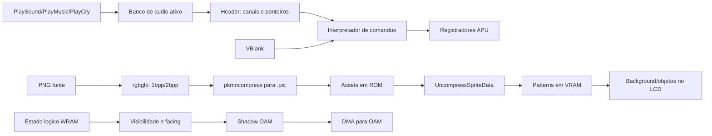

# Audio, musicas, efeitos sonoros e sprites de Pokemon Red/Blue

## Controle do documento

| Campo | Valor |
|---|---|
| Identificacao | AV-004 |
| Arquivo | `004-2026-08-01-Audio_Musicas_Efeitos_Sonoros_e_Sprites.md` |
| Revisao | 1.0 |
| Data de emissao | 2026-08-01 |
| Situacao | Emitido para revisao e uso tecnico interno |
| Responsavel pelo processo | Equipe de reescrita ASM para C |
| Elaborado por | Gerador deterministico, Graphify e verificacao direta do codigo-fonte |
| Aprovador | Pendente de designacao |
| Baseline do codigo | commit `28c9cf2e1f75c1cc5efdd76fdb34130b0bd380cd` |
| Abrangencia | Audio, musicas, SFX, gritos, sprites, imagens de batalha e fluxo de renderizacao da ROM Red/Blue |
| Classificacao | Informacao documentada interna |

### Historico de revisoes

| Revisao | Data | Alteracao | Autor | Aprovacao |
|---|---|---|---|---|
| 1.0 | 2026-08-01 | Emissao inicial, arquitetura, riscos e inventarios extraidos do codigo | Codex | Pendente |

## 1. Finalidade e relacao com a ISO 9001

Este documento preserva o conhecimento necessario para reescrever gradualmente em C
os subsistemas de audio e apresentacao visual. Ele estabelece escopo, responsaveis,
fontes, criterios verificaveis, riscos, controles de mudanca e evidencias de teste.

A organizacao segue principios de abordagem de processo, pensamento baseado em risco,
rastreabilidade, controle de informacao documentada e melhoria continua inspirados na
ISO 9001. Isso **nao declara certificacao nem conformidade formal** do repositorio,
produto ou documento. Em 2026-08-01, a referencia publicada e a
[ISO 9001:2015/Amd 1:2024](https://www.iso.org/standard/88431.html); a
[sexta edicao estava em publicacao, prevista para 2026-09](https://www.iso.org/standard/88464.html).
Tambem foram consideradas a orientacao oficial sobre
[informacao documentada](https://www.iso.org/files/live/sites/isoorg/files/standards/docs/en/iso_9001_2015_guidance_documented_information.pdf)
e a [ISO 10013:2021](https://www.iso.org/standard/75736.html).

## 2. Escopo

### 2.1 Incluido

- os tres motores de audio, suas tabelas, comandos, bancos e estado em RAM;
- 45 IDs de musica enderecaveis, 161 IDs de SFX, 38 gritos-base, 190 entradas
  internas de grito e 248 associacoes de mapa para musica;
- selecao de musica de mapa, bicicleta, surfe, batalha, fanfarra e alarme de HP;
- pipeline de PNG para 1bpp/2bpp e `.pic`, compressao e descompressao em runtime;
- 72 IDs de sprite de overworld, 47 classes de treinador e imagens de Pokemon;
- tiles, tilemaps, paletas DMG/SGB, VRAM, shadow OAM, DMA, animacao, scroll e culling;
- o tratamento do mundo e de objetos que estao fora do viewport;
- recomendacoes SOLID, DDD, Refactoring e TDD para modo fiel e melhorias posteriores.

### 2.2 Excluido

- analise musical subjetiva, partitura convencional ou transcricao para formatos MIDI/WAV;
- garantia de comportamento analogico identico em todo emulador ou dispositivo de audio;
- arte de Pokemon Yellow, geracoes posteriores ou recursos que nao participam deste build;
- licenca para redistribuir propriedade intelectual; isso exige avaliacao juridica separada;
- afirmacao de intencao dos autores quando somente o efeito do codigo pode ser observado.

## 3. Objetivos e criterios da qualidade

| ID | Objetivo | Criterio verificavel |
|---|---|---|
| AV-Q01 | Cobertura de audio | 45 musicas, 161 SFX, 317 headers de SFX por motor e 190 gritos inventariados. |
| AV-Q02 | Cobertura visual | 72 IDs de overworld, 47 classes de treinador e 668 PNGs contabilizados. |
| AV-Q03 | Fidelidade | Mesmos eventos e frames produzem os mesmos writes de APU, VRAM, tilemap e OAM no modo fiel. |
| AV-Q04 | Rastreabilidade | Cada processo aponta para arquivo, simbolo, tabela ou inventario de origem. |
| AV-Q05 | Reprodutibilidade | `python3 tools/generate_audio_sprite_document.py --check` nao encontra divergencia. |
| AV-Q06 | Separacao de melhoria | Recursos modernos permanecem sob `ENHANCED`, sem mudar traces de `GEN1_FIDELITY`. |
| AV-Q07 | Controle de contexto | Mudancas relevantes regeneram este documento e o grafo Graphify/HTML. |

## 4. Conclusao executiva

O repositorio nao armazena faixas PCM, MP3, WAV ou MIDI. Musicas, efeitos e gritos
sao **programas compactos de comandos** interpretados uma vez por VBlank e convertidos
em escritas nos quatro canais da APU do Game Boy: dois pulsos, uma forma de onda
programavel e ruido. Quatro canais de software atendem musica (`CHAN1..CHAN4`) e
quatro atendem efeitos (`CHAN5..CHAN8`) sobre o mesmo hardware; o efeito ativo pode
preemptar a voz musical correspondente.

Os graficos-fonte sao PNGs convertidos no build para tiles 1bpp/2bpp. Imagens grandes
de Pokemon e treinadores recebem compressao `.pic`, sao descomprimidas em SRAM/WRAM,
centralizadas em uma area 7x7 e copiadas para VRAM. Pokemon e treinadores exibidos na
batalha usam principalmente o mapa de tiles do **background**, mesmo sendo chamados
de sprites no codigo. Personagens de mapa usam OAM: cada figura 16x16 consome quatro
objetos 8x8 montados a partir de tabelas de direcao e quadro.

Objetos fora da tela nao sao renderizados para um framebuffer oculto. O jogo mantem
estado logico em WRAM, marca sprites fora do viewport com `IMAGEINDEX = $ff`, conserva
um mapa de mundo com bordas/conexoes e atualiza somente faixas que entram no mapa de
background circular 32x32. A tela mostra 20x18 tiles. Portanto, simulacao, conjunto
de tiles residente e visibilidade sao conceitos diferentes.

## 5. Visao arquitetural

| Processo | Fontes principais | Simbolos/artefatos |
|---|---|---|
| API de audio | `home/audio.asm`, `home/pokemon.asm` | `PlaySound`, `PlayMusic`, `PlayDefaultMusic`, `PlayCry`, `GetCryData` |
| Atualizacao | `home/vblank.asm`, `home/fade_audio.asm` | `VBlank`, `FadeOutAudio`, `Audio1/2/3_UpdateMusic` |
| Interpretador | `audio/engine_1.asm`, `engine_2.asm`, `engine_3.asm` | `PlayNextNote`, `GetNextMusicByte`, `PlaySound` de cada motor |
| Linguagem dos dados | `macros/scripts/audio.asm`, `audio/notes.asm` | notas, pausas, tempo, vibrato, loops, chamadas e retorno |
| Catalogos | `constants/music_constants.asm`, `audio/headers/*.asm`, `data/maps/songs.asm` | IDs, headers e banco |
| Gritos | `data/pokemon/cries.asm`, `audio/sfx/cry*.asm` | `CryData`, 38 gritos-base e modificadores |
| Build grafico | `Makefile`, `tools/gfx.c`, `tools/pkmncompress.c` | PNG -> 1bpp/2bpp -> `.pic` |
| Descompressao | `home/uncompress.asm`, `home/pics.asm` | `UncompressSpriteData`, buffers SRAM, merge 2bpp |
| Sprites de mapa | `engine/overworld/map_sprites.asm`, `data/sprites/*.asm` | sets, ponteiros, facings, slots VRAM |
| OAM | `engine/gfx/sprite_oam.asm`, `engine/gfx/oam_dma.asm` | `PrepareOAMData`, `wShadowOAM`, `hDMARoutine` |
| Background | `home/vcopy.asm`, `engine/overworld/load_map.asm` | copia por VBlank e redesenho de linha/coluna |
| Memoria de video | `ram/vram.asm`, `ram/wram.asm` | unions de VRAM, `wTileMap`, estados e buffers |
| Batalha | `engine/battle/core.asm`, `gfx/pics.asm` | `vFrontPic`, `vBackPic`, tilemap 7x7, trainer pics |
| Paletas | `home/palettes.asm`, `engine/gfx/palettes.asm`, `data/sgb/sgb_palettes.asm` | DMG BGP/OBP e pacotes SGB |

## 6. Subsistema de audio

### 6.1 Modelo de execucao

`PlayMusic` registra o novo ID, cancela fade pendente e escolhe o banco. `PlaySound`
preserva registradores, troca temporariamente para `wAudioROMBank`, despacha para
`Audio1_PlaySound`, `Audio2_PlaySound` ou `Audio3_PlaySound` e restaura o banco anterior.
Durante fade, o novo som fica pendente ate `FadeOutAudio` reduzir os dois nibbles do
volume mestre e trocar para `wAudioSavedROMBank`.

No VBlank, depois das transferencias de video, OAM DMA e preparacao do proximo shadow
OAM, a rotina executa fade e uma atualizacao do motor de audio. O motor 2 executa antes
`Music_DoLowHealthAlarm`. `UpdateMusic6Times` adianta o sequenciador ao entrar em mapa,
uma particularidade que deve permanecer em traces de fidelidade.

### 6.2 Canais e concorrencia

| Software | Hardware compartilhado | Uso |
|---|---|---|
| `CHAN1` e `CHAN5` | Pulso 1, com sweep | musica e SFX/grito |
| `CHAN2` e `CHAN6` | Pulso 2 | musica e SFX/grito |
| `CHAN3` e `CHAN7` | Wave RAM | musica e SFX |
| `CHAN4` e `CHAN8` | Ruido | musica, bateria, SFX e grito |

O loop percorre oito estruturas de canal. Quando o SFX correspondente esta ativo,
ele ocupa o canal fisico usado pela musica. A prioridade de substituicao e decidida
pelos IDs nos headers; gritos inicializam os canais 5 a 8 e usam normalmente 5, 6 e 8.
O alarme de HP baixo escreve diretamente no pulso 1 e pode sobrepor outros sons desse
canal. `WaitForSoundToFinish` observa os canais 5, 6 e 8, mas retorna imediatamente
quando o alarme esta habilitado.

### 6.3 Linguagem de comandos

| Grupo | Macros | Efeito |
|---|---|---|
| Headers | `channel_count`, `channel` | numero de vozes e ponteiro inicial de cada canal |
| Notas SFX | `square_note`, `noise_note` | duracao, volume/envelope e frequencia |
| Notas musicais | `note`, `drum_note`, `rest` | pitch/instrumento e comprimento de 1 a 16 unidades |
| Articulacao | `note_type`, `drum_speed`, `octave`, `duty_cycle` | velocidade, envelope, oitava e ciclo de pulso |
| Modulacao | `pitch_sweep`, `vibrato`, `pitch_slide`, `toggle_perfect_pitch` | alteracao temporal da frequencia |
| Mix | `stereo_panning`, `volume`, `execute_music` | roteamento, volume mestre e modo de interpretacao |
| Controle | `tempo`, `duty_cycle_pattern`, `sound_call`, `sound_loop`, `sound_ret` | temporizacao, subrotinas e repeticao |

`PlayNextNote` continua consumindo comandos de duracao zero ate encontrar nota ou
pausa. `GetNextMusicByte` le pelo ponteiro do canal. `CalculateFrequency` consulta
`audio/notes.asm` e ajusta pela oitava. A duracao usa parte inteira e fracionaria por
canal, efetivamente ponto fixo 8.8 baseado em comprimento, velocidade e tempo. O
macro `tempo` grava big-endian e alerta que valores acima de `$100`, combinados com
notas longas/lentas, podem estourar o calculo original.

No canal wave, a saida e desabilitada, 16 bytes (32 amostras de 4 bits) sao copiados
para `_AUD3WAVERAM` e o canal e reativado. Existem seis formas `.wave0` a `.wave5`;
o vetor tem nove ponteiros, dos quais quatro apontam para `.wave5` e tres desses sao
marcados como nao usados. A forma 5 vem dos dados de SFX e difere conforme o banco.

### 6.4 Musica contextual e batalha

`data/maps/songs.asm` define ID e banco para cada mapa. `PlayDefaultMusic` usa essa
associacao ao caminhar, mas substitui por `MUSIC_BIKE_RIDING` ou `MUSIC_SURFING` de
acordo com `wWalkBikeSurfState`. `PlayBattleMusic` escolhe musica selvagem, treinador,
lider ou batalha final e usa o motor 2. Finais de batalha e curas usam musicas curtas
ou fanfarras pelos mesmos headers.

Ha 45 faixas com ID/header: 20 no motor 1, 7 no motor 2 e 18 no motor 3. O arquivo
`audio/music/unusedsong.asm` contem `Music_UnusedSong`, incluido na ROM, mas sem header
e sem constante enderecavel. `Music_PokeFluteInBattle` e outro caso especial: altera
ponteiros do canal diretamente em vez de ser uma musica normal do catalogo.

### 6.5 Gritos de Pokemon

`PlayCry` chama `GetCryData`, que indexa `CryData` pelo indice interno da especie,
carrega grito-base, modificador de frequencia e modificador de tempo, converte o
grito para o deslocamento de header de tres canais e chama `PlaySound`. A tabela tem
190 entradas internas: 151 especies e 39 slots `MissingNo.`. As especies reutilizam
38 programas-base (`SFX_CRY_00` a `SFX_CRY_25`) com pitch e comprimento diferentes;
nao existem 151 gravacoes PCM independentes.

### 6.6 Estado persistente do motor

O bloco inicial de `ram/wram.asm` guarda IDs, flags, ponteiros de comandos e retornos,
duty, vibrato, pitch slide, contadores inteiro/fracionario, oitavas, volumes, tempos,
instrumentos wave, bancos atual/salvo e modificadores de grito. Mais adiante ficam os
contadores de fade e o alarme de HP. `wMuteAudioAndPauseMusic` silencia a saida e pausa
a musica; conforme o contrato documentado no WRAM, SFX continua a ser processado.

## 7. Pipeline de graficos e sprites

### 7.1 Build dos assets

1. O PNG e a fonte controlada e legivel por ferramentas.
2. A regra generica do `Makefile` executa `rgbgfx --colors dmg` para gerar 2bpp ou
   `--depth 1` para 1bpp.
3. Regras especificas chamam `tools/gfx` para trim, remocao de duplicatas, flips,
   interlace ou preservacao de indices quando necessario.
4. Imagens quadradas de Pokemon/treinadores viram `.pic` por `tools/pkmncompress`.
5. Os `.2bpp`, `.1bpp` e `.pic` entram em ROM por `INCBIN`.

`pkmncompress` separa planos, escolhe ordem/modos e aplica codificacao compacta com
RLE e transformacoes diferenciais. `home/uncompress.asm` faz o inverso em runtime:
le dimensoes do primeiro byte, decodifica dois chunks 1bpp nos buffers SRAM
`sSpriteBuffer1/2` e restaura os planos. `LoadUncompressedSpriteData` centraliza cada
plano em 7x7, zera margens e intercala os bytes em 2bpp antes da copia para VRAM.

### 7.2 Imagens de Pokemon e treinadores

`UncompressMonSprite` le o ponteiro do header da especie e seleciona os bancos
`Pics 1` a `Pics 5` por faixa do indice interno, com casos especiais para Mew e o
fossil de Kabutops. `LoadMonFrontSprite` envia a imagem centralizada para `vFrontPic`.
Back pics de Pokemon partem de 4x4 e `ScaleSpriteByTwo` as amplia para a area 7x7.

`_LoadTrainerPic` usa `TrainerPicAndMoneyPointers` para localizar a imagem comprimida;
em link pode carregar `RedPicFront`. `CopyUncompressedPicToTilemap` escreve os 49 IDs
de tile 7x7. Assim, as grandes figuras de batalha sao patterns de background, nao
objetos OAM tradicionais. Durante a transicao, o mapa de background 32x32 e limpo e
somente as 20 colunas visiveis de cada uma das 18 linhas sao copiadas. Em uma etapa
da introducao, o corpo/inimigo permanece no background e a cabeca do jogador usa OAM
para contornar o scroll por scanline.

Os 153 PNGs em `gfx/pokemon/front` sao 151 especies mais os dois fosseis. Os 151
backs ficam em `gfx/pokemon/back`. `gfx/pokemon/front_rg` tambem possui 153 PNGs, mas
nao e referenciado pelo `Makefile`, `gfx/pics.asm` ou headers desta baseline; deve ser
tratado como acervo alternativo, nao como entrada ativa deste build.

### 7.3 Personagens de overworld

Cada personagem movel tem 12 tiles: quatro olhando para baixo, quatro para cima e
quatro para a esquerda. A direita reutiliza a esquerda com X-flip. `facings.asm`
combina quatro tiles em 16x16 e define standing/walking; quadros 0 e 2 compartilham a
pose parada e o quadro 3 usa flips adicionais para passos. Objetos estaticos com ID
a partir de `FIRST_STILL_SPRITE` usam quatro tiles e a mesma composicao em todas as
direcoes.

`InitMapSprites` carrega sets fixos de 11 tipos em mapas externos e os picture IDs
presentes em mapas internos. IDs repetidos compartilham o slot. O jogador ocupa o
primeiro slot; ate dez slots normais de 12 tiles sao alocados, e dois objetos de
quatro tiles usam as regioes `$78` e `$7c`. Metade inferior guarda poses paradas e a
metade superior, deslocada em `$800`, guarda caminhada.

`LoadPlayerSpriteGraphics` escolhe `RedSprite`, `RedBikeSprite` ou `SeelSprite`
conforme caminhar/bicicleta/surfe. Quando a fonte de texto ocupa a metade superior da
VRAM, o movimento de NPC e restringido e os tiles de caminhada sao recarregados por
`CopyVideoData` com o LCD ligado. Isso e um acoplamento de memoria importante para o
modo fiel, mesmo que uma implementacao moderna nao precise reproduzir a escassez.

### 7.4 Paletas

No Game Boy monocromatico, `rBGP`, `rOBP0` e `rOBP1` mapeiam os quatro valores 2bpp
para tons. No Super Game Boy, `engine/gfx/palettes.asm` envia comandos/pacotes apenas
quando `wOnSGB` esta ativo; `MonsterPalettes` associa especies a IDs e
`data/sgb/sgb_palettes.asm` fornece as paletas de quatro cores. Paleta nao altera os
pixels-fonte: ela interpreta os indices dos tiles na exibicao.

## 8. O que acontece fora da tela

### 8.1 Estado logico, viewport e VRAM

| Camada | Estrutura | Comportamento |
|---|---|---|
| Mundo | `wOverworldMap` e `wSurroundingTiles` | blocos do mapa atual, bordas e conexoes permanecem em WRAM |
| Viewport logico | `wTileMap` | buffer de 20x18 tiles usado por menus, batalha e copias automaticas |
| Background fisico | `vBGMap0/vBGMap1` | mapas circulares 32x32, maiores que a tela visivel |
| Objetos logicos | `wSpriteStateData1/2` | 16 estruturas, jogador mais ate 15 objetos de mapa |
| Objetos visiveis | `wShadowOAM` -> OAM | no maximo 40 entradas de hardware; quatro por personagem 16x16 |
| Patterns | `vNPCSprites`, `vSprites`, `vFrontPic`, `vBackPic` | tiles residentes e reutilizados conforme o modo atual |

`CheckSpriteAvailability` calcula posicao relativa ao jogador e verifica flags,
limites e cobertura por texto. Fora da regiao visivel, grava `$ff` no image index.
`PrepareOAMData` ainda pode atualizar coordenadas calculadas, mas nao emite as quatro
entradas OAM; entradas restantes recebem Y invisivel. O estado do objeto continua em
WRAM, e a logica de movimento padrao pode ser limitada pela invisibilidade. Scripts
de mapa continuam capazes de manipular esse estado.

Ao caminhar, `RedrawRowOrColumn` transfere somente a linha ou coluna de dois tiles que
acabou de entrar no viewport e faz wrap no background 32x32. Em telas estaticas,
`AutoBgMapTransfer` copia um terco dos 20x18 tiles por VBlank, completando em tres
frames. `CopyVideoData` agenda no maximo oito tiles por frame e suspende a copia
automatica enquanto trabalha. Agua e flores alteram patterns diretamente na VRAM.

### 8.2 Ordem de OAM e latencia

No VBlank, `hDMARoutine` primeiro copia `wShadowOAM` preparado no frame anterior para
OAM; depois `PrepareOAMData` monta o buffer para o proximo DMA. O codigo da DMA roda
em HRAM porque o barramento restringe outros acessos durante a transferencia. Uma
reescrita fiel precisa modelar essa preparacao em dois estagios; uma reescrita moderna
pode renderizar no mesmo frame somente no modo melhorado e com teste visual explicito.

### 8.3 Reuso por modo

`ram/vram.asm` declara `UNION`: as mesmas faixas fisicas recebem nomes diferentes em
batalha/menu, overworld e titulo. `vFrontPic` pode ocupar o mesmo endereco que parte
de outro conjunto de characters em outro modo. Nao se deve traduzir cada alias para
uma alocacao C independente no emulador fiel sem preservar os efeitos de sobreposicao.
Em um renderer moderno, os aliases podem virar recursos separados se o adaptador de
compatibilidade mantiver os mesmos resultados observaveis.

## 9. Reescrita incremental em C

### 9.1 Contextos DDD e portas

| Contexto | Responsabilidade | Portas recomendadas |
|---|---|---|
| `AudioCatalog` | IDs, headers, mapas, gritos e assets | `AudioAssetSource`, `RomBankReader` |
| `AudioSequencer` | comandos, tempo, loops, prioridade e fade | `FrameClock`, `ApuRegisterSink` |
| `BattlePresentation` | imagens 7x7, HUD e transicoes | `PictureDecoder`, `TileSurface` |
| `OverworldScene` | estado, culling, facing e animacao | `MapView`, `SpriteCatalog` |
| `VideoMemory` | VRAM, tilemaps, OAM e transferencias | `VideoBus`, `DmaSink` |
| `AssetPipeline` | PNG, tiles, compressao e manifests | `ImageConverter`, `AssetWriter` |

No modo fiel, `ApuRegisterSink` e `VideoBus` registram os mesmos writes por frame da
ROM. Em producao moderna, adaptadores transformam eventos em samples de audio,
textures e draw calls. O dominio nao deve conhecer SDL, OpenGL, sistema de arquivos
ou API de som. Interfaces pequenas evitam um `Renderer` ou `AudioManager` monolitico
e aplicam responsabilidade unica, inversao de dependencia e segregacao de interfaces.

### 9.2 Sequencia de extracao por Refactoring/TDD

1. Capture traces dourados de writes APU, VRAM, tilemap, shadow OAM e bancos em ROM.
2. Extraia catalogos tipados sem mudar o ASM; compare IDs, ponteiros e contagens.
3. Implemente o parser de comandos de audio em C sob testes de caracterizacao.
4. Implemente descompressao `.pic` e merge 2bpp; compare byte a byte os buffers 7x7.
5. Extraia facing, culling e montagem OAM; compare cada frame e direcao.
6. Introduza portas de plataforma e execute ASM e C em paralelo sobre os mesmos eventos.
7. Troque um processo por vez somente quando a equivalencia estiver demonstrada.
8. Consolide duplicacao dos tres motores depois de testes cobrirem diferencas do motor 2.

Refatoracoes devem ser pequenas, reversiveis e sem mistura com melhorias de produto.
Cada commit informa requisito AV-Q afetado, evidencia e risco residual. Bugs observados
do original entram como testes no modo fiel antes de qualquer correcao em `ENHANCED`.

### 9.3 Melhorias posteriores, fora do modo fiel

- mixer com buses independentes para musica, SFX, grito e interface, controles de
  volume/mute, ramps sem clique, mono e opcoes de acessibilidade;
- clock de samples independente do FPS, buffer monitorado e telemetria de underrun;
- atlas de textures, batching, escala inteira e profundidade/prioridade explicita;
- cache de imagens descomprimidas e preload por zona, sem bloquear a simulacao;
- camera e culling modernos, mantendo simulacao de NPC independente da visibilidade;
- manifests de assets com IDs estaveis, validacao de schema e suporte controlado a mods;
- sprites opcionais de maior resolucao e animacoes adicionais sob feature flag;
- paletas alternativas, alto contraste, reducao de movimento e controle de flashes;
- ferramentas de debug para canais, notas, OAM, slots VRAM e limites de viewport.

Essas melhorias sao possiveis depois da reescrita, mas nao devem contaminar a trilha
de equivalencia. A recomendacao e manter `GEN1_FIDELITY` e `ENHANCED` sobre os mesmos
eventos de dominio, com renderizadores/mixers e politicas configuraveis.

## 10. Estrategia de testes e aceitacao

| ID | Teste | Evidencia esperada |
|---|---|---|
| AV-T01 | Parser dos 45 headers musicais | bancos, canais e ponteiros iguais ao ASM |
| AV-T02 | Todos os 161 IDs de SFX nos tres motores | disponibilidade, prioridade e canais esperados |
| AV-T03 | 151 especies e 39 slots internos | grito-base, pitch e comprimento identicos |
| AV-T04 | Trace de audio por frame | mesma ordem/valor de writes nos registradores APU |
| AV-T05 | Fade, mute, alarme e preempcao | traces dourados para conflitos e troca de banco |
| AV-T06 | Decoder `.pic` | buffers 1bpp e resultado 2bpp iguais byte a byte |
| AV-T07 | Front/back/trainer pics | hash dos 49 tiles e screenshot de referencia |
| AV-T08 | 72 sprites, quatro direcoes e frames | tile IDs, flips, prioridade e coordenadas OAM iguais |
| AV-T09 | Entrada/saida do viewport | `$ff`, colisao, shadow OAM e redesenho de faixa corretos |
| AV-T10 | Fontes sobre tiles de caminhada | pausa/reload e recuperacao visual caracterizadas |
| AV-T11 | DMG e SGB | registros/pacotes e paleta por especie equivalentes |
| AV-T12 | Geracao documental | `--check`, Graphify atualizado e `git diff --check` limpo |

Testes de audio nao devem depender somente de WAV final: o trace de registradores
localiza divergencias de timing com mais precisao. Testes visuais combinam bytes,
hashes e screenshots; um hash sozinho nao explica falha de alinhamento, flip ou
prioridade. Relogio, banco ROM e fontes de evento devem ser injetaveis e deterministicos.

## 11. Riscos e controles

| Risco | Impacto | Controle preventivo/detectivo |
|---|---|---|
| Deriva entre frame e sample | musica muda tempo ou desafina | clock racional, traces longos e teste de loop |
| Prioridade de SFX alterada | notas somem ou efeitos se sobrepoem | cenarios por par de canais e IDs concorrentes |
| Estado de banco omitido | ponteiro le dados errados | tipo explicito `AudioBank`, asserts e trace de switch |
| Motor 2 tratado como copia exata | alarme/grito/batalha regressam | testes dedicados e consolidacao posterior |
| Assets alternativos incluidos por engano | ROM/visual divergente | manifest ativo derivado de `INCBIN`; `front_rg` excluido |
| Decoder aceita stream corrompido | loop, overflow ou memoria invalida | limites, fuzzing e falha tipada no modo moderno |
| Aliases eliminados | IDs legados mudam | preservar tabela completa de 72/47 entradas |
| Render-all muda logica | NPC fora da tela passa a colidir/mover diferente | separar simulacao, culling e apresentacao |
| Ordem VBlank/DMA alterada | tremor ou frame de atraso diferente | teste de trace por fase do frame |
| Fonte pisa em tiles de caminhada | sprites corrompidos | teste de transicao texto-overworld |
| Async muda gameplay | evento depende de asset ainda nao carregado | preload deterministico e fallback controlado |
| Direitos de assets ignorados | risco de distribuicao | revisao juridica e inventario de proveniencia |

## 12. Matriz de rastreabilidade

| Requisito | Fonte | Testes | Responsavel sugerido |
|---|---|---|---|
| AV-Q01 | constantes/headers/audio/cries | AV-T01 a AV-T05 | Audio |
| AV-Q02 | `gfx/`, tabelas de sprite/treinador | AV-T06 a AV-T11 | Video/assets |
| AV-Q03 | `home/vblank.asm` e traces | AV-T04, AV-T07 a AV-T10 | Compatibilidade |
| AV-Q04 | referencias por secao e anexos | revisao documental | Qualidade tecnica |
| AV-Q05 | este gerador | AV-T12 | Ferramentas |
| AV-Q06 | feature flags e ADRs | suite fiel + melhorada | Arquitetura |
| AV-Q07 | AGENTS/CLAUDE e Graphify | AV-T12 | Mantenedor do repositorio |

## 13. Controle de mudancas

Uma alteracao em `audio/`, `gfx/`, `home/audio.asm`, `home/vblank.asm`, `home/pics.asm`,
`home/vcopy.asm`, `engine/gfx/`, `engine/overworld/map_sprites.asm`, tabelas associadas,
macros ou ferramentas graficas exige avaliar este documento. O fluxo minimo e:

1. regenerar com `python3 tools/generate_audio_sprite_document.py`;
2. executar novamente com `--check`;
3. atualizar Graphify por `python tools/graphify_rgbds.py .` no ambiente registrado;
4. revisar contagens, riscos, criterios e inventarios alterados;
5. registrar revisao, aprovador e evidencias antes da liberacao.

## 14. Inventarios gerados

Os anexos seguintes sao derivados da baseline e nao devem ser editados manualmente.
"Banco" significa motor/banco de audio, nao canal de hardware.

### 14.1 Musicas enderecaveis

| ID | Banco | Canais | Dados | Constante |
|---|---|---|---|---|
| MUSIC_PALLET_TOWN | 1 | 1, 2, 3 | audio/music/pallettown.asm | `constants/music_constants.asm:9` |
| MUSIC_POKECENTER | 1 | 1, 2, 3 | audio/music/pokecenter.asm | `constants/music_constants.asm:10` |
| MUSIC_GYM | 1 | 1, 2, 3 | audio/music/gym.asm | `constants/music_constants.asm:11` |
| MUSIC_CITIES1 | 1 | 1, 2, 3, 4 | audio/music/cities1.asm | `constants/music_constants.asm:12` |
| MUSIC_CITIES2 | 1 | 1, 2, 3 | audio/music/cities2.asm | `constants/music_constants.asm:13` |
| MUSIC_CELADON | 1 | 1, 2, 3 | audio/music/celadon.asm | `constants/music_constants.asm:14` |
| MUSIC_CINNABAR | 1 | 1, 2, 3 | audio/music/cinnabar.asm | `constants/music_constants.asm:15` |
| MUSIC_VERMILION | 1 | 1, 2, 3, 4 | audio/music/vermilion.asm | `constants/music_constants.asm:16` |
| MUSIC_LAVENDER | 1 | 1, 2, 3, 4 | audio/music/lavender.asm | `constants/music_constants.asm:17` |
| MUSIC_SS_ANNE | 1 | 1, 2, 3 | audio/music/ssanne.asm | `constants/music_constants.asm:18` |
| MUSIC_MEET_PROF_OAK | 1 | 1, 2, 3 | audio/music/meetprofoak.asm | `constants/music_constants.asm:19` |
| MUSIC_MEET_RIVAL | 1 | 1, 2, 3 | audio/music/meetrival.asm | `constants/music_constants.asm:20` |
| MUSIC_MUSEUM_GUY | 1 | 1, 2, 3, 4 | audio/music/museumguy.asm | `constants/music_constants.asm:21` |
| MUSIC_SAFARI_ZONE | 1 | 1, 2, 3 | audio/music/safarizone.asm | `constants/music_constants.asm:22` |
| MUSIC_PKMN_HEALED | 1 | 1, 2, 3 | audio/music/pkmnhealed.asm | `constants/music_constants.asm:23` |
| MUSIC_ROUTES1 | 1 | 1, 2, 3, 4 | audio/music/routes1.asm | `constants/music_constants.asm:24` |
| MUSIC_ROUTES2 | 1 | 1, 2, 3, 4 | audio/music/routes2.asm | `constants/music_constants.asm:25` |
| MUSIC_ROUTES3 | 1 | 1, 2, 3, 4 | audio/music/routes3.asm | `constants/music_constants.asm:26` |
| MUSIC_ROUTES4 | 1 | 1, 2, 3, 4 | audio/music/routes4.asm | `constants/music_constants.asm:27` |
| MUSIC_INDIGO_PLATEAU | 1 | 1, 2, 3, 4 | audio/music/indigoplateau.asm | `constants/music_constants.asm:28` |
| MUSIC_GYM_LEADER_BATTLE | 2 | 1, 2, 3 | audio/music/gymleaderbattle.asm | `constants/music_constants.asm:31` |
| MUSIC_TRAINER_BATTLE | 2 | 1, 2, 3 | audio/music/trainerbattle.asm | `constants/music_constants.asm:32` |
| MUSIC_WILD_BATTLE | 2 | 1, 2, 3 | audio/music/wildbattle.asm | `constants/music_constants.asm:33` |
| MUSIC_FINAL_BATTLE | 2 | 1, 2, 3 | audio/music/finalbattle.asm | `constants/music_constants.asm:34` |
| MUSIC_DEFEATED_TRAINER | 2 | 1, 2, 3 | audio/music/defeatedtrainer.asm | `constants/music_constants.asm:35` |
| MUSIC_DEFEATED_WILD_MON | 2 | 1, 2, 3 | audio/music/defeatedwildmon.asm | `constants/music_constants.asm:36` |
| MUSIC_DEFEATED_GYM_LEADER | 2 | 1, 2, 3 | audio/music/defeatedgymleader.asm | `constants/music_constants.asm:37` |
| MUSIC_TITLE_SCREEN | 3 | 1, 2, 3, 4 | audio/music/titlescreen.asm | `constants/music_constants.asm:40` |
| MUSIC_CREDITS | 3 | 1, 2, 3 | audio/music/credits.asm | `constants/music_constants.asm:41` |
| MUSIC_HALL_OF_FAME | 3 | 1, 2, 3 | audio/music/halloffame.asm | `constants/music_constants.asm:42` |
| MUSIC_OAKS_LAB | 3 | 1, 2, 3 | audio/music/oakslab.asm | `constants/music_constants.asm:43` |
| MUSIC_JIGGLYPUFF_SONG | 3 | 1, 2 | audio/music/jigglypuffsong.asm | `constants/music_constants.asm:44` |
| MUSIC_BIKE_RIDING | 3 | 1, 2, 3, 4 | audio/music/bikeriding.asm | `constants/music_constants.asm:45` |
| MUSIC_SURFING | 3 | 1, 2, 3 | audio/music/surfing.asm | `constants/music_constants.asm:46` |
| MUSIC_GAME_CORNER | 3 | 1, 2, 3 | audio/music/gamecorner.asm | `constants/music_constants.asm:47` |
| MUSIC_INTRO_BATTLE | 3 | 1, 2, 3, 4 | audio/music/introbattle.asm | `constants/music_constants.asm:48` |
| MUSIC_DUNGEON1 | 3 | 1, 2, 3, 4 | audio/music/dungeon1.asm | `constants/music_constants.asm:49` |
| MUSIC_DUNGEON2 | 3 | 1, 2, 3, 4 | audio/music/dungeon2.asm | `constants/music_constants.asm:50` |
| MUSIC_DUNGEON3 | 3 | 1, 2, 3, 4 | audio/music/dungeon3.asm | `constants/music_constants.asm:51` |
| MUSIC_CINNABAR_MANSION | 3 | 1, 2, 3, 4 | audio/music/cinnabarmansion.asm | `constants/music_constants.asm:52` |
| MUSIC_POKEMON_TOWER | 3 | 1, 2, 3 | audio/music/pokemontower.asm | `constants/music_constants.asm:53` |
| MUSIC_SILPH_CO | 3 | 1, 2, 3 | audio/music/silphco.asm | `constants/music_constants.asm:54` |
| MUSIC_MEET_EVIL_TRAINER | 3 | 1, 2, 3 | audio/music/meeteviltrainer.asm | `constants/music_constants.asm:55` |
| MUSIC_MEET_FEMALE_TRAINER | 3 | 1, 2, 3 | audio/music/meetfemaletrainer.asm | `constants/music_constants.asm:56` |
| MUSIC_MEET_MALE_TRAINER | 3 | 1, 2, 3 | audio/music/meetmaletrainer.asm | `constants/music_constants.asm:57` |

### 14.2 Musica por mapa

O inventario possui uma linha por indice de mapa, inclusive mapas tecnicos e copias
que compartilham musica.

| # | Mapa | Musica | Header/banco | Fonte |
|---|---|---|---|---|
| 1 | PALLET_TOWN | MUSIC_PALLET_TOWN | Music_PalletTown | `data/maps/songs.asm:3` |
| 2 | VIRIDIAN_CITY | MUSIC_CITIES1 | Music_Cities1 | `data/maps/songs.asm:4` |
| 3 | PEWTER_CITY | MUSIC_CITIES1 | Music_Cities1 | `data/maps/songs.asm:5` |
| 4 | CERULEAN_CITY | MUSIC_CITIES2 | Music_Cities2 | `data/maps/songs.asm:6` |
| 5 | LAVENDER_TOWN | MUSIC_LAVENDER | Music_Lavender | `data/maps/songs.asm:7` |
| 6 | VERMILION_CITY | MUSIC_VERMILION | Music_Vermilion | `data/maps/songs.asm:8` |
| 7 | CELADON_CITY | MUSIC_CELADON | Music_Celadon | `data/maps/songs.asm:9` |
| 8 | FUCHSIA_CITY | MUSIC_CITIES2 | Music_Cities2 | `data/maps/songs.asm:10` |
| 9 | CINNABAR_ISLAND | MUSIC_CINNABAR | Music_Cinnabar | `data/maps/songs.asm:11` |
| 10 | INDIGO_PLATEAU | MUSIC_INDIGO_PLATEAU | Music_IndigoPlateau | `data/maps/songs.asm:12` |
| 11 | SAFFRON_CITY | MUSIC_CITIES1 | Music_Cities1 | `data/maps/songs.asm:13` |
| 12 | UNUSED_MAP_0B | MUSIC_CITIES1 | Music_Cities1 | `data/maps/songs.asm:14` |
| 13 | ROUTE_1 | MUSIC_ROUTES1 | Music_Routes1 | `data/maps/songs.asm:15` |
| 14 | ROUTE_2 | MUSIC_ROUTES1 | Music_Routes1 | `data/maps/songs.asm:16` |
| 15 | ROUTE_3 | MUSIC_ROUTES3 | Music_Routes3 | `data/maps/songs.asm:17` |
| 16 | ROUTE_4 | MUSIC_ROUTES3 | Music_Routes3 | `data/maps/songs.asm:18` |
| 17 | ROUTE_5 | MUSIC_ROUTES3 | Music_Routes3 | `data/maps/songs.asm:19` |
| 18 | ROUTE_6 | MUSIC_ROUTES3 | Music_Routes3 | `data/maps/songs.asm:20` |
| 19 | ROUTE_7 | MUSIC_ROUTES3 | Music_Routes3 | `data/maps/songs.asm:21` |
| 20 | ROUTE_8 | MUSIC_ROUTES3 | Music_Routes3 | `data/maps/songs.asm:22` |
| 21 | ROUTE_9 | MUSIC_ROUTES3 | Music_Routes3 | `data/maps/songs.asm:23` |
| 22 | ROUTE_10 | MUSIC_ROUTES3 | Music_Routes3 | `data/maps/songs.asm:24` |
| 23 | ROUTE_11 | MUSIC_ROUTES4 | Music_Routes4 | `data/maps/songs.asm:25` |
| 24 | ROUTE_12 | MUSIC_ROUTES4 | Music_Routes4 | `data/maps/songs.asm:26` |
| 25 | ROUTE_13 | MUSIC_ROUTES4 | Music_Routes4 | `data/maps/songs.asm:27` |
| 26 | ROUTE_14 | MUSIC_ROUTES4 | Music_Routes4 | `data/maps/songs.asm:28` |
| 27 | ROUTE_15 | MUSIC_ROUTES4 | Music_Routes4 | `data/maps/songs.asm:29` |
| 28 | ROUTE_16 | MUSIC_ROUTES3 | Music_Routes3 | `data/maps/songs.asm:30` |
| 29 | ROUTE_17 | MUSIC_ROUTES3 | Music_Routes3 | `data/maps/songs.asm:31` |
| 30 | ROUTE_18 | MUSIC_ROUTES3 | Music_Routes3 | `data/maps/songs.asm:32` |
| 31 | ROUTE_19 | MUSIC_ROUTES3 | Music_Routes3 | `data/maps/songs.asm:33` |
| 32 | ROUTE_20 | MUSIC_ROUTES3 | Music_Routes3 | `data/maps/songs.asm:34` |
| 33 | ROUTE_21 | MUSIC_ROUTES3 | Music_Routes3 | `data/maps/songs.asm:35` |
| 34 | ROUTE_22 | MUSIC_ROUTES3 | Music_Routes3 | `data/maps/songs.asm:36` |
| 35 | ROUTE_23 | MUSIC_INDIGO_PLATEAU | Music_IndigoPlateau | `data/maps/songs.asm:37` |
| 36 | ROUTE_24 | MUSIC_ROUTES2 | Music_Routes2 | `data/maps/songs.asm:38` |
| 37 | ROUTE_25 | MUSIC_ROUTES2 | Music_Routes2 | `data/maps/songs.asm:39` |
| 38 | REDS_HOUSE_1F | MUSIC_PALLET_TOWN | Music_PalletTown | `data/maps/songs.asm:40` |
| 39 | REDS_HOUSE_2F | MUSIC_PALLET_TOWN | Music_PalletTown | `data/maps/songs.asm:41` |
| 40 | BLUES_HOUSE | MUSIC_PALLET_TOWN | Music_PalletTown | `data/maps/songs.asm:42` |
| 41 | OAKS_LAB | MUSIC_OAKS_LAB | Music_OaksLab | `data/maps/songs.asm:43` |
| 42 | VIRIDIAN_POKECENTER | MUSIC_POKECENTER | Music_Pokecenter | `data/maps/songs.asm:44` |
| 43 | VIRIDIAN_MART | MUSIC_POKECENTER | Music_Pokecenter | `data/maps/songs.asm:45` |
| 44 | VIRIDIAN_SCHOOL_HOUSE | MUSIC_CITIES1 | Music_Cities1 | `data/maps/songs.asm:46` |
| 45 | VIRIDIAN_NICKNAME_HOUSE | MUSIC_CITIES1 | Music_Cities1 | `data/maps/songs.asm:47` |
| 46 | VIRIDIAN_GYM | MUSIC_GYM | Music_Gym | `data/maps/songs.asm:48` |
| 47 | DIGLETTS_CAVE_ROUTE_2 | MUSIC_DUNGEON2 | Music_Dungeon2 | `data/maps/songs.asm:49` |
| 48 | VIRIDIAN_FOREST_NORTH_GATE | MUSIC_CITIES1 | Music_Cities1 | `data/maps/songs.asm:50` |
| 49 | ROUTE_2_TRADE_HOUSE | MUSIC_CITIES1 | Music_Cities1 | `data/maps/songs.asm:51` |
| 50 | ROUTE_2_GATE | MUSIC_CITIES1 | Music_Cities1 | `data/maps/songs.asm:52` |
| 51 | VIRIDIAN_FOREST_SOUTH_GATE | MUSIC_CITIES1 | Music_Cities1 | `data/maps/songs.asm:53` |
| 52 | VIRIDIAN_FOREST | MUSIC_DUNGEON2 | Music_Dungeon2 | `data/maps/songs.asm:54` |
| 53 | MUSEUM_1F | MUSIC_CITIES1 | Music_Cities1 | `data/maps/songs.asm:55` |
| 54 | MUSEUM_2F | MUSIC_CITIES1 | Music_Cities1 | `data/maps/songs.asm:56` |
| 55 | PEWTER_GYM | MUSIC_GYM | Music_Gym | `data/maps/songs.asm:57` |
| 56 | PEWTER_NIDORAN_HOUSE | MUSIC_CITIES1 | Music_Cities1 | `data/maps/songs.asm:58` |
| 57 | PEWTER_MART | MUSIC_POKECENTER | Music_Pokecenter | `data/maps/songs.asm:59` |
| 58 | PEWTER_SPEECH_HOUSE | MUSIC_CITIES1 | Music_Cities1 | `data/maps/songs.asm:60` |
| 59 | PEWTER_POKECENTER | MUSIC_POKECENTER | Music_Pokecenter | `data/maps/songs.asm:61` |
| 60 | MT_MOON_1F | MUSIC_DUNGEON3 | Music_Dungeon3 | `data/maps/songs.asm:62` |
| 61 | MT_MOON_B1F | MUSIC_DUNGEON3 | Music_Dungeon3 | `data/maps/songs.asm:63` |
| 62 | MT_MOON_B2F | MUSIC_DUNGEON3 | Music_Dungeon3 | `data/maps/songs.asm:64` |
| 63 | CERULEAN_TRASHED_HOUSE | MUSIC_CITIES2 | Music_Cities2 | `data/maps/songs.asm:65` |
| 64 | CERULEAN_TRADE_HOUSE | MUSIC_CITIES2 | Music_Cities2 | `data/maps/songs.asm:66` |
| 65 | CERULEAN_POKECENTER | MUSIC_POKECENTER | Music_Pokecenter | `data/maps/songs.asm:67` |
| 66 | CERULEAN_GYM | MUSIC_GYM | Music_Gym | `data/maps/songs.asm:68` |
| 67 | BIKE_SHOP | MUSIC_CITIES2 | Music_Cities2 | `data/maps/songs.asm:69` |
| 68 | CERULEAN_MART | MUSIC_POKECENTER | Music_Pokecenter | `data/maps/songs.asm:70` |
| 69 | MT_MOON_POKECENTER | MUSIC_POKECENTER | Music_Pokecenter | `data/maps/songs.asm:71` |
| 70 | CERULEAN_TRASHED_HOUSE_COPY | MUSIC_DUNGEON3 | Music_Dungeon3 | `data/maps/songs.asm:72` |
| 71 | ROUTE_5_GATE | MUSIC_CITIES1 | Music_Cities1 | `data/maps/songs.asm:73` |
| 72 | UNDERGROUND_PATH_ROUTE_5 | MUSIC_CITIES1 | Music_Cities1 | `data/maps/songs.asm:74` |
| 73 | DAYCARE | MUSIC_CITIES1 | Music_Cities1 | `data/maps/songs.asm:75` |
| 74 | ROUTE_6_GATE | MUSIC_CITIES1 | Music_Cities1 | `data/maps/songs.asm:76` |
| 75 | UNDERGROUND_PATH_ROUTE_6 | MUSIC_CITIES1 | Music_Cities1 | `data/maps/songs.asm:77` |
| 76 | UNDERGROUND_PATH_ROUTE_6_COPY | MUSIC_VERMILION | Music_Vermilion | `data/maps/songs.asm:78` |
| 77 | ROUTE_7_GATE | MUSIC_CITIES1 | Music_Cities1 | `data/maps/songs.asm:79` |
| 78 | UNDERGROUND_PATH_ROUTE_7 | MUSIC_CITIES1 | Music_Cities1 | `data/maps/songs.asm:80` |
| 79 | UNDERGROUND_PATH_ROUTE_7_COPY | MUSIC_CELADON | Music_Celadon | `data/maps/songs.asm:81` |
| 80 | ROUTE_8_GATE | MUSIC_CITIES1 | Music_Cities1 | `data/maps/songs.asm:82` |
| 81 | UNDERGROUND_PATH_ROUTE_8 | MUSIC_CITIES1 | Music_Cities1 | `data/maps/songs.asm:83` |
| 82 | ROCK_TUNNEL_POKECENTER | MUSIC_POKECENTER | Music_Pokecenter | `data/maps/songs.asm:84` |
| 83 | ROCK_TUNNEL_1F | MUSIC_DUNGEON3 | Music_Dungeon3 | `data/maps/songs.asm:85` |
| 84 | POWER_PLANT | MUSIC_DUNGEON1 | Music_Dungeon1 | `data/maps/songs.asm:86` |
| 85 | ROUTE_11_GATE_1F | MUSIC_VERMILION | Music_Vermilion | `data/maps/songs.asm:87` |
| 86 | DIGLETTS_CAVE_ROUTE_11 | MUSIC_DUNGEON2 | Music_Dungeon2 | `data/maps/songs.asm:88` |
| 87 | ROUTE_11_GATE_2F | MUSIC_VERMILION | Music_Vermilion | `data/maps/songs.asm:89` |
| 88 | ROUTE_12_GATE_1F | MUSIC_CITIES1 | Music_Cities1 | `data/maps/songs.asm:90` |
| 89 | BILLS_HOUSE | MUSIC_CITIES2 | Music_Cities2 | `data/maps/songs.asm:91` |
| 90 | VERMILION_POKECENTER | MUSIC_POKECENTER | Music_Pokecenter | `data/maps/songs.asm:92` |
| 91 | POKEMON_FAN_CLUB | MUSIC_VERMILION | Music_Vermilion | `data/maps/songs.asm:93` |
| 92 | VERMILION_MART | MUSIC_POKECENTER | Music_Pokecenter | `data/maps/songs.asm:94` |
| 93 | VERMILION_GYM | MUSIC_GYM | Music_Gym | `data/maps/songs.asm:95` |
| 94 | VERMILION_PIDGEY_HOUSE | MUSIC_VERMILION | Music_Vermilion | `data/maps/songs.asm:96` |
| 95 | VERMILION_DOCK | MUSIC_SS_ANNE | Music_SSAnne | `data/maps/songs.asm:97` |
| 96 | SS_ANNE_1F | MUSIC_SS_ANNE | Music_SSAnne | `data/maps/songs.asm:98` |
| 97 | SS_ANNE_2F | MUSIC_SS_ANNE | Music_SSAnne | `data/maps/songs.asm:99` |
| 98 | SS_ANNE_3F | MUSIC_SS_ANNE | Music_SSAnne | `data/maps/songs.asm:100` |
| 99 | SS_ANNE_B1F | MUSIC_SS_ANNE | Music_SSAnne | `data/maps/songs.asm:101` |
| 100 | SS_ANNE_BOW | MUSIC_SS_ANNE | Music_SSAnne | `data/maps/songs.asm:102` |
| 101 | SS_ANNE_KITCHEN | MUSIC_SS_ANNE | Music_SSAnne | `data/maps/songs.asm:103` |
| 102 | SS_ANNE_CAPTAINS_ROOM | MUSIC_SS_ANNE | Music_SSAnne | `data/maps/songs.asm:104` |
| 103 | SS_ANNE_1F_ROOMS | MUSIC_SS_ANNE | Music_SSAnne | `data/maps/songs.asm:105` |
| 104 | SS_ANNE_2F_ROOMS | MUSIC_SS_ANNE | Music_SSAnne | `data/maps/songs.asm:106` |
| 105 | SS_ANNE_B1F_ROOMS | MUSIC_SS_ANNE | Music_SSAnne | `data/maps/songs.asm:107` |
| 106 | UNUSED_MAP_69 | MUSIC_DUNGEON2 | Music_Dungeon2 | `data/maps/songs.asm:108` |
| 107 | UNUSED_MAP_6A | MUSIC_DUNGEON2 | Music_Dungeon2 | `data/maps/songs.asm:109` |
| 108 | UNUSED_MAP_6B | MUSIC_SS_ANNE | Music_SSAnne | `data/maps/songs.asm:110` |
| 109 | VICTORY_ROAD_1F | MUSIC_DUNGEON3 | Music_Dungeon3 | `data/maps/songs.asm:111` |
| 110 | UNUSED_MAP_6D | MUSIC_POKEMON_TOWER | Music_PokemonTower | `data/maps/songs.asm:112` |
| 111 | UNUSED_MAP_6E | MUSIC_DUNGEON1 | Music_Dungeon1 | `data/maps/songs.asm:113` |
| 112 | UNUSED_MAP_6F | MUSIC_SILPH_CO | Music_SilphCo | `data/maps/songs.asm:114` |
| 113 | UNUSED_MAP_70 | MUSIC_SILPH_CO | Music_SilphCo | `data/maps/songs.asm:115` |
| 114 | LANCES_ROOM | MUSIC_INDIGO_PLATEAU | Music_IndigoPlateau | `data/maps/songs.asm:116` |
| 115 | UNUSED_MAP_72 | MUSIC_SS_ANNE | Music_SSAnne | `data/maps/songs.asm:117` |
| 116 | UNUSED_MAP_73 | MUSIC_SS_ANNE | Music_SSAnne | `data/maps/songs.asm:118` |
| 117 | UNUSED_MAP_74 | MUSIC_SS_ANNE | Music_SSAnne | `data/maps/songs.asm:119` |
| 118 | UNUSED_MAP_75 | MUSIC_SS_ANNE | Music_SSAnne | `data/maps/songs.asm:120` |
| 119 | HALL_OF_FAME | MUSIC_PALLET_TOWN | Music_PalletTown | `data/maps/songs.asm:121` |
| 120 | UNDERGROUND_PATH_NORTH_SOUTH | MUSIC_ROUTES1 | Music_Routes1 | `data/maps/songs.asm:122` |
| 121 | CHAMPIONS_ROOM | MUSIC_INDIGO_PLATEAU | Music_IndigoPlateau | `data/maps/songs.asm:123` |
| 122 | UNDERGROUND_PATH_WEST_EAST | MUSIC_ROUTES1 | Music_Routes1 | `data/maps/songs.asm:124` |
| 123 | CELADON_MART_1F | MUSIC_POKECENTER | Music_Pokecenter | `data/maps/songs.asm:125` |
| 124 | CELADON_MART_2F | MUSIC_POKECENTER | Music_Pokecenter | `data/maps/songs.asm:126` |
| 125 | CELADON_MART_3F | MUSIC_POKECENTER | Music_Pokecenter | `data/maps/songs.asm:127` |
| 126 | CELADON_MART_4F | MUSIC_POKECENTER | Music_Pokecenter | `data/maps/songs.asm:128` |
| 127 | CELADON_MART_ROOF | MUSIC_POKECENTER | Music_Pokecenter | `data/maps/songs.asm:129` |
| 128 | CELADON_MART_ELEVATOR | MUSIC_POKECENTER | Music_Pokecenter | `data/maps/songs.asm:130` |
| 129 | CELADON_MANSION_1F | MUSIC_CELADON | Music_Celadon | `data/maps/songs.asm:131` |
| 130 | CELADON_MANSION_2F | MUSIC_CELADON | Music_Celadon | `data/maps/songs.asm:132` |
| 131 | CELADON_MANSION_3F | MUSIC_CELADON | Music_Celadon | `data/maps/songs.asm:133` |
| 132 | CELADON_MANSION_ROOF | MUSIC_CELADON | Music_Celadon | `data/maps/songs.asm:134` |
| 133 | CELADON_MANSION_ROOF_HOUSE | MUSIC_CELADON | Music_Celadon | `data/maps/songs.asm:135` |
| 134 | CELADON_POKECENTER | MUSIC_POKECENTER | Music_Pokecenter | `data/maps/songs.asm:136` |
| 135 | CELADON_GYM | MUSIC_GYM | Music_Gym | `data/maps/songs.asm:137` |
| 136 | GAME_CORNER | MUSIC_GAME_CORNER | Music_GameCorner | `data/maps/songs.asm:138` |
| 137 | CELADON_MART_5F | MUSIC_POKECENTER | Music_Pokecenter | `data/maps/songs.asm:139` |
| 138 | GAME_CORNER_PRIZE_ROOM | MUSIC_CELADON | Music_Celadon | `data/maps/songs.asm:140` |
| 139 | CELADON_DINER | MUSIC_CELADON | Music_Celadon | `data/maps/songs.asm:141` |
| 140 | CELADON_CHIEF_HOUSE | MUSIC_CELADON | Music_Celadon | `data/maps/songs.asm:142` |
| 141 | CELADON_HOTEL | MUSIC_CELADON | Music_Celadon | `data/maps/songs.asm:143` |
| 142 | LAVENDER_POKECENTER | MUSIC_POKECENTER | Music_Pokecenter | `data/maps/songs.asm:144` |
| 143 | POKEMON_TOWER_1F | MUSIC_POKEMON_TOWER | Music_PokemonTower | `data/maps/songs.asm:145` |
| 144 | POKEMON_TOWER_2F | MUSIC_POKEMON_TOWER | Music_PokemonTower | `data/maps/songs.asm:146` |
| 145 | POKEMON_TOWER_3F | MUSIC_POKEMON_TOWER | Music_PokemonTower | `data/maps/songs.asm:147` |
| 146 | POKEMON_TOWER_4F | MUSIC_POKEMON_TOWER | Music_PokemonTower | `data/maps/songs.asm:148` |
| 147 | POKEMON_TOWER_5F | MUSIC_POKEMON_TOWER | Music_PokemonTower | `data/maps/songs.asm:149` |
| 148 | POKEMON_TOWER_6F | MUSIC_POKEMON_TOWER | Music_PokemonTower | `data/maps/songs.asm:150` |
| 149 | POKEMON_TOWER_7F | MUSIC_POKEMON_TOWER | Music_PokemonTower | `data/maps/songs.asm:151` |
| 150 | MR_FUJIS_HOUSE | MUSIC_LAVENDER | Music_Lavender | `data/maps/songs.asm:152` |
| 151 | LAVENDER_MART | MUSIC_POKECENTER | Music_Pokecenter | `data/maps/songs.asm:153` |
| 152 | LAVENDER_CUBONE_HOUSE | MUSIC_LAVENDER | Music_Lavender | `data/maps/songs.asm:154` |
| 153 | FUCHSIA_MART | MUSIC_POKECENTER | Music_Pokecenter | `data/maps/songs.asm:155` |
| 154 | FUCHSIA_BILLS_GRANDPAS_HOUSE | MUSIC_CITIES2 | Music_Cities2 | `data/maps/songs.asm:156` |
| 155 | FUCHSIA_POKECENTER | MUSIC_POKECENTER | Music_Pokecenter | `data/maps/songs.asm:157` |
| 156 | WARDENS_HOUSE | MUSIC_CITIES2 | Music_Cities2 | `data/maps/songs.asm:158` |
| 157 | SAFARI_ZONE_GATE | MUSIC_CITIES2 | Music_Cities2 | `data/maps/songs.asm:159` |
| 158 | FUCHSIA_GYM | MUSIC_GYM | Music_Gym | `data/maps/songs.asm:160` |
| 159 | FUCHSIA_MEETING_ROOM | MUSIC_CITIES2 | Music_Cities2 | `data/maps/songs.asm:161` |
| 160 | SEAFOAM_ISLANDS_B1F | MUSIC_DUNGEON2 | Music_Dungeon2 | `data/maps/songs.asm:162` |
| 161 | SEAFOAM_ISLANDS_B2F | MUSIC_DUNGEON2 | Music_Dungeon2 | `data/maps/songs.asm:163` |
| 162 | SEAFOAM_ISLANDS_B3F | MUSIC_DUNGEON2 | Music_Dungeon2 | `data/maps/songs.asm:164` |
| 163 | SEAFOAM_ISLANDS_B4F | MUSIC_DUNGEON2 | Music_Dungeon2 | `data/maps/songs.asm:165` |
| 164 | VERMILION_OLD_ROD_HOUSE | MUSIC_CITIES2 | Music_Cities2 | `data/maps/songs.asm:166` |
| 165 | FUCHSIA_GOOD_ROD_HOUSE | MUSIC_CITIES2 | Music_Cities2 | `data/maps/songs.asm:167` |
| 166 | POKEMON_MANSION_1F | MUSIC_CINNABAR_MANSION | Music_CinnabarMansion | `data/maps/songs.asm:168` |
| 167 | CINNABAR_GYM | MUSIC_GYM | Music_Gym | `data/maps/songs.asm:169` |
| 168 | CINNABAR_LAB | MUSIC_CINNABAR | Music_Cinnabar | `data/maps/songs.asm:170` |
| 169 | CINNABAR_LAB_TRADE_ROOM | MUSIC_CINNABAR | Music_Cinnabar | `data/maps/songs.asm:171` |
| 170 | CINNABAR_LAB_METRONOME_ROOM | MUSIC_CINNABAR | Music_Cinnabar | `data/maps/songs.asm:172` |
| 171 | CINNABAR_LAB_FOSSIL_ROOM | MUSIC_CINNABAR | Music_Cinnabar | `data/maps/songs.asm:173` |
| 172 | CINNABAR_POKECENTER | MUSIC_POKECENTER | Music_Pokecenter | `data/maps/songs.asm:174` |
| 173 | CINNABAR_MART | MUSIC_POKECENTER | Music_Pokecenter | `data/maps/songs.asm:175` |
| 174 | CINNABAR_MART_COPY | MUSIC_CINNABAR | Music_Cinnabar | `data/maps/songs.asm:176` |
| 175 | INDIGO_PLATEAU_LOBBY | MUSIC_INDIGO_PLATEAU | Music_IndigoPlateau | `data/maps/songs.asm:177` |
| 176 | COPYCATS_HOUSE_1F | MUSIC_CITIES1 | Music_Cities1 | `data/maps/songs.asm:178` |
| 177 | COPYCATS_HOUSE_2F | MUSIC_CITIES1 | Music_Cities1 | `data/maps/songs.asm:179` |
| 178 | FIGHTING_DOJO | MUSIC_CITIES1 | Music_Cities1 | `data/maps/songs.asm:180` |
| 179 | SAFFRON_GYM | MUSIC_GYM | Music_Gym | `data/maps/songs.asm:181` |
| 180 | SAFFRON_PIDGEY_HOUSE | MUSIC_CITIES1 | Music_Cities1 | `data/maps/songs.asm:182` |
| 181 | SAFFRON_MART | MUSIC_POKECENTER | Music_Pokecenter | `data/maps/songs.asm:183` |
| 182 | SILPH_CO_1F | MUSIC_SILPH_CO | Music_SilphCo | `data/maps/songs.asm:184` |
| 183 | SAFFRON_POKECENTER | MUSIC_POKECENTER | Music_Pokecenter | `data/maps/songs.asm:185` |
| 184 | MR_PSYCHICS_HOUSE | MUSIC_CITIES1 | Music_Cities1 | `data/maps/songs.asm:186` |
| 185 | ROUTE_15_GATE_1F | MUSIC_CITIES1 | Music_Cities1 | `data/maps/songs.asm:187` |
| 186 | ROUTE_15_GATE_2F | MUSIC_CITIES1 | Music_Cities1 | `data/maps/songs.asm:188` |
| 187 | ROUTE_16_GATE_1F | MUSIC_CITIES1 | Music_Cities1 | `data/maps/songs.asm:189` |
| 188 | ROUTE_16_GATE_2F | MUSIC_CITIES1 | Music_Cities1 | `data/maps/songs.asm:190` |
| 189 | ROUTE_16_FLY_HOUSE | MUSIC_CELADON | Music_Celadon | `data/maps/songs.asm:191` |
| 190 | ROUTE_12_SUPER_ROD_HOUSE | MUSIC_CELADON | Music_Celadon | `data/maps/songs.asm:192` |
| 191 | ROUTE_18_GATE_1F | MUSIC_CITIES1 | Music_Cities1 | `data/maps/songs.asm:193` |
| 192 | ROUTE_18_GATE_2F | MUSIC_CITIES1 | Music_Cities1 | `data/maps/songs.asm:194` |
| 193 | SEAFOAM_ISLANDS_1F | MUSIC_DUNGEON2 | Music_Dungeon2 | `data/maps/songs.asm:195` |
| 194 | ROUTE_22_GATE | MUSIC_DUNGEON2 | Music_Dungeon2 | `data/maps/songs.asm:196` |
| 195 | VICTORY_ROAD_2F | MUSIC_DUNGEON3 | Music_Dungeon3 | `data/maps/songs.asm:197` |
| 196 | ROUTE_12_GATE_2F | MUSIC_CITIES1 | Music_Cities1 | `data/maps/songs.asm:198` |
| 197 | VERMILION_TRADE_HOUSE | MUSIC_VERMILION | Music_Vermilion | `data/maps/songs.asm:199` |
| 198 | DIGLETTS_CAVE | MUSIC_DUNGEON2 | Music_Dungeon2 | `data/maps/songs.asm:200` |
| 199 | VICTORY_ROAD_3F | MUSIC_DUNGEON3 | Music_Dungeon3 | `data/maps/songs.asm:201` |
| 200 | ROCKET_HIDEOUT_B1F | MUSIC_DUNGEON1 | Music_Dungeon1 | `data/maps/songs.asm:202` |
| 201 | ROCKET_HIDEOUT_B2F | MUSIC_DUNGEON1 | Music_Dungeon1 | `data/maps/songs.asm:203` |
| 202 | ROCKET_HIDEOUT_B3F | MUSIC_DUNGEON1 | Music_Dungeon1 | `data/maps/songs.asm:204` |
| 203 | ROCKET_HIDEOUT_B4F | MUSIC_DUNGEON1 | Music_Dungeon1 | `data/maps/songs.asm:205` |
| 204 | ROCKET_HIDEOUT_ELEVATOR | MUSIC_DUNGEON1 | Music_Dungeon1 | `data/maps/songs.asm:206` |
| 205 | UNUSED_MAP_CC | MUSIC_DUNGEON1 | Music_Dungeon1 | `data/maps/songs.asm:207` |
| 206 | UNUSED_MAP_CD | MUSIC_DUNGEON1 | Music_Dungeon1 | `data/maps/songs.asm:208` |
| 207 | UNUSED_MAP_CE | MUSIC_DUNGEON1 | Music_Dungeon1 | `data/maps/songs.asm:209` |
| 208 | SILPH_CO_2F | MUSIC_SILPH_CO | Music_SilphCo | `data/maps/songs.asm:210` |
| 209 | SILPH_CO_3F | MUSIC_SILPH_CO | Music_SilphCo | `data/maps/songs.asm:211` |
| 210 | SILPH_CO_4F | MUSIC_SILPH_CO | Music_SilphCo | `data/maps/songs.asm:212` |
| 211 | SILPH_CO_5F | MUSIC_SILPH_CO | Music_SilphCo | `data/maps/songs.asm:213` |
| 212 | SILPH_CO_6F | MUSIC_SILPH_CO | Music_SilphCo | `data/maps/songs.asm:214` |
| 213 | SILPH_CO_7F | MUSIC_SILPH_CO | Music_SilphCo | `data/maps/songs.asm:215` |
| 214 | SILPH_CO_8F | MUSIC_SILPH_CO | Music_SilphCo | `data/maps/songs.asm:216` |
| 215 | POKEMON_MANSION_2F | MUSIC_CINNABAR_MANSION | Music_CinnabarMansion | `data/maps/songs.asm:217` |
| 216 | POKEMON_MANSION_3F | MUSIC_CINNABAR_MANSION | Music_CinnabarMansion | `data/maps/songs.asm:218` |
| 217 | POKEMON_MANSION_B1F | MUSIC_CINNABAR_MANSION | Music_CinnabarMansion | `data/maps/songs.asm:219` |
| 218 | SAFARI_ZONE_EAST | MUSIC_SAFARI_ZONE | Music_SafariZone | `data/maps/songs.asm:220` |
| 219 | SAFARI_ZONE_NORTH | MUSIC_SAFARI_ZONE | Music_SafariZone | `data/maps/songs.asm:221` |
| 220 | SAFARI_ZONE_WEST | MUSIC_SAFARI_ZONE | Music_SafariZone | `data/maps/songs.asm:222` |
| 221 | SAFARI_ZONE_CENTER | MUSIC_SAFARI_ZONE | Music_SafariZone | `data/maps/songs.asm:223` |
| 222 | SAFARI_ZONE_CENTER_REST_HOUSE | MUSIC_SAFARI_ZONE | Music_SafariZone | `data/maps/songs.asm:224` |
| 223 | SAFARI_ZONE_SECRET_HOUSE | MUSIC_SAFARI_ZONE | Music_SafariZone | `data/maps/songs.asm:225` |
| 224 | SAFARI_ZONE_WEST_REST_HOUSE | MUSIC_SAFARI_ZONE | Music_SafariZone | `data/maps/songs.asm:226` |
| 225 | SAFARI_ZONE_EAST_REST_HOUSE | MUSIC_SAFARI_ZONE | Music_SafariZone | `data/maps/songs.asm:227` |
| 226 | SAFARI_ZONE_NORTH_REST_HOUSE | MUSIC_SAFARI_ZONE | Music_SafariZone | `data/maps/songs.asm:228` |
| 227 | CERULEAN_CAVE_2F | MUSIC_DUNGEON1 | Music_Dungeon1 | `data/maps/songs.asm:229` |
| 228 | CERULEAN_CAVE_B1F | MUSIC_DUNGEON1 | Music_Dungeon1 | `data/maps/songs.asm:230` |
| 229 | CERULEAN_CAVE_1F | MUSIC_DUNGEON1 | Music_Dungeon1 | `data/maps/songs.asm:231` |
| 230 | NAME_RATERS_HOUSE | MUSIC_CITIES2 | Music_Cities2 | `data/maps/songs.asm:232` |
| 231 | CERULEAN_BADGE_HOUSE | MUSIC_CITIES1 | Music_Cities1 | `data/maps/songs.asm:233` |
| 232 | UNUSED_MAP_E7 | MUSIC_CINNABAR | Music_Cinnabar | `data/maps/songs.asm:234` |
| 233 | ROCK_TUNNEL_B1F | MUSIC_DUNGEON3 | Music_Dungeon3 | `data/maps/songs.asm:235` |
| 234 | SILPH_CO_9F | MUSIC_SILPH_CO | Music_SilphCo | `data/maps/songs.asm:236` |
| 235 | SILPH_CO_10F | MUSIC_SILPH_CO | Music_SilphCo | `data/maps/songs.asm:237` |
| 236 | SILPH_CO_11F | MUSIC_SILPH_CO | Music_SilphCo | `data/maps/songs.asm:238` |
| 237 | SILPH_CO_ELEVATOR | MUSIC_SILPH_CO | Music_SilphCo | `data/maps/songs.asm:239` |
| 238 | UNUSED_MAP_ED | MUSIC_SILPH_CO | Music_SilphCo | `data/maps/songs.asm:240` |
| 239 | UNUSED_MAP_EE | MUSIC_SILPH_CO | Music_SilphCo | `data/maps/songs.asm:241` |
| 240 | TRADE_CENTER | MUSIC_CELADON | Music_Celadon | `data/maps/songs.asm:242` |
| 241 | COLOSSEUM | MUSIC_CELADON | Music_Celadon | `data/maps/songs.asm:243` |
| 242 | UNUSED_MAP_F1 | MUSIC_SILPH_CO | Music_SilphCo | `data/maps/songs.asm:244` |
| 243 | UNUSED_MAP_F2 | MUSIC_SILPH_CO | Music_SilphCo | `data/maps/songs.asm:245` |
| 244 | UNUSED_MAP_F3 | MUSIC_SILPH_CO | Music_SilphCo | `data/maps/songs.asm:246` |
| 245 | UNUSED_MAP_F4 | MUSIC_SILPH_CO | Music_SilphCo | `data/maps/songs.asm:247` |
| 246 | LORELEIS_ROOM | MUSIC_GYM | Music_Gym | `data/maps/songs.asm:248` |
| 247 | BRUNOS_ROOM | MUSIC_DUNGEON1 | Music_Dungeon1 | `data/maps/songs.asm:249` |
| 248 | AGATHAS_ROOM | MUSIC_POKEMON_TOWER | Music_PokemonTower | `data/maps/songs.asm:250` |

### 14.3 Efeitos, instrumentos e gritos-base

"Disponibilidade" e calculada pela existencia do header correspondente em cada motor.
O mesmo ID pode apontar para implementacoes equivalentes com sufixos `_1`, `_2` e `_3`.

| ID | Categoria | Motores | Canais | Dados | Nota do fonte |
|---|---|---|---|---|---|
| SFX_NOISE_INSTRUMENT01 | instrumento de ruido | 1, 2, 3 | A1:8; A2:8; A3:8 | audio/sfx/noise_instrument01_1.asm | - |
| SFX_NOISE_INSTRUMENT02 | instrumento de ruido | 1, 2, 3 | A1:8; A2:8; A3:8 | audio/sfx/noise_instrument02_1.asm | - |
| SFX_NOISE_INSTRUMENT03 | instrumento de ruido | 1, 2, 3 | A1:8; A2:8; A3:8 | audio/sfx/noise_instrument03_1.asm | - |
| SFX_NOISE_INSTRUMENT04 | instrumento de ruido | 1, 2, 3 | A1:8; A2:8; A3:8 | audio/sfx/noise_instrument04_1.asm | - |
| SFX_NOISE_INSTRUMENT05 | instrumento de ruido | 1, 2, 3 | A1:8; A2:8; A3:8 | audio/sfx/noise_instrument05_1.asm | - |
| SFX_NOISE_INSTRUMENT06 | instrumento de ruido | 1, 2, 3 | A1:8; A2:8; A3:8 | audio/sfx/noise_instrument06_1.asm | - |
| SFX_NOISE_INSTRUMENT07 | instrumento de ruido | 1, 2, 3 | A1:8; A2:8; A3:8 | audio/sfx/noise_instrument07_1.asm | - |
| SFX_NOISE_INSTRUMENT08 | instrumento de ruido | 1, 2, 3 | A1:8; A2:8; A3:8 | audio/sfx/noise_instrument08_1.asm | - |
| SFX_NOISE_INSTRUMENT09 | instrumento de ruido | 1, 2, 3 | A1:8; A2:8; A3:8 | audio/sfx/noise_instrument09_1.asm | - |
| SFX_NOISE_INSTRUMENT10 | instrumento de ruido | 1, 2, 3 | A1:8; A2:8; A3:8 | audio/sfx/noise_instrument10_1.asm | - |
| SFX_NOISE_INSTRUMENT11 | instrumento de ruido | 1, 2, 3 | A1:8; A2:8; A3:8 | audio/sfx/noise_instrument11_1.asm | - |
| SFX_NOISE_INSTRUMENT12 | instrumento de ruido | 1, 2, 3 | A1:8; A2:8; A3:8 | audio/sfx/noise_instrument12_1.asm | - |
| SFX_NOISE_INSTRUMENT13 | instrumento de ruido | 1, 2, 3 | A1:8; A2:8; A3:8 | audio/sfx/noise_instrument13_1.asm | - |
| SFX_NOISE_INSTRUMENT14 | instrumento de ruido | 1, 2, 3 | A1:8; A2:8; A3:8 | audio/sfx/noise_instrument14_1.asm | - |
| SFX_NOISE_INSTRUMENT15 | instrumento de ruido | 1, 2, 3 | A1:8; A2:8; A3:8 | audio/sfx/noise_instrument15_1.asm | - |
| SFX_NOISE_INSTRUMENT16 | instrumento de ruido | 1, 2, 3 | A1:8; A2:8; A3:8 | audio/sfx/noise_instrument16_1.asm | - |
| SFX_NOISE_INSTRUMENT17 | instrumento de ruido | 1, 2, 3 | A1:8; A2:8; A3:8 | audio/sfx/noise_instrument17_1.asm | - |
| SFX_NOISE_INSTRUMENT18 | instrumento de ruido | 1, 2, 3 | A1:8; A2:8; A3:8 | audio/sfx/noise_instrument18_1.asm | - |
| SFX_NOISE_INSTRUMENT19 | instrumento de ruido | 1, 2, 3 | A1:8; A2:8; A3:8 | audio/sfx/noise_instrument19_1.asm | - |
| SFX_CRY_00 | grito-base | 1, 2, 3 | A1:5,6,8; A2:5,6,8; A3:5,6,8 | audio/sfx/cry00_1.asm | - |
| SFX_CRY_01 | grito-base | 1, 2, 3 | A1:5,6,8; A2:5,6,8; A3:5,6,8 | audio/sfx/cry01_1.asm | - |
| SFX_CRY_02 | grito-base | 1, 2, 3 | A1:5,6,8; A2:5,6,8; A3:5,6,8 | audio/sfx/cry02_1.asm | - |
| SFX_CRY_03 | grito-base | 1, 2, 3 | A1:5,6,8; A2:5,6,8; A3:5,6,8 | audio/sfx/cry03_1.asm | - |
| SFX_CRY_04 | grito-base | 1, 2, 3 | A1:5,6,8; A2:5,6,8; A3:5,6,8 | audio/sfx/cry04_1.asm | - |
| SFX_CRY_05 | grito-base | 1, 2, 3 | A1:5,6,8; A2:5,6,8; A3:5,6,8 | audio/sfx/cry05_1.asm | - |
| SFX_CRY_06 | grito-base | 1, 2, 3 | A1:5,6,8; A2:5,6,8; A3:5,6,8 | audio/sfx/cry06_1.asm | - |
| SFX_CRY_07 | grito-base | 1, 2, 3 | A1:5,6,8; A2:5,6,8; A3:5,6,8 | audio/sfx/cry07_1.asm | - |
| SFX_CRY_08 | grito-base | 1, 2, 3 | A1:5,6,8; A2:5,6,8; A3:5,6,8 | audio/sfx/cry08_1.asm | - |
| SFX_CRY_09 | grito-base | 1, 2, 3 | A1:5,6,8; A2:5,6,8; A3:5,6,8 | audio/sfx/cry09_1.asm | - |
| SFX_CRY_0A | grito-base | 1, 2, 3 | A1:5,6,8; A2:5,6,8; A3:5,6,8 | audio/sfx/cry0a_1.asm | - |
| SFX_CRY_0B | grito-base | 1, 2, 3 | A1:5,6,8; A2:5,6,8; A3:5,6,8 | audio/sfx/cry0b_1.asm | - |
| SFX_CRY_0C | grito-base | 1, 2, 3 | A1:5,6,8; A2:5,6,8; A3:5,6,8 | audio/sfx/cry0c_1.asm | - |
| SFX_CRY_0D | grito-base | 1, 2, 3 | A1:5,6,8; A2:5,6,8; A3:5,6,8 | audio/sfx/cry0d_1.asm | - |
| SFX_CRY_0E | grito-base | 1, 2, 3 | A1:5,6,8; A2:5,6,8; A3:5,6,8 | audio/sfx/cry0e_1.asm | - |
| SFX_CRY_0F | grito-base | 1, 2, 3 | A1:5,6,8; A2:5,6,8; A3:5,6,8 | audio/sfx/cry0f_1.asm | - |
| SFX_CRY_10 | grito-base | 1, 2, 3 | A1:5,6,8; A2:5,6,8; A3:5,6,8 | audio/sfx/cry10_1.asm | - |
| SFX_CRY_11 | grito-base | 1, 2, 3 | A1:5,6,8; A2:5,6,8; A3:5,6,8 | audio/sfx/cry11_1.asm | - |
| SFX_CRY_12 | grito-base | 1, 2, 3 | A1:5,6,8; A2:5,6,8; A3:5,6,8 | audio/sfx/cry12_1.asm | - |
| SFX_CRY_13 | grito-base | 1, 2, 3 | A1:5,6,8; A2:5,6,8; A3:5,6,8 | audio/sfx/cry13_1.asm | - |
| SFX_CRY_14 | grito-base | 1, 2, 3 | A1:5,6,8; A2:5,6,8; A3:5,6,8 | audio/sfx/cry14_1.asm | - |
| SFX_CRY_15 | grito-base | 1, 2, 3 | A1:5,6,8; A2:5,6,8; A3:5,6,8 | audio/sfx/cry15_1.asm | - |
| SFX_CRY_16 | grito-base | 1, 2, 3 | A1:5,6,8; A2:5,6,8; A3:5,6,8 | audio/sfx/cry16_1.asm | - |
| SFX_CRY_17 | grito-base | 1, 2, 3 | A1:5,6,8; A2:5,6,8; A3:5,6,8 | audio/sfx/cry17_1.asm | - |
| SFX_CRY_18 | grito-base | 1, 2, 3 | A1:5,6,8; A2:5,6,8; A3:5,6,8 | audio/sfx/cry18_1.asm | - |
| SFX_CRY_19 | grito-base | 1, 2, 3 | A1:5,6,8; A2:5,6,8; A3:5,6,8 | audio/sfx/cry19_1.asm | - |
| SFX_CRY_1A | grito-base | 1, 2, 3 | A1:5,6,8; A2:5,6,8; A3:5,6,8 | audio/sfx/cry1a_1.asm | - |
| SFX_CRY_1B | grito-base | 1, 2, 3 | A1:5,6,8; A2:5,6,8; A3:5,6,8 | audio/sfx/cry1b_1.asm | - |
| SFX_CRY_1C | grito-base | 1, 2, 3 | A1:5,6,8; A2:5,6,8; A3:5,6,8 | audio/sfx/cry1c_1.asm | - |
| SFX_CRY_1D | grito-base | 1, 2, 3 | A1:5,6,8; A2:5,6,8; A3:5,6,8 | audio/sfx/cry1d_1.asm | - |
| SFX_CRY_1E | grito-base | 1, 2, 3 | A1:5,6,8; A2:5,6,8; A3:5,6,8 | audio/sfx/cry1e_1.asm | - |
| SFX_CRY_1F | grito-base | 1, 2, 3 | A1:5,6,8; A2:5,6,8; A3:5,6,8 | audio/sfx/cry1f_1.asm | - |
| SFX_CRY_20 | grito-base | 1, 2, 3 | A1:5,6,8; A2:5,6,8; A3:5,6,8 | audio/sfx/cry20_1.asm | - |
| SFX_CRY_21 | grito-base | 1, 2, 3 | A1:5,6,8; A2:5,6,8; A3:5,6,8 | audio/sfx/cry21_1.asm | - |
| SFX_CRY_22 | grito-base | 1, 2, 3 | A1:5,6,8; A2:5,6,8; A3:5,6,8 | audio/sfx/cry22_1.asm | - |
| SFX_CRY_23 | grito-base | 1, 2, 3 | A1:5,6,8; A2:5,6,8; A3:5,6,8 | audio/sfx/cry23_1.asm | - |
| SFX_CRY_24 | grito-base | 1, 2, 3 | A1:5,6,8; A2:5,6,8; A3:5,6,8 | audio/sfx/cry24_1.asm | - |
| SFX_CRY_25 | grito-base | 1, 2, 3 | A1:5,6,8; A2:5,6,8; A3:5,6,8 | audio/sfx/cry25_1.asm | - |
| SFX_GET_ITEM_2 | interface/mundo | 1, 2, 3 | A1:5,6,7; A2:5,6,7; A3:5,6,7 | audio/sfx/get_item2_1.asm | - |
| SFX_TINK | interface/mundo | 1, 2, 3 | A1:5; A2:5; A3:5 | audio/sfx/tink_1.asm | - |
| SFX_HEAL_HP | interface/mundo | 1, 2, 3 | A1:5; A2:5; A3:5 | audio/sfx/heal_hp_1.asm | - |
| SFX_HEAL_AILMENT | interface/mundo | 1, 2, 3 | A1:5; A2:5; A3:5 | audio/sfx/heal_ailment_1.asm | - |
| SFX_START_MENU | interface/mundo | 1, 2, 3 | A1:8; A2:8; A3:8 | audio/sfx/start_menu_1.asm | - |
| SFX_PRESS_AB | interface/mundo | 1, 2, 3 | A1:5; A2:5; A3:5 | audio/sfx/press_ab_1.asm | - |
| SFX_GET_ITEM_1 | interface/mundo | 1, 3 | A1:5,6,7; A3:5,6,7 | audio/sfx/get_item1_1.asm | - |
| SFX_POKEDEX_RATING | interface/mundo | 1, 3 | A1:5,6,7; A3:5,6,7 | audio/sfx/pokedex_rating_1.asm | - |
| SFX_GET_KEY_ITEM | interface/mundo | 1, 3 | A1:5,6,7; A3:5,6,7 | audio/sfx/get_key_item_1.asm | - |
| SFX_POISONED | interface/mundo | 1, 3 | A1:5; A3:5 | audio/sfx/poisoned_1.asm | - |
| SFX_TRADE_MACHINE | interface/mundo | 1, 3 | A1:5; A3:5 | audio/sfx/trade_machine_1.asm | - |
| SFX_TURN_ON_PC | interface/mundo | 1, 3 | A1:5; A3:5 | audio/sfx/turn_on_pc_1.asm | - |
| SFX_TURN_OFF_PC | interface/mundo | 1, 3 | A1:5; A3:5 | audio/sfx/turn_off_pc_1.asm | - |
| SFX_ENTER_PC | interface/mundo | 1, 3 | A1:5; A3:5 | audio/sfx/enter_pc_1.asm | - |
| SFX_SHRINK | interface/mundo | 1, 3 | A1:5; A3:5 | audio/sfx/shrink_1.asm | - |
| SFX_SWITCH | interface/mundo | 1, 3 | A1:5; A3:5 | audio/sfx/switch_1.asm | - |
| SFX_HEALING_MACHINE | interface/mundo | 1, 3 | A1:5; A3:5 | audio/sfx/healing_machine_1.asm | - |
| SFX_TELEPORT_EXIT_1 | interface/mundo | 1, 3 | A1:5; A3:5 | audio/sfx/teleport_exit1_1.asm | - |
| SFX_TELEPORT_ENTER_1 | interface/mundo | 1, 3 | A1:5; A3:5 | audio/sfx/teleport_enter1_1.asm | - |
| SFX_TELEPORT_EXIT_2 | interface/mundo | 1, 3 | A1:5; A3:5 | audio/sfx/teleport_exit2_1.asm | - |
| SFX_LEDGE | interface/mundo | 1, 3 | A1:5; A3:5 | audio/sfx/ledge_1.asm | - |
| SFX_TELEPORT_ENTER_2 | interface/mundo | 1, 3 | A1:8; A3:8 | audio/sfx/teleport_enter2_1.asm | - |
| SFX_FLY | interface/mundo | 1, 3 | A1:8; A3:8 | audio/sfx/fly_1.asm | - |
| SFX_DENIED | interface/mundo | 1, 3 | A1:5,6; A3:5,6 | audio/sfx/denied_1.asm | - |
| SFX_ARROW_TILES | interface/mundo | 1, 3 | A1:5; A3:5 | audio/sfx/arrow_tiles_1.asm | - |
| SFX_PUSH_BOULDER | interface/mundo | 1, 3 | A1:8; A3:8 | audio/sfx/push_boulder_1.asm | - |
| SFX_SS_ANNE_HORN | interface/mundo | 1, 3 | A1:5,6; A3:5,6 | audio/sfx/ss_anne_horn_1.asm | - |
| SFX_WITHDRAW_DEPOSIT | interface/mundo | 1, 3 | A1:5; A3:5 | audio/sfx/withdraw_deposit_1.asm | - |
| SFX_CUT | interface/mundo | 1, 3 | A1:8; A3:8 | audio/sfx/cut_1.asm | - |
| SFX_GO_INSIDE | interface/mundo | 1, 3 | A1:8; A3:8 | audio/sfx/go_inside_1.asm | - |
| SFX_SWAP | interface/mundo | 1, 3 | A1:5,6; A3:5,6 | audio/sfx/swap_1.asm | - |
| SFX_59 | interface/mundo | 1, 3 | A1:5,6; A3:5,6 | audio/sfx/59_1.asm | unused, sounds similar to SFX_SLOTS_STOP_WHEEL |
| SFX_PURCHASE | interface/mundo | 1, 3 | A1:5,6; A3:5,6 | audio/sfx/purchase_1.asm | - |
| SFX_COLLISION | interface/mundo | 1, 3 | A1:5; A3:5 | audio/sfx/collision_1.asm | - |
| SFX_GO_OUTSIDE | interface/mundo | 1, 3 | A1:8; A3:8 | audio/sfx/go_outside_1.asm | - |
| SFX_SAVE | interface/mundo | 1, 3 | A1:5,6; A3:5,6 | audio/sfx/save_1.asm | - |
| SFX_POKEFLUTE | interface/mundo | 1 | A1:3 | audio/sfx/pokeflute.asm | - |
| SFX_SAFARI_ZONE_PA | interface/mundo | 1 | A1:5 | audio/sfx/safari_zone_pa.asm | - |
| SFX_LEVEL_UP | batalha/fanfara | 2 | A2:5,6,7 | audio/sfx/level_up.asm | - |
| SFX_BALL_TOSS | batalha/fanfara | 2 | A2:5,6 | audio/sfx/ball_toss.asm | - |
| SFX_BALL_POOF | batalha/fanfara | 2 | A2:5,8 | audio/sfx/ball_poof.asm | - |
| SFX_FAINT_THUD | batalha/fanfara | 2 | A2:5,8 | audio/sfx/faint_thud.asm | - |
| SFX_RUN | batalha/fanfara | 2 | A2:8 | audio/sfx/run.asm | - |
| SFX_DEX_PAGE_ADDED | batalha/fanfara | 2 | A2:5,6 | audio/sfx/dex_page_added.asm | - |
| SFX_CAUGHT_MON | batalha/fanfara | 2 | A2:5,6,7 | audio/sfx/caught_mon.asm | - |
| SFX_PECK | batalha | 2 | A2:8 | audio/sfx/peck.asm | - |
| SFX_FAINT_FALL | batalha | 2 | A2:5 | audio/sfx/faint_fall.asm | - |
| SFX_BATTLE_09 | batalha | 2 | A2:5 | audio/sfx/battle_09.asm | - |
| SFX_POUND | batalha | 2 | A2:8 | audio/sfx/pound.asm | - |
| SFX_BATTLE_0B | batalha | 2 | A2:8 | audio/sfx/battle_0b.asm | - |
| SFX_BATTLE_0C | batalha | 2 | A2:8 | audio/sfx/battle_0c.asm | - |
| SFX_BATTLE_0D | batalha | 2 | A2:8 | audio/sfx/battle_0d.asm | - |
| SFX_BATTLE_0E | batalha | 2 | A2:8 | audio/sfx/battle_0e.asm | - |
| SFX_BATTLE_0F | batalha | 2 | A2:8 | audio/sfx/battle_0f.asm | - |
| SFX_DAMAGE | batalha | 2 | A2:8 | audio/sfx/damage.asm | - |
| SFX_NOT_VERY_EFFECTIVE | batalha | 2 | A2:8 | audio/sfx/not_very_effective.asm | - |
| SFX_BATTLE_12 | batalha | 2 | A2:8 | audio/sfx/battle_12.asm | - |
| SFX_BATTLE_13 | batalha | 2 | A2:8 | audio/sfx/battle_13.asm | - |
| SFX_BATTLE_14 | batalha | 2 | A2:8 | audio/sfx/battle_14.asm | - |
| SFX_VINE_WHIP | batalha | 2 | A2:8 | audio/sfx/vine_whip.asm | - |
| SFX_BATTLE_16 | batalha | 2 | A2:8 | audio/sfx/battle_16.asm | unused? |
| SFX_BATTLE_17 | batalha | 2 | A2:8 | audio/sfx/battle_17.asm | - |
| SFX_BATTLE_18 | batalha | 2 | A2:8 | audio/sfx/battle_18.asm | - |
| SFX_BATTLE_19 | batalha | 2 | A2:8 | audio/sfx/battle_19.asm | - |
| SFX_SUPER_EFFECTIVE | batalha | 2 | A2:8 | audio/sfx/super_effective.asm | - |
| SFX_BATTLE_1B | batalha | 2 | A2:8 | audio/sfx/battle_1b.asm | - |
| SFX_BATTLE_1C | batalha | 2 | A2:8 | audio/sfx/battle_1c.asm | - |
| SFX_DOUBLESLAP | batalha | 2 | A2:8 | audio/sfx/doubleslap.asm | - |
| SFX_BATTLE_1E | batalha | 2 | A2:5,8 | audio/sfx/battle_1e.asm | - |
| SFX_HORN_DRILL | batalha | 2 | A2:8 | audio/sfx/horn_drill.asm | - |
| SFX_BATTLE_20 | batalha | 2 | A2:8 | audio/sfx/battle_20.asm | - |
| SFX_BATTLE_21 | batalha | 2 | A2:8 | audio/sfx/battle_21.asm | - |
| SFX_BATTLE_22 | batalha | 2 | A2:8 | audio/sfx/battle_22.asm | - |
| SFX_BATTLE_23 | batalha | 2 | A2:8 | audio/sfx/battle_23.asm | - |
| SFX_BATTLE_24 | batalha | 2 | A2:5,8 | audio/sfx/battle_24.asm | - |
| SFX_BATTLE_25 | batalha | 2 | A2:8 | audio/sfx/battle_25.asm | - |
| SFX_BATTLE_26 | batalha | 2 | A2:8 | audio/sfx/battle_26.asm | - |
| SFX_BATTLE_27 | batalha | 2 | A2:5,6,8 | audio/sfx/battle_27.asm | - |
| SFX_BATTLE_28 | batalha | 2 | A2:5,6,8 | audio/sfx/battle_28.asm | - |
| SFX_BATTLE_29 | batalha | 2 | A2:5,8 | audio/sfx/battle_29.asm | - |
| SFX_BATTLE_2A | batalha | 2 | A2:5,6,8 | audio/sfx/battle_2a.asm | - |
| SFX_BATTLE_2B | batalha | 2 | A2:5,8 | audio/sfx/battle_2b.asm | - |
| SFX_BATTLE_2C | batalha | 2 | A2:5,6,8 | audio/sfx/battle_2c.asm | - |
| SFX_PSYBEAM | batalha | 2 | A2:5,6,8 | audio/sfx/psybeam.asm | - |
| SFX_BATTLE_2E | batalha | 2 | A2:5,6,8 | audio/sfx/battle_2e.asm | - |
| SFX_BATTLE_2F | batalha | 2 | A2:5,6,8 | audio/sfx/battle_2f.asm | - |
| SFX_PSYCHIC_M | batalha | 2 | A2:5,6,8 | audio/sfx/psychic_m.asm | - |
| SFX_BATTLE_31 | batalha | 2 | A2:5,6 | audio/sfx/battle_31.asm | - |
| SFX_BATTLE_32 | batalha | 2 | A2:5,6 | audio/sfx/battle_32.asm | - |
| SFX_BATTLE_33 | batalha | 2 | A2:5,6 | audio/sfx/battle_33.asm | - |
| SFX_BATTLE_34 | batalha | 2 | A2:5,6,8 | audio/sfx/battle_34.asm | - |
| SFX_BATTLE_35 | batalha | 2 | A2:5,6 | audio/sfx/battle_35.asm | - |
| SFX_BATTLE_36 | batalha | 2 | A2:5,6,8 | audio/sfx/battle_36.asm | - |
| SFX_TRAINER_APPEARED | batalha | 2 | A2:5 | audio/sfx/trainer_appeared.asm | - |
| SFX_INTRO_LUNGE | intro/slots | 3 | A3:8 | audio/sfx/intro_lunge.asm | - |
| SFX_INTRO_HIP | intro/slots | 3 | A3:5 | audio/sfx/intro_hip.asm | - |
| SFX_INTRO_HOP | intro/slots | 3 | A3:5 | audio/sfx/intro_hop.asm | - |
| SFX_INTRO_RAISE | intro/slots | 3 | A3:8 | audio/sfx/intro_raise.asm | - |
| SFX_INTRO_CRASH | intro/slots | 3 | A3:8 | audio/sfx/intro_crash.asm | - |
| SFX_INTRO_WHOOSH | intro/slots | 3 | A3:8 | audio/sfx/intro_whoosh.asm | - |
| SFX_SLOTS_STOP_WHEEL | intro/slots | 3 | A3:5 | audio/sfx/slots_stop_wheel.asm | - |
| SFX_SLOTS_REWARD | intro/slots | 3 | A3:5 | audio/sfx/slots_reward.asm | - |
| SFX_SLOTS_NEW_SPIN | intro/slots | 3 | A3:5,6 | audio/sfx/slots_new_spin.asm | - |
| SFX_SHOOTING_STAR | intro/slots | 3 | A3:5 | audio/sfx/shooting_star.asm | - |

### 14.4 Gritos por indice interno

Pitch e comprimento sao bytes modificadores consumidos pelo motor 2; nao equivalem
diretamente a Hertz ou milissegundos sem executar as formulas do sequenciador.

| Indice | Pokemon/slot | Grito-base | Pitch | Comprimento | Fonte |
|---|---|---|---|---|---|
| 1 | Rhydon | SFX_CRY_11 | $00 | $80 | `data/pokemon/cries.asm:9` |
| 2 | Kangaskhan | SFX_CRY_03 | $00 | $80 | `data/pokemon/cries.asm:10` |
| 3 | Nidoran♂ | SFX_CRY_00 | $00 | $80 | `data/pokemon/cries.asm:11` |
| 4 | Clefairy | SFX_CRY_19 | $CC | $01 | `data/pokemon/cries.asm:12` |
| 5 | Spearow | SFX_CRY_10 | $00 | $80 | `data/pokemon/cries.asm:13` |
| 6 | Voltorb | SFX_CRY_06 | $ED | $80 | `data/pokemon/cries.asm:14` |
| 7 | Nidoking | SFX_CRY_09 | $00 | $80 | `data/pokemon/cries.asm:15` |
| 8 | Slowbro | SFX_CRY_1F | $00 | $80 | `data/pokemon/cries.asm:16` |
| 9 | Ivysaur | SFX_CRY_0F | $20 | $80 | `data/pokemon/cries.asm:17` |
| 10 | Exeggutor | SFX_CRY_0D | $00 | $80 | `data/pokemon/cries.asm:18` |
| 11 | Lickitung | SFX_CRY_0C | $00 | $80 | `data/pokemon/cries.asm:19` |
| 12 | Exeggcute | SFX_CRY_0B | $00 | $80 | `data/pokemon/cries.asm:20` |
| 13 | Grimer | SFX_CRY_05 | $00 | $80 | `data/pokemon/cries.asm:21` |
| 14 | Gengar | SFX_CRY_07 | $00 | $FF | `data/pokemon/cries.asm:22` |
| 15 | Nidoran♀ | SFX_CRY_01 | $00 | $80 | `data/pokemon/cries.asm:23` |
| 16 | Nidoqueen | SFX_CRY_0A | $00 | $80 | `data/pokemon/cries.asm:24` |
| 17 | Cubone | SFX_CRY_19 | $00 | $80 | `data/pokemon/cries.asm:25` |
| 18 | Rhyhorn | SFX_CRY_04 | $00 | $80 | `data/pokemon/cries.asm:26` |
| 19 | Lapras | SFX_CRY_1B | $00 | $80 | `data/pokemon/cries.asm:27` |
| 20 | Arcanine | SFX_CRY_15 | $00 | $80 | `data/pokemon/cries.asm:28` |
| 21 | Mew | SFX_CRY_1E | $EE | $FF | `data/pokemon/cries.asm:29` |
| 22 | Gyarados | SFX_CRY_17 | $00 | $80 | `data/pokemon/cries.asm:30` |
| 23 | Shellder | SFX_CRY_18 | $00 | $80 | `data/pokemon/cries.asm:31` |
| 24 | Tentacool | SFX_CRY_1A | $00 | $80 | `data/pokemon/cries.asm:32` |
| 25 | Gastly | SFX_CRY_1C | $00 | $80 | `data/pokemon/cries.asm:33` |
| 26 | Scyther | SFX_CRY_16 | $00 | $80 | `data/pokemon/cries.asm:34` |
| 27 | Staryu | SFX_CRY_1E | $02 | $20 | `data/pokemon/cries.asm:35` |
| 28 | Blastoise | SFX_CRY_13 | $00 | $80 | `data/pokemon/cries.asm:36` |
| 29 | Pinsir | SFX_CRY_14 | $00 | $80 | `data/pokemon/cries.asm:37` |
| 30 | Tangela | SFX_CRY_12 | $00 | $80 | `data/pokemon/cries.asm:38` |
| 31 | MissingNo. | SFX_CRY_00 | $00 | $00 | `data/pokemon/cries.asm:39` |
| 32 | MissingNo. | SFX_CRY_00 | $00 | $00 | `data/pokemon/cries.asm:40` |
| 33 | Growlithe | SFX_CRY_1F | $20 | $40 | `data/pokemon/cries.asm:41` |
| 34 | Onix | SFX_CRY_17 | $FF | $C0 | `data/pokemon/cries.asm:42` |
| 35 | Fearow | SFX_CRY_18 | $40 | $A0 | `data/pokemon/cries.asm:43` |
| 36 | Pidgey | SFX_CRY_0E | $DF | $04 | `data/pokemon/cries.asm:44` |
| 37 | Slowpoke | SFX_CRY_02 | $00 | $80 | `data/pokemon/cries.asm:45` |
| 38 | Kadabra | SFX_CRY_1C | $A8 | $C0 | `data/pokemon/cries.asm:46` |
| 39 | Graveler | SFX_CRY_24 | $00 | $80 | `data/pokemon/cries.asm:47` |
| 40 | Chansey | SFX_CRY_14 | $0A | $C0 | `data/pokemon/cries.asm:48` |
| 41 | Machoke | SFX_CRY_1F | $48 | $60 | `data/pokemon/cries.asm:49` |
| 42 | Mr.Mime | SFX_CRY_20 | $08 | $40 | `data/pokemon/cries.asm:50` |
| 43 | Hitmonlee | SFX_CRY_12 | $80 | $C0 | `data/pokemon/cries.asm:51` |
| 44 | Hitmonchan | SFX_CRY_0C | $EE | $C0 | `data/pokemon/cries.asm:52` |
| 45 | Arbok | SFX_CRY_17 | $E0 | $10 | `data/pokemon/cries.asm:53` |
| 46 | Parasect | SFX_CRY_1E | $42 | $FF | `data/pokemon/cries.asm:54` |
| 47 | Psyduck | SFX_CRY_21 | $20 | $60 | `data/pokemon/cries.asm:55` |
| 48 | Drowzee | SFX_CRY_0D | $88 | $20 | `data/pokemon/cries.asm:56` |
| 49 | Golem | SFX_CRY_12 | $E0 | $40 | `data/pokemon/cries.asm:57` |
| 50 | MissingNo. | SFX_CRY_00 | $00 | $00 | `data/pokemon/cries.asm:58` |
| 51 | Magmar | SFX_CRY_04 | $FF | $30 | `data/pokemon/cries.asm:59` |
| 52 | MissingNo. | SFX_CRY_00 | $00 | $00 | `data/pokemon/cries.asm:60` |
| 53 | Electabuzz | SFX_CRY_06 | $8F | $FF | `data/pokemon/cries.asm:61` |
| 54 | Magneton | SFX_CRY_1C | $20 | $C0 | `data/pokemon/cries.asm:62` |
| 55 | Koffing | SFX_CRY_12 | $E6 | $DD | `data/pokemon/cries.asm:63` |
| 56 | MissingNo. | SFX_CRY_00 | $00 | $00 | `data/pokemon/cries.asm:64` |
| 57 | Mankey | SFX_CRY_0A | $DD | $60 | `data/pokemon/cries.asm:65` |
| 58 | Seel | SFX_CRY_0C | $88 | $C0 | `data/pokemon/cries.asm:66` |
| 59 | Diglett | SFX_CRY_0B | $AA | $01 | `data/pokemon/cries.asm:67` |
| 60 | Tauros | SFX_CRY_1D | $11 | $40 | `data/pokemon/cries.asm:68` |
| 61 | MissingNo. | SFX_CRY_00 | $00 | $00 | `data/pokemon/cries.asm:69` |
| 62 | MissingNo. | SFX_CRY_00 | $00 | $00 | `data/pokemon/cries.asm:70` |
| 63 | MissingNo. | SFX_CRY_00 | $00 | $00 | `data/pokemon/cries.asm:71` |
| 64 | Farfetch'd | SFX_CRY_10 | $DD | $01 | `data/pokemon/cries.asm:72` |
| 65 | Venonat | SFX_CRY_1A | $44 | $40 | `data/pokemon/cries.asm:73` |
| 66 | Dragonite | SFX_CRY_0F | $3C | $C0 | `data/pokemon/cries.asm:74` |
| 67 | MissingNo. | SFX_CRY_00 | $80 | $10 | `data/pokemon/cries.asm:75` |
| 68 | MissingNo. | SFX_CRY_00 | $00 | $00 | `data/pokemon/cries.asm:76` |
| 69 | MissingNo. | SFX_CRY_1D | $E0 | $80 | `data/pokemon/cries.asm:77` |
| 70 | Doduo | SFX_CRY_0B | $BB | $01 | `data/pokemon/cries.asm:78` |
| 71 | Poliwag | SFX_CRY_0E | $FF | $FF | `data/pokemon/cries.asm:79` |
| 72 | Jynx | SFX_CRY_0D | $FF | $FF | `data/pokemon/cries.asm:80` |
| 73 | Moltres | SFX_CRY_09 | $F8 | $40 | `data/pokemon/cries.asm:81` |
| 74 | Articuno | SFX_CRY_09 | $80 | $40 | `data/pokemon/cries.asm:82` |
| 75 | Zapdos | SFX_CRY_18 | $FF | $80 | `data/pokemon/cries.asm:83` |
| 76 | Ditto | SFX_CRY_0E | $FF | $FF | `data/pokemon/cries.asm:84` |
| 77 | Meowth | SFX_CRY_19 | $77 | $10 | `data/pokemon/cries.asm:85` |
| 78 | Krabby | SFX_CRY_20 | $20 | $E0 | `data/pokemon/cries.asm:86` |
| 79 | MissingNo. | SFX_CRY_22 | $FF | $40 | `data/pokemon/cries.asm:87` |
| 80 | MissingNo. | SFX_CRY_00 | $00 | $00 | `data/pokemon/cries.asm:88` |
| 81 | MissingNo. | SFX_CRY_0E | $E0 | $60 | `data/pokemon/cries.asm:89` |
| 82 | Vulpix | SFX_CRY_24 | $4F | $10 | `data/pokemon/cries.asm:90` |
| 83 | Ninetales | SFX_CRY_24 | $88 | $60 | `data/pokemon/cries.asm:91` |
| 84 | Pikachu | SFX_CRY_0F | $EE | $01 | `data/pokemon/cries.asm:92` |
| 85 | Raichu | SFX_CRY_09 | $EE | $08 | `data/pokemon/cries.asm:93` |
| 86 | MissingNo. | SFX_CRY_00 | $00 | $00 | `data/pokemon/cries.asm:94` |
| 87 | MissingNo. | SFX_CRY_00 | $00 | $00 | `data/pokemon/cries.asm:95` |
| 88 | Dratini | SFX_CRY_0F | $60 | $40 | `data/pokemon/cries.asm:96` |
| 89 | Dragonair | SFX_CRY_0F | $40 | $80 | `data/pokemon/cries.asm:97` |
| 90 | Kabuto | SFX_CRY_16 | $BB | $40 | `data/pokemon/cries.asm:98` |
| 91 | Kabutops | SFX_CRY_18 | $EE | $01 | `data/pokemon/cries.asm:99` |
| 92 | Horsea | SFX_CRY_19 | $99 | $10 | `data/pokemon/cries.asm:100` |
| 93 | Seadra | SFX_CRY_19 | $3C | $01 | `data/pokemon/cries.asm:101` |
| 94 | MissingNo. | SFX_CRY_0F | $40 | $C0 | `data/pokemon/cries.asm:102` |
| 95 | MissingNo. | SFX_CRY_0F | $20 | $C0 | `data/pokemon/cries.asm:103` |
| 96 | Sandshrew | SFX_CRY_00 | $20 | $40 | `data/pokemon/cries.asm:104` |
| 97 | Sandslash | SFX_CRY_00 | $FF | $FF | `data/pokemon/cries.asm:105` |
| 98 | Omanyte | SFX_CRY_1F | $F0 | $01 | `data/pokemon/cries.asm:106` |
| 99 | Omastar | SFX_CRY_1F | $FF | $40 | `data/pokemon/cries.asm:107` |
| 100 | Jigglypuff | SFX_CRY_0E | $FF | $35 | `data/pokemon/cries.asm:108` |
| 101 | Wigglytuff | SFX_CRY_0E | $68 | $60 | `data/pokemon/cries.asm:109` |
| 102 | Eevee | SFX_CRY_1A | $88 | $60 | `data/pokemon/cries.asm:110` |
| 103 | Flareon | SFX_CRY_1A | $10 | $20 | `data/pokemon/cries.asm:111` |
| 104 | Jolteon | SFX_CRY_1A | $3D | $80 | `data/pokemon/cries.asm:112` |
| 105 | Vaporeon | SFX_CRY_1A | $AA | $FF | `data/pokemon/cries.asm:113` |
| 106 | Machop | SFX_CRY_1F | $EE | $01 | `data/pokemon/cries.asm:114` |
| 107 | Zubat | SFX_CRY_1D | $E0 | $80 | `data/pokemon/cries.asm:115` |
| 108 | Ekans | SFX_CRY_17 | $12 | $40 | `data/pokemon/cries.asm:116` |
| 109 | Paras | SFX_CRY_1E | $20 | $E0 | `data/pokemon/cries.asm:117` |
| 110 | Poliwhirl | SFX_CRY_0E | $77 | $60 | `data/pokemon/cries.asm:118` |
| 111 | Poliwrath | SFX_CRY_0E | $00 | $FF | `data/pokemon/cries.asm:119` |
| 112 | Weedle | SFX_CRY_15 | $EE | $01 | `data/pokemon/cries.asm:120` |
| 113 | Kakuna | SFX_CRY_13 | $FF | $01 | `data/pokemon/cries.asm:121` |
| 114 | Beedrill | SFX_CRY_13 | $60 | $80 | `data/pokemon/cries.asm:122` |
| 115 | MissingNo. | SFX_CRY_00 | $00 | $00 | `data/pokemon/cries.asm:123` |
| 116 | Dodrio | SFX_CRY_0B | $99 | $20 | `data/pokemon/cries.asm:124` |
| 117 | Primeape | SFX_CRY_0A | $AF | $40 | `data/pokemon/cries.asm:125` |
| 118 | Dugtrio | SFX_CRY_0B | $2A | $10 | `data/pokemon/cries.asm:126` |
| 119 | Venomoth | SFX_CRY_1A | $29 | $80 | `data/pokemon/cries.asm:127` |
| 120 | Dewgong | SFX_CRY_0C | $23 | $FF | `data/pokemon/cries.asm:128` |
| 121 | MissingNo. | SFX_CRY_00 | $00 | $00 | `data/pokemon/cries.asm:129` |
| 122 | MissingNo. | SFX_CRY_00 | $00 | $00 | `data/pokemon/cries.asm:130` |
| 123 | Caterpie | SFX_CRY_16 | $80 | $20 | `data/pokemon/cries.asm:131` |
| 124 | Metapod | SFX_CRY_1C | $CC | $01 | `data/pokemon/cries.asm:132` |
| 125 | Butterfree | SFX_CRY_16 | $77 | $40 | `data/pokemon/cries.asm:133` |
| 126 | Machamp | SFX_CRY_1F | $08 | $C0 | `data/pokemon/cries.asm:134` |
| 127 | MissingNo. | SFX_CRY_11 | $20 | $10 | `data/pokemon/cries.asm:135` |
| 128 | Golduck | SFX_CRY_21 | $FF | $40 | `data/pokemon/cries.asm:136` |
| 129 | Hypno | SFX_CRY_0D | $EE | $40 | `data/pokemon/cries.asm:137` |
| 130 | Golbat | SFX_CRY_1D | $FA | $80 | `data/pokemon/cries.asm:138` |
| 131 | Mewtwo | SFX_CRY_1E | $99 | $FF | `data/pokemon/cries.asm:139` |
| 132 | Snorlax | SFX_CRY_05 | $55 | $01 | `data/pokemon/cries.asm:140` |
| 133 | Magikarp | SFX_CRY_17 | $80 | $00 | `data/pokemon/cries.asm:141` |
| 134 | MissingNo. | SFX_CRY_00 | $00 | $00 | `data/pokemon/cries.asm:142` |
| 135 | MissingNo. | SFX_CRY_00 | $00 | $00 | `data/pokemon/cries.asm:143` |
| 136 | Muk | SFX_CRY_07 | $EF | $FF | `data/pokemon/cries.asm:144` |
| 137 | MissingNo. | SFX_CRY_0F | $40 | $80 | `data/pokemon/cries.asm:145` |
| 138 | Kingler | SFX_CRY_20 | $EE | $E0 | `data/pokemon/cries.asm:146` |
| 139 | Cloyster | SFX_CRY_18 | $6F | $E0 | `data/pokemon/cries.asm:147` |
| 140 | MissingNo. | SFX_CRY_00 | $00 | $00 | `data/pokemon/cries.asm:148` |
| 141 | Electrode | SFX_CRY_06 | $A8 | $90 | `data/pokemon/cries.asm:149` |
| 142 | Clefable | SFX_CRY_19 | $AA | $20 | `data/pokemon/cries.asm:150` |
| 143 | Weezing | SFX_CRY_12 | $FF | $FF | `data/pokemon/cries.asm:151` |
| 144 | Persian | SFX_CRY_19 | $99 | $FF | `data/pokemon/cries.asm:152` |
| 145 | Marowak | SFX_CRY_08 | $4F | $60 | `data/pokemon/cries.asm:153` |
| 146 | MissingNo. | SFX_CRY_00 | $00 | $00 | `data/pokemon/cries.asm:154` |
| 147 | Haunter | SFX_CRY_1C | $30 | $40 | `data/pokemon/cries.asm:155` |
| 148 | Abra | SFX_CRY_1C | $C0 | $01 | `data/pokemon/cries.asm:156` |
| 149 | Alakazam | SFX_CRY_1C | $98 | $FF | `data/pokemon/cries.asm:157` |
| 150 | Pidgeotto | SFX_CRY_14 | $28 | $C0 | `data/pokemon/cries.asm:158` |
| 151 | Pidgeot | SFX_CRY_14 | $11 | $FF | `data/pokemon/cries.asm:159` |
| 152 | Starmie | SFX_CRY_1E | $00 | $80 | `data/pokemon/cries.asm:160` |
| 153 | Bulbasaur | SFX_CRY_0F | $80 | $01 | `data/pokemon/cries.asm:161` |
| 154 | Venusaur | SFX_CRY_0F | $00 | $C0 | `data/pokemon/cries.asm:162` |
| 155 | Tentacruel | SFX_CRY_1A | $EE | $FF | `data/pokemon/cries.asm:163` |
| 156 | MissingNo. | SFX_CRY_00 | $00 | $00 | `data/pokemon/cries.asm:164` |
| 157 | Goldeen | SFX_CRY_16 | $80 | $40 | `data/pokemon/cries.asm:165` |
| 158 | Seaking | SFX_CRY_16 | $10 | $FF | `data/pokemon/cries.asm:166` |
| 159 | MissingNo. | SFX_CRY_00 | $00 | $00 | `data/pokemon/cries.asm:167` |
| 160 | MissingNo. | SFX_CRY_00 | $00 | $00 | `data/pokemon/cries.asm:168` |
| 161 | MissingNo. | SFX_CRY_00 | $00 | $00 | `data/pokemon/cries.asm:169` |
| 162 | MissingNo. | SFX_CRY_00 | $00 | $00 | `data/pokemon/cries.asm:170` |
| 163 | Ponyta | SFX_CRY_25 | $00 | $80 | `data/pokemon/cries.asm:171` |
| 164 | Rapidash | SFX_CRY_25 | $20 | $C0 | `data/pokemon/cries.asm:172` |
| 165 | Rattata | SFX_CRY_22 | $00 | $80 | `data/pokemon/cries.asm:173` |
| 166 | Raticate | SFX_CRY_22 | $20 | $FF | `data/pokemon/cries.asm:174` |
| 167 | Nidorino | SFX_CRY_00 | $2C | $C0 | `data/pokemon/cries.asm:175` |
| 168 | Nidorina | SFX_CRY_01 | $2C | $E0 | `data/pokemon/cries.asm:176` |
| 169 | Geodude | SFX_CRY_24 | $F0 | $10 | `data/pokemon/cries.asm:177` |
| 170 | Porygon | SFX_CRY_25 | $AA | $FF | `data/pokemon/cries.asm:178` |
| 171 | Aerodactyl | SFX_CRY_23 | $20 | $F0 | `data/pokemon/cries.asm:179` |
| 172 | MissingNo. | SFX_CRY_00 | $00 | $00 | `data/pokemon/cries.asm:180` |
| 173 | Magnemite | SFX_CRY_1C | $80 | $60 | `data/pokemon/cries.asm:181` |
| 174 | MissingNo. | SFX_CRY_00 | $00 | $00 | `data/pokemon/cries.asm:182` |
| 175 | MissingNo. | SFX_CRY_00 | $00 | $00 | `data/pokemon/cries.asm:183` |
| 176 | Charmander | SFX_CRY_04 | $60 | $40 | `data/pokemon/cries.asm:184` |
| 177 | Squirtle | SFX_CRY_1D | $60 | $40 | `data/pokemon/cries.asm:185` |
| 178 | Charmeleon | SFX_CRY_04 | $20 | $40 | `data/pokemon/cries.asm:186` |
| 179 | Wartortle | SFX_CRY_1D | $20 | $40 | `data/pokemon/cries.asm:187` |
| 180 | Charizard | SFX_CRY_04 | $00 | $80 | `data/pokemon/cries.asm:188` |
| 181 | MissingNo. | SFX_CRY_1D | $00 | $80 | `data/pokemon/cries.asm:189` |
| 182 | MissingNo. | SFX_CRY_00 | $00 | $00 | `data/pokemon/cries.asm:190` |
| 183 | MissingNo. | SFX_CRY_00 | $00 | $00 | `data/pokemon/cries.asm:191` |
| 184 | MissingNo. | SFX_CRY_00 | $00 | $00 | `data/pokemon/cries.asm:192` |
| 185 | Oddish | SFX_CRY_08 | $DD | $01 | `data/pokemon/cries.asm:193` |
| 186 | Gloom | SFX_CRY_08 | $AA | $40 | `data/pokemon/cries.asm:194` |
| 187 | Vileplume | SFX_CRY_23 | $22 | $FF | `data/pokemon/cries.asm:195` |
| 188 | Bellsprout | SFX_CRY_21 | $55 | $01 | `data/pokemon/cries.asm:196` |
| 189 | Weepinbell | SFX_CRY_25 | $44 | $20 | `data/pokemon/cries.asm:197` |
| 190 | Victreebel | SFX_CRY_25 | $66 | $CC | `data/pokemon/cries.asm:198` |

### 14.5 Sprites de overworld

Os aliases/IDs marcados como `UNUSED` continuam presentes para preservar o layout da
tabela. O PNG `red_bike.png` existe no catalogo, mas e selecionado diretamente por
`LoadPlayerSpriteGraphics`, nao por um ID adicional na tabela de 72 entradas.

| ID | Constante | Simbolo | Tiles | PNG fonte | Tabela |
|---|---|---|---|---|---|
| $01 | SPRITE_RED | RedSprite | 12 | gfx/sprites/red.png | `data/sprites/sprites.asm:10` |
| $02 | SPRITE_BLUE | BlueSprite | 12 | gfx/sprites/blue.png | `data/sprites/sprites.asm:11` |
| $03 | SPRITE_OAK | OakSprite | 12 | gfx/sprites/oak.png | `data/sprites/sprites.asm:12` |
| $04 | SPRITE_YOUNGSTER | YoungsterSprite | 12 | gfx/sprites/youngster.png | `data/sprites/sprites.asm:13` |
| $05 | SPRITE_MONSTER | MonsterSprite | 12 | gfx/sprites/monster.png | `data/sprites/sprites.asm:14` |
| $06 | SPRITE_COOLTRAINER_F | CooltrainerFSprite | 12 | gfx/sprites/cooltrainer_f.png | `data/sprites/sprites.asm:15` |
| $07 | SPRITE_COOLTRAINER_M | CooltrainerMSprite | 12 | gfx/sprites/cooltrainer_m.png | `data/sprites/sprites.asm:16` |
| $08 | SPRITE_LITTLE_GIRL | LittleGirlSprite | 12 | gfx/sprites/little_girl.png | `data/sprites/sprites.asm:17` |
| $09 | SPRITE_BIRD | BirdSprite | 12 | gfx/sprites/bird.png | `data/sprites/sprites.asm:18` |
| $0A | SPRITE_MIDDLE_AGED_MAN | MiddleAgedManSprite | 12 | gfx/sprites/middle_aged_man.png | `data/sprites/sprites.asm:19` |
| $0B | SPRITE_GAMBLER | GamblerSprite | 12 | gfx/sprites/gambler.png | `data/sprites/sprites.asm:20` |
| $0C | SPRITE_SUPER_NERD | SuperNerdSprite | 12 | gfx/sprites/super_nerd.png | `data/sprites/sprites.asm:21` |
| $0D | SPRITE_GIRL | GirlSprite | 12 | gfx/sprites/girl.png | `data/sprites/sprites.asm:22` |
| $0E | SPRITE_HIKER | HikerSprite | 12 | gfx/sprites/hiker.png | `data/sprites/sprites.asm:23` |
| $0F | SPRITE_BEAUTY | BeautySprite | 12 | gfx/sprites/beauty.png | `data/sprites/sprites.asm:24` |
| $10 | SPRITE_GENTLEMAN | GentlemanSprite | 12 | gfx/sprites/gentleman.png | `data/sprites/sprites.asm:25` |
| $11 | SPRITE_DAISY | DaisySprite | 12 | gfx/sprites/daisy.png | `data/sprites/sprites.asm:26` |
| $12 | SPRITE_BIKER | BikerSprite | 12 | gfx/sprites/biker.png | `data/sprites/sprites.asm:27` |
| $13 | SPRITE_SAILOR | SailorSprite | 12 | gfx/sprites/sailor.png | `data/sprites/sprites.asm:28` |
| $14 | SPRITE_COOK | CookSprite | 12 | gfx/sprites/cook.png | `data/sprites/sprites.asm:29` |
| $15 | SPRITE_BIKE_SHOP_CLERK | BikeShopClerkSprite | 12 | gfx/sprites/bike_shop_clerk.png | `data/sprites/sprites.asm:30` |
| $16 | SPRITE_MR_FUJI | MrFujiSprite | 12 | gfx/sprites/mr_fuji.png | `data/sprites/sprites.asm:31` |
| $17 | SPRITE_GIOVANNI | GiovanniSprite | 12 | gfx/sprites/giovanni.png | `data/sprites/sprites.asm:32` |
| $18 | SPRITE_ROCKET | RocketSprite | 12 | gfx/sprites/rocket.png | `data/sprites/sprites.asm:33` |
| $19 | SPRITE_CHANNELER | ChannelerSprite | 12 | gfx/sprites/channeler.png | `data/sprites/sprites.asm:34` |
| $1A | SPRITE_WAITER | WaiterSprite | 12 | gfx/sprites/waiter.png | `data/sprites/sprites.asm:35` |
| $1B | SPRITE_SILPH_WORKER_F | SilphWorkerFSprite | 12 | gfx/sprites/silph_worker_f.png | `data/sprites/sprites.asm:36` |
| $1C | SPRITE_MIDDLE_AGED_WOMAN | MiddleAgedWomanSprite | 12 | gfx/sprites/middle_aged_woman.png | `data/sprites/sprites.asm:37` |
| $1D | SPRITE_BRUNETTE_GIRL | BrunetteGirlSprite | 12 | gfx/sprites/brunette_girl.png | `data/sprites/sprites.asm:38` |
| $1E | SPRITE_LANCE | LanceSprite | 12 | gfx/sprites/lance.png | `data/sprites/sprites.asm:39` |
| $1F | SPRITE_UNUSED_SCIENTIST | ScientistSprite | 12 | gfx/sprites/scientist.png | `data/sprites/sprites.asm:40` |
| $20 | SPRITE_SCIENTIST | ScientistSprite | 12 | gfx/sprites/scientist.png | `data/sprites/sprites.asm:41` |
| $21 | SPRITE_ROCKER | RockerSprite | 12 | gfx/sprites/rocker.png | `data/sprites/sprites.asm:42` |
| $22 | SPRITE_SWIMMER | SwimmerSprite | 12 | gfx/sprites/swimmer.png | `data/sprites/sprites.asm:43` |
| $23 | SPRITE_SAFARI_ZONE_WORKER | SafariZoneWorkerSprite | 12 | gfx/sprites/safari_zone_worker.png | `data/sprites/sprites.asm:44` |
| $24 | SPRITE_GYM_GUIDE | GymGuideSprite | 12 | gfx/sprites/gym_guide.png | `data/sprites/sprites.asm:45` |
| $25 | SPRITE_GRAMPS | GrampsSprite | 12 | gfx/sprites/gramps.png | `data/sprites/sprites.asm:46` |
| $26 | SPRITE_CLERK | ClerkSprite | 12 | gfx/sprites/clerk.png | `data/sprites/sprites.asm:47` |
| $27 | SPRITE_FISHING_GURU | FishingGuruSprite | 12 | gfx/sprites/fishing_guru.png | `data/sprites/sprites.asm:48` |
| $28 | SPRITE_GRANNY | GrannySprite | 12 | gfx/sprites/granny.png | `data/sprites/sprites.asm:49` |
| $29 | SPRITE_NURSE | NurseSprite | 12 | gfx/sprites/nurse.png | `data/sprites/sprites.asm:50` |
| $2A | SPRITE_LINK_RECEPTIONIST | LinkReceptionistSprite | 12 | gfx/sprites/link_receptionist.png | `data/sprites/sprites.asm:51` |
| $2B | SPRITE_SILPH_PRESIDENT | SilphPresidentSprite | 12 | gfx/sprites/silph_president.png | `data/sprites/sprites.asm:52` |
| $2C | SPRITE_SILPH_WORKER_M | SilphWorkerMSprite | 12 | gfx/sprites/silph_worker_m.png | `data/sprites/sprites.asm:53` |
| $2D | SPRITE_WARDEN | WardenSprite | 12 | gfx/sprites/warden.png | `data/sprites/sprites.asm:54` |
| $2E | SPRITE_CAPTAIN | CaptainSprite | 12 | gfx/sprites/captain.png | `data/sprites/sprites.asm:55` |
| $2F | SPRITE_FISHER | FisherSprite | 12 | gfx/sprites/fisher.png | `data/sprites/sprites.asm:56` |
| $30 | SPRITE_KOGA | KogaSprite | 12 | gfx/sprites/koga.png | `data/sprites/sprites.asm:57` |
| $31 | SPRITE_GUARD | GuardSprite | 12 | gfx/sprites/guard.png | `data/sprites/sprites.asm:58` |
| $32 | SPRITE_UNUSED_GUARD | GuardSprite | 12 | gfx/sprites/guard.png | `data/sprites/sprites.asm:59` |
| $33 | SPRITE_MOM | MomSprite | 12 | gfx/sprites/mom.png | `data/sprites/sprites.asm:60` |
| $34 | SPRITE_BALDING_GUY | BaldingGuySprite | 12 | gfx/sprites/balding_guy.png | `data/sprites/sprites.asm:61` |
| $35 | SPRITE_LITTLE_BOY | LittleBoySprite | 12 | gfx/sprites/little_boy.png | `data/sprites/sprites.asm:62` |
| $36 | SPRITE_UNUSED_GAMEBOY_KID | GameboyKidSprite | 12 | gfx/sprites/gameboy_kid.png | `data/sprites/sprites.asm:63` |
| $37 | SPRITE_GAMEBOY_KID | GameboyKidSprite | 12 | gfx/sprites/gameboy_kid.png | `data/sprites/sprites.asm:64` |
| $38 | SPRITE_FAIRY | FairySprite | 12 | gfx/sprites/fairy.png | `data/sprites/sprites.asm:65` |
| $39 | SPRITE_AGATHA | AgathaSprite | 12 | gfx/sprites/agatha.png | `data/sprites/sprites.asm:66` |
| $3A | SPRITE_BRUNO | BrunoSprite | 12 | gfx/sprites/bruno.png | `data/sprites/sprites.asm:67` |
| $3B | SPRITE_LORELEI | LoreleiSprite | 12 | gfx/sprites/lorelei.png | `data/sprites/sprites.asm:68` |
| $3C | SPRITE_SEEL | SeelSprite | 12 | gfx/sprites/seel.png | `data/sprites/sprites.asm:69` |
| $3D | SPRITE_POKE_BALL | PokeBallSprite | 4 | gfx/sprites/poke_ball.png | `data/sprites/sprites.asm:70` |
| $3E | SPRITE_FOSSIL | FossilSprite | 4 | gfx/sprites/fossil.png | `data/sprites/sprites.asm:71` |
| $3F | SPRITE_BOULDER | BoulderSprite | 4 | gfx/sprites/boulder.png | `data/sprites/sprites.asm:72` |
| $40 | SPRITE_PAPER | PaperSprite | 4 | gfx/sprites/paper.png | `data/sprites/sprites.asm:73` |
| $41 | SPRITE_POKEDEX | PokedexSprite | 4 | gfx/sprites/pokedex.png | `data/sprites/sprites.asm:74` |
| $42 | SPRITE_CLIPBOARD | ClipboardSprite | 4 | gfx/sprites/clipboard.png | `data/sprites/sprites.asm:75` |
| $43 | SPRITE_SNORLAX | SnorlaxSprite | 4 | gfx/sprites/snorlax.png | `data/sprites/sprites.asm:76` |
| $44 | SPRITE_UNUSED_OLD_AMBER | OldAmberSprite | 4 | gfx/sprites/old_amber.png | `data/sprites/sprites.asm:77` |
| $45 | SPRITE_OLD_AMBER | OldAmberSprite | 4 | gfx/sprites/old_amber.png | `data/sprites/sprites.asm:78` |
| $46 | SPRITE_UNUSED_GAMBLER_ASLEEP_1 | GamblerAsleepSprite | 4 | gfx/sprites/gambler_asleep.png | `data/sprites/sprites.asm:79` |
| $47 | SPRITE_UNUSED_GAMBLER_ASLEEP_2 | GamblerAsleepSprite | 4 | gfx/sprites/gambler_asleep.png | `data/sprites/sprites.asm:80` |
| $48 | SPRITE_GAMBLER_ASLEEP | GamblerAsleepSprite | 4 | gfx/sprites/gambler_asleep.png | `data/sprites/sprites.asm:81` |

### 14.6 Imagens por classe de treinador

O valor BCD de recompensa integra a mesma tabela, embora o foco deste documento seja
a imagem. `ChiefPic` e alias de `ScientistPic`; duas classes usam `JugglerPic`.

| Indice | Ponteiro | PNG fonte | Recompensa-base BCD | Fonte |
|---|---|---|---|---|
| 1 | YoungsterPic | gfx/trainers/youngster.png | 1500 | `data/trainers/pic_pointers_money.asm:10` |
| 2 | BugCatcherPic | gfx/trainers/bugcatcher.png | 1000 | `data/trainers/pic_pointers_money.asm:11` |
| 3 | LassPic | gfx/trainers/lass.png | 1500 | `data/trainers/pic_pointers_money.asm:12` |
| 4 | SailorPic | gfx/trainers/sailor.png | 3000 | `data/trainers/pic_pointers_money.asm:13` |
| 5 | JrTrainerMPic | gfx/trainers/jr.trainerm.png | 2000 | `data/trainers/pic_pointers_money.asm:14` |
| 6 | JrTrainerFPic | gfx/trainers/jr.trainerf.png | 2000 | `data/trainers/pic_pointers_money.asm:15` |
| 7 | PokemaniacPic | gfx/trainers/pokemaniac.png | 5000 | `data/trainers/pic_pointers_money.asm:16` |
| 8 | SuperNerdPic | gfx/trainers/supernerd.png | 2500 | `data/trainers/pic_pointers_money.asm:17` |
| 9 | HikerPic | gfx/trainers/hiker.png | 3500 | `data/trainers/pic_pointers_money.asm:18` |
| 10 | BikerPic | gfx/trainers/biker.png | 2000 | `data/trainers/pic_pointers_money.asm:19` |
| 11 | BurglarPic | gfx/trainers/burglar.png | 9000 | `data/trainers/pic_pointers_money.asm:20` |
| 12 | EngineerPic | gfx/trainers/engineer.png | 5000 | `data/trainers/pic_pointers_money.asm:21` |
| 13 | JugglerPic | gfx/trainers/juggler.png | 3500 | `data/trainers/pic_pointers_money.asm:22` |
| 14 | FisherPic | gfx/trainers/fisher.png | 3500 | `data/trainers/pic_pointers_money.asm:23` |
| 15 | SwimmerPic | gfx/trainers/swimmer.png | 500 | `data/trainers/pic_pointers_money.asm:24` |
| 16 | CueBallPic | gfx/trainers/cueball.png | 2500 | `data/trainers/pic_pointers_money.asm:25` |
| 17 | GamblerPic | gfx/trainers/gambler.png | 7000 | `data/trainers/pic_pointers_money.asm:26` |
| 18 | BeautyPic | gfx/trainers/beauty.png | 7000 | `data/trainers/pic_pointers_money.asm:27` |
| 19 | PsychicPic | gfx/trainers/psychic.png | 1000 | `data/trainers/pic_pointers_money.asm:28` |
| 20 | RockerPic | gfx/trainers/rocker.png | 2500 | `data/trainers/pic_pointers_money.asm:29` |
| 21 | JugglerPic | gfx/trainers/juggler.png | 3500 | `data/trainers/pic_pointers_money.asm:30` |
| 22 | TamerPic | gfx/trainers/tamer.png | 4000 | `data/trainers/pic_pointers_money.asm:31` |
| 23 | BirdKeeperPic | gfx/trainers/birdkeeper.png | 2500 | `data/trainers/pic_pointers_money.asm:32` |
| 24 | BlackbeltPic | gfx/trainers/blackbelt.png | 2500 | `data/trainers/pic_pointers_money.asm:33` |
| 25 | Rival1Pic | gfx/trainers/rival1.png | 3500 | `data/trainers/pic_pointers_money.asm:34` |
| 26 | ProfOakPic | gfx/trainers/prof.oak.png | 9900 | `data/trainers/pic_pointers_money.asm:35` |
| 27 | ChiefPic | gfx/trainers/scientist.png | 3000 | `data/trainers/pic_pointers_money.asm:36` |
| 28 | ScientistPic | gfx/trainers/scientist.png | 5000 | `data/trainers/pic_pointers_money.asm:37` |
| 29 | GiovanniPic | gfx/trainers/giovanni.png | 9900 | `data/trainers/pic_pointers_money.asm:38` |
| 30 | RocketPic | gfx/trainers/rocket.png | 3000 | `data/trainers/pic_pointers_money.asm:39` |
| 31 | CooltrainerMPic | gfx/trainers/cooltrainerm.png | 3500 | `data/trainers/pic_pointers_money.asm:40` |
| 32 | CooltrainerFPic | gfx/trainers/cooltrainerf.png | 3500 | `data/trainers/pic_pointers_money.asm:41` |
| 33 | BrunoPic | gfx/trainers/bruno.png | 9900 | `data/trainers/pic_pointers_money.asm:42` |
| 34 | BrockPic | gfx/trainers/brock.png | 9900 | `data/trainers/pic_pointers_money.asm:43` |
| 35 | MistyPic | gfx/trainers/misty.png | 9900 | `data/trainers/pic_pointers_money.asm:44` |
| 36 | LtSurgePic | gfx/trainers/lt.surge.png | 9900 | `data/trainers/pic_pointers_money.asm:45` |
| 37 | ErikaPic | gfx/trainers/erika.png | 9900 | `data/trainers/pic_pointers_money.asm:46` |
| 38 | KogaPic | gfx/trainers/koga.png | 9900 | `data/trainers/pic_pointers_money.asm:47` |
| 39 | BlainePic | gfx/trainers/blaine.png | 9900 | `data/trainers/pic_pointers_money.asm:48` |
| 40 | SabrinaPic | gfx/trainers/sabrina.png | 9900 | `data/trainers/pic_pointers_money.asm:49` |
| 41 | GentlemanPic | gfx/trainers/gentleman.png | 7000 | `data/trainers/pic_pointers_money.asm:50` |
| 42 | Rival2Pic | gfx/trainers/rival2.png | 6500 | `data/trainers/pic_pointers_money.asm:51` |
| 43 | Rival3Pic | gfx/trainers/rival3.png | 9900 | `data/trainers/pic_pointers_money.asm:52` |
| 44 | LoreleiPic | gfx/trainers/lorelei.png | 9900 | `data/trainers/pic_pointers_money.asm:53` |
| 45 | ChannelerPic | gfx/trainers/channeler.png | 3000 | `data/trainers/pic_pointers_money.asm:54` |
| 46 | AgathaPic | gfx/trainers/agatha.png | 9900 | `data/trainers/pic_pointers_money.asm:55` |
| 47 | LancePic | gfx/trainers/lance.png | 9900 | `data/trainers/pic_pointers_money.asm:56` |

### 14.7 Imagens comprimidas de personagens ativas

Esta lista vem de `INCBIN` em `gfx/pics.asm` e `data/pokemon/mew.asm`. Os dois fosseis,
o back do jogador e o back do velho aparecem junto das especies por participarem do
mesmo pipeline `.pic`.

| Simbolo | Asset compilado | PNG fonte | Referencia |
|---|---|---|---|
| OldManPicBack | gfx/battle/oldmanb.pic | gfx/battle/oldmanb.png | `gfx/pics.asm:267` |
| RedPicBack | gfx/player/redb.pic | gfx/player/redb.png | `gfx/pics.asm:266` |
| AbraPicBack | gfx/pokemon/back/abrab.pic | gfx/pokemon/back/abrab.png | `gfx/pics.asm:256` |
| AerodactylPicBack | gfx/pokemon/back/aerodactylb.pic | gfx/pokemon/back/aerodactylb.png | `gfx/pics.asm:299` |
| AlakazamPicBack | gfx/pokemon/back/alakazamb.pic | gfx/pokemon/back/alakazamb.png | `gfx/pics.asm:258` |
| ArbokPicBack | gfx/pokemon/back/arbokb.pic | gfx/pokemon/back/arbokb.png | `gfx/pics.asm:90` |
| ArcaninePicBack | gfx/pokemon/back/arcanineb.pic | gfx/pokemon/back/arcanineb.png | `gfx/pics.asm:42` |
| ArticunoPicBack | gfx/pokemon/back/articunob.pic | gfx/pokemon/back/articunob.png | `gfx/pics.asm:134` |
| BeedrillPicBack | gfx/pokemon/back/beedrillb.pic | gfx/pokemon/back/beedrillb.png | `gfx/pics.asm:200` |
| BellsproutPicBack | gfx/pokemon/back/bellsproutb.pic | gfx/pokemon/back/bellsproutb.png | `gfx/pics.asm:321` |
| BlastoisePicBack | gfx/pokemon/back/blastoiseb.pic | gfx/pokemon/back/blastoiseb.png | `gfx/pics.asm:56` |
| BulbasaurPicBack | gfx/pokemon/back/bulbasaurb.pic | gfx/pokemon/back/bulbasaurb.png | `gfx/pics.asm:273` |
| ButterfreePicBack | gfx/pokemon/back/butterfreeb.pic | gfx/pokemon/back/butterfreeb.png | `gfx/pics.asm:222` |
| CaterpiePicBack | gfx/pokemon/back/caterpieb.pic | gfx/pokemon/back/caterpieb.png | `gfx/pics.asm:218` |
| ChanseyPicBack | gfx/pokemon/back/chanseyb.pic | gfx/pokemon/back/chanseyb.png | `gfx/pics.asm:80` |
| CharizardPicBack | gfx/pokemon/back/charizardb.pic | gfx/pokemon/back/charizardb.png | `gfx/pics.asm:311` |
| CharmanderPicBack | gfx/pokemon/back/charmanderb.pic | gfx/pokemon/back/charmanderb.png | `gfx/pics.asm:303` |
| CharmeleonPicBack | gfx/pokemon/back/charmeleonb.pic | gfx/pokemon/back/charmeleonb.png | `gfx/pics.asm:307` |
| ClefablePicBack | gfx/pokemon/back/clefableb.pic | gfx/pokemon/back/clefableb.png | `gfx/pics.asm:246` |
| ClefairyPicBack | gfx/pokemon/back/clefairyb.pic | gfx/pokemon/back/clefairyb.png | `gfx/pics.asm:10` |
| CloysterPicBack | gfx/pokemon/back/cloysterb.pic | gfx/pokemon/back/cloysterb.png | `gfx/pics.asm:242` |
| CubonePicBack | gfx/pokemon/back/cuboneb.pic | gfx/pokemon/back/cuboneb.png | `gfx/pics.asm:36` |
| DewgongPicBack | gfx/pokemon/back/dewgongb.pic | gfx/pokemon/back/dewgongb.png | `gfx/pics.asm:216` |
| DiglettPicBack | gfx/pokemon/back/diglettb.pic | gfx/pokemon/back/diglettb.png | `gfx/pics.asm:112` |
| DittoPicBack | gfx/pokemon/back/dittob.pic | gfx/pokemon/back/dittob.png | `gfx/pics.asm:138` |
| DodrioPicBack | gfx/pokemon/back/dodriob.pic | gfx/pokemon/back/dodriob.png | `gfx/pics.asm:208` |
| DoduoPicBack | gfx/pokemon/back/doduob.pic | gfx/pokemon/back/doduob.png | `gfx/pics.asm:122` |
| DragonairPicBack | gfx/pokemon/back/dragonairb.pic | gfx/pokemon/back/dragonairb.png | `gfx/pics.asm:154` |
| DragonitePicBack | gfx/pokemon/back/dragoniteb.pic | gfx/pokemon/back/dragoniteb.png | `gfx/pics.asm:120` |
| DratiniPicBack | gfx/pokemon/back/dratinib.pic | gfx/pokemon/back/dratinib.png | `gfx/pics.asm:152` |
| DrowzeePicBack | gfx/pokemon/back/drowzeeb.pic | gfx/pokemon/back/drowzeeb.png | `gfx/pics.asm:96` |
| DugtrioPicBack | gfx/pokemon/back/dugtriob.pic | gfx/pokemon/back/dugtriob.png | `gfx/pics.asm:212` |
| EeveePicBack | gfx/pokemon/back/eeveeb.pic | gfx/pokemon/back/eeveeb.png | `gfx/pics.asm:176` |
| EkansPicBack | gfx/pokemon/back/ekansb.pic | gfx/pokemon/back/ekansb.png | `gfx/pics.asm:188` |
| ElectabuzzPicBack | gfx/pokemon/back/electabuzzb.pic | gfx/pokemon/back/electabuzzb.png | `gfx/pics.asm:102` |
| ElectrodePicBack | gfx/pokemon/back/electrodeb.pic | gfx/pokemon/back/electrodeb.png | `gfx/pics.asm:244` |
| ExeggcutePicBack | gfx/pokemon/back/exeggcuteb.pic | gfx/pokemon/back/exeggcuteb.png | `gfx/pics.asm:26` |
| ExeggutorPicBack | gfx/pokemon/back/exeggutorb.pic | gfx/pokemon/back/exeggutorb.png | `gfx/pics.asm:22` |
| FarfetchdPicBack | gfx/pokemon/back/farfetchdb.pic | gfx/pokemon/back/farfetchdb.png | `gfx/pics.asm:116` |
| FearowPicBack | gfx/pokemon/back/fearowb.pic | gfx/pokemon/back/fearowb.png | `gfx/pics.asm:70` |
| FlareonPicBack | gfx/pokemon/back/flareonb.pic | gfx/pokemon/back/flareonb.png | `gfx/pics.asm:178` |
| GastlyPicBack | gfx/pokemon/back/gastlyb.pic | gfx/pokemon/back/gastlyb.png | `gfx/pics.asm:50` |
| GengarPicBack | gfx/pokemon/back/gengarb.pic | gfx/pokemon/back/gengarb.png | `gfx/pics.asm:30` |
| GeodudePicBack | gfx/pokemon/back/geodudeb.pic | gfx/pokemon/back/geodudeb.png | `gfx/pics.asm:295` |
| GloomPicBack | gfx/pokemon/back/gloomb.pic | gfx/pokemon/back/gloomb.png | `gfx/pics.asm:317` |
| GolbatPicBack | gfx/pokemon/back/golbatb.pic | gfx/pokemon/back/golbatb.png | `gfx/pics.asm:230` |
| GoldeenPicBack | gfx/pokemon/back/goldeenb.pic | gfx/pokemon/back/goldeenb.png | `gfx/pics.asm:279` |
| GolduckPicBack | gfx/pokemon/back/golduckb.pic | gfx/pokemon/back/golduckb.png | `gfx/pics.asm:226` |
| GolemPicBack | gfx/pokemon/back/golemb.pic | gfx/pokemon/back/golemb.png | `gfx/pics.asm:98` |
| GravelerPicBack | gfx/pokemon/back/gravelerb.pic | gfx/pokemon/back/gravelerb.png | `gfx/pics.asm:78` |
| GrimerPicBack | gfx/pokemon/back/grimerb.pic | gfx/pokemon/back/grimerb.png | `gfx/pics.asm:28` |
| GrowlithePicBack | gfx/pokemon/back/growlitheb.pic | gfx/pokemon/back/growlitheb.png | `gfx/pics.asm:66` |
| GyaradosPicBack | gfx/pokemon/back/gyaradosb.pic | gfx/pokemon/back/gyaradosb.png | `gfx/pics.asm:44` |
| HaunterPicBack | gfx/pokemon/back/haunterb.pic | gfx/pokemon/back/haunterb.png | `gfx/pics.asm:254` |
| HitmonchanPicBack | gfx/pokemon/back/hitmonchanb.pic | gfx/pokemon/back/hitmonchanb.png | `gfx/pics.asm:88` |
| HitmonleePicBack | gfx/pokemon/back/hitmonleeb.pic | gfx/pokemon/back/hitmonleeb.png | `gfx/pics.asm:86` |
| HorseaPicBack | gfx/pokemon/back/horseab.pic | gfx/pokemon/back/horseab.png | `gfx/pics.asm:160` |
| HypnoPicBack | gfx/pokemon/back/hypnob.pic | gfx/pokemon/back/hypnob.png | `gfx/pics.asm:228` |
| IvysaurPicBack | gfx/pokemon/back/ivysaurb.pic | gfx/pokemon/back/ivysaurb.png | `gfx/pics.asm:20` |
| JigglypuffPicBack | gfx/pokemon/back/jigglypuffb.pic | gfx/pokemon/back/jigglypuffb.png | `gfx/pics.asm:172` |
| JolteonPicBack | gfx/pokemon/back/jolteonb.pic | gfx/pokemon/back/jolteonb.png | `gfx/pics.asm:180` |
| JynxPicBack | gfx/pokemon/back/jynxb.pic | gfx/pokemon/back/jynxb.png | `gfx/pics.asm:126` |
| KabutoPicBack | gfx/pokemon/back/kabutob.pic | gfx/pokemon/back/kabutob.png | `gfx/pics.asm:156` |
| KabutopsPicBack | gfx/pokemon/back/kabutopsb.pic | gfx/pokemon/back/kabutopsb.png | `gfx/pics.asm:158` |
| KadabraPicBack | gfx/pokemon/back/kadabrab.pic | gfx/pokemon/back/kadabrab.png | `gfx/pics.asm:76` |
| KakunaPicBack | gfx/pokemon/back/kakunab.pic | gfx/pokemon/back/kakunab.png | `gfx/pics.asm:198` |
| KangaskhanPicBack | gfx/pokemon/back/kangaskhanb.pic | gfx/pokemon/back/kangaskhanb.png | `gfx/pics.asm:6` |
| KinglerPicBack | gfx/pokemon/back/kinglerb.pic | gfx/pokemon/back/kinglerb.png | `gfx/pics.asm:240` |
| KoffingPicBack | gfx/pokemon/back/koffingb.pic | gfx/pokemon/back/koffingb.png | `gfx/pics.asm:106` |
| KrabbyPicBack | gfx/pokemon/back/krabbyb.pic | gfx/pokemon/back/krabbyb.png | `gfx/pics.asm:142` |
| LaprasPicBack | gfx/pokemon/back/laprasb.pic | gfx/pokemon/back/laprasb.png | `gfx/pics.asm:40` |
| LickitungPicBack | gfx/pokemon/back/lickitungb.pic | gfx/pokemon/back/lickitungb.png | `gfx/pics.asm:24` |
| MachampPicBack | gfx/pokemon/back/machampb.pic | gfx/pokemon/back/machampb.png | `gfx/pics.asm:224` |
| MachokePicBack | gfx/pokemon/back/machokeb.pic | gfx/pokemon/back/machokeb.png | `gfx/pics.asm:82` |
| MachopPicBack | gfx/pokemon/back/machopb.pic | gfx/pokemon/back/machopb.png | `gfx/pics.asm:184` |
| MagikarpPicBack | gfx/pokemon/back/magikarpb.pic | gfx/pokemon/back/magikarpb.png | `gfx/pics.asm:236` |
| MagmarPicBack | gfx/pokemon/back/magmarb.pic | gfx/pokemon/back/magmarb.png | `gfx/pics.asm:100` |
| MagnemitePicBack | gfx/pokemon/back/magnemiteb.pic | gfx/pokemon/back/magnemiteb.png | `gfx/pics.asm:301` |
| MagnetonPicBack | gfx/pokemon/back/magnetonb.pic | gfx/pokemon/back/magnetonb.png | `gfx/pics.asm:104` |
| MankeyPicBack | gfx/pokemon/back/mankeyb.pic | gfx/pokemon/back/mankeyb.png | `gfx/pics.asm:108` |
| MarowakPicBack | gfx/pokemon/back/marowakb.pic | gfx/pokemon/back/marowakb.png | `gfx/pics.asm:252` |
| MeowthPicBack | gfx/pokemon/back/meowthb.pic | gfx/pokemon/back/meowthb.png | `gfx/pics.asm:140` |
| MetapodPicBack | gfx/pokemon/back/metapodb.pic | gfx/pokemon/back/metapodb.png | `gfx/pics.asm:220` |
| MewPicBack | gfx/pokemon/back/mewb.pic | gfx/pokemon/back/mewb.png | `data/pokemon/mew.asm:12` |
| MewtwoPicBack | gfx/pokemon/back/mewtwob.pic | gfx/pokemon/back/mewtwob.png | `gfx/pics.asm:232` |
| MoltresPicBack | gfx/pokemon/back/moltresb.pic | gfx/pokemon/back/moltresb.png | `gfx/pics.asm:128` |
| MrMimePicBack | gfx/pokemon/back/mr.mimeb.pic | gfx/pokemon/back/mr.mimeb.png | `gfx/pics.asm:84` |
| MukPicBack | gfx/pokemon/back/mukb.pic | gfx/pokemon/back/mukb.png | `gfx/pics.asm:238` |
| NidokingPicBack | gfx/pokemon/back/nidokingb.pic | gfx/pokemon/back/nidokingb.png | `gfx/pics.asm:16` |
| NidoqueenPicBack | gfx/pokemon/back/nidoqueenb.pic | gfx/pokemon/back/nidoqueenb.png | `gfx/pics.asm:34` |
| NidoranFPicBack | gfx/pokemon/back/nidoranfb.pic | gfx/pokemon/back/nidoranfb.png | `gfx/pics.asm:32` |
| NidoranMPicBack | gfx/pokemon/back/nidoranmb.pic | gfx/pokemon/back/nidoranmb.png | `gfx/pics.asm:8` |
| NidorinaPicBack | gfx/pokemon/back/nidorinab.pic | gfx/pokemon/back/nidorinab.png | `gfx/pics.asm:293` |
| NidorinoPicBack | gfx/pokemon/back/nidorinob.pic | gfx/pokemon/back/nidorinob.png | `gfx/pics.asm:291` |
| NinetalesPicBack | gfx/pokemon/back/ninetalesb.pic | gfx/pokemon/back/ninetalesb.png | `gfx/pics.asm:146` |
| OddishPicBack | gfx/pokemon/back/oddishb.pic | gfx/pokemon/back/oddishb.png | `gfx/pics.asm:315` |
| OmanytePicBack | gfx/pokemon/back/omanyteb.pic | gfx/pokemon/back/omanyteb.png | `gfx/pics.asm:168` |
| OmastarPicBack | gfx/pokemon/back/omastarb.pic | gfx/pokemon/back/omastarb.png | `gfx/pics.asm:170` |
| OnixPicBack | gfx/pokemon/back/onixb.pic | gfx/pokemon/back/onixb.png | `gfx/pics.asm:68` |
| ParasPicBack | gfx/pokemon/back/parasb.pic | gfx/pokemon/back/parasb.png | `gfx/pics.asm:190` |
| ParasectPicBack | gfx/pokemon/back/parasectb.pic | gfx/pokemon/back/parasectb.png | `gfx/pics.asm:92` |
| PersianPicBack | gfx/pokemon/back/persianb.pic | gfx/pokemon/back/persianb.png | `gfx/pics.asm:250` |
| PidgeotPicBack | gfx/pokemon/back/pidgeotb.pic | gfx/pokemon/back/pidgeotb.png | `gfx/pics.asm:262` |
| PidgeottoPicBack | gfx/pokemon/back/pidgeottob.pic | gfx/pokemon/back/pidgeottob.png | `gfx/pics.asm:260` |
| PidgeyPicBack | gfx/pokemon/back/pidgeyb.pic | gfx/pokemon/back/pidgeyb.png | `gfx/pics.asm:72` |
| PikachuPicBack | gfx/pokemon/back/pikachub.pic | gfx/pokemon/back/pikachub.png | `gfx/pics.asm:148` |
| PinsirPicBack | gfx/pokemon/back/pinsirb.pic | gfx/pokemon/back/pinsirb.png | `gfx/pics.asm:58` |
| PoliwagPicBack | gfx/pokemon/back/poliwagb.pic | gfx/pokemon/back/poliwagb.png | `gfx/pics.asm:124` |
| PoliwhirlPicBack | gfx/pokemon/back/poliwhirlb.pic | gfx/pokemon/back/poliwhirlb.png | `gfx/pics.asm:192` |
| PoliwrathPicBack | gfx/pokemon/back/poliwrathb.pic | gfx/pokemon/back/poliwrathb.png | `gfx/pics.asm:194` |
| PonytaPicBack | gfx/pokemon/back/ponytab.pic | gfx/pokemon/back/ponytab.png | `gfx/pics.asm:284` |
| PorygonPicBack | gfx/pokemon/back/porygonb.pic | gfx/pokemon/back/porygonb.png | `gfx/pics.asm:297` |
| PrimeapePicBack | gfx/pokemon/back/primeapeb.pic | gfx/pokemon/back/primeapeb.png | `gfx/pics.asm:210` |
| PsyduckPicBack | gfx/pokemon/back/psyduckb.pic | gfx/pokemon/back/psyduckb.png | `gfx/pics.asm:94` |
| RaichuPicBack | gfx/pokemon/back/raichub.pic | gfx/pokemon/back/raichub.png | `gfx/pics.asm:150` |
| RapidashPicBack | gfx/pokemon/back/rapidashb.pic | gfx/pokemon/back/rapidashb.png | `gfx/pics.asm:285` |
| RaticatePicBack | gfx/pokemon/back/raticateb.pic | gfx/pokemon/back/raticateb.png | `gfx/pics.asm:289` |
| RattataPicBack | gfx/pokemon/back/rattatab.pic | gfx/pokemon/back/rattatab.png | `gfx/pics.asm:287` |
| RhydonPicBack | gfx/pokemon/back/rhydonb.pic | gfx/pokemon/back/rhydonb.png | `gfx/pics.asm:4` |
| RhyhornPicBack | gfx/pokemon/back/rhyhornb.pic | gfx/pokemon/back/rhyhornb.png | `gfx/pics.asm:38` |
| SandshrewPicBack | gfx/pokemon/back/sandshrewb.pic | gfx/pokemon/back/sandshrewb.png | `gfx/pics.asm:164` |
| SandslashPicBack | gfx/pokemon/back/sandslashb.pic | gfx/pokemon/back/sandslashb.png | `gfx/pics.asm:166` |
| ScytherPicBack | gfx/pokemon/back/scytherb.pic | gfx/pokemon/back/scytherb.png | `gfx/pics.asm:52` |
| SeadraPicBack | gfx/pokemon/back/seadrab.pic | gfx/pokemon/back/seadrab.png | `gfx/pics.asm:162` |
| SeakingPicBack | gfx/pokemon/back/seakingb.pic | gfx/pokemon/back/seakingb.png | `gfx/pics.asm:281` |
| SeelPicBack | gfx/pokemon/back/seelb.pic | gfx/pokemon/back/seelb.png | `gfx/pics.asm:110` |
| ShellderPicBack | gfx/pokemon/back/shellderb.pic | gfx/pokemon/back/shellderb.png | `gfx/pics.asm:46` |
| SlowbroPicBack | gfx/pokemon/back/slowbrob.pic | gfx/pokemon/back/slowbrob.png | `gfx/pics.asm:18` |
| SlowpokePicBack | gfx/pokemon/back/slowpokeb.pic | gfx/pokemon/back/slowpokeb.png | `gfx/pics.asm:74` |
| SnorlaxPicBack | gfx/pokemon/back/snorlaxb.pic | gfx/pokemon/back/snorlaxb.png | `gfx/pics.asm:234` |
| SpearowPicBack | gfx/pokemon/back/spearowb.pic | gfx/pokemon/back/spearowb.png | `gfx/pics.asm:12` |
| SquirtlePicBack | gfx/pokemon/back/squirtleb.pic | gfx/pokemon/back/squirtleb.png | `gfx/pics.asm:305` |
| StarmiePicBack | gfx/pokemon/back/starmieb.pic | gfx/pokemon/back/starmieb.png | `gfx/pics.asm:264` |
| StaryuPicBack | gfx/pokemon/back/staryub.pic | gfx/pokemon/back/staryub.png | `gfx/pics.asm:54` |
| TangelaPicBack | gfx/pokemon/back/tangelab.pic | gfx/pokemon/back/tangelab.png | `gfx/pics.asm:60` |
| TaurosPicBack | gfx/pokemon/back/taurosb.pic | gfx/pokemon/back/taurosb.png | `gfx/pics.asm:114` |
| TentacoolPicBack | gfx/pokemon/back/tentacoolb.pic | gfx/pokemon/back/tentacoolb.png | `gfx/pics.asm:48` |
| TentacruelPicBack | gfx/pokemon/back/tentacruelb.pic | gfx/pokemon/back/tentacruelb.png | `gfx/pics.asm:277` |
| VaporeonPicBack | gfx/pokemon/back/vaporeonb.pic | gfx/pokemon/back/vaporeonb.png | `gfx/pics.asm:182` |
| VenomothPicBack | gfx/pokemon/back/venomothb.pic | gfx/pokemon/back/venomothb.png | `gfx/pics.asm:214` |
| VenonatPicBack | gfx/pokemon/back/venonatb.pic | gfx/pokemon/back/venonatb.png | `gfx/pics.asm:118` |
| VenusaurPicBack | gfx/pokemon/back/venusaurb.pic | gfx/pokemon/back/venusaurb.png | `gfx/pics.asm:275` |
| VictreebelPicBack | gfx/pokemon/back/victreebelb.pic | gfx/pokemon/back/victreebelb.png | `gfx/pics.asm:325` |
| VileplumePicBack | gfx/pokemon/back/vileplumeb.pic | gfx/pokemon/back/vileplumeb.png | `gfx/pics.asm:319` |
| VoltorbPicBack | gfx/pokemon/back/voltorbb.pic | gfx/pokemon/back/voltorbb.png | `gfx/pics.asm:14` |
| VulpixPicBack | gfx/pokemon/back/vulpixb.pic | gfx/pokemon/back/vulpixb.png | `gfx/pics.asm:144` |
| WartortlePicBack | gfx/pokemon/back/wartortleb.pic | gfx/pokemon/back/wartortleb.png | `gfx/pics.asm:309` |
| WeedlePicBack | gfx/pokemon/back/weedleb.pic | gfx/pokemon/back/weedleb.png | `gfx/pics.asm:196` |
| WeepinbellPicBack | gfx/pokemon/back/weepinbellb.pic | gfx/pokemon/back/weepinbellb.png | `gfx/pics.asm:323` |
| WeezingPicBack | gfx/pokemon/back/weezingb.pic | gfx/pokemon/back/weezingb.png | `gfx/pics.asm:248` |
| WigglytuffPicBack | gfx/pokemon/back/wigglytuffb.pic | gfx/pokemon/back/wigglytuffb.png | `gfx/pics.asm:174` |
| ZapdosPicBack | gfx/pokemon/back/zapdosb.pic | gfx/pokemon/back/zapdosb.png | `gfx/pics.asm:136` |
| ZubatPicBack | gfx/pokemon/back/zubatb.pic | gfx/pokemon/back/zubatb.png | `gfx/pics.asm:186` |
| AbraPicFront | gfx/pokemon/front/abra.pic | gfx/pokemon/front/abra.png | `gfx/pics.asm:255` |
| AerodactylPicFront | gfx/pokemon/front/aerodactyl.pic | gfx/pokemon/front/aerodactyl.png | `gfx/pics.asm:298` |
| AlakazamPicFront | gfx/pokemon/front/alakazam.pic | gfx/pokemon/front/alakazam.png | `gfx/pics.asm:257` |
| ArbokPicFront | gfx/pokemon/front/arbok.pic | gfx/pokemon/front/arbok.png | `gfx/pics.asm:89` |
| ArcaninePicFront | gfx/pokemon/front/arcanine.pic | gfx/pokemon/front/arcanine.png | `gfx/pics.asm:41` |
| ArticunoPicFront | gfx/pokemon/front/articuno.pic | gfx/pokemon/front/articuno.png | `gfx/pics.asm:133` |
| BeedrillPicFront | gfx/pokemon/front/beedrill.pic | gfx/pokemon/front/beedrill.png | `gfx/pics.asm:199` |
| BellsproutPicFront | gfx/pokemon/front/bellsprout.pic | gfx/pokemon/front/bellsprout.png | `gfx/pics.asm:320` |
| BlastoisePicFront | gfx/pokemon/front/blastoise.pic | gfx/pokemon/front/blastoise.png | `gfx/pics.asm:55` |
| BulbasaurPicFront | gfx/pokemon/front/bulbasaur.pic | gfx/pokemon/front/bulbasaur.png | `gfx/pics.asm:272` |
| ButterfreePicFront | gfx/pokemon/front/butterfree.pic | gfx/pokemon/front/butterfree.png | `gfx/pics.asm:221` |
| CaterpiePicFront | gfx/pokemon/front/caterpie.pic | gfx/pokemon/front/caterpie.png | `gfx/pics.asm:217` |
| ChanseyPicFront | gfx/pokemon/front/chansey.pic | gfx/pokemon/front/chansey.png | `gfx/pics.asm:79` |
| CharizardPicFront | gfx/pokemon/front/charizard.pic | gfx/pokemon/front/charizard.png | `gfx/pics.asm:310` |
| CharmanderPicFront | gfx/pokemon/front/charmander.pic | gfx/pokemon/front/charmander.png | `gfx/pics.asm:302` |
| CharmeleonPicFront | gfx/pokemon/front/charmeleon.pic | gfx/pokemon/front/charmeleon.png | `gfx/pics.asm:306` |
| ClefablePicFront | gfx/pokemon/front/clefable.pic | gfx/pokemon/front/clefable.png | `gfx/pics.asm:245` |
| ClefairyPicFront | gfx/pokemon/front/clefairy.pic | gfx/pokemon/front/clefairy.png | `gfx/pics.asm:9` |
| CloysterPicFront | gfx/pokemon/front/cloyster.pic | gfx/pokemon/front/cloyster.png | `gfx/pics.asm:241` |
| CubonePicFront | gfx/pokemon/front/cubone.pic | gfx/pokemon/front/cubone.png | `gfx/pics.asm:35` |
| DewgongPicFront | gfx/pokemon/front/dewgong.pic | gfx/pokemon/front/dewgong.png | `gfx/pics.asm:215` |
| DiglettPicFront | gfx/pokemon/front/diglett.pic | gfx/pokemon/front/diglett.png | `gfx/pics.asm:111` |
| DittoPicFront | gfx/pokemon/front/ditto.pic | gfx/pokemon/front/ditto.png | `gfx/pics.asm:137` |
| DodrioPicFront | gfx/pokemon/front/dodrio.pic | gfx/pokemon/front/dodrio.png | `gfx/pics.asm:207` |
| DoduoPicFront | gfx/pokemon/front/doduo.pic | gfx/pokemon/front/doduo.png | `gfx/pics.asm:121` |
| DragonairPicFront | gfx/pokemon/front/dragonair.pic | gfx/pokemon/front/dragonair.png | `gfx/pics.asm:153` |
| DragonitePicFront | gfx/pokemon/front/dragonite.pic | gfx/pokemon/front/dragonite.png | `gfx/pics.asm:119` |
| DratiniPicFront | gfx/pokemon/front/dratini.pic | gfx/pokemon/front/dratini.png | `gfx/pics.asm:151` |
| DrowzeePicFront | gfx/pokemon/front/drowzee.pic | gfx/pokemon/front/drowzee.png | `gfx/pics.asm:95` |
| DugtrioPicFront | gfx/pokemon/front/dugtrio.pic | gfx/pokemon/front/dugtrio.png | `gfx/pics.asm:211` |
| EeveePicFront | gfx/pokemon/front/eevee.pic | gfx/pokemon/front/eevee.png | `gfx/pics.asm:175` |
| EkansPicFront | gfx/pokemon/front/ekans.pic | gfx/pokemon/front/ekans.png | `gfx/pics.asm:187` |
| ElectabuzzPicFront | gfx/pokemon/front/electabuzz.pic | gfx/pokemon/front/electabuzz.png | `gfx/pics.asm:101` |
| ElectrodePicFront | gfx/pokemon/front/electrode.pic | gfx/pokemon/front/electrode.png | `gfx/pics.asm:243` |
| ExeggcutePicFront | gfx/pokemon/front/exeggcute.pic | gfx/pokemon/front/exeggcute.png | `gfx/pics.asm:25` |
| ExeggutorPicFront | gfx/pokemon/front/exeggutor.pic | gfx/pokemon/front/exeggutor.png | `gfx/pics.asm:21` |
| FarfetchdPicFront | gfx/pokemon/front/farfetchd.pic | gfx/pokemon/front/farfetchd.png | `gfx/pics.asm:115` |
| FearowPicFront | gfx/pokemon/front/fearow.pic | gfx/pokemon/front/fearow.png | `gfx/pics.asm:69` |
| FlareonPicFront | gfx/pokemon/front/flareon.pic | gfx/pokemon/front/flareon.png | `gfx/pics.asm:177` |
| FossilAerodactylPic | gfx/pokemon/front/fossilaerodactyl.pic | gfx/pokemon/front/fossilaerodactyl.png | `gfx/pics.asm:312` |
| FossilKabutopsPic | gfx/pokemon/front/fossilkabutops.pic | gfx/pokemon/front/fossilkabutops.png | `gfx/pics.asm:202` |
| GastlyPicFront | gfx/pokemon/front/gastly.pic | gfx/pokemon/front/gastly.png | `gfx/pics.asm:49` |
| GengarPicFront | gfx/pokemon/front/gengar.pic | gfx/pokemon/front/gengar.png | `gfx/pics.asm:29` |
| GeodudePicFront | gfx/pokemon/front/geodude.pic | gfx/pokemon/front/geodude.png | `gfx/pics.asm:294` |
| GloomPicFront | gfx/pokemon/front/gloom.pic | gfx/pokemon/front/gloom.png | `gfx/pics.asm:316` |
| GolbatPicFront | gfx/pokemon/front/golbat.pic | gfx/pokemon/front/golbat.png | `gfx/pics.asm:229` |
| GoldeenPicFront | gfx/pokemon/front/goldeen.pic | gfx/pokemon/front/goldeen.png | `gfx/pics.asm:278` |
| GolduckPicFront | gfx/pokemon/front/golduck.pic | gfx/pokemon/front/golduck.png | `gfx/pics.asm:225` |
| GolemPicFront | gfx/pokemon/front/golem.pic | gfx/pokemon/front/golem.png | `gfx/pics.asm:97` |
| GravelerPicFront | gfx/pokemon/front/graveler.pic | gfx/pokemon/front/graveler.png | `gfx/pics.asm:77` |
| GrimerPicFront | gfx/pokemon/front/grimer.pic | gfx/pokemon/front/grimer.png | `gfx/pics.asm:27` |
| GrowlithePicFront | gfx/pokemon/front/growlithe.pic | gfx/pokemon/front/growlithe.png | `gfx/pics.asm:65` |
| GyaradosPicFront | gfx/pokemon/front/gyarados.pic | gfx/pokemon/front/gyarados.png | `gfx/pics.asm:43` |
| HaunterPicFront | gfx/pokemon/front/haunter.pic | gfx/pokemon/front/haunter.png | `gfx/pics.asm:253` |
| HitmonchanPicFront | gfx/pokemon/front/hitmonchan.pic | gfx/pokemon/front/hitmonchan.png | `gfx/pics.asm:87` |
| HitmonleePicFront | gfx/pokemon/front/hitmonlee.pic | gfx/pokemon/front/hitmonlee.png | `gfx/pics.asm:85` |
| HorseaPicFront | gfx/pokemon/front/horsea.pic | gfx/pokemon/front/horsea.png | `gfx/pics.asm:159` |
| HypnoPicFront | gfx/pokemon/front/hypno.pic | gfx/pokemon/front/hypno.png | `gfx/pics.asm:227` |
| IvysaurPicFront | gfx/pokemon/front/ivysaur.pic | gfx/pokemon/front/ivysaur.png | `gfx/pics.asm:19` |
| JigglypuffPicFront | gfx/pokemon/front/jigglypuff.pic | gfx/pokemon/front/jigglypuff.png | `gfx/pics.asm:171` |
| JolteonPicFront | gfx/pokemon/front/jolteon.pic | gfx/pokemon/front/jolteon.png | `gfx/pics.asm:179` |
| JynxPicFront | gfx/pokemon/front/jynx.pic | gfx/pokemon/front/jynx.png | `gfx/pics.asm:125` |
| KabutoPicFront | gfx/pokemon/front/kabuto.pic | gfx/pokemon/front/kabuto.png | `gfx/pics.asm:155` |
| KabutopsPicFront | gfx/pokemon/front/kabutops.pic | gfx/pokemon/front/kabutops.png | `gfx/pics.asm:157` |
| KadabraPicFront | gfx/pokemon/front/kadabra.pic | gfx/pokemon/front/kadabra.png | `gfx/pics.asm:75` |
| KakunaPicFront | gfx/pokemon/front/kakuna.pic | gfx/pokemon/front/kakuna.png | `gfx/pics.asm:197` |
| KangaskhanPicFront | gfx/pokemon/front/kangaskhan.pic | gfx/pokemon/front/kangaskhan.png | `gfx/pics.asm:5` |
| KinglerPicFront | gfx/pokemon/front/kingler.pic | gfx/pokemon/front/kingler.png | `gfx/pics.asm:239` |
| KoffingPicFront | gfx/pokemon/front/koffing.pic | gfx/pokemon/front/koffing.png | `gfx/pics.asm:105` |
| KrabbyPicFront | gfx/pokemon/front/krabby.pic | gfx/pokemon/front/krabby.png | `gfx/pics.asm:141` |
| LaprasPicFront | gfx/pokemon/front/lapras.pic | gfx/pokemon/front/lapras.png | `gfx/pics.asm:39` |
| LickitungPicFront | gfx/pokemon/front/lickitung.pic | gfx/pokemon/front/lickitung.png | `gfx/pics.asm:23` |
| MachampPicFront | gfx/pokemon/front/machamp.pic | gfx/pokemon/front/machamp.png | `gfx/pics.asm:223` |
| MachokePicFront | gfx/pokemon/front/machoke.pic | gfx/pokemon/front/machoke.png | `gfx/pics.asm:81` |
| MachopPicFront | gfx/pokemon/front/machop.pic | gfx/pokemon/front/machop.png | `gfx/pics.asm:183` |
| MagikarpPicFront | gfx/pokemon/front/magikarp.pic | gfx/pokemon/front/magikarp.png | `gfx/pics.asm:235` |
| MagmarPicFront | gfx/pokemon/front/magmar.pic | gfx/pokemon/front/magmar.png | `gfx/pics.asm:99` |
| MagnemitePicFront | gfx/pokemon/front/magnemite.pic | gfx/pokemon/front/magnemite.png | `gfx/pics.asm:300` |
| MagnetonPicFront | gfx/pokemon/front/magneton.pic | gfx/pokemon/front/magneton.png | `gfx/pics.asm:103` |
| MankeyPicFront | gfx/pokemon/front/mankey.pic | gfx/pokemon/front/mankey.png | `gfx/pics.asm:107` |
| MarowakPicFront | gfx/pokemon/front/marowak.pic | gfx/pokemon/front/marowak.png | `gfx/pics.asm:251` |
| MeowthPicFront | gfx/pokemon/front/meowth.pic | gfx/pokemon/front/meowth.png | `gfx/pics.asm:139` |
| MetapodPicFront | gfx/pokemon/front/metapod.pic | gfx/pokemon/front/metapod.png | `gfx/pics.asm:219` |
| MewPicFront | gfx/pokemon/front/mew.pic | gfx/pokemon/front/mew.png | `data/pokemon/mew.asm:11` |
| MewtwoPicFront | gfx/pokemon/front/mewtwo.pic | gfx/pokemon/front/mewtwo.png | `gfx/pics.asm:231` |
| MoltresPicFront | gfx/pokemon/front/moltres.pic | gfx/pokemon/front/moltres.png | `gfx/pics.asm:127` |
| MrMimePicFront | gfx/pokemon/front/mr.mime.pic | gfx/pokemon/front/mr.mime.png | `gfx/pics.asm:83` |
| MukPicFront | gfx/pokemon/front/muk.pic | gfx/pokemon/front/muk.png | `gfx/pics.asm:237` |
| NidokingPicFront | gfx/pokemon/front/nidoking.pic | gfx/pokemon/front/nidoking.png | `gfx/pics.asm:15` |
| NidoqueenPicFront | gfx/pokemon/front/nidoqueen.pic | gfx/pokemon/front/nidoqueen.png | `gfx/pics.asm:33` |
| NidoranFPicFront | gfx/pokemon/front/nidoranf.pic | gfx/pokemon/front/nidoranf.png | `gfx/pics.asm:31` |
| NidoranMPicFront | gfx/pokemon/front/nidoranm.pic | gfx/pokemon/front/nidoranm.png | `gfx/pics.asm:7` |
| NidorinaPicFront | gfx/pokemon/front/nidorina.pic | gfx/pokemon/front/nidorina.png | `gfx/pics.asm:292` |
| NidorinoPicFront | gfx/pokemon/front/nidorino.pic | gfx/pokemon/front/nidorino.png | `gfx/pics.asm:290` |
| NinetalesPicFront | gfx/pokemon/front/ninetales.pic | gfx/pokemon/front/ninetales.png | `gfx/pics.asm:145` |
| OddishPicFront | gfx/pokemon/front/oddish.pic | gfx/pokemon/front/oddish.png | `gfx/pics.asm:314` |
| OmanytePicFront | gfx/pokemon/front/omanyte.pic | gfx/pokemon/front/omanyte.png | `gfx/pics.asm:167` |
| OmastarPicFront | gfx/pokemon/front/omastar.pic | gfx/pokemon/front/omastar.png | `gfx/pics.asm:169` |
| OnixPicFront | gfx/pokemon/front/onix.pic | gfx/pokemon/front/onix.png | `gfx/pics.asm:67` |
| ParasPicFront | gfx/pokemon/front/paras.pic | gfx/pokemon/front/paras.png | `gfx/pics.asm:189` |
| ParasectPicFront | gfx/pokemon/front/parasect.pic | gfx/pokemon/front/parasect.png | `gfx/pics.asm:91` |
| PersianPicFront | gfx/pokemon/front/persian.pic | gfx/pokemon/front/persian.png | `gfx/pics.asm:249` |
| PidgeotPicFront | gfx/pokemon/front/pidgeot.pic | gfx/pokemon/front/pidgeot.png | `gfx/pics.asm:261` |
| PidgeottoPicFront | gfx/pokemon/front/pidgeotto.pic | gfx/pokemon/front/pidgeotto.png | `gfx/pics.asm:259` |
| PidgeyPicFront | gfx/pokemon/front/pidgey.pic | gfx/pokemon/front/pidgey.png | `gfx/pics.asm:71` |
| PikachuPicFront | gfx/pokemon/front/pikachu.pic | gfx/pokemon/front/pikachu.png | `gfx/pics.asm:147` |
| PinsirPicFront | gfx/pokemon/front/pinsir.pic | gfx/pokemon/front/pinsir.png | `gfx/pics.asm:57` |
| PoliwagPicFront | gfx/pokemon/front/poliwag.pic | gfx/pokemon/front/poliwag.png | `gfx/pics.asm:123` |
| PoliwhirlPicFront | gfx/pokemon/front/poliwhirl.pic | gfx/pokemon/front/poliwhirl.png | `gfx/pics.asm:191` |
| PoliwrathPicFront | gfx/pokemon/front/poliwrath.pic | gfx/pokemon/front/poliwrath.png | `gfx/pics.asm:193` |
| PonytaPicFront | gfx/pokemon/front/ponyta.pic | gfx/pokemon/front/ponyta.png | `gfx/pics.asm:282` |
| PorygonPicFront | gfx/pokemon/front/porygon.pic | gfx/pokemon/front/porygon.png | `gfx/pics.asm:296` |
| PrimeapePicFront | gfx/pokemon/front/primeape.pic | gfx/pokemon/front/primeape.png | `gfx/pics.asm:209` |
| PsyduckPicFront | gfx/pokemon/front/psyduck.pic | gfx/pokemon/front/psyduck.png | `gfx/pics.asm:93` |
| RaichuPicFront | gfx/pokemon/front/raichu.pic | gfx/pokemon/front/raichu.png | `gfx/pics.asm:149` |
| RapidashPicFront | gfx/pokemon/front/rapidash.pic | gfx/pokemon/front/rapidash.png | `gfx/pics.asm:283` |
| RaticatePicFront | gfx/pokemon/front/raticate.pic | gfx/pokemon/front/raticate.png | `gfx/pics.asm:288` |
| RattataPicFront | gfx/pokemon/front/rattata.pic | gfx/pokemon/front/rattata.png | `gfx/pics.asm:286` |
| RhydonPicFront | gfx/pokemon/front/rhydon.pic | gfx/pokemon/front/rhydon.png | `gfx/pics.asm:3` |
| RhyhornPicFront | gfx/pokemon/front/rhyhorn.pic | gfx/pokemon/front/rhyhorn.png | `gfx/pics.asm:37` |
| SandshrewPicFront | gfx/pokemon/front/sandshrew.pic | gfx/pokemon/front/sandshrew.png | `gfx/pics.asm:163` |
| SandslashPicFront | gfx/pokemon/front/sandslash.pic | gfx/pokemon/front/sandslash.png | `gfx/pics.asm:165` |
| ScytherPicFront | gfx/pokemon/front/scyther.pic | gfx/pokemon/front/scyther.png | `gfx/pics.asm:51` |
| SeadraPicFront | gfx/pokemon/front/seadra.pic | gfx/pokemon/front/seadra.png | `gfx/pics.asm:161` |
| SeakingPicFront | gfx/pokemon/front/seaking.pic | gfx/pokemon/front/seaking.png | `gfx/pics.asm:280` |
| SeelPicFront | gfx/pokemon/front/seel.pic | gfx/pokemon/front/seel.png | `gfx/pics.asm:109` |
| ShellderPicFront | gfx/pokemon/front/shellder.pic | gfx/pokemon/front/shellder.png | `gfx/pics.asm:45` |
| SlowbroPicFront | gfx/pokemon/front/slowbro.pic | gfx/pokemon/front/slowbro.png | `gfx/pics.asm:17` |
| SlowpokePicFront | gfx/pokemon/front/slowpoke.pic | gfx/pokemon/front/slowpoke.png | `gfx/pics.asm:73` |
| SnorlaxPicFront | gfx/pokemon/front/snorlax.pic | gfx/pokemon/front/snorlax.png | `gfx/pics.asm:233` |
| SpearowPicFront | gfx/pokemon/front/spearow.pic | gfx/pokemon/front/spearow.png | `gfx/pics.asm:11` |
| SquirtlePicFront | gfx/pokemon/front/squirtle.pic | gfx/pokemon/front/squirtle.png | `gfx/pics.asm:304` |
| StarmiePicFront | gfx/pokemon/front/starmie.pic | gfx/pokemon/front/starmie.png | `gfx/pics.asm:263` |
| StaryuPicFront | gfx/pokemon/front/staryu.pic | gfx/pokemon/front/staryu.png | `gfx/pics.asm:53` |
| TangelaPicFront | gfx/pokemon/front/tangela.pic | gfx/pokemon/front/tangela.png | `gfx/pics.asm:59` |
| TaurosPicFront | gfx/pokemon/front/tauros.pic | gfx/pokemon/front/tauros.png | `gfx/pics.asm:113` |
| TentacoolPicFront | gfx/pokemon/front/tentacool.pic | gfx/pokemon/front/tentacool.png | `gfx/pics.asm:47` |
| TentacruelPicFront | gfx/pokemon/front/tentacruel.pic | gfx/pokemon/front/tentacruel.png | `gfx/pics.asm:276` |
| VaporeonPicFront | gfx/pokemon/front/vaporeon.pic | gfx/pokemon/front/vaporeon.png | `gfx/pics.asm:181` |
| VenomothPicFront | gfx/pokemon/front/venomoth.pic | gfx/pokemon/front/venomoth.png | `gfx/pics.asm:213` |
| VenonatPicFront | gfx/pokemon/front/venonat.pic | gfx/pokemon/front/venonat.png | `gfx/pics.asm:117` |
| VenusaurPicFront | gfx/pokemon/front/venusaur.pic | gfx/pokemon/front/venusaur.png | `gfx/pics.asm:274` |
| VictreebelPicFront | gfx/pokemon/front/victreebel.pic | gfx/pokemon/front/victreebel.png | `gfx/pics.asm:324` |
| VileplumePicFront | gfx/pokemon/front/vileplume.pic | gfx/pokemon/front/vileplume.png | `gfx/pics.asm:318` |
| VoltorbPicFront | gfx/pokemon/front/voltorb.pic | gfx/pokemon/front/voltorb.png | `gfx/pics.asm:13` |
| VulpixPicFront | gfx/pokemon/front/vulpix.pic | gfx/pokemon/front/vulpix.png | `gfx/pics.asm:143` |
| WartortlePicFront | gfx/pokemon/front/wartortle.pic | gfx/pokemon/front/wartortle.png | `gfx/pics.asm:308` |
| WeedlePicFront | gfx/pokemon/front/weedle.pic | gfx/pokemon/front/weedle.png | `gfx/pics.asm:195` |
| WeepinbellPicFront | gfx/pokemon/front/weepinbell.pic | gfx/pokemon/front/weepinbell.png | `gfx/pics.asm:322` |
| WeezingPicFront | gfx/pokemon/front/weezing.pic | gfx/pokemon/front/weezing.png | `gfx/pics.asm:247` |
| WigglytuffPicFront | gfx/pokemon/front/wigglytuff.pic | gfx/pokemon/front/wigglytuff.png | `gfx/pics.asm:173` |
| ZapdosPicFront | gfx/pokemon/front/zapdos.pic | gfx/pokemon/front/zapdos.png | `gfx/pics.asm:135` |
| ZubatPicFront | gfx/pokemon/front/zubat.pic | gfx/pokemon/front/zubat.png | `gfx/pics.asm:185` |
| AgathaPic | gfx/trainers/agatha.pic | gfx/trainers/agatha.png | `gfx/pics.asm:374` |
| BeautyPic | gfx/trainers/beauty.pic | gfx/trainers/beauty.png | `gfx/pics.asm:346` |
| BikerPic | gfx/trainers/biker.pic | gfx/trainers/biker.png | `gfx/pics.asm:339` |
| BirdKeeperPic | gfx/trainers/birdkeeper.pic | gfx/trainers/birdkeeper.png | `gfx/pics.asm:351` |
| BlackbeltPic | gfx/trainers/blackbelt.pic | gfx/trainers/blackbelt.png | `gfx/pics.asm:352` |
| BlainePic | gfx/trainers/blaine.pic | gfx/trainers/blaine.png | `gfx/pics.asm:367` |
| BrockPic | gfx/trainers/brock.pic | gfx/trainers/brock.png | `gfx/pics.asm:362` |
| BrunoPic | gfx/trainers/bruno.pic | gfx/trainers/bruno.png | `gfx/pics.asm:361` |
| BugCatcherPic | gfx/trainers/bugcatcher.pic | gfx/trainers/bugcatcher.png | `gfx/pics.asm:331` |
| BurglarPic | gfx/trainers/burglar.pic | gfx/trainers/burglar.png | `gfx/pics.asm:340` |
| ChannelerPic | gfx/trainers/channeler.pic | gfx/trainers/channeler.png | `gfx/pics.asm:373` |
| CooltrainerFPic | gfx/trainers/cooltrainerf.pic | gfx/trainers/cooltrainerf.png | `gfx/pics.asm:360` |
| CooltrainerMPic | gfx/trainers/cooltrainerm.pic | gfx/trainers/cooltrainerm.png | `gfx/pics.asm:359` |
| CueBallPic | gfx/trainers/cueball.pic | gfx/trainers/cueball.png | `gfx/pics.asm:344` |
| EngineerPic | gfx/trainers/engineer.pic | gfx/trainers/engineer.png | `gfx/pics.asm:341` |
| ErikaPic | gfx/trainers/erika.pic | gfx/trainers/erika.png | `gfx/pics.asm:365` |
| FisherPic | gfx/trainers/fisher.pic | gfx/trainers/fisher.png | `gfx/pics.asm:342` |
| GamblerPic | gfx/trainers/gambler.pic | gfx/trainers/gambler.png | `gfx/pics.asm:345` |
| GentlemanPic | gfx/trainers/gentleman.pic | gfx/trainers/gentleman.png | `gfx/pics.asm:369` |
| GiovanniPic | gfx/trainers/giovanni.pic | gfx/trainers/giovanni.png | `gfx/pics.asm:357` |
| HikerPic | gfx/trainers/hiker.pic | gfx/trainers/hiker.png | `gfx/pics.asm:338` |
| JrTrainerFPic | gfx/trainers/jr.trainerf.pic | gfx/trainers/jr.trainerf.png | `gfx/pics.asm:335` |
| JrTrainerMPic | gfx/trainers/jr.trainerm.pic | gfx/trainers/jr.trainerm.png | `gfx/pics.asm:334` |
| JugglerPic | gfx/trainers/juggler.pic | gfx/trainers/juggler.png | `gfx/pics.asm:349` |
| KogaPic | gfx/trainers/koga.pic | gfx/trainers/koga.png | `gfx/pics.asm:366` |
| LancePic | gfx/trainers/lance.pic | gfx/trainers/lance.png | `gfx/pics.asm:375` |
| LassPic | gfx/trainers/lass.pic | gfx/trainers/lass.png | `gfx/pics.asm:332` |
| LoreleiPic | gfx/trainers/lorelei.pic | gfx/trainers/lorelei.png | `gfx/pics.asm:372` |
| LtSurgePic | gfx/trainers/lt.surge.pic | gfx/trainers/lt.surge.png | `gfx/pics.asm:364` |
| MistyPic | gfx/trainers/misty.pic | gfx/trainers/misty.png | `gfx/pics.asm:363` |
| PokemaniacPic | gfx/trainers/pokemaniac.pic | gfx/trainers/pokemaniac.png | `gfx/pics.asm:336` |
| ProfOakPic | gfx/trainers/prof.oak.pic | gfx/trainers/prof.oak.png | `gfx/pics.asm:354` |
| PsychicPic | gfx/trainers/psychic.pic | gfx/trainers/psychic.png | `gfx/pics.asm:347` |
| Rival1Pic | gfx/trainers/rival1.pic | gfx/trainers/rival1.png | `gfx/pics.asm:353` |
| Rival2Pic | gfx/trainers/rival2.pic | gfx/trainers/rival2.png | `gfx/pics.asm:370` |
| Rival3Pic | gfx/trainers/rival3.pic | gfx/trainers/rival3.png | `gfx/pics.asm:371` |
| RockerPic | gfx/trainers/rocker.pic | gfx/trainers/rocker.png | `gfx/pics.asm:348` |
| RocketPic | gfx/trainers/rocket.pic | gfx/trainers/rocket.png | `gfx/pics.asm:358` |
| SabrinaPic | gfx/trainers/sabrina.pic | gfx/trainers/sabrina.png | `gfx/pics.asm:368` |
| SailorPic | gfx/trainers/sailor.pic | gfx/trainers/sailor.png | `gfx/pics.asm:333` |
| ScientistPic | gfx/trainers/scientist.pic | gfx/trainers/scientist.png | `gfx/pics.asm:356` |
| SuperNerdPic | gfx/trainers/supernerd.pic | gfx/trainers/supernerd.png | `gfx/pics.asm:337` |
| SwimmerPic | gfx/trainers/swimmer.pic | gfx/trainers/swimmer.png | `gfx/pics.asm:343` |
| TamerPic | gfx/trainers/tamer.pic | gfx/trainers/tamer.png | `gfx/pics.asm:350` |
| YoungsterPic | gfx/trainers/youngster.pic | gfx/trainers/youngster.png | `gfx/pics.asm:330` |

### 14.8 Cobertura dos PNGs no repositorio

Esta contagem e de arquivos-fonte por diretorio, nao de tiles unicos nem de assets
ativos. Ela torna inclusoes/remocoes detectaveis pelo `--check`.

| Diretorio | PNGs | Situacao |
|---|---|---|
| gfx/battle | 8 | fonte versionada; uso definido por ASM/Makefile |
| gfx/credits | 1 | fonte versionada; uso definido por ASM/Makefile |
| gfx/emotes | 3 | fonte versionada; uso definido por ASM/Makefile |
| gfx/font | 6 | fonte versionada; uso definido por ASM/Makefile |
| gfx/icons | 4 | fonte versionada; uso definido por ASM/Makefile |
| gfx/intro | 7 | fonte versionada; uso definido por ASM/Makefile |
| gfx/overworld | 9 | fonte versionada; uso definido por ASM/Makefile |
| gfx/player | 4 | fonte versionada; uso definido por ASM/Makefile |
| gfx/pokedex | 1 | fonte versionada; uso definido por ASM/Makefile |
| gfx/pokemon/back | 151 | fonte versionada; uso definido por ASM/Makefile |
| gfx/pokemon/front | 153 | fonte versionada; uso definido por ASM/Makefile |
| gfx/pokemon/front_rg | 153 | alternativo nao referenciado nesta baseline |
| gfx/sgb | 3 | fonte versionada; uso definido por ASM/Makefile |
| gfx/slots | 6 | fonte versionada; uso definido por ASM/Makefile |
| gfx/splash | 4 | fonte versionada; uso definido por ASM/Makefile |
| gfx/sprites | 67 | fonte versionada; uso definido por ASM/Makefile |
| gfx/tilesets | 19 | fonte versionada; uso definido por ASM/Makefile |
| gfx/tilesets/flower | 3 | fonte versionada; uso definido por ASM/Makefile |
| gfx/tilesets/tilesets_rg | 3 | fonte versionada; uso definido por ASM/Makefile |
| gfx/title | 5 | fonte versionada; uso definido por ASM/Makefile |
| gfx/town_map | 4 | fonte versionada; uso definido por ASM/Makefile |
| gfx/trade | 4 | fonte versionada; uso definido por ASM/Makefile |
| gfx/trainer_card | 5 | fonte versionada; uso definido por ASM/Makefile |
| gfx/trainers | 45 | fonte versionada; uso definido por ASM/Makefile |

## 15. Evidencias de geracao

- Expansao usada na consulta Graphify: `audio`, `music`, `sound`, `sfx`, `cry`,
  `channel`, `sprite`, `graphics`, `tile`, `oam`, `vram`, `animation`.
- As contagens sao asserts executaveis em `tools/generate_audio_sprite_document.py`.
- O catalogo Graphify e sua visualizacao HTML devem acompanhar a revisao aprovada.
- Baseline documental: commit indicado no controle, antes da inclusao deste documento.

## 16. Aprovacao e pendencias

| Item | Situacao | Evidencia necessaria para encerrar |
|---|---|---|
| Revisao tecnica de audio | Pendente | responsavel confirma comandos, canais e casos especiais |
| Revisao tecnica de video | Pendente | responsavel confirma VRAM/OAM, culling e pipeline `.pic` |
| Revisao de qualidade | Pendente | criterios, riscos e rastreabilidade aprovados |
| Direitos de distribuicao | Fora do escopo tecnico | parecer juridico/proveniencia dos assets |

O documento pode orientar implementacao imediatamente, mas passa a ser baseline
aprovada somente quando os tres revisores tecnicos/qualidade forem designados e a
revisao registrada no historico.
